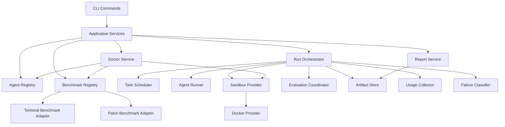
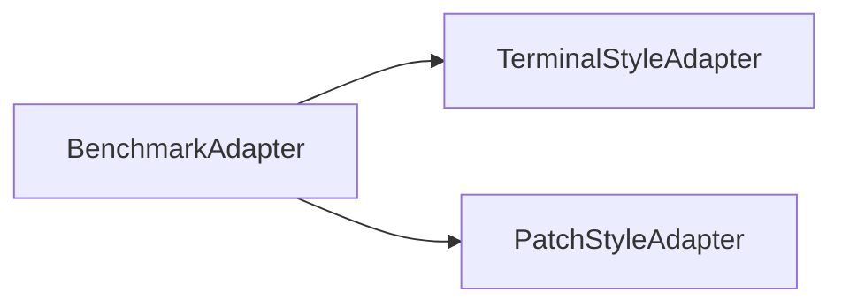
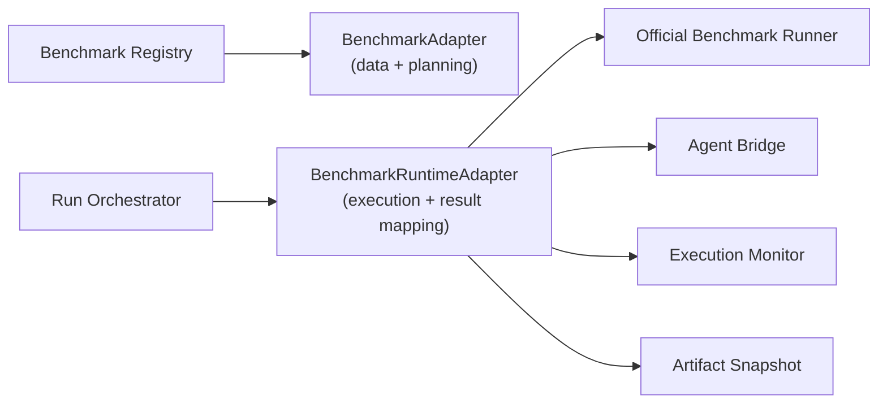

# HarnessLab 技术架构设计

> 本文定义 HarnessLab 的核心架构。目标不是一次性写出所有实现细节，而是先确定稳定的系统边界、模块职责、扩展点和数据流，避免后续实现被某个 benchmark、某个 CLI agent 或某种 Docker 细节绑死。

更细的开发切片、测试编号、通过标准和本地/CI gate 见 `docs/mvp-development-spec.md`。防止测试丢失、跑偏和自欺的测试工程见 `docs/test-engineering.md`。本文只保留架构边界和关键 contract。

## 1. 架构目标

HarnessLab 的架构必须优先满足四件事：

1. **Agent 接入轻量**：用户通过配置注册完整 CLI Agent profile，不为每个 agent 写业务代码。
2. **Benchmark 接入稳定**：Terminal-Bench 和 SWE-bench Pro 是 P0，但系统要能继续接入新的 terminal-style 或 patch-style benchmark。
3. **Run 可复现**：每次 run 都保存完整配置快照、任务快照、日志、结果、报告和 replay 所需元数据。
4. **故障可归因**：执行链路问题、benchmark 判断失败、部分得分和 usage parser warning 必须在数据模型上分开。

架构的中心不是 Web UI，也不是排行榜，而是 **Run Orchestrator + Adapter Contracts + Artifact Store**。

## 2. 关键外部事实

设计基于这些外部事实：

- Terminal-Bench 面向 terminal-native agents，任务包含 instruction、sandbox、verifier 和 oracle，官方 CLI 把 agent runtime 接到 sandboxed terminal 中执行并验证结果。参考：[Terminal-Bench](https://terminalbench.lol/)。
- Harbor 的任务结构包含 `instruction.md`、`task.toml`、`environment/`、`tests/` 和 verifier reward；它的 artifact collection 约定 `/logs/artifacts/`，并把 trial 输出组织成 agent/verifier/config/result/artifacts。参考：[Harbor task structure](https://www.harborframework.com/docs/tasks)、[Harbor artifact collection](https://www.harborframework.com/docs/run-jobs/results-and-artifacts)。
- SWE-bench 评测以 JSONL prediction 为输入，核心字段是 `instance_id`、`model_name_or_path`、`model_patch`，官方 evaluator 在 Docker 中应用 patch 并运行测试。参考：[SWE-bench evaluation guide](https://www.swebench.com/SWE-bench/guides/evaluation/)。
- SWE-bench Pro 是 Scale AI 发布的长周期软件工程 benchmark，包含公开、held-out 和商业集合，任务更长、更复杂，公开和授权数据获取能力必须被建模进 doctor/benchmark 状态。参考：[Scale Labs SWE-bench Pro](https://labs.scale.com/papers/swe_bench_pro)。

## 3. 架构原则

| 原则 | 约束 |
|---|---|
| Core owns lifecycle | 核心层拥有 run lifecycle、状态机、artifact layout 和失败分类。 |
| Adapters own translation | Benchmark adapter 只负责把外部 benchmark 翻译成 HarnessLab task/run contract。 |
| Agent is opaque | HarnessLab 不解析 agent 内部 harness，只执行完整 CLI profile 并收集可观测输出。 |
| Snapshot over reference | replay 读取 run 快照，不读取当前全局配置。 |
| Filesystem first | MVP 使用本地文件系统作为事实来源，不引入数据库。 |
| Docker behind boundary | Docker 是 sandbox provider 的实现，不泄漏到上层产品对象。 |
| Warnings are not failures | usage parser、artifact collection 这类附加能力失败不能污染 benchmark 主评分。 |

## 4. 顶层架构



### 分层说明

| 层 | 职责 | 不做什么 |
|---|---|---|
| CLI | 参数解析、命令分发、用户输出。 | 不直接调 Docker，不直接读写 task 结果。 |
| Application Services | 编排 use case，例如 init、doctor、run、resume、replay、report open。 | 不实现 benchmark 细节。 |
| Core Domain | Run、TaskAttempt、AgentProfile、BenchmarkDescriptor、FailureClass 等核心模型。 | 不依赖 CLI、Docker、HTML。 |
| Adapter Layer | 接入 Terminal-Bench、SWE-bench Pro、未来 benchmark 和 agent profile templates。 | 不拥有全局 run 状态。 |
| Infrastructure | 文件系统、Docker、进程执行、PTY、浏览器打开报告。 | 不决定产品语义。 |

依赖方向必须单向：`CLI -> Application -> Core <- Adapters`，基础设施通过接口注入。Core 不能 import Docker SDK、HTML renderer 或具体 benchmark package。

## 5. 核心模块

### 5.1 CLI

命令：

```text
harnesslab init
harnesslab doctor
harnesslab agent list
harnesslab benchmark list
harnesslab benchmark info <benchmark>
harnesslab run --agent <profile> --benchmark <benchmark> --split <split>
harnesslab run resume <run-dir>
harnesslab run replay <run-dir>
harnesslab report open latest|<run-dir>
```

CLI 只负责：

- 解析参数。
- 加载全局配置路径。
- 调用 Application Service。
- 渲染简洁进度和摘要。
- 返回稳定 exit code。

CLI 不负责构建 Docker 命令，也不直接拼 report HTML。

稳定 exit code：

| Exit code | 语义 |
|---:|---|
| `0` | run 完成并产出有效实验结果；`benchmark_failure`、`partial_success` 和 warning 不影响 exit code。 |
| `1` | run 完成，但存在 `execution_failure`。 |
| `3` | run 级失败，例如配置损坏、benchmark 数据不可用、Docker 不可达。 |
| `130` | 用户中断，run 已进入 `paused`，可 resume。 |

如果同时存在多类问题，优先级为 `130 > 3 > 1 > 0`。`skipped` task 不单独决定 exit code；如果 skipped 是用户显式 limit/filter 的结果，按实际执行 task 结果返回。

`run --json` 的顶层 `status` 只表示命令健康状态：`success` 表示命令完成并写出 run artifacts，不表示所有任务得满分。自动化消费者必须读取顶层 `verdict`、`summary`、`results_path` 或 `results.json` 来判断实验结果。`verdict` 至少区分 `success`、`partial_success`、`benchmark_failure`、`execution_failure`、`interrupted`、`run_failed`。顶层 `report_path` 指向 HTML 报告，`results_path` 指向聚合 JSON。

### 5.2 Config Service

负责读写：

```text
~/.harnesslab/config.toml
~/.harnesslab/agents/*.toml
~/.harnesslab/benchmarks/
~/.harnesslab/runs/
```

设计要求：

- 所有配置解析都必须带 schema validation。
- `~`、env var、相对路径要在加载阶段规范化。
- 敏感值进入内存后可用于执行，但写入快照和报告前必须脱敏。
- 配置 schema 必须版本化：`schema_version`。

### 5.3 Agent Registry

职责：

- 检测本机 CLI Agent。
- 生成四类内置 profile 草稿和可读注册表模板。
- 加载用户手动编辑后的 profile。
- 校验 command、input_mode、auth、setup、skills、tools、hooks、usage parser。
- 把语义化注册表展开为 run-time snapshot，供 sandbox runner、benchmark adapter 和报告使用。
- 对其他 agent 生成的 profile 给出结构化诊断，错误必须指向具体字段和允许取值。

Agent profile 不是一段 opaque shell，而是可解释的 harness 注册表。核心字段：

```toml
schema_version = 1
name = "codex-default"
kind = "codex"
command = "codex exec --full-auto {{instruction}}"
input_mode = "argument"
working_dir = "workspace"
timeout_sec = 3600

[auth]
inherit = true
inherit_env = ["OPENAI_API_KEY"]
include_paths = ["~/.codex"]
mount_ssh_socket = false
mount_docker_socket = false

[setup]
preset = "builtin"
required_commands = ["codex"]
run_as = "harnesslab"
commands = []

[skills]
inherit = true
allow = []
deny = []
include_paths = []

[tools]
inherit = true
allow = []
deny = []

[hooks]
inherit = true
allow = []
deny = []

[usage]
parser = "none"

[labels]
```

`auth.inherit` 是认证继承开关，不是“继承整个父进程环境”的许可。规则展开后必须落到显式字段：

- `inherit_env`：允许传入 sandbox 的环境变量名称。
- `include_paths` / `exclude_paths`：允许挂载的本机配置路径。
- `mount_ssh_socket`：是否挂载 SSH agent socket。
- `mount_docker_socket`：是否挂载 Docker socket，默认禁止。

Host execution and Docker execution share the same resolved auth source. Host execution must use explicit environment construction; `auth.inherit = false` means profile-declared env/path inheritance is disabled and the parent process environment is not passed through wholesale. A minimal launch baseline such as `PATH`, `HOME`, `TMPDIR`, and locale may be preserved, but that baseline is process infrastructure, not auth inheritance.

`setup`、`skills`、`tools`、`hooks` 必须通过 agent-kind adapter materializer 转换为具体 sandbox 文件、环境变量或命令行参数。架构约束：

- 普通 profile 优先使用 `setup.preset` 和能力 allow/deny，不直接写 `sandbox_setup_command`。
- `setup.commands` 是高级逃生口，只在 `setup.preset = "custom"` 时允许；doctor 必须标记风险并展示失败归因。
- `skills`、`tools`、`hooks` 采用相同策略模型：如果 `allow` 非空，目标集合来自 `allow`；否则 `inherit = true` 使用默认集合；否则目标集合为空；最后应用 `deny`。
- 如果某个 `kind` 暂不支持某类能力 materialization，doctor 必须对非默认策略报错，不能继续跑出不可比较结果。
- run snapshot 必须保存原始注册表、公开 redacted profile、结构化 materialized runtime、version probe snapshot 和展开后的有效能力摘要，报告展示人类可读摘要并链接结构化 artifacts。
- benchmark adapter 不应解释 skills/tools/hooks 语义，只消费已经 materialize 完成的 agent runtime 配置。

`setup.run_as` 的 materialization 边界也必须显式：

- Omitted `setup.run_as` values default to `current`; templates can still write a stricter explicit value such as `harnesslab`.
- Docker sandbox 可以 materialize `root`、`harnesslab`、`current`。
- Host execution, Terminal-Bench import-agent host path, and SWE-bench Pro `gold` host path currently only support `current`.
- Host-incompatible `run_as` must be blocked before task execution. Silent fallback is not allowed.

### 5.4 Benchmark Registry

职责：

- 注册可用 benchmark adapter。
- 暴露 benchmark metadata、split、数据准备状态。
- 为 run 创建 `BenchmarkPlan`。

核心接口：

```text
list_benchmarks() -> list[BenchmarkDescriptor]
get_info(name) -> BenchmarkInfo
inspect_data(name) -> BenchmarkDataState
prepare(name, split) -> BenchmarkPreparedState
plan_run(name, split, run_config) -> BenchmarkPlan
```

Benchmark Registry 不执行 agent，只生成可执行计划。

`BenchmarkDataState` 必须细化到 split：

```text
not_downloaded
downloading
partial
ready
corrupted
requires_auth
auth_failed
unsupported
```

### 5.5 Run Orchestrator

Run Orchestrator 是系统核心。职责：

1. 创建 run 目录。
2. 写入 run spec 和所有配置快照。
3. 通过 benchmark adapter 枚举 task。
4. 通过 scheduler 控制并发和 attempts。
5. 为每个 task 创建 sandbox。
6. 调用 Agent Runner。
7. 调用 Evaluation Coordinator。
8. 收集 artifacts、usage、logs、diff。
9. 分类 failure / warning。
10. 增量写入结果，支持 resume。
11. 完成后生成 report。

Orchestrator 必须是幂等和可恢复的：每个 task 状态落盘后，进程崩溃不应破坏已完成结果。

Task 完成时，Orchestrator 负责组装最终结果：

```text
AgentRunnerResult
  + EvaluationResult
  + ArtifactCollectionResult
  + UsageResult
  + FailureClassification
  -> TaskAttemptResult
```

这个组装逻辑可以实现为 `TaskAttemptAssembler`，但 ownership 属于 Orchestrator，不属于 adapter、agent runner 或 report service。

### 5.6 Task Scheduler

Scheduler 控制 run 内 task 并发和 attempts。MVP 不支持多个 run 同时执行的全局调度；如果用户并行启动多个 CLI 进程，互相之间不共享 scheduler。

Scheduler 必须是动态 worker pool，而不是固定 chunk drain：当任一 task attempt 完成后，只要 run-health 尚未 abort 且仍有待执行 attempt，就立即补位启动下一项。这样长时间 Docker build、官方 timeout 或单个 agent 卡住不会让已空闲的并发槽等待整批任务结束。若 RunMonitor 触发 run-level abort，Scheduler 停止派发新 attempt，但必须等待已经启动的 active workers 收敛，并把尚未启动的 pending attempts 写成 `run_health_aborted` interrupted 结果。内部 worker `Err` 或 panic 被观察到后同样停止继续派发；在错误被观察到之前已经启动的并发 attempt 允许收敛。

核心输入：

```text
tasks
max_parallel
attempts
resource_pool
resume_policy
```

MVP 类型：

```text
ResourcePool
  max_parallel
  available_cpu_cores?
  available_memory_mb?
  available_disk_mb?

ResumePolicy
  skip_statuses: success | partial_success
  rerun_statuses: execution_failure | benchmark_failure | interrupted
```

核心输出：

```text
TaskAssignment(task_id, attempt, resource_reservation)
```

`resource_reservation` MVP 可只包含 slot id 和 task resource hint；不需要实现复杂资源调度，但接口必须保留 CPU/内存/磁盘字段。

资源策略：

- 默认 `max_parallel=4`，来自 PRD。
- 如果 Docker 资源不足，task 应排队而不是直接失败。
- 如果单个 task 的 resource hint 超过本机能力，preflight 阶段失败。
- `attempts > 1` 时，同一个 task 的多个 attempt 视作独立 assignment，但共享 task snapshot。

### 5.7 Evaluation Coordinator

Evaluation Coordinator 统一执行 benchmark verifier/evaluator。它拥有执行环境选择和 verifier/evaluator 进程生命周期；BenchmarkAdapter 只负责把原始输出解析为标准 `EvaluationResult`。

```text
evaluate(task_plan, sandbox_handle, agent_result, artifacts) -> EvaluationResult
```

Evaluation Coordinator 持有两个 infrastructure port：

- `SandboxProvider`：用于 sandbox 内执行和 separate sandbox 生命周期。
- `HostProcessExecutor`：用于宿主机上的官方 evaluator 或 lightweight wrapper。

执行环境模式：

| 模式 | 用途 |
|---|---|
| `same_sandbox` | Terminal-style verifier 在 agent sandbox 内运行，使用 `SandboxProvider.exec(agent_sandbox, verifier_command)`。 |
| `separate_sandbox` | verifier 需要独立干净环境，由 Evaluation Coordinator 创建、执行、收集并销毁 verifier sandbox。 |
| `host_process` | patch-style benchmark 调用官方 evaluator 或本地 wrapper，使用 `HostProcessExecutor.exec()`。 |

Evaluation Coordinator 负责：

- 根据 `verifier_spec.environment_mode` 选择执行环境。
- 调用 verifier command 或 benchmark evaluator。
- 捕获 verifier stdout/stderr、退出码、duration。
- 调用 adapter 的 `parse_evaluation(...)`，把 adapter-specific evaluator 输出标准化为 `EvaluationResult`。
- 保证 separate verifier sandbox 的 cleanup，即使 verifier 失败也必须先收集 artifacts。

BenchmarkAdapter 的 `parse_evaluation()` 负责解释 benchmark 原始输出；Evaluation Coordinator 负责执行和收集。

### 5.8 Usage Collector

Usage Collector 从 agent 原始日志或结构化日志中提取 token/cost。

```text
collect(stdout_path, stderr_path, parser_config, task_context) -> UsageResult
```

`parser_config` 来自 Agent Profile 的 `usage` 字段。MVP schema：

```text
UsageParserConfig
  parser: none | regex | json_path
  source: stdout | stderr | file
  path?
  patterns?
  json_paths?
```

`task_context` 只能包含 task id、agent profile labels、attempt dir 和 run dir，不能成为任意依赖注入容器。

`UsageResult`：

```text
status: ok | unknown | parse_error
tokens_in?
tokens_out?
total_tokens?
cost_usd?
model?
warnings[]
```

`unknown` 表示未配置 parser；`parse_error` 表示配置了 parser 但解析失败。两者都只生成 warning，不改变 benchmark 主评分。

### 5.9 Failure Classifier

Failure Classifier 的输入必须是结构化结果，不直接扫全文日志做主判断。

```text
classify(
  agent_result,
  evaluation_result,
  usage_result,
  artifact_result
) -> FailureClassification
```

日志内容可作为辅助信号，但优先级低于 stage、exit code、termination reason、evaluator code 和 explicit error code。

MVP failure code 枚举：

| Class | Codes |
|---|---|
| execution | `sandbox_create_failed`, `workspace_prep_failed`, `agent_spawn_error`, `agent_timeout`, `agent_cleanup_failed`, `external_runner_no_progress`, `external_runner_timeout`, `agent_signaled`, `agent_nonzero_exit`, `artifact_collection_failed`, `docker_network_pool_exhausted`, `run_health_aborted`, `evaluator_error` |
| benchmark | `agent_timeout`, `verifier_timeout`, `verifier_error`, `test_failed`, `no_valid_diff`, `patch_apply_failed` |
| warning | `usage_unknown`, `usage_parser_failed`, `artifact_optional_missing`, adapter-translated upstream advisory verdicts such as `agent_timeout` |

Adapters 可以保留 benchmark 原始错误码，但必须映射到上述规范 code，报告才能跨 benchmark 比较。
外部 benchmark 明确给出的 agent timeout 是任务结果 verdict，归入 `benchmark/agent_timeout`；HarnessLab 进程级 agent 超时、外部 runner hard timeout 或 watchdog kill 才归入 execution。

TaskAttemptResult 额外持有 `health_impact = none | stall | environment_unhealthy`。RunMonitor 只消费该健康影响信号，不直接枚举 benchmark adapter 的失败码。Terminal-Bench 这类外部 runner 如果被 HarnessLab 进程硬超时或 no-progress watchdog 杀掉，必须把 `health_impact` 设为 `stall`，即使官方 `results.json` 已经写出；官方 verdict 只能作为 warning 或 verifier 元数据保留。

## 6. Benchmark Adapter 架构

系统只定义两类一级 adapter contract：



### 6.1 通用 BenchmarkAdapter

所有 adapter 必须提供：

```text
descriptor() -> BenchmarkDescriptor
inspect_data() -> BenchmarkDataState
prepare(split) -> PreparedBenchmark
list_tasks(split) -> list[TaskDescriptor]
create_task_plan(task, run_context) -> TaskPlan
parse_evaluation(raw_stdout, raw_stderr, exit_code, parser_config) -> EvaluationResult
snapshot(task) -> TaskSnapshot
```

上面是数据与任务规划 contract，只解决“这个 benchmark 有哪些任务、如何表达任务”。真实第三方 benchmark 还必须有一个 runtime adapter contract，解决“如何调用官方 runner、如何监控它、如何把官方结果投影到 HarnessLab”。因此每个外部 benchmark 实例都由两层组成：



`BenchmarkRuntimeAdapter` 必须提供：

```text
preflight(profile, run_config, benchmark_snapshot) -> RuntimePreflightResult
prepare_task(task_snapshot, attempt_dir) -> RuntimeTaskContext
runner_command(context) -> ExternalCommandSpec
monitor_policy(context) -> ExternalMonitorPolicy
parse_result(context, process_record) -> TaskAttemptResult
post_task_cleanup(context) -> CleanupResult
run_cleanup(run_context) -> CleanupResult
replay_materials(context) -> ReplaySnapshot
```

运行期边界：

| 职责 | Adapter 所有权 | Orchestrator 所有权 |
|---|---|---|
| 上游数据结构、split、task id、官方版本 | Data adapter | 保存 snapshot、选择任务 |
| 官方 runner 命令、环境变量、平台策略 | Runtime adapter | 进程启动与日志捕获 |
| CLI agent 接入桥、输入模式、输出规范化 | Runtime adapter | Agent profile 校验入口 |
| 进度文件、静默 watchdog、hard timeout | Runtime adapter 给 policy | HostProcessExecutor 执行 policy |
| 官方结果解析、失败码映射、score/usage | Runtime adapter | 统一持久化 result/report |
| Docker compose/container/network 清理 | Runtime adapter | run 级最终 cleanup 调度 |
| replay 所需配置快照和上游 artifact 引用 | Runtime adapter | replay 命令与 snapshot 存储 |

架构原则：

- 一个 benchmark family 一个 runtime adapter 实例；不要为某个任务写一次性逻辑。
- Adapter 可以包住官方 CLI 或官方 Python API，但必须暴露统一的 HarnessLab 失败分类、artifact、日志和 replay contract。
- Adapter 不能吞掉执行层异常。官方 runner 已经写出 success 时，如果 HarnessLab 进程被 hard timeout、no-progress watchdog 或 cleanup failure 命中，仍必须按 execution failure 处理。
- Adapter 不能要求用户理解 Docker 细节；平台、socket、compose project、cleanup 都由 adapter 自己配置和记录。
- Adapter 的特殊策略必须可测试、可记录到 `events.jsonl`，并能在 report 中解释。

核心对象：

```text
BenchmarkDescriptor
  name
  version
  homepage
  style: terminal | patch
  splits[]

TaskDescriptor
  task_id
  split
  estimated_timeout_sec
  resource_hint
  source_ref

TaskPlan
  instruction
  workspace_spec
  sandbox_spec
  verifier_spec
  artifact_spec
```

最小 spec 字段：

```text
WorkspaceSpec
  type: git_clone | local_copy | empty | benchmark_managed
  source_uri?
  target_path
  revision?
  clean: boolean

SandboxSpec
  image
  mounts[]
  env_vars[]
  network: none | restricted | full
  privileged: boolean
  resource_limits:
    cpu_cores?
    memory_mb?
    disk_mb?

VerifierSpec
  command?
  working_dir
  timeout_sec
  expected_exit_codes[]
  environment_mode: same_sandbox | separate_sandbox | host_process
  output_parser: reward_file | json | swe_evaluator | custom

ArtifactSpec
  base_dir
  globs[]
  required_paths[]
  max_size_bytes?
```

Workspace 生命周期：

```text
prepare workspace -> agent mutates workspace -> verifier/evaluator reads workspace -> artifact collector snapshots outputs
```

Artifacts 和 verifier 输出是两个 collection pass：verifier 输出用于评分，artifacts 用于复盘和报告。

Verifier stdout/stderr 由 Evaluation Coordinator 直接捕获到 `verifier/stdout.log` 和 `verifier/stderr.log`，不属于 Artifact Collector 的 best-effort collection。Artifact Collector 只处理用户可见产物、diff、prediction 和额外文件。

`WorkspaceSpec.type` 语义：

| type | Orchestrator 行为 | SandboxProvider 行为 |
|---|---|---|
| `git_clone` | 根据 source_uri/revision 准备 repo workspace，并记录 base revision。 | 挂载或复制 workspace 到 sandbox。 |
| `local_copy` | 从本地路径复制干净 workspace。 | 挂载或复制 workspace 到 sandbox。 |
| `empty` | 创建空 workspace。 | 挂载空目录到 sandbox。 |
| `benchmark_managed` | 不自行准备 workspace，只调用 adapter 提供的 prepare hook 并接收 workspace handle/path。 | 根据 adapter 返回的 workspace handle/path 挂载或进入对应环境。 |

`benchmark_managed` 只用于外部 evaluator 强管理 workspace 的场景，例如某些 SWE-style evaluator。即使 workspace 由 benchmark 管理，Orchestrator 仍负责记录 workspace manifest、source ref 和 replay 所需 checksum。

### 6.2 TerminalStyleAdapter

用于 Terminal-Bench 和未来 Harbor-compatible terminal tasks。

运行形态：

```text
task metadata -> sandbox workspace -> agent executes instruction -> verifier script -> reward/result -> artifacts
```

设计要点：

- instruction 是 agent 输入。
- verifier 是 benchmark 原始评分来源。
- reward 文件、测试输出、agent logs 都进入 task artifact 目录。
- Terminal task 可以没有 git diff。
- verifier 失败是 Benchmark Failure；sandbox、agent、setup 失败是 Execution Failure。

Terminal-Bench runtime adapter 的固定 contract：

| 维度 | 规则 |
|---|---|
| 官方 runner | 通过 `uvx --from terminal-bench tb run` 运行官方 Terminal-Bench。 |
| 运行平台 | 普通 task 默认导出 `DOCKER_DEFAULT_PLATFORM=linux/amd64`；Apple Silicon 上的 x86 QEMU task 默认使用 `linux/arm64` 容器并交叉编译 x86_64 kernel/rootfs；可用 `HARNESSLAB_TERMINAL_BENCH_DOCKER_PLATFORM` 临时覆盖。 |
| Agent bridge | 内置 `harnesslab_tb_agent:HarnessLabCommandAgent`，负责把本机 CLI agent 命令转换成 Terminal-Bench agent。 |
| 输出规范化 | 优先使用 fenced code；无 code fence 时允许剥离纯自然语言前言，从第一行 shell-looking 命令开始执行，避免官方 `parse_error` 误判。 |
| QEMU 本机兼容 | 对 `build-initramfs-qemu` 和 `build-tcc-qemu`，adapter 复制 attempt-local dataset；Apple Silicon/native arm64 模式注入 `gcc-x86-64-linux-gnu` 并使用 `ARCH=x86_64 CROSS_COMPILE=x86_64-linux-gnu-` 交叉编译；强制 amd64 emulation 模式只做 `make -j1` 降级；原始 benchmark cache 不被修改。 |
| 官方 timeout | Adapter 从 task.yaml 读取 `max_agent_timeout_sec` 和 `max_test_timeout_sec`；`--timeout-sec` 只影响 HarnessLab/agent 预算上限，不能放大官方 verifier timeout。 |
| 进度监控 | 注册官方 `run.log` 为进度文件，注册 Docker setup/build/pull 进程为有界活动信号。 |
| 静默 watchdog | 默认下限覆盖首次 setup/build 静默窗口；无日志和无有效活动时才报 `execution/external_runner_no_progress`。 |
| hard timeout | 默认 `agent_timeout + test_timeout + 1800`，可用 `HARNESSLAB_TERMINAL_BENCH_PROCESS_TIMEOUT_SEC` 诊断覆盖。 |
| 失败映射 | 官方 `agent_timeout/test_timeout` 是 benchmark verdict；官方 `parse_error` 映射为 `benchmark/agent_output_parse_error`；官方 setup/build 失败映射为 `execution/external_runner_setup_failed`；HarnessLab kill/cleanup 映射为 execution failure。 |
| cleanup | 每个 task 后清理对应 compose container/network，run 结束再按 run id token 扫描兜底。 |

### 6.3 PatchStyleAdapter

用于 SWE-bench Pro 和未来 SWE-style benchmark。

运行形态：

```text
instance metadata -> repo workspace -> agent edits repo -> collect git diff -> prediction JSONL -> official evaluator -> result
```

设计要点：

- Agent Runner 只负责让 CLI Agent 在 repo workspace 中完成任务。
- PatchStyleAdapter 负责把最终 diff 转成 benchmark prediction。
- 官方 evaluator 输出是 benchmark 主评分。
- `no_valid_diff`、`patch_apply_failed`、`test_failed` 要分开。
- replay 必须保留 instance metadata、base commit、diff、prediction JSONL 和 evaluator result。

## 7. Agent Runner 架构

Agent Runner 统一四种输入方式：

| input_mode | 语义 |
|---|---|
| `argument` | 将 `{{instruction}}` 渲染进命令。 |
| `file` | 写入 instruction 文件，通过 `{{instruction_file}}` 传入。 |
| `stdin` | 启动命令后向 stdin 写入 instruction。 |
| `tty` | 通过 PTY 注入 instruction，用于必须 TTY 的 CLI。 |

`tty` 时序：

1. execution target 先启动带 PTY 的 agent 命令；sandbox target 使用 `SandboxProvider.exec(pty=true)`，host target 使用 `HostProcessExecutor.exec(pty=true)`。
2. Agent Runner 等待可配置的 readiness signal，默认是固定短延迟加首屏输出；profile 可指定 prompt regex。
3. readiness 成功后写入 instruction，并发送 Enter。
4. 如果 readiness 超时，标记 `agent_spawn_error` 或 `agent_timeout`，由 Failure Classifier 归类。

Agent Runner 分为两层：

| 组件 | 层级 | 职责 |
|---|---|---|
| AgentCommandRenderer | Core | 渲染命令模板、准备 instruction 文件、决定 stdin/tty 输入内容。 |
| HostProcessExecutor | Infrastructure port | 管理宿主机进程/PTY 生命周期、日志流、timeout、exit status。 |
| SandboxProvider.exec | Infrastructure port | 管理 sandbox 内进程执行。 |

Runner pipeline：

```text
render command -> prepare input material -> execute process/pty -> capture logs/status -> write agent result
```

Agent Runner 不直接选择宿主机还是 sandbox 执行。Orchestrator 根据 TaskPlan/SandboxSpec 传入 execution target：

- target = `sandbox`：Agent Runner 调用 `SandboxProvider.exec()`。
- target = `host`：Agent Runner 调用 `HostProcessExecutor.exec()`，仅允许用于 doctor smoke 或 future non-sandbox mode。

MVP 正式 benchmark run 默认 target 必须是 `sandbox`。

Runner 需要输出：

```json
{
  "exit_code": 0,
  "started_at": "...",
  "finished_at": "...",
  "duration_ms": 1234,
  "stdout_path": "stdout.log",
  "stderr_path": "stderr.log",
  "termination_reason": "completed|timeout|no_progress|signaled|spawn_error"
}
```

Runner 不判断任务成功。任务成功只由 benchmark evaluator/verifier 决定。

`no_progress` 是进程生命周期状态，不是 benchmark 得分。外部 benchmark runner 可以把它映射成更具体的执行失败，例如 Terminal-Bench 的 `external_runner_no_progress`。no-output watchdog 只能在“stdout/stderr 无新字节、无已注册进度文件增长、无可接受的已注册活动信号”时触发；Terminal-Bench 注册官方 `run.log` 作为进度文件，并注册 Docker setup/build 子进程活动，避免首次镜像构建被误判为 runner stall。进程活动匹配只延期到下一次短周期复查，并且最多持续一个额外 watchdog 窗口；官方 `run.log` 增长才会刷新进度窗口。匹配事件应写入运行日志，最终 no-progress 事件必须带 `activity_grace_exhausted`、`current_activity`、`last_activity`、`last_progress` 诊断字段，便于解释 no-progress。
外层 hard timeout 映射为 `external_runner_timeout`，同样是 HarnessLab 执行层失败，必须压过已经写出的外部 benchmark 结果，避免把 runner teardown/setup 卡死误算成 agent 能力得分。Terminal-Bench 默认 runner hard timeout 是 `agent_timeout + test_timeout + 1800`，额外预算用于官方 setup 和首次 Docker build；该值可用 `HARNESSLAB_TERMINAL_BENCH_PROCESS_TIMEOUT_SEC` 临时覆盖。

Terminal-Bench Python adapter 以宿主机进程执行已注册 CLI agent。adapter 必须给 agent 命令注入 `HARNESSLAB_AGENT_RUN_TOKEN`，并在运行期间捕获 agent 进程树 ancestry；启动阶段必须高频捕获以覆盖快速 daemonize/env-sanitize 的 helper，稳定后可以降频。timeout 路径和正常退出路径都要合并 ancestry 快照与 token 扫描来清理残留进程。父命令成功退出但留下后台 agent 子进程属于执行层清理风险，必须在返回前收敛并写出持久化 cleanup 诊断。cleanup 失败或仍有 live child/token survivor 必须映射为执行层 `agent_cleanup_failed`，不能降级成 benchmark `test_failed`。Strict diagnostic mode 可以额外把 agent 窗口内新出现且无法安全归属的新 live 进程作为 `agent_cleanup_failed` 证据；默认不强杀或误判这类进程，避免影响并发任务或用户进程。

## 8. Sandbox Provider 架构

MVP 只实现 Docker Provider，但 Core 只依赖 Sandbox Provider 接口。

```text
health_check()
create(task_plan, agent_profile, run_context) -> SandboxHandle
copy_in(files)
exec(command, user, env, cwd, timeout)
stream_logs()
copy_out(artifact_spec)
inspect_resources()
cleanup_orphans(run_id)
destroy()
```

Docker Provider 负责：

- 构建或拉取 benchmark/task 镜像。
- 挂载 workspace、logs、artifacts。
- 挂载授权路径和 env。
- 控制网络开关。
- 应用 CPU、内存、磁盘等资源限制。
- 注入 agent profile 所需资源。
- 提供 dry-run auth mount check 给 doctor。
- 按 run id 清理 orphaned sandbox。

Docker 细节不能泄漏到 BenchmarkAdapter 的返回值之外。Adapter 只声明 `SandboxSpec`，Provider 决定如何执行。

Sandbox 生命周期策略由 Orchestrator 决定：

- 正常 task 完成后默认销毁 sandbox。
- task 失败时仍默认销毁，但必须先完成 artifact collection。
- debug/post-mortem 保留 sandbox 是未来高级选项，不进入 MVP 默认路径。

## 9. Run 状态机

### 9.1 Run 状态

```text
created
preflight
running
paused
completed
failed
```

`paused` 表示用户中断或进程异常退出但 run 可 resume。`failed` 表示 run 级别不可继续，例如 run spec 损坏、benchmark 数据缺失且无法准备。

### 9.2 TaskAttempt 状态

```text
pending
preparing
agent_running
evaluating
collecting
success
partial_success
benchmark_failure
execution_failure
warning_only
skipped
interrupted
```

状态必须增量写入 `<task-id>/result.json`。Resume 时：

- 跳过 `success` 和 `partial_success`。
- 默认重跑 `execution_failure` 和 `benchmark_failure`。
- 保留旧 result 为 attempt history。
- 中间状态 attempt 在 resume 前标记为 `interrupted`。

## 10. Artifact Store

本地文件系统是 MVP 的唯一 artifact store。

```text
~/.harnesslab/runs/<agent>-<benchmark>-<split>-<timestamp>/
  run.json
  command.txt
  snapshots/
    config.snapshot.json
    agent-profile.snapshot.json
    benchmark.snapshot.json
    environment.snapshot.json
  results.json
  events.jsonl
  report.html
  tasks/
    <task-id>/
      task.snapshot.json
      attempts/
        1/
          instruction.md
          agent/
            stdout.log
            stderr.log
            result.json
          verifier/
            stdout.log
            stderr.log
            result.json
          artifacts/
            manifest.json
          diff.patch
          prediction.jsonl
          result.json
```

原则：

- 任何可复现输入都进入 `snapshots/` 或 `task.snapshot.json`。
- 任何执行输出都进入 task attempt。
- 顶层 `results.json` 是聚合索引，可以重建。
- 顶层 `results.json` 必须保存 `report_path`，与 `run --json` 的 `report_path` 一致。
- `events.jsonl` 是 append-only 操作日志，服务排障和未来可视化。
- `run_finished` 事件的 message 至少包含 `exit_code`、summary bucket 和 `report_path`，用于无 HTML 的故障复盘。

## 11. 失败分类与结果模型

结果模型必须同时支持三层信息：

```text
Outcome: success | partial_success | failure
FailureClass: execution | benchmark | none
Warning[]: usage_unknown | usage_parser_failed | artifact_collection_failed
```

这样可以避免 usage parser 或 artifact collection 警告污染主评分。

Task result 最小结构：

```json
{
  "task_id": "example",
  "attempt": 1,
  "outcome": "failure",
  "failure_class": "benchmark",
  "failure_code": "test_failed",
  "benchmark_score": 0,
  "patch": {
    "path": "diff.patch",
    "format": "unified"
  },
  "duration_ms": 120000,
  "usage": {
    "status": "unknown"
  },
  "warnings": []
}
```

## 12. Resume 与 Replay

### Resume

Resume 读取原 run 目录：

1. 清理或标记旧 run 遗留的 orphaned sandbox。
2. 校验 run schema 和 benchmark snapshot。
3. 扫描 task result 和未完成 attempt。
4. 跳过 `success` 和 `partial_success`。
5. 将失败或中断 task 新建 attempt。
6. 增量更新 `results.json`，然后从 artifact store 重新生成 `report.html`。

Resume 修改原 run 目录，因为它表示继续同一个 run。

如果 task 停在 `preparing`、`agent_running`、`evaluating`、`collecting` 等中间状态，resume 不尝试续写原 attempt，而是把旧 attempt 标记为 `interrupted`，保留半写日志和 partial result，再创建新 attempt。

### Replay

Replay 创建新 run 目录：

1. 读取旧 run 快照。
2. 不读取当前全局 agent profile。
3. 校验 benchmark 数据和缓存是否满足旧快照。
4. 创建新的 run id。
5. 重新执行所有 task。

Replay 失败时必须说明缺失的是 agent 命令、auth、benchmark 数据、Docker 资源还是 snapshot 损坏。

ReplayValidator contract：

```text
validate(run_snapshot) -> ReplayReadiness
```

`ReplayReadiness`：

```text
ready: boolean
blockers:
  - stage
    code
    detail
```

必须校验：

- snapshot schema version 当前仍支持。
- benchmark name、version、split 与快照一致。
- benchmark/task 数据 checksum 一致；没有 checksum 时至少要求 source ref 和本地缓存 manifest 一致。
- agent command binary 仍存在；如果 profile 定义了 version command，则 version 输出要和快照一致，否则报告为 warning 或 blocker，由 profile 策略决定。
- auth include paths 和允许的 env 仍可用。
- sandbox image tag/digest 可用。

## 13. Report 架构

Report Service 输入只来自 artifact store，不直接调用 evaluator 或 Docker。

```text
results.json + snapshots + task attempts -> report model -> report artifact
```

Report model：

- run summary。
- agent profile summary。
- materialized runtime summary, including effective skills/tools/hooks and unsupported reasons.
- version probe status when `version_command` exists.
- benchmark summary。
- failure summary。
- usage summary。
- task table。
- task detail links。
- replay command。
- original command。

MVP report artifact 必须可离线查看，不依赖运行中的 server。PRD 要求 HTML 为单文件；日志和大 artifacts 仍以相对链接指向 run 目录。生成时把 report 绝对路径写入报告内容，并在 CLI 中打印。

## 14. Doctor 架构

Doctor 是架构质量门禁，不只是用户提示。

检查项：

| 检查 | 失败级别 |
|---|---|
| config schema valid | error |
| agent command exists | error |
| Docker daemon reachable | error |
| auth include paths readable | error |
| auth paths mountable in Docker dry-run | error |
| benchmark adapter installed | error |
| split data state known | error |
| split data missing | warning or error by split |
| smoke task can be planned | error |
| usage parser valid | warning |
| setup.required_commands valid/available/provided by setup | error or info |
| capability policy names and materializer support | error for invalid/non-materializable declarations |
| version_command probe | warning unless malformed |
| host-incompatible setup.run_as | error before run |
| host auth inheritance consistency | error for impossible declarations |

Doctor 输出结构化结果，CLI 渲染为人类可读表格。后续测试可以直接断言结构化 doctor result。

## 15. 日志与可观测性

每个 run 必须有三类日志：

1. `events.jsonl`：HarnessLab 自己的结构化事件。
2. `stdout.log` / `stderr.log`：agent 和 verifier 原始输出。
3. `result.json`：每个阶段的机器可读结果。

事件类型：

```text
run_created
preflight_started
task_started
sandbox_created
agent_started
agent_finished
evaluation_started
evaluation_finished
artifact_collection_finished
task_finished
run_finished
warning_emitted
error_emitted
```

日志原则：

- 原始日志不可丢。
- 结构化事件用于报告和 debug。
- 敏感 env 值进入日志前必须脱敏。
- 所有 error 必须带 stage、code、message、recoverable。

## 16. 测试架构

MVP 实现时测试按边界设计：

| 测试层 | 覆盖内容 |
|---|---|
| Unit | config validation、command rendering、state machine、failure classifier、usage parser。 |
| Contract | BenchmarkAdapter contract、SandboxProvider contract、AgentRunner contract。 |
| Integration | Docker smoke sandbox、fake terminal benchmark、fake patch benchmark。 |
| Golden | report model -> HTML snapshot。 |
| Resume/Replay | crash 后 resume、snapshot replay、缺失数据错误。 |
| Coverage | production code line、branch、function/method coverage 均不低于 95%；若工具链无法原生统计 function/method coverage，按 `docs/mvp-development-spec.md` 的替代阈值执行。 |

必须先内置 fake benchmark：

- `fake-terminal`：一个极小 terminal-style task，用于 doctor 和 CI smoke。
- `fake-patch`：一个极小 patch-style repo，用于验证 diff/prediction/evaluator flow。

Fake benchmark 不对用户开放为正式 benchmark，只作为测试工具，避免违反“不自创 benchmark”的产品定位。

测试架构必须接入 `docs/test-engineering.md` 定义的 Test Registry、Traceability Matrix、Runtime Proof、Seeded Failure、Coverage + Mutation 和 PR Evidence Chain。架构 contract 发生变化时，同一 PR 必须更新对应测试 ID、registry entry 和 traceability row。

关键路径组件必须具备可测试注入点，避免负向控制只能靠脆弱 monkey patch：

- `FailureClassifier` 和 `TaskAttemptAssembler` 通过构造参数接收 failure priority policy，用于测试 exit code priority inversion。
- `RunOrchestrator` 通过 clock、interrupt source、executor factory 注入，保证 timeout、resume 和 retry 测试可确定复现。
- `ReplayValidator` 通过 checksum provider 和 artifact resolver 注入，保证缺失数据、checksum mismatch、旧配置还原可被 fixture 精确触发。
- 这些注入点只改变依赖，不允许绕过生产状态机或生产 artifact layout。

## 17. 推荐模块边界

```text
HarnessLab
  CLI
  Application Services
  Core Domain
  Config
  Agent Registry
  Agent Command Renderer
  Host Process Executor
  Benchmark Registry
  Benchmark Adapters
  Task Scheduler
  Run Orchestrator
  Evaluation Coordinator
  Sandbox Providers
  Artifact Store
  Usage Collector
  Failure Classifier
  Report Service
  Test Fixtures
```

MVP 技术栈和文件树以 `docs/technology-decisions.md` 为准：Rust workspace、TOML 用户配置、JSON/JSONL run artifacts。以上模块边界和 contract 不应因具体 crate 调整而改变。

## 18. 关键 ADR

### ADR-001：MVP 使用文件系统，不引入数据库

理由：

- run 是天然目录型 artifact。
- replay 需要完整文件快照。
- 本地 CLI 工具减少依赖更重要。

代价：多 run 查询和统计较弱。P1 可以增加索引文件，不必立刻上数据库。

### ADR-002：核心层不依赖 Docker

理由：Docker 是默认 sandbox 实现，不是产品模型。未来可能接远程 sandbox、CI 或 cloud worker。

### ADR-003：Benchmark 分为 terminal-style 和 patch-style

理由：Terminal-Bench 与 SWE-bench Pro 的执行模型根本不同；强行统一会导致抽象泄漏。统一点应放在 run lifecycle、artifact、result 和 failure taxonomy。

### ADR-004：Agent profile 是 opaque

理由：HarnessLab 评测的是完整 harness，不拆 model、prompt、skills。拆解差异由用户注册多个 profile 表达。

### ADR-005：Report 从 artifact store 生成

理由：报告必须可重建、可离线、可 replay。Report Service 不应该依赖活跃进程或外部 evaluator。

## 19. 架构风险

| 风险 | 应对 |
|---|---|
| Benchmark adapter 被具体实现污染 | 所有 adapter 必须通过 contract test。 |
| Docker 权限和认证继承复杂 | Doctor 做 dry-run mount check，并统一脱敏输出。 |
| CLI Agent 行为差异大 | Agent Runner 只承诺 process/pty/log contract，不承诺理解 agent 内部。 |
| SWE-bench Pro 数据准备重 | split 级数据状态建模，5 分钟承诺限定在已准备数据或 Terminal smoke。 |
| Resume 结果混乱 | 每次重跑创建新 attempt，旧 attempt 不覆盖。 |
| 报告变成技术债 | Report model 独立于 HTML renderer，HTML 可替换。 |

## 20. 开发顺序建议

开发顺序以 `docs/mvp-development-spec.md` Section 3 和 `docs/test-engineering.md` Section 17 为准。架构建议不能绕过 M0 测试工程。

前置步骤：M0 testing project、registry、requirement manifest、traceability、coverage gate、local gate。

1. Core models、artifact layout、state machine。
2. Config loader、agent registry、doctor 基础检查。
3. Fake terminal benchmark + Docker sandbox smoke。
4. Agent Runner 四种 input mode 中先实现 `argument/file/stdin`，`tty` 紧随其后。
5. Terminal-Bench adapter。
6. Report model + 单文件 HTML。
7. Resume。
8. Fake patch benchmark。
9. SWE-bench Pro adapter。
10. Replay。
11. Usage parser 和 warning 完整接入。

这一路径先证明架构闭环，再接入重 benchmark，避免一开始被 SWE-bench Pro 的数据和 evaluator 复杂度拖住核心抽象。
