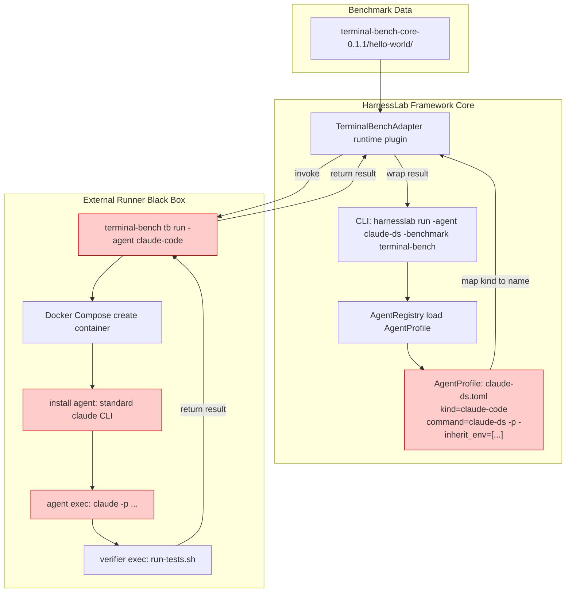
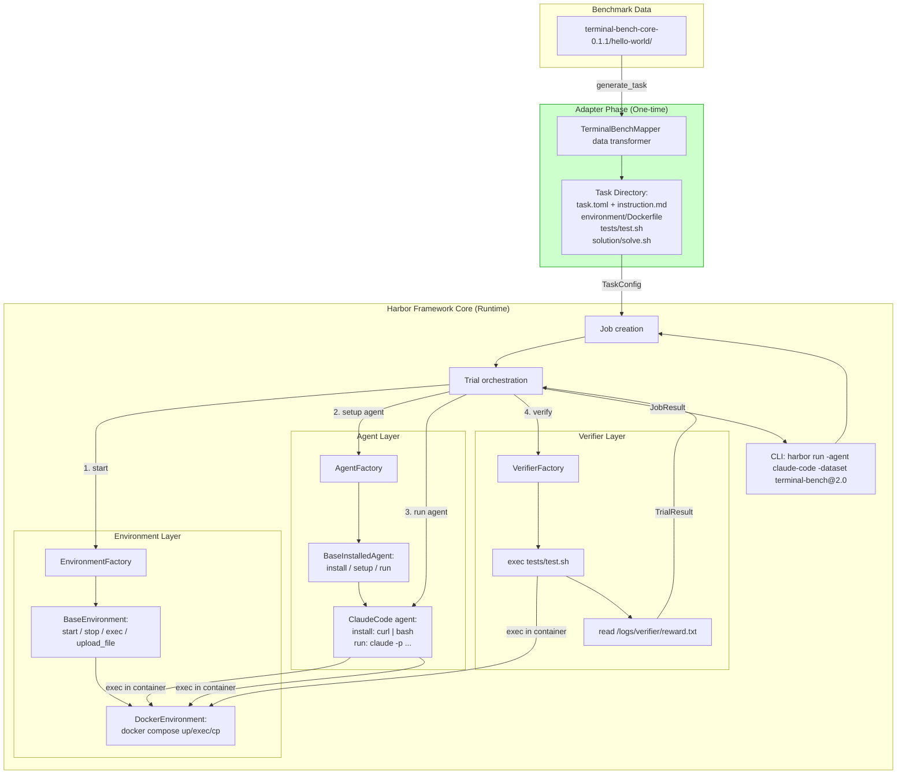
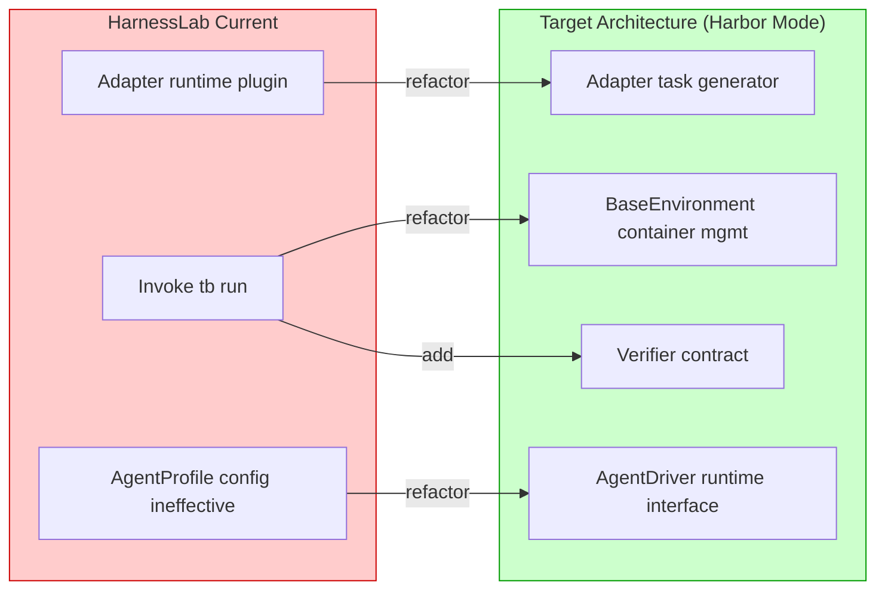

# HarnessLab vs Harbor 架构对比

## 1. HarnessLab 当前架构



**Pain points (red)**:
- AgentProfile `command` and `env` ignored by external runner
- Adapter invokes external runner: runtime black box
- Custom agent (claude-ds) cannot take effect

---

## 2. Harbor Architecture



**Advantages**:
- Adapter only generates static task directory, zero runtime coupling
- Framework core manages container, agent, verifier itself
- Agent config fully effective inside container

---

## 3. Side-by-side Comparison

| Layer | HarnessLab (Current) | Harbor |
|------|---------------------|--------|
| **Adapter** | Runtime plugin, calls external runner | Data transformer, generates static task directory |
| **Task Representation** | No unified directory, data passed in memory | Task-as-Files: task.toml + instruction.md + environment/ + tests/ + solution/ |
| **Container Management** | External runner manages (black box) | BaseEnvironment unified interface, framework manages |
| **Agent Install** | External runner installs (ignores HarnessLab config) | BaseInstalledAgent.install(), framework executes inside container |
| **Agent Execution** | External runner executes | BaseAgent.run(), framework drives inside container |
| **Verifier** | External runner executes | Framework executes tests/test.sh, reads reward.txt |
| **Custom Agent** | Limited by external runner's -agent-import-path | Native subclassing + AgentFactory registration |
| **Environment Backend** | Docker only (via external runner) | Docker / Daytona / Modal / E2B / GKE |
| **Result Collection** | Parse external runner output files | Read from bind-mounted log directory |

---

## 4. Key Migration Points for HarnessLab



### Migration Details

1. **Adapter -> Task Generator**
   - `TerminalBenchAdapter.prepare()` no longer calls `tb run`
   - Generate HarnessLab task directory (like Harbor's Task Directory)
   - Convert terminal-bench's `task.yaml` + `docker-compose.yaml` + `run-tests.sh` to HarnessLab format

2. **Add BaseEnvironment Layer**
   - Define Rust trait: `BaseEnvironment { start(), stop(), exec(), upload_file(), download_file() }`
   - Docker backend based on `docker compose`
   - Support compose override stacking (resource limits, mounts, network policy)

3. **Add AgentDriver Layer**
   - Define Rust trait: `AgentDriver { setup(env), run(instruction, env) }`
   - `ClaudeCodeDriver`: install `claude` in container, exec `claude -p ...`
   - `CodexDriver`: install `codex` in container, exec `codex ...`
   - `CustomDriver`: use AgentProfile.command to exec custom command in container
   - AgentProfile `env` injected via `environment.exec()`

4. **Verifier Contract**
   - Define standard verifier interface: exec verification script in container
   - Script writes result to agreed path (e.g. `/harnesslab/verifier/result.json`)
   - Framework core reads result file

5. **Task Directory Structure**
   ```
   .harnesslab/tasks/<task-id>/
   ├── task.toml          # task config
   ├── instruction.md     # task description
   ├── environment/
   │   ├── Dockerfile
   │   └── docker-compose.yaml
   ├── tests/
   │   └── test.sh        # verification script
   └── solution/
       └── solve.sh       # reference solution
   ```
