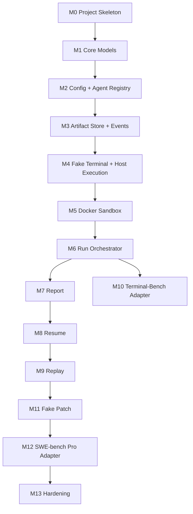

# HarnessLab MVP 开发与测试规格

> 本文把产品设计和架构设计落成可执行开发规格。每个模块都必须有明确输入、输出、失败语义、测试编号和通过标准。后续编码时，本文件是任务拆分、测试设计和验收的主要依据。

## 1. 文档定位

| 文档 | 作用 |
|---|---|
| `docs/archive/stubs/prd.md` | 定义产品方向、用户体验、MVP 边界。 |
| `docs/archive/stubs/architecture.md` | 定义核心架构、模块边界、关键 contract。 |
| `docs/archive/stubs/mvp-development-spec.md` | 定义具体开发切片、测试矩阵、通过标准和交付 gate。 |
| `docs/architecture/test-engineering.md` | 定义防止测试丢失、跑偏和自欺的测试工程、registry、traceability、runtime proof 和 meta-test 体系。 |
| `docs/architecture/technology-decisions.md` | 定义开发与测试工程关键技术选型、文件格式、依赖预算和 CI 工具。 |

本文不重新讨论产品取舍。默认所有产品决策以 PRD 为准，所有模块边界以 architecture 为准。

## 2. MVP Definition of Done

MVP 只有在以下条件全部满足时才算完成：

1. `harnesslab init` 能生成全局目录、默认配置和四类 agent profile 草稿。
2. `harnesslab doctor` 能输出结构化检查结果，并能发现 Docker、agent、auth、benchmark data、usage parser 问题。
3. `fake-terminal` benchmark 可以在 Docker 中完成成功、失败、超时、artifact collection 四类路径。
4. `fake-patch` benchmark 可以完成 repo workspace、agent diff、prediction JSONL、evaluator result 四类路径。
5. Terminal-Bench adapter 能跑通至少一个 smoke split task。
6. SWE-bench Pro adapter 能在数据已准备时跑通至少一个 public/smoke instance。
7. `run` 支持并发、attempts、增量结果落盘、失败分类、usage warning 和报告生成。
8. `resume` 能从中断 run 继续，并不会覆盖旧 attempt。
9. `replay` 能基于快照创建新 run，并在数据缺失时给出明确 blocker。
10. 单文件 HTML 报告能离线打开，首屏和 task 明细满足 PRD。
11. 测试覆盖率满足硬性 coverage gate：生产代码整体 line、branch、function/method coverage 均不低于 95%；若所选工具无法原生统计 function/method coverage，则按 Section 14.1 的替代规则执行更高 line/branch 阈值。
12. `docs/architecture/test-engineering.md` 定义的 test registry、traceability、runtime proof、meta-test 和 secret scan gate 全部通过。
13. 所有测试 gate 通过，工作区无未提交变更。

## 3. 开发切片

开发必须按可独立验证的垂直切片推进，不允许先铺大量空框架。



### 3.1 Milestone Gates

| Milestone | 交付内容 | 必须通过的测试 |
|---|---|---|
| M0 | CLI skeleton、测试框架、lint/format/test 脚本。 | `GATE-M0` |
| M1 | Core models、state machine、failure taxonomy。 | `CORE-*` |
| M2 | Config loader、agent detector、profile templates。 | `CFG-*`, `AGT-*` |
| M3 | Artifact store、event log、redaction。 | `ART-*`, `LOG-*` |
| M4 | Host process executor、fake-terminal host smoke。 | `RUN-*`, `FAKE-T-*` |
| M5 | Docker provider、auth mount dry-run。 | `SBOX-*`, `DOC-*` |
| M6 | Run orchestrator、scheduler、attempt assembly。 | `ORCH-*`, `SCHED-*` |
| M7 | Report model、HTML report。 | `RPT-*` |
| M8 | Resume。 | `RESUME-*` |
| M9 | Replay validator and replay run。 | `REPLAY-*` |
| M10 | Terminal-Bench adapter smoke。 | `TB-*` |
| M11 | Fake patch benchmark。 | `PATCH-*` |
| M12 | SWE-bench Pro adapter smoke。 | `SWEPRO-*` |
| M13 | End-to-end hardening and docs sync。 | `E2E-*`, `SEC-*` |

### 3.2 Gate Detail

| Gate | Must pass |
|---|---|
| `GATE-M0` | CLI binary can print help; test runner works; `scripts/test-after-change.sh` exits non-zero on a known failing test and zero on an empty passing suite. |
| `CORE-*` | Core models validate, state machine transitions are enforced, failure taxonomy is deterministic. |
| `CFG-*` | Global config and agent profiles parse, validate, normalize paths, and redact secrets. |
| `AGT-*` | Agent detection, command rendering, input modes, timeout config, auth expansion. |
| `ART-*` | Run directories, atomic JSON writes, manifest generation, relative artifact paths. |
| `LOG-*` | JSONL events, terminal run/task events, redaction, recoverable error fields. |
| `SBOX-*` | Docker health, sandbox create/exec/copy/destroy, network policy, orphan cleanup. |
| `DOC-*` | Doctor structured output, split-level data readiness, auth mount dry-run. |
| `ORCH-*` | Normal run lifecycle, task attempts, result assembly, exit code mapping. |
| `SCHED-*` | concurrency limit, attempts scheduling, resource hint handling, queueing. |
| `RPT-*` | report model, HTML generation, golden snapshots, relative links. |
| `RESUME-*` | interrupted run detection, attempt preservation, rerun policy. |
| `REPLAY-*` | snapshot validation, new run creation, blocker reporting. |
| `TB-*` | Terminal-Bench smoke planning, execution, verifier mapping, artifact capture. |
| `PATCH-*` | fake patch diff capture, prediction JSONL, patch failure cases. |
| `SWEPRO-*` | SWE-bench Pro data readiness, smoke instance, evaluator mapping. |
| `SEC-*` | secret redaction, docker socket warning, report/artifact scan. |
| `COV-*` | coverage report generated, global thresholds enforced, exclusions audited. |

## 4. Repository Layout Target

MVP 使用 `docs/architecture/technology-decisions.md` 锁定的 Rust workspace。目录按模块边界拆分，禁止把 CLI、core、infra、adapter 和 report 混在同一 crate。

```text
crates/
  harnesslab-cli/
  harnesslab-core/
  harnesslab-adapters/
  harnesslab-infra/
  harnesslab-report/
xtask/
tests/
  unit/
  contract/
  integration/
  golden/
  e2e/
examples/
  agents/
  runs/
docs/
scripts/
```

测试 fixture 不允许混入正式 benchmark 名称。内部测试 benchmark 必须命名为 `fake-terminal` 和 `fake-patch`。

## 5. Core Models

### 5.1 RunSpec

```json
{
  "schema_version": 1,
  "run_id": "codex-default-terminal-bench-smoke-20260526T120000Z",
  "created_at": "2026-05-26T12:00:00Z",
  "agent_profile_ref": "codex-default",
  "benchmark": {
    "name": "terminal-bench",
    "version": "2.x",
    "split": "smoke"
  },
  "execution": {
    "concurrency": 4,
    "attempts": 1,
    "network": "full",
    "timeout_sec": null
  },
  "paths": {
    "run_dir": "~/.harnesslab/runs/..."
  }
}
```

Validation rules:

- `schema_version` must be supported.
- `run_id` must be filesystem-safe.
- `agent_profile_ref` must resolve before run creation.
- `benchmark.name` and `benchmark.split` must resolve before run creation.
- `attempts >= 1`, `concurrency >= 1`.
- Agent profile materialization must complete before task scheduling. Non-materializable capability policies, invalid required commands, and host-incompatible `setup.run_as` are command failures, not benchmark verdicts.
- Run inputs must persist both private and public profile state: `agent-profile.runtime.json` for replay/resume, `agent-profile.snapshot.json` for redacted sharing, `agent-runtime.materialized.json` for structured resolved setup/capabilities, and `agent-version.snapshot.json` when `version_command` is configured.
- Public run artifacts must redact known secret values and common sensitive tokens in command-like fields, reports, task command snapshots, and version probe logs.

### 5.2 TaskAttemptResult

```json
{
  "schema_version": 1,
  "task_id": "task-001",
  "attempt": 1,
  "state": "success",
  "outcome": "success",
  "failure_class": "none",
  "failure_code": null,
  "benchmark_score": 1.0,
  "duration_ms": 122000,
  "agent": {
    "exit_code": 0,
    "termination_reason": "completed",
    "stdout_path": "agent/stdout.log",
    "stderr_path": "agent/stderr.log"
  },
  "evaluation": {
    "exit_code": 0,
    "raw_score": 1.0,
    "stdout_path": "verifier/stdout.log",
    "stderr_path": "verifier/stderr.log"
  },
  "patch": null,
  "usage": {
    "status": "unknown"
  },
  "warnings": []
}
```

Schema version `1` currently includes these structured process termination reasons:

- `completed`
- `spawn_error`
- `timeout`
- `no_progress`
- `signaled`

`no_progress` means HarnessLab killed the external process because stdout/stderr produced no new bytes within the configured watchdog window and the runner did not expose durable progress. Terminal-Bench treats official `run.log` growth as progress and active Docker setup/build subprocesses as short-lived activity, so first-time image builds are not misclassified during normal quiet phases. Activity checks are re-probed on a short cadence after the watchdog boundary and may defer for at most one extra watchdog window; process activity does not reset the no-output window, while actual `run.log` growth refreshes the progress window. Final no-progress events include `activity_grace_exhausted`, `current_activity`, `last_activity`, and `last_progress` diagnostics.

Failure codes are additive within schema version `1`. Terminal-Bench runner stalls use `external_runner_no_progress` or `external_runner_timeout` so they are distinguishable from agent-level `agent_timeout`.
Terminal-Bench adapter cleanup failures use `agent_cleanup_failed` and are execution failures because they invalidate the run environment rather than scoring the benchmark task.
`TaskAttemptResult.health_impact` is an adapter-agnostic run-health signal:

- `none`: no run-level health impact.
- `stall`: execution made no useful progress or timed out and can count toward run-health abort.
- `environment_unhealthy`: local benchmark environment is unhealthy and should abort immediately.

RunMonitor consumes `health_impact`, not benchmark-specific failure codes. A HarnessLab process-level timeout or no-progress kill must set `stall` even if an external benchmark wrote a valid result first.

Pass criteria:

- Result JSON is valid after every terminal task state.
- A partial write must never leave invalid JSON at canonical `result.json`; write temp then atomic rename.
- `outcome`, `failure_class`, and `failure_code` must be internally consistent.

### 5.3 Failure Mapping

| Trigger | Expected outcome | Class | Code |
|---|---|---|---|
| Docker create fails | failure | execution | `sandbox_create_failed` |
| Workspace preparation fails | failure | execution | `workspace_prep_failed` |
| Agent command not found | failure | execution | `agent_spawn_error` |
| Agent timeout | failure | execution | `agent_timeout` |
| External benchmark runner has no durable log progress before watchdog timeout and bounded activity grace | failure | execution | `external_runner_no_progress` |
| External benchmark runner exceeds HarnessLab hard timeout | failure | execution | `external_runner_timeout` |
| External benchmark runner setup/build fails before agent starts | failure | execution | `external_runner_setup_failed` |
| External benchmark reports agent timeout | failure | benchmark | `agent_timeout` |
| Agent killed by signal | failure | execution | `agent_signaled` |
| Agent exits non-zero before evaluation can run | failure | execution | `agent_nonzero_exit` |
| Verifier timeout | failure | benchmark | `verifier_timeout` |
| Verifier infra crash | failure | benchmark | `verifier_error` |
| Tests fail normally | failure | benchmark | `test_failed` |
| Patch benchmark has no diff | failure | benchmark | `no_valid_diff` |
| Patch cannot be captured or applied because HarnessLab workspace/git plumbing failed | failure | execution | `patch_apply_failed` |
| Usage parser missing | unchanged | warning | `usage_unknown` |
| Usage parser fails | unchanged | warning | `usage_parser_failed` |

### 5.4 Run Exit Code Derivation

| Run condition | Exit code |
|---|---:|
| User interrupted run and run is resumable | `130` |
| Run-level failure before task execution, such as invalid config, Docker unavailable, benchmark data blocker | `3` |
| At least one task has `execution_failure` | `1` |
| No execution failure; tasks contain `success`, `partial_success`, or `benchmark_failure` verdicts | `0` |
| No task executed because filter/limit selected zero tasks | `3` with run-level validation error |

Skipped tasks do not hide failures. If a task was skipped because of run-level failure, the run-level failure exit code wins.

`run --json` fields:

- `status` is command health only. `status = "success"` means the run completed and artifacts were written, not that every task scored.
- `exit_code` mirrors the process exit code.
- `verdict` is the experiment verdict bucket: `success`, `partial_success`, `benchmark_failure`, `execution_failure`, `interrupted`, or `run_failed`.
- `summary` mirrors `results.json.summary` so automation can distinguish low score from command failure without parsing HTML.
- `results_path` points to `results.json`; `report_path` points to `report.html`.
- `report.html` must link the redacted profile snapshot, materialized runtime snapshot, command snapshot, run-health snapshot, and version snapshot when available. It must display effective capability sets and version probe status from persisted artifacts.

### 5.5 TaskAttemptAssembler

`TaskAttemptAssembler` is the deterministic join point for runtime outputs:

```text
assemble(
  agent_result,
  evaluation_result,
  artifact_result,
  usage_result,
  failure_classification
) -> TaskAttemptResult
```

Rules:

- `evaluation_result` determines benchmark score and success/partial/failure when agent execution reached evaluation.
- `failure_classification` determines `failure_class` and `failure_code`.
- `usage_result` can only add usage fields or warning codes; it must not change outcome.
- `warnings[]` can include adapter-translated upstream advisory verdicts. These warnings must not change `outcome`, `failure_class`, exit code, or benchmark score.
- Optional artifact collection failure can only add warnings.
- Required artifact collection failure maps to `execution/artifact_collection_failed`.
- If agent fails before evaluation, `evaluation` may be null but `agent` must be present.
- The assembler must be pure and unit-tested; it must not read files or run commands.

## 6. Config And Agent Registry

### 6.1 Global Config

```toml
schema_version = 1
default_concurrency = 4
default_attempts = 1
runs_dir = "~/.harnesslab/runs"
benchmarks_dir = "~/.harnesslab/benchmarks"
network_default = "full"

[usage_default]
parser = "none"
```

Validation:

- Unknown top-level keys are warnings in MVP, not errors.
- Invalid enum values are errors.
- Paths must be expanded for execution but preserved in redacted snapshots.

### 6.2 Agent Profile Schema

```toml
schema_version = 1
name = "codex-default"
kind = "codex"
display_name = "Codex Default"
command = "codex exec --full-auto {{instruction}}"
input_mode = "argument"
working_dir = "workspace"
timeout_sec = 3600
version_command = "codex --version"

[auth]
inherit = true
inherit_env = ["OPENAI_API_KEY"]
include_paths = ["~/.codex"]
exclude_paths = []
mount_ssh_socket = false
mount_docker_socket = false

[setup]
preset = "builtin"
required_commands = ["codex"]
run_as = "harnesslab"
commands = []

[skills]
inherit = true
allow = []
deny = []
include_paths = []

[tools]
inherit = true
allow = []
deny = []

[hooks]
inherit = true
allow = []
deny = []

[usage]
parser = "none"

[labels]
model = "user-configured"
```

Validation:

- `name` must match `[a-zA-Z0-9][a-zA-Z0-9._-]*`.
- `kind` must be one of built-in kinds or `custom`.
- `command` must include one input variable unless input mode is `stdin` or `tty`.
- `setup.preset` must be `none`, `builtin`, or `custom`.
- `setup.commands` is valid only when `setup.preset = "custom"`.
- `setup.required_commands` entries must be non-empty command names, not shell pipelines.
- `setup.run_as` must be `root`, `harnesslab`, or `current`; omitted values default to `current`.
- `skills.allow` and `skills.deny` must not contain the same item.
- `tools.allow` and `tools.deny` must not contain the same item.
- `hooks.allow` and `hooks.deny` must not contain the same item.
- Non-default skills/tools/hooks policies must be materializable by the profile kind; otherwise doctor returns an error before run.
- `input_mode` must be `argument`, `file`, `stdin`, or `tty`.
- `timeout_sec` must be positive.
- `mount_docker_socket` defaults to false and must produce a warning if true.

Agent registration first-experience acceptance:

- `harnesslab init` creates readable default profile files for detected built-in agents; a human or another agent should understand what to edit without reading Rust code.
- Every profile field has a documented allowed value range and example in the user-facing registry reference.
- `harnesslab doctor --json` reports invalid profile fields with the exact profile name, field path, accepted values, and a suggested fix.
- A profile with non-default skills/tools/hooks policy must either materialize successfully for its `kind` or fail pre-run doctor with a blocking error.
- A profile using `setup.preset = "custom"` and `setup.commands` must be marked as advanced/high-risk in doctor output.
- Run snapshots and HTML reports include the effective setup, skills, tools, and hooks summaries so users can verify the compared harness configuration.
- Registration validation can run without starting a benchmark, so another agent can generate a profile and immediately ask HarnessLab to verify it.
- `version_command` is optional. If present, replay validator compares its output with the snapshot according to profile policy.

### 6.3 Init Detection Standards

| Agent | Detection | Generated profile |
|---|---|---|
| Codex CLI | executable `codex` in PATH. | `codex-default.toml` |
| Claude Code | executable `claude` in PATH. | `claude-code-default.toml` |
| opencode | executable `opencode` in PATH. | `opencode-default.toml` |
| Pi Coding Agent | executable `pi` in PATH and version command succeeds. | `pi-coding-agent-default.toml` |

Detection must be non-destructive and must not invoke model APIs.

## 7. Benchmark Adapter Contracts

### 7.1 BenchmarkDescriptor

```json
{
  "name": "terminal-bench",
  "style": "terminal",
  "version": "2.x",
  "homepage": "https://terminalbench.lol/",
  "splits": [
    {
      "name": "smoke",
      "task_count": 1,
      "data_state": "ready"
    }
  ]
}
```

Pass criteria:

- `benchmark list` can be rendered entirely from descriptors.
- `benchmark info` must include split-level data state.
- Descriptor generation must not mutate local cache.

Benchmark data state mapping:

| State | Doctor behavior | Run preflight behavior |
|---|---|---|
| `not_downloaded` | warning with setup action. | block requested split unless auto-prepare is available and succeeds. |
| `downloading` | warning. | block concurrent run for that split. |
| `partial` | warning with ready/missing split detail. | allow ready splits, block missing splits. |
| `ready` | ok. | allow. |
| `corrupted` | error with repair action. | block. |
| `requires_auth` | error with auth setup action. | block. |
| `auth_failed` | error. | block. |
| `unsupported` | error. | block. |

### 7.2 PreparedBenchmark

Returned by `BenchmarkAdapter.prepare(split)`:

```json
{
  "descriptor": {
    "name": "terminal-bench",
    "style": "terminal"
  },
  "split": "smoke",
  "data_state": "ready",
  "prepared_at": "2026-05-26T12:00:00Z",
  "task_count": 1,
  "cache_manifest_path": "~/.harnesslab/benchmarks/terminal-bench/manifest.json",
  "size_bytes": 123456,
  "warnings": []
}
```

Pass criteria:

- Preparation is idempotent.
- Preparation failure never creates a partially valid `ready` state.
- `prepared_at` and cache manifest are saved into benchmark snapshot.

### 7.3 TaskDescriptor

```json
{
  "task_id": "fake-terminal-success",
  "split": "smoke",
  "estimated_timeout_sec": 60,
  "resource_hint": {
    "cpu_cores": 1,
    "memory_mb": 1024
  },
  "source_ref": {
    "benchmark": "fake-terminal",
    "upstream_id": "success",
    "checksum": "sha256:..."
  }
}
```

Pass criteria:

- Descriptor is serializable.
- `task_id` is stable across list/plan calls for the same benchmark version.
- `source_ref` is sufficient for replay readiness checks.

### 7.4 BenchmarkPlan

Output of `BenchmarkRegistry.plan_run()`:

```json
{
  "benchmark": {
    "name": "terminal-bench",
    "version": "2.x"
  },
  "split": "smoke",
  "prepared_benchmark_ref": "~/.harnesslab/benchmarks/terminal-bench/manifest.json",
  "tasks": [
    { "task_id": "fake-terminal-success" }
  ],
  "run_config_overrides": {
    "timeout_sec": null,
    "network": "none"
  },
  "warnings": []
}
```

Pass criteria:

- Plan contains only serializable data.
- Plan is written into `benchmark.snapshot.json`.
- Plan contains all tasks selected by split and any CLI limit/filter.

### 7.5 TaskPlan

```json
{
  "task_id": "fake-terminal-success",
  "instruction": "Create /workspace/result.txt with content ok",
  "workspace_spec": {
    "type": "empty",
    "target_path": "/workspace",
    "clean": true
  },
  "sandbox_spec": {
    "image": "harnesslab/fake-terminal:0.1.0@sha256:<fixture-image-digest>",
    "mounts": [],
    "env_vars": [],
    "network": "none",
    "privileged": false,
    "resource_limits": {
      "cpu_cores": 1,
      "memory_mb": 1024
    }
  },
  "verifier_spec": {
    "command": "bash /tests/test.sh",
    "working_dir": "/workspace",
    "timeout_sec": 60,
    "expected_exit_codes": [0],
    "environment_mode": "same_sandbox",
    "output_parser": "reward_file"
  },
  "artifact_spec": {
    "base_dir": "/workspace",
    "globs": ["**/*"],
    "required_paths": [],
    "max_size_bytes": 10485760
  }
}
```

Pass criteria:

- Every supported benchmark task can be represented by TaskPlan.
- TaskPlan can be serialized into `task.snapshot.json`.
- TaskPlan contains no live process handle or non-serializable object.

### 7.6 Terminal-Style Adapter

Required behavior:

- Creates task instruction from upstream task metadata.
- Produces sandbox spec from upstream task environment.
- Runs verifier through Evaluation Coordinator.
- Parses upstream reward/result into `EvaluationResult`.
- Does not require a git diff.

Terminal smoke acceptance:

- A known passing fake task returns `success` and score `1`.
- A known failing fake task returns `benchmark_failure/test_failed`.
- A HarnessLab process-level agent timeout returns `execution_failure/agent_timeout`.
- An external benchmark-reported agent timeout returns `benchmark_failure/agent_timeout`.
- Artifacts under configured artifact dirs are collected and listed in manifest.

Terminal-Bench runtime acceptance:

- The adapter runs through HarnessLab CLI using the official Terminal-Bench runner; no validation path may bypass `harnesslab run`.
- Runtime configuration is emitted to `events.jsonl` before launching each task and includes `process_timeout_sec`, `no_output_timeout_sec`, `activity_grace_sec`, `docker_platform`, progress paths, and activity patterns.
- The default Docker platform for ordinary Terminal-Bench tasks is `linux/amd64`; a contract test must prove `DOCKER_DEFAULT_PLATFORM=linux/amd64` is exported for non-QEMU tasks. On Apple Silicon, QEMU tasks such as `build-initramfs-qemu` and `build-tcc-qemu` must use an adapter-owned compatibility path that still produces x86_64 artifacts for the official verifier.
- QEMU compatibility preparation must be attempt-local: for `build-initramfs-qemu` and `build-tcc-qemu`, the adapter may copy the task dataset and patch its Dockerfile, but it must not mutate the original benchmark cache. Native arm64 compatibility must cross-compile with `ARCH=x86_64 CROSS_COMPILE=x86_64-linux-gnu-`; forced amd64 emulation may serialize the kernel build to `make -j1`.
- Adapter planning must read Terminal-Bench `task.yaml` `max_agent_timeout_sec` and `max_test_timeout_sec`. `--global-agent-timeout-sec`, `HARNESSLAB_AGENT_TIMEOUT_SEC`, `--global-test-timeout-sec`, and HarnessLab hard/no-output timeouts must be derived from those benchmark-owned limits; user `--timeout-sec` must not inflate official verifier timeout.
- The no-output watchdog default must leave a setup/build window of at least 1800 seconds unless capped by the hard timeout. A unit test must prove the default is not the short agent/test-only window.
- Official Terminal-Bench `failure_mode=parse_error` maps to `benchmark_failure/agent_output_parse_error` so agent output-format failures are visible separately from wrong answers.
- Official Terminal-Bench setup/build failures, including Docker compose build errors reported as `unknown_agent_error`, map to `execution_failure/external_runner_setup_failed` and trigger run-health abort for pending tasks.
- The Python agent bridge must strip common natural-language preambles before shell script execution while preserving shell-significant content such as arrays, heredocs, exports, and fenced scripts.
- A real-run check for QEMU tasks must use a `.benchmarks/` subset and the normal HarnessLab CLI. Passing criteria are either valid benchmark scores for both tasks, or a classified benchmark verdict that is not caused by HarnessLab runtime/platform/watchdog/cleanup failure.
- Any `execution_failure/external_runner_no_progress`, `execution_failure/external_runner_timeout`, `execution_failure/external_runner_setup_failed`, `execution_failure/agent_cleanup_failed`, missing official result, or unclassified parse failure in that QEMU check is a release blocker for the Terminal-Bench adapter.

### 7.7 Patch-Style Adapter

Required behavior:

- Prepares repo workspace or `benchmark_managed` workspace handle.
- Captures diff after agent run.
- Emits prediction JSONL when required by evaluator.
- Runs evaluator and parses result.
- Preserves base revision, diff, prediction, evaluator logs.

Patch smoke acceptance:

- Agent creates valid diff; evaluator returns success.
- Agent creates no diff; result is `benchmark_failure/no_valid_diff`.
- HarnessLab cannot capture/apply the diff because workspace or git plumbing failed; result is `execution_failure/patch_apply_failed`.
- Official evaluator output is missing or unparsable after HarnessLab launches it; result is `execution_failure/evaluator_error`.
- Official evaluator reports a normal failed patch; result is `benchmark_failure/test_failed` or the benchmark-specific failure code.

## 8. Execution Contracts

### 8.1 AgentCommandRenderer

Inputs:

- Agent profile.
- Task instruction.
- Attempt directory.
- Template variables.

Outputs:

- Rendered command.
- Input material path if `input_mode=file`.
- stdin payload if `input_mode=stdin`.
- tty injection plan if `input_mode=tty`.

Pass criteria:

- Missing template variable is validation error.
- Shell metacharacters in instruction do not alter command structure for `file`, `stdin`, or `tty`.
- `argument` mode must document that shell quoting is the user profile author's responsibility unless command is array-based.

### 8.2 AgentRunner

AgentRunner executes rendered commands through a target:

| Target | Executor |
|---|---|
| sandbox | `SandboxProvider.exec` |
| host | `HostProcessExecutor.exec` |

MVP official benchmark runs must use `sandbox`.

AgentRunner pass criteria:

- Writes stdout/stderr even on timeout.
- Produces `AgentRunnerResult` for spawn errors, timeouts, signals, and normal exits.
- Does not classify task success.
- Never writes secrets to structured event fields.

### 8.3 SandboxProvider

Minimum API:

```text
health_check() -> HealthResult
create(TaskPlan, AgentProfile, RunContext) -> SandboxHandle
exec(SandboxHandle, ExecSpec) -> ExecResult
copy_out(SandboxHandle, ArtifactSpec, AttemptDir) -> ArtifactCollectionResult
cleanup_orphans(run_id) -> CleanupResult
destroy(SandboxHandle) -> DestroyResult
```

Docker pass criteria:

- `health_check` fails clearly when Docker daemon is unavailable.
- Auth include path dry-run proves files are visible inside container without printing contents.
- Network policy `none` prevents outbound network in fake test.
- `cleanup_orphans` removes containers labeled with run id.
- `destroy` is called after success and failure paths.

### 8.4 EvaluationCoordinator

Pass criteria:

- `same_sandbox` verifier runs after agent in same sandbox.
- `separate_sandbox` verifier creates and destroys a separate sandbox.
- `host_process` evaluator never runs inside agent sandbox.
- Verifier stdout is preserved at `verifier/stdout.log`; stderr is preserved at `verifier/stderr.log`.
- Verifier/evaluator test failure maps to a benchmark failure. HarnessLab cannot parse required evaluator output or cannot complete evaluator orchestration maps to `execution_failure/evaluator_error`.

### 8.5 Artifact Collector

Pass criteria:

- Required artifact missing creates `artifact_collection_failed`.
- Optional artifact missing creates warning only.
- Manifest includes source, destination, type, status, size, and error message if failed.
- Artifact collection happens after evaluation.
- Artifact collection failure never changes benchmark score unless required artifact is missing.

## 9. Run Orchestrator Acceptance

### 9.1 Normal Run Sequence

Expected event order for each task:

```text
task_started
sandbox_created
workspace_prepared
agent_started
agent_finished
evaluation_started
evaluation_finished
artifact_collection_finished
task_finished
```

Pass criteria:

- Events are append-only JSONL.
- Concurrent task workers must not interleave event writes; every physical line
  must be exactly one valid event object.
- If process crashes, completed task attempts remain valid.
- `results.json` can be regenerated from task attempt results.
- Report can be regenerated from artifact store only.

### 9.2 Attempts

For `attempts=3`, each task gets up to three attempts according to benchmark policy.

MVP policy:

- Run all attempts independently.
- Report task-level score as benchmark adapter's aggregation rule.
- If adapter has no rule, default to `max(score)` across attempts, where normalized score is in `[0, 1]`, with all attempt details visible.

Pass criteria:

- Attempt directories are `attempts/1`, `attempts/2`, etc.
- Attempts do not overwrite each other.
- Usage and duration aggregate across attempts and remain visible per attempt.

### 9.3 Concurrency

Pass criteria:

- `concurrency=1` produces deterministic task start order.
- `concurrency=4` never exceeds four active task assignments.
- Scheduler uses a worker-pool refill model: a completed fast task immediately frees a slot for the next pending attempt, even while slower active attempts continue running.
- Once run-health abort is observed, Scheduler stops assigning new pending attempts, lets active workers finish, and writes not-yet-started attempts as `run_health_aborted`.
- Once an internal worker error or panic is observed, Scheduler stops assigning new pending attempts and lets already-started workers finish before returning the error.
- Failure in one task does not cancel unrelated tasks unless run-level config says fail-fast.
- Ctrl+C transitions run to `paused` and returns exit code `130`.

## 10. Resume And Replay Acceptance

### 10.1 Resume

Setup:

- A run directory contains one success task, one partial success task, one benchmark failure, one execution failure, and one interrupted attempt.

Expected:

- Any attempt in `preparing`, `agent_running`, `evaluating`, or `collecting` state is marked as `interrupted` before a new attempt is created.
- Partial agent stdout/stderr from an interrupted attempt is preserved in the original attempt directory.
- If Docker was restarted and orphaned containers are already gone, cleanup returns ok with `not_found` details instead of failing resume.
- Resume skips success and partial success.
- Resume creates new attempts for benchmark failure, execution failure, and interrupted task.
- Old attempt directories remain intact.
- Run event log records `run_resumed`.
- Final report marks resumed tasks.

### 10.2 Replay

Setup:

- A completed run directory has all snapshots and task manifests.

Expected:

- Replay creates a new run directory.
- Replay uses snapshot agent profile, not current global profile.
- Replay fails before execution if the authoritative benchmark snapshot is
  missing or benchmark identity is mismatched.
- Replay fails before execution if required agent command is missing.
- Replay fails before execution if required sandbox image tag/digest is unavailable.
- If `version_command` exists and output differs from snapshot, replay readiness reports blocker or warning according to profile policy.
- Replay readiness output lists blockers with stage/code/detail.
- Replay `run.json` contains `replay_source_run_id`; report displays source run id as text because source path may not exist.

## 11. Report Acceptance

HTML report must satisfy:

- Opens from filesystem without a server.
- Contains run summary, agent profile summary, benchmark summary, failure summary, usage summary.
- Contains task table with task id, outcome, failure class/code, score, duration, usage, links.
- Shows `unknown` usage with explicit "cost not comparable" wording.
- Redacts env values and auth path contents.
- Includes replay command and original command.
- Links to stdout/stderr/verifier/diff artifacts using relative paths.

Golden tests:

- `report-success.html`
- `report-execution-failure.html`
- `report-benchmark-failure.html`
- `report-partial-usage-unknown.html`
- `report-resumed-run.html`

Golden tests may ignore timestamps and generated ids through stable normalization.

## 12. Doctor Acceptance

Doctor output must have machine-readable and human-readable forms.

Machine-readable shape:

```json
{
  "status": "ok|warning|error",
  "checks": [
    {
      "id": "docker.daemon",
      "status": "ok",
      "severity": "error",
      "message": "Docker daemon reachable",
      "details": {}
    }
  ]
}
```

Pass criteria:

- Missing Docker returns error.
- Missing agent command returns error for that profile.
- Missing optional usage parser returns warning, not error.
- Missing benchmark full split data returns split-level warning or error depending on requested run.
- Auth path mount dry-run does not print file content.
- `doctor --json` follows the stability contract below.

`doctor --json` stability contract:

- `checks[].id`, `checks[].status`, `checks[].severity`, and `checks[].message` are exact-match stable.
- `details` keys are stable, but values may be normalized in tests when they contain absolute paths.
- Timestamps, durations, and local machine paths are not exact-match fields.

## 13. Test Matrix

### 13.1 Unit Tests

| ID | Area | Scenario | Expected |
|---|---|---|---|
| CORE-001 | State machine | pending -> preparing -> agent_running -> evaluating -> collecting -> success | allowed |
| CORE-002 | State machine | success -> agent_running | rejected |
| CORE-003 | Failure classifier | agent timeout | execution/agent_timeout |
| CORE-004 | Failure classifier | verifier failed tests | benchmark/test_failed |
| CFG-001 | Config | valid global config | parses |
| CFG-002 | Config | invalid enum | validation error |
| CFG-003 | Config | secret env redaction | value redacted |
| CFG-004 | Config | path expansion | `~`, env var, relative path normalize correctly |
| CFG-005 | Config | config snapshot redaction | sensitive values redacted in snapshot |
| AGT-001 | Renderer | file input mode | writes instruction file |
| AGT-002 | Renderer | missing template var | validation error |
| AGT-003 | Renderer | stdin mode | creates stdin payload |
| AGT-004 | Agent profile | auth inherit expansion | explicit env/path fields created |
| AGT-005 | Agent profile | docker socket requested | warning emitted |
| AGT-006 | Init | profile generation | generated profiles are valid |
| ART-001 | Artifact | manifest generation | source/destination/type/status/size present |
| ART-002 | Artifact | relative paths | manifest stores relative artifact paths |
| ART-003 | Artifact | atomic JSON write | crash leaves old valid JSON or new valid JSON |
| LOG-001 | Events | event schema | every line has required fields |
| LOG-002 | Events | event ordering | lifecycle order is valid |
| LOG-003 | Events | event redaction | no known fake secret in events |
| LOG-004 | Events | terminal task event | task has terminal finished/interrupted event |
| LOG-005 | Events | concurrent append | parallel task writes preserve one valid event per JSONL line |
| LOG-006 | Events | integrity gate | malformed event log line is rejected with path and line number |
| ORCH-001 | Orchestrator | success assembly | output TaskAttemptResult is consistent |
| ORCH-002 | Orchestrator | failure assembly | failure class/code propagated |
| ORCH-003 | Orchestrator | exit code mapping | run outcome matrix maps to expected code |
| ORCH-004 | Orchestrator | attempts assembly | attempts 1/2/3 do not overwrite |
| ORCH-005 | Orchestrator | results rebuild | run result rebuilds from task attempts |
| SCHED-001 | Scheduler | serial order | concurrency 1 deterministic |
| SCHED-002 | Scheduler | resource preflight | impossible resource hint blocks run |
| SCHED-003 | Scheduler | concurrency limit | active assignments never exceed limit |
| SCHED-004 | Scheduler | dynamic refill | fast completion starts next pending attempt before slow active attempt drains |
| SCHED-005 | Scheduler | abort refill stop | run-health abort stops new assignment and records pending attempts as interrupted |
| RPT-001 | Report | golden HTML | normalized HTML matches golden |
| RPT-002 | Report | report model | serializable and independent of Docker/evaluator |
| RPT-003 | Report | regenerable | same report model from artifact store only |
| USE-001 | Usage | parser none | status unknown warning |
| USE-002 | Usage | regex parser success | tokens parsed |
| USE-003 | Usage | regex parser miss | parse_error warning |
| USE-004 | Usage | attempts aggregate | aggregate usage follows documented rule |

### 13.2 Contract Tests

| ID | Contract | Scenario | Expected |
|---|---|---|---|
| C-BENCH-001 | BenchmarkAdapter | descriptor | serializable, contains splits |
| C-BENCH-002 | BenchmarkAdapter | task plan | all specs serializable |
| C-BENCH-003 | BenchmarkAdapter | evaluate parse | maps raw output to EvaluationResult |
| C-SBOX-001 | SandboxProvider | health check | structured ok/error |
| C-SBOX-002 | SandboxProvider | exec echo | stdout captured |
| C-SBOX-003 | SandboxProvider | timeout | termination_reason timeout |
| C-RUN-001 | AgentRunner | sandbox target | uses sandbox executor |
| C-RUN-002 | AgentRunner | host target | uses host executor only when allowed |
| C-RPT-001 | ReportService | from artifact store | no evaluator/Docker dependency |

### 13.3 Integration Tests

| ID | Scenario | Command | Expected |
|---|---|---|---|
| INT-001 | init empty home | `harnesslab init --home <tmp>` | config and profile templates created |
| INT-002 | doctor fake ok | `harnesslab doctor --home <tmp> --json` | status ok |
| INT-003 | fake terminal success | `harnesslab run --agent fake --benchmark fake-terminal --split success` | exit 0 |
| INT-004 | fake terminal test fail | same with fail split | exit 0, result contains `benchmark/test_failed` |
| INT-005 | fake terminal timeout | timeout split | exit 1 |
| INT-006 | fake patch success | `fake-patch` success split | diff and prediction saved |
| INT-007 | fake patch no diff | no-diff split | benchmark/no_valid_diff |
| INT-008 | resume mixed run | `harnesslab run resume <run>` | only failed/interrupted rerun |
| INT-009 | replay success | `harnesslab run replay <run>` | new run dir created |
| INT-010 | replay missing data | remove cached manifest | readiness blocker, no task starts |
| INT-011 | resume mid-agent | simulate interrupted `agent_running` attempt | old attempt marked interrupted, logs preserved |
| INT-012 | replay missing agent | remove fake agent binary from PATH | readiness blocker, no task starts |
| INT-013 | replay missing benchmark snapshot | remove `benchmark.snapshot.json` | replay blocker, no task starts |
| INT-014 | replay missing image | remove or reference missing sandbox image | readiness blocker, no task starts |

### 13.4 E2E Tests

| ID | Scenario | Pass standard |
|---|---|---|
| E2E-001 | Terminal-Bench smoke | At least one official smoke task runs to a benchmark result with logs and report. |
| E2E-002 | SWE-bench Pro smoke | With prepared data, one public/smoke instance runs through diff/prediction/evaluator/report. |
| E2E-003 | CLI user journey | `init -> doctor -> run -> report open latest` works under temp home. |
| E2E-004 | Interrupt and resume | Ctrl+C or simulated interrupt creates paused run and resume completes. |

## 14. Local Test Gate

Once implementation starts, every code change must pass a single local gate script:

```bash
scripts/test-after-change.sh
```

Minimum responsibilities:

1. Format check.
2. Lint/static check.
3. Unit tests.
4. Contract tests.
5. Fast integration tests with fake benchmarks.
6. Report golden tests.
7. Security redaction scan.
8. Test registry check.
9. Traceability check.
10. New-file coverage check.
11. Coverage check.

Docker-dependent tests must be included in the default gate once Docker provider exists. Before then, the script must print `SKIP` with a concrete reason, not silently omit them.

`docs/architecture/test-engineering.md` is the source of truth for the concrete test project layout, registry schema, anti-self-deception rules, meta-tests, and M0 acceptance criteria.

### 14.1 Coverage Gate

Coverage is a hard engineering gate, not an informational metric.

M0 must pin the Rust toolchain and coverage engine before any production feature code lands. The selected coverage engine, version range, command, config file, and output formats must be recorded in the repository, for example:

```text
coverage.engine: cargo-llvm-cov
coverage.version: pinned in tools.versions.toml
coverage.toolchain: rust-toolchain.coverage.toml
coverage.command: scripts/test-after-change.sh
coverage.config: coverage-critical.toml
coverage.outputs:
  - coverage/cobertura.xml
  - coverage/coverage.json
```

If the selected coverage toolchain cannot report function/method coverage natively, M0 must encode the waiver in checked-in coverage config and preserve the hard global line coverage threshold at `>= 95%`. Branch coverage remains a tracked gate and is raised as the Rust coverage path stabilizes for this code shape.

M0 uses this encoded waiver in `coverage-critical.toml`: Rust function coverage is deferred because the current cargo-llvm-cov path counts duplicate unexecuted CLI library monomorphizations during binary integration tests. The active implementation gate is line `>= 95%` and branch `>= 70%`, enforced by `xtask check-coverage` over LCOV output. Critical modules are checked from the same LCOV file.

Minimum thresholds for production code:

| Metric | Threshold |
|---|---:|
| Line coverage | `>= 95%` |
| Branch coverage | `>= 95%` |
| Function / method coverage | `>= 95%` |

Critical modules have stricter expectations:

| Module area | Minimum |
|---|---:|
| Core models, state machine, failure classifier | `>= 98% line`, `>= 95% branch` |
| Config validation and redaction | `>= 98% line`, `>= 95% branch` |
| Run orchestrator, resume, replay validator | `>= 98% line`, `>= 95% branch` |
| Usage parser and report model | `>= 95% line`, `>= 95% branch` |

Coverage scope:

- Included: all production source under `crates/harnesslab-*/src/`.
- Excluded by default: test files, generated files, vendored dependencies, type-only declarations, and benchmark fixture data.
- HTML/CSS templates under `crates/harnesslab-report/` are included when rendered at runtime by report code. Pure static assets can be excluded only with path-specific reasons.
- `scripts/test-after-change.sh` is covered by `GATE-M0` functional tests. If future gate logic moves into production source, it is included in coverage accounting.
- Exclusions must be explicit in the coverage config and must include a one-line reason.
- New production files must enter coverage accounting in the same PR that creates them.

Anti-gaming rules:

- Do not raise coverage by testing only trivial import paths.
- Do not exclude a file merely because it is hard to test.
- Runtime behavior changes require at least one unit/contract test and, when applicable, a fake benchmark or Docker smoke test.
- Coverage regressions below threshold fail `scripts/test-after-change.sh` and CI.
- Critical modules must include error-path and edge-case tests, not only import or happy-path tests.
- Starting at M13 hardening, critical modules must pass mutation testing with kill rate `>= 80%`, or the milestone must explicitly document why the selected language/toolchain cannot support mutation testing yet.

Coverage artifacts:

- Local gate must print a human-readable summary.
- CI must produce Cobertura XML at `coverage/cobertura.xml` and JSON summary at `coverage/coverage.json`, or equivalent files documented by the pinned coverage engine.
- CI must retain coverage artifacts according to repository CI retention policy; default target is at least 90 days.
- Coverage report must include uncovered lines and branches for failed thresholds.

Critical module enforcement:

- Critical thresholds must be represented in a checked-in config, for example `coverage-critical.toml`.
- The local gate must run both global coverage thresholds and critical-module thresholds.
- A pass requires both global and critical coverage checks to pass.

New file enforcement:

- CI must compare changed files against the merge base, for example `git merge-base origin/main HEAD`.
- Any new file under production source that is missing from the coverage report fails CI.
- This check should live in a script such as `scripts/check-new-file-coverage.sh` and run inside `scripts/test-after-change.sh` or CI.

## 15. CI Gate

CI must run:

```text
lint
unit
contract
integration-fast
report-golden
security-redaction
registry-check
traceability-check
new-file-coverage
coverage
docs-link-check
```

CI may skip external Terminal-Bench and SWE-bench Pro smoke by default if data or runtime is too heavy, but must run fake terminal and fake patch every time.

CI must fail if coverage drops below the thresholds in Section 14.1.

Coverage scope for CI:

- The required coverage gate is computed from unit, contract, report golden, and fast fake-benchmark integration tests.
- External benchmark smoke jobs are not required to pass before the coverage gate can be evaluated.
- If the toolchain supports coverage merge, external smoke coverage may be merged into the report, but thresholds must already pass without relying on external benchmark jobs.

Nightly or manual CI should run:

```text
docker-full
terminal-bench-smoke
swe-bench-pro-smoke
mutation-critical
resume-replay-e2e
```

## 16. External Benchmark Acceptance

### 16.1 Terminal-Bench

Pass standard:

- `benchmark info terminal-bench` shows at least one ready split or clear setup instructions.
- Running one official smoke task produces:
  - task snapshot.
  - agent stdout/stderr.
  - verifier stdout/stderr.
  - benchmark score.
  - report row.
  - replay metadata.

Failure modes must be tested by adapter-level fixtures if official benchmark does not provide deterministic failures.

### 16.2 SWE-bench Pro

Pass standard:

- `benchmark info swe-bench-pro` reports split-level data readiness.
- If data is missing, doctor gives actionable blocker before run starts.
- With data ready, one instance produces:
  - repo workspace manifest.
  - base revision.
  - diff patch.
  - prediction JSONL.
  - evaluator logs.
  - benchmark score.
  - report row.

No-diff and patch-apply failure must be reproducible via fake-patch even if external dataset does not expose convenient cases.

## 17. Security And Redaction Tests

### 17.1 Redaction Rules

| Target | Rule |
|---|---|
| Env var value marked secret or inherited auth value | Replace with `[REDACTED]` in snapshots, events, and report. |
| Auth file content | Never embed in snapshots, events, or report. |
| Auth path | Preserve path name in doctor/report, tagged as `(mounted)`, but do not list file contents. |
| `command.txt` | Store the original CLI command template and redacted rendered command; never store expanded secret values. |
| Agent stdout/stderr | Preserve raw logs by default; mark as sensitive-risk artifact and do not inline into HTML. |
| Structured events | Must not contain raw secret values. |

### 17.2 Verification Method

Security tests must:

1. Inject a known fake secret value, for example `HARNESSLAB_TEST_SECRET=test-secret-12345`.
2. Run a fake benchmark that would expose the env if redaction failed.
3. Scan generated `.toml`, `.json`, `.jsonl`, `.html`, and `.txt` files for the literal fake secret.
4. Pass only if the literal secret is absent and the env var name appears with `[REDACTED]` where expected.

### 17.3 Test Cases

| ID | Scenario | Expected |
|---|---|---|
| SEC-001 | env contains API key | report and events show key name, not value |
| SEC-002 | auth include path mounted | doctor shows path, not file content |
| SEC-003 | profile requests docker socket | warning emitted |
| SEC-004 | report generated | no known secret values in HTML |
| SEC-005 | artifact collection | manifest does not inline file content |
| SEC-006 | config snapshot generated | `config.snapshot.json` does not contain known fake secret |
| SEC-007 | task result generated | `result.json` does not contain known fake secret |
| SEC-008 | raw agent logs contain secret | report links raw log but does not inline secret content |
| SEC-009 | command snapshot generated | `command.txt` does not contain known fake secret |

Security tests must use fake secret values and scan generated artifacts for those exact values.

## 18. Coverage Tests

Coverage test IDs are gate assertions over the test suite itself:

| ID | Scenario | Expected |
|---|---|---|
| COV-001 | coverage report generated | machine-readable and human-readable reports exist |
| COV-002 | global line coverage | production code line coverage `>= 95%`, or active substituted threshold if function coverage is unavailable |
| COV-003 | global branch coverage | production code branch coverage `>= 95%`, or active substituted threshold if function coverage is unavailable |
| COV-004 | global function/method coverage | production code function/method coverage `>= 95%`, unless an encoded M0 waiver activates the line/branch substitution |
| COV-005 | critical module coverage | critical module thresholds in Section 14.1 pass |
| COV-006 | exclusion audit | every excluded production path has an explicit reason |
| COV-007 | new file coverage | newly added production files are included in coverage accounting |
| COV-008 | coverage tool pinned | engine, version range, command, config, and outputs are documented |
| COV-009 | coverage artifacts | Cobertura XML and JSON summary, or documented equivalents, are generated |
| COV-010 | critical config | checked-in critical module threshold config is enforced |

## 19. Performance Baselines

MVP does not optimize for large-scale throughput, but must avoid obvious regressions.

| Operation | Baseline |
|---|---:|
| `harnesslab init` with empty home | < 2s excluding filesystem stalls |
| `harnesslab doctor` without Docker smoke | < 5s |
| Config load for 100 profiles | < 1s |
| Report generation for 100 tasks | < 5s |
| Resume scan for 100 tasks | < 3s |

Performance tests are soft assertions until M13 hardening. Starting at M13, the baselines above become hard assertions unless the milestone explicitly revises them with evidence.

## 20. Logging Standards

Every structured event must include:

```json
{
  "schema_version": 1,
  "timestamp": "2026-05-26T12:00:00Z",
  "run_id": "...",
  "task_id": null,
  "attempt": null,
  "event": "run_created",
  "stage": "orchestrator",
  "level": "info",
  "message": "Run created",
  "fields": {}
}
```

Pass criteria:

- Events are valid JSON lines.
- Events contain no unredacted secret values.
- `run resume`, `run replay`, and `report open` validate existing
  `events.jsonl` before reusing a run directory.
- Every task has `task_started` and terminal `task_finished` or `task_interrupted`.
- Run has terminal `run_finished`, `run_failed`, or `run_paused`.

## 21. Review Checklist For Each PR

Every implementation PR must answer:

1. Which module contract changed?
2. Which test IDs were added or updated?
3. Which local gate command was run?
4. Were docs updated if contract changed?
5. Are artifacts and logs redacted?
6. Does resume/replay behavior remain valid?
7. Does the change preserve `docs/archive/stubs/architecture.md` dependency direction?
8. Attach or reference the `scripts/test-after-change.sh` output showing the coverage summary.
9. If any metric dropped, what tests were added or what documented exclusion explains it?
10. If any file is excluded from coverage, what is the checked-in exclusion reason?
11. Which `tests/TEST_REGISTRY.toml` entries and traceability rows changed?
12. Which `tests/REQUIREMENTS.toml` requirements changed or were added?
13. Which runtime proof artifact demonstrates that runtime-sensitive behavior still works?

No PR should be accepted with only static tests if it changes runtime behavior. Runtime-sensitive changes require fake benchmark or Docker smoke coverage.

## 22. First Implementation Task List

Recommended first tasks:

1. Create the testing project skeleton and pass the M0 acceptance criteria in `docs/architecture/test-engineering.md`.
2. Create CLI/project skeleton and wire it into the already guarded local test gate.
3. Implement schema validation for `RunSpec`, `AgentProfile`, `TaskPlan`, `TaskAttemptResult`.
4. Implement artifact store with atomic JSON write and event append.
5. Implement fake-terminal adapter without Docker, using host executor only for tests.
6. Implement Docker provider health check and echo command.
7. Implement AgentCommandRenderer for `argument`, `file`, `stdin`.
8. Implement orchestrator for one fake-terminal success task.
9. Add report model and minimal HTML.
10. Add failure path fixtures.
11. Add resume/replay after attempt directories are stable.

Each task must land with tests and must not leave the repo with uncommitted changes.
