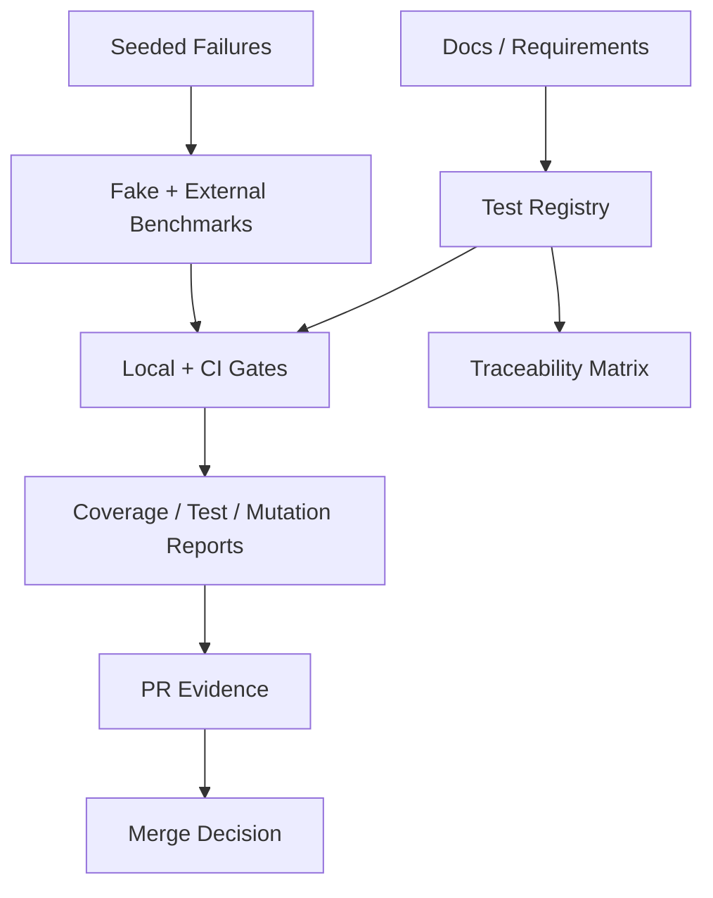

# HarnessLab 测试工程设计

> 本文定义 HarnessLab 的测试工程体系，目标是防止测试丢失、测试跑偏和自我欺骗式测试。测试工程不只是覆盖率，而是一套可追踪、可审计、可故障注入、可复现的质量系统。

## 1. 测试工程目标

HarnessLab 的测试系统必须回答四个问题：

1. **有没有测到该测的东西？**  
   每个产品需求、架构 contract、失败分类和 CLI 行为都必须能追踪到测试 ID。

2. **测试是否仍然在测真实行为？**  
   测试必须绑定 runtime artifact、exit code、日志、报告、resume/replay 结果，而不是只断言函数被调用。

3. **测试是否能发现故意注入的错误？**  
   fake benchmark、mutation testing、negative controls 和 seeded failure 必须证明测试会红。

4. **测试是否会随代码演化丢失？**  
   测试注册表、覆盖率差异检查、测试删除审计和 PR checklist 必须阻止测试静默消失。

## 2. 核心机制



测试工程由六个硬机制组成：

| 机制 | 防止的问题 |
|---|---|
| Test Registry | 测试丢失、测试 ID 漂移、无人知道某个需求是否仍被覆盖。 |
| Traceability Matrix | 测试跑偏，只测实现细节不测产品/架构 contract。 |
| Runtime Proof | 静态测试假绿，缺少真实进程、文件、Docker、报告验证。 |
| Seeded Failure | 自我欺骗式测试，测试不会因为错误实现而失败。 |
| Coverage + Mutation | 高覆盖低质量、只测 happy path。 |
| PR Evidence Chain | 人工口头保证，缺少可审计 gate 输出。 |

## 3. 测试工程目录

M0 开始时必须建立以下测试工程骨架。路径是 contract，后续实现不得随意改名；确需改名时必须同步更新 `scripts/test-after-change.sh`、CI 配置和本文。

```text
tests/
  TEST_REGISTRY.toml
  REQUIREMENTS.toml
  fixtures/
    benchmarks/
      fake-terminal/
      fake-patch/
  unit/
  contract/
  integration/
  golden/
  meta/
scripts/
  test-after-change.sh
  verify-test-registry.sh
  generate-test-traceability.sh
  scan-artifacts-for-secrets.sh
  check-new-file-coverage.sh
artifacts/
  test-traceability.md
  test-traceability.json
coverage/
  cobertura.xml
  coverage.json
```

目录职责：

| Path | 责任 |
|---|---|
| `tests/unit/` | 纯领域逻辑、配置校验、状态机、失败分类、usage parser。 |
| `tests/contract/` | Adapter、SandboxProvider、AgentRunner、ArtifactStore contract。 |
| `tests/integration/` | fake benchmark、真实进程、Docker smoke、resume/replay。 |
| `tests/golden/` | report model、HTML 快照、可读 diff。 |
| `tests/meta/` | 测试 gate 自测，证明 gate 会在故障注入时失败。 |
| `tests/fixtures/benchmarks/` | 小型确定性 fixture，不承载产品 benchmark 创新。 |

## 4. Test ID Namespace

所有测试必须使用稳定 ID。ID 用于 registry、traceability、PR 证据和报告索引，不允许只依赖测试函数名。

| Prefix | Scope |
|---|---|
| `CORE-*` | core models、state machine、failure taxonomy。 |
| `CLI-*` | CLI parsing、command dispatch、exit code、human-readable output。 |
| `CFG-*` | 配置加载、继承、覆盖、敏感信息脱敏。 |
| `AGT-*` | agent profile 检测、命令渲染、usage parser。 |
| `BNCH-*`, `TB-*`, `SWEPRO-*` | benchmark adapter、外部 benchmark readiness、task translation。 |
| `RUN-*`, `SBOX-*`, `DOC-*` | host/Docker process execution、sandbox、doctor。 |
| `ORCH-*`, `SCHED-*`, `INT-*`, `E2E-*` | run lifecycle、scheduler、集成流、端到端流。 |
| `ART-*` | artifact layout、atomic write、manifest、checksum。 |
| `RESUME-*` | interrupted run 恢复。 |
| `REPLAY-*` | snapshot replay、配置还原、缺失数据 blocker。 |
| `RPT-*`, `PATCH-*`, `USE-*` | report、patch-style 结果、usage/cost 聚合。 |
| `C-*` | contract tests，例如 `C-RUN-*`、`C-SBOX-*`、`C-BENCH-*`、`C-RPT-*`。 |
| `LOG-*` | structured event、logging、observability contract。 |
| `SEC-*` | secret redaction、artifact scan。 |
| `COV-*` | coverage gate 和新文件覆盖。 |
| `META-*` | 测试工程自测。 |

命名规则：

- 一个测试文件可以覆盖多个 ID，但每个 ID 必须在测试代码或测试参数名中可搜索。
- 一个 ID 可以有多个测试，但 registry 中只能有一个 canonical entry。
- 新增产品/架构 contract 时，必须同步新增或复用测试 ID。

### 4.1 Requirement Manifest

需求到测试的反向追踪必须机器可读，不能靠人工读 PR 描述。M0 必须新增：

```text
tests/REQUIREMENTS.toml
```

Schema:

```toml
schema_version = 1

[[requirements]]
id = "run_exit_code_priority"
title = "Run exit code priority is deterministic"
area = "orchestrator"
risk = "critical"
expected_layers = ["unit", "integration"]
required_runtime_proof = true

[requirements.source]
doc = "docs/mvp-development-spec.md"
section = "5.4"
```

Rules:

- 每个必须自动验证的产品需求、架构 contract、failure code、CLI exit code 和 artifact contract 都必须有 requirement ID。
- `docs/prd.md` 中的产品级承诺可以在 `docs/mvp-development-spec.md` 落成可测 requirement 后再进入 manifest。
- `tests/REQUIREMENTS.toml` 是 `generate-test-traceability.sh` 的主输入；没有进入 manifest 的需求不算已被测试工程保护。
- `risk: critical` 的 requirement 必须有 negative control 或 mutation target。

## 5. Test Registry

实现开始后必须新增：

```text
tests/TEST_REGISTRY.toml
```

### 5.1 Registry Schema

```toml
schema_version = 1

[[tests]]
id = "ORCH-003"
title = "Run exit code mapping"
layer = "unit"
owner_module = "run_orchestrator"
command = "scripts/test-after-change.sh --select ORCH-003"
file_patterns = ["tests/unit/**/test_exit_code*"]
required_artifacts = ["coverage/coverage.json"]
status = "active"

[tests.source]
doc = "docs/mvp-development-spec.md"
section = "5.4"

[tests.verifies]
requirements = ["run_exit_code_priority"]
contracts = ["TaskAttemptResult"]

[tests.negative_control]
description = "Flip benchmark_failure and execution_failure priority"
expected = "test fails"
```

### 5.2 Registry Rules

- Every test ID in `docs/mvp-development-spec.md` must appear in `tests/TEST_REGISTRY.toml`.
- Every requirement in `tests/REQUIREMENTS.toml` must be verified by at least one active registry entry.
- Every registry entry must point back to a doc section.
- Every registry entry must point to at least one test file pattern.
- `status = "planned"` is allowed only for Benchmark Adapter Phase 0 proof IDs
  that are explicitly claimed in the adapter architecture/inventory documents
  and routed through `scripts/test-after-change.sh --select` as planned proof.
  It must not be used to suppress active coverage for ordinary requirements.
- Every runtime-sensitive test must declare required artifacts.
- Every critical module test must declare a negative control or mutation target.
- Deleted tests require a registry change in the same PR.
- `status: skipped` is not allowed on `main`; use `xfail` only with expiry and issue reference.

### 5.3 Registry Verification

Implementation must include:

```text
scripts/verify-test-registry.sh
```

The shell script is only a stable entrypoint. TOML parsing and schema validation must live in `xtask` or another checked-in Rust helper, not in ad hoc shell parsing.

Pass criteria:

- Fails if a documented test ID is absent from registry.
- Fails if a registry entry points to no test files.
- Fails if a test file contains an unregistered test ID.
- Fails if an active test is removed without registry update.
- Fails if skipped/xfail tests have no expiry.

## 6. Traceability Matrix

实现开始后必须生成：

```text
artifacts/test-traceability.md
artifacts/test-traceability.json
```

Traceability row:

| Requirement / Contract | Test IDs | Runtime Proof | Last Gate |
|---|---|---|---|
| `resume` preserves old attempt | `RESUME-002`, `RESUME-003`, `INT-011` | fake-terminal interrupted run | local + CI |
| replay checks missing image | `INT-014`, `REPLAY-*` | missing sandbox image fixture | local + CI |
| report does not inline raw logs | `RPT-*`, `SEC-008` | HTML artifact scan | local + CI |

Rules:

- A PR changing a requirement or contract must update the matrix.
- A requirement with no test ID is a merge blocker.
- A test ID with no requirement/contract is allowed only for utility or regression tests and must be labeled `regression` or `infrastructure`.

### 6.1 Traceability Generator Contract

`scripts/generate-test-traceability.sh` must be deterministic and non-interactive.
It must sort requirements by `id`, registry entries by `id`, matched files lexicographically, and JSON keys consistently before writing artifacts.

Inputs:

- `tests/REQUIREMENTS.toml`
- `tests/TEST_REGISTRY.toml`
- current test files matched by registry `file_patterns`
- optional previous `artifacts/test-traceability.json` for diff display only

Failure conditions:

- requirement has no active registry entry.
- active registry entry references no requirement and is not labeled `regression` or `infrastructure`.
- registry `file_patterns` match no files after the corresponding test layer is introduced.
- `required_runtime_proof: true` has no required runtime artifact in registry.
- duplicate requirement ID or duplicate registry ID exists.

JSON output shape:

```json
{
  "schema_version": 1,
  "requirements": [
    {
      "id": "run_exit_code_priority",
      "source": "docs/mvp-development-spec.md#5.4",
      "test_ids": ["ORCH-003"],
      "runtime_proof": ["fake-terminal:test-fail"],
      "status": "covered"
    }
  ]
}
```

## 7. Runtime Proof Standard

Any behavior that touches process execution, Docker, files, reports, replay, resume, artifact collection, usage parsing, or redaction requires runtime proof.

Runtime proof must include at least one of:

- A fake benchmark run that creates real run artifacts.
- A Docker smoke test.
- A CLI invocation under a temp HarnessLab home.
- A generated `report.html` inspected by test.
- A replay/resume run using an actual run directory.

Static-only tests are insufficient for runtime-sensitive changes.

### 7.1 Required Runtime Artifacts

For a run test to be accepted, it must assert the existence and content of:

```text
run.json
command.txt
snapshots/
results.json
events.jsonl
report.html
tasks/<task-id>/attempts/<n>/result.json
tasks/<task-id>/attempts/<n>/agent/stdout.log
tasks/<task-id>/attempts/<n>/verifier/stdout.log
```

Runtime-sensitive CLI tests must also assert that `run --json` exposes `exit_code`,
`verdict`, `summary`, `results_path`, and `report_path`, and that
`results.json.report_path` matches the reported HTML path. Tests that exercise
benchmark-level failures must prove top-level `status = "success"` is paired
with a non-success `verdict`, so command health is not confused with benchmark
score. At least one run test must assert `events.jsonl` contains a `run_finished`
message with `exit_code`, summary buckets, and `report_path`.

Patch-style tests must additionally assert:

```text
patch.diff
prediction.jsonl
```

Grouped runtime proofs that declare many artifacts, such as `INT-011`, must
keep the asserted artifact set in a shared contract file that is consumed by the
runtime smoke test and the registry verifier. Duplicating the list in test code
and registry-verifier code is not sufficient because it lets the two proof
surfaces drift independently.

## 8. Seeded Failure System

Testing must prove that tests fail when HarnessLab behavior is wrong.

### 8.1 Fake Terminal Failure Seeds

`fake-terminal` must provide deterministic splits:

| Split | Purpose | Expected Result |
|---|---|---|
| `success` | happy path | exit `0`, score `1` |
| `test-fail` | verifier failure | exit `0`, `benchmark/test_failed` |
| `agent-timeout` | agent timeout | exit `1`, `execution/agent_timeout` |
| `agent-crash` | non-zero agent exit | exit `1`, `execution/agent_nonzero_exit` |
| `missing-required-artifact` | required artifact missing | `execution/artifact_collection_failed` |
| `usage-unknown` | no usage parser | warning only |
| `usage-parse-error` | bad usage parser | warning only |
| `interrupt-agent-running` | resume mid-agent | old attempt marked `interrupted` |

### 8.2 Fake Patch Failure Seeds

`fake-patch` must provide deterministic splits:

| Split | Purpose | Expected Result |
|---|---|---|
| `success` | valid diff and evaluator pass | score `1` |
| `no-diff` | agent changes nothing | `benchmark/no_valid_diff` |
| `bad-patch` | patch cannot apply | `benchmark/patch_apply_failed` |
| `test-fail` | patch applies but tests fail | `benchmark/test_failed` |
| `evaluator-crash` | evaluator crashes | `benchmark/evaluator_error` |
| `replay-missing-data` | missing checksum/cache | readiness blocker |

### 8.3 Negative Controls

For critical behavior, tests must include negative controls:

| Behavior | Negative Control |
|---|---|
| exit code priority | Make benchmark verdicts incorrectly drive command failure. |
| resume | Treat interrupted attempt as completed. |
| replay | Ignore benchmark checksum mismatch. |
| redaction | Write fake secret into `command.txt`. |
| artifact manifest | Store absolute host path instead of relative path. |
| report | Inline raw stdout into HTML. |

Negative controls can be implemented through mutation testing, targeted fault injection, or explicit fixture toggles.

## 9. Anti-Self-Deception Rules

Tests must not be accepted if they only prove the implementation can call itself.

Rejected patterns:

- Asserting only that a function was called.
- Asserting only that a file exists without checking schema/content.
- Mocking Docker for all sandbox tests.
- Mocking evaluator output for every benchmark path.
- Counting coverage from import-only tests.
- Golden tests that update snapshots without human-readable diff.
- Tests that pass even when the expected failure code is changed.

Required patterns:

- Assert exact exit code and failure code.
- Assert artifact schema and content.
- Assert report content and redaction.
- Assert JSONL event ordering for run lifecycle.
- Run fake benchmark paths that intentionally fail.
- Make at least one test prove timeout behavior.

## 10. Skip, Xfail, And Quarantine Policy

Skipped tests are a common way tests get lost.

Rules:

- `skip` is allowed only for missing external dependency and must include reason.
- `xfail` must include expiry date and issue reference.
- No `xfail` is allowed for unit tests in critical modules.
- No skipped test is allowed in `tests/TEST_REGISTRY.toml` with `status: active`.
- CI must fail if any xfail is past expiry.
- Flaky tests are not deleted; they move to quarantine with owner, failure rate, and deadline.

Quarantine record:

```toml
id = "INT-014"
reason = "Docker image prune behavior differs by runner"
owner = "maintainer"
quarantined_at = "2026-05-26"
expires_at = "2026-06-02"
required_action = "stabilize image fixture"
```

## 11. Test Data Governance

Test data must be stable, small, and inspectable.

Rules:

- Fake benchmarks live under `tests/fixtures/benchmarks/`.
- Fixture data must be deterministic and not depend on network.
- External benchmark smoke tests cannot be the only coverage for a behavior.
- Each fixture must have a README explaining what behavior it proves.
- Fixture checksums must be recorded when used for replay tests.
- Large or licensed external datasets must not be committed.

## 12. CI Pipeline Design

### 12.1 Required CI Jobs

```text
lint
unit
contract
integration-fast
coverage
new-file-coverage
registry-check
traceability-check
report-golden
security-redaction
docs-link-check
```

### 12.2 Manual Or Nightly Jobs

```text
docker-full
terminal-bench-smoke
swe-bench-pro-smoke
mutation-critical
resume-replay-e2e
```

### 12.3 Merge Blockers

CI must block merge if:

- Any required job fails.
- Coverage drops below threshold.
- A new production file is absent from the coverage report.
- A documented test ID has no registry entry.
- A registry entry points to missing tests.
- A runtime-sensitive change has no runtime proof.
- A secret appears in generated JSON/HTML/TOML/TXT artifacts.
- A golden file changes without a report diff artifact.

## 13. Local Gate Design

`scripts/test-after-change.sh` must be the single local command.

Required stages:

```text
1. environment preflight
2. lint / format
3. unit tests
4. contract tests
5. integration-fast
6. report-golden
7. security-redaction
8. registry-check
9. traceability-check
10. coverage global
11. coverage critical
12. new-file-coverage
13. docs-link-check
```

Output must include:

- command versions.
- number of tests collected and run.
- skipped/xfail count.
- coverage summary.
- artifact paths.
- final gate status.

The script must fail if zero tests are collected for any required test layer after that layer is introduced.

## 14. PR Evidence Chain

Every PR must include:

```text
Local gate:
  command: scripts/test-after-change.sh
  result: pass/fail
  coverage: line/branch/function
  artifacts: coverage/coverage.json, coverage/cobertura.xml

Traceability:
  changed requirements/contracts:
  added/updated test IDs:
  runtime proof:

Redaction:
  secret scan result:

Known gaps:
  skipped/xfail/quarantine:
```

This evidence should be pasted into the PR or attached as CI artifacts.

## 15. Testing The Tests

The test system itself must be tested.

Required meta-tests:

| ID | Purpose |
|---|---|
| META-001 | `scripts/test-after-change.sh` fails when a known failing test is injected. |
| META-002 | registry check fails when a documented test ID is removed from registry. |
| META-003 | registry check fails when registry points to missing test file. |
| META-004 | secret scanner fails when fake secret appears in generated artifact. |
| META-005 | coverage gate fails when new production file is missing from report. |
| META-006 | traceability check fails when a requirement has no test. |
| META-007 | golden report diff is produced when HTML changes. |
| META-008 | adapter proof selectors execute active proofs and planned-proof guards. |
| Future | each fake-benchmark seeded split returns identical exit code and failure code across repeated runs. |

M0 also registers the coverage-specific gate tests `COV-003`, `COV-005` and `COV-007`; these exercise branch-data presence, critical module thresholds and new-file coverage accounting before external benchmark adapters exist.

These meta-tests prevent the gate from silently becoming decorative.

## 16. M0 Acceptance Criteria

M0 is not complete until the testing project can fail for the right reasons before any real benchmark integration exists.

Required M0 checks:

| Check | Pass Standard |
|---|---|
| Registry skeleton | `tests/TEST_REGISTRY.toml` validates against schema and contains all M0 IDs. |
| Requirement skeleton | `tests/REQUIREMENTS.toml` validates against schema and covers all M0 requirements. |
| Registry verifier | Removing one M0 ID makes `scripts/verify-test-registry.sh` fail. |
| Local gate | `scripts/test-after-change.sh` prints every stage, fails on first failing required stage, and returns non-zero. |
| Zero-test guard | Empty `tests/unit/` after unit layer is enabled fails the gate. |
| Coverage pin | Coverage engine, config, thresholds and outputs are committed. |
| Secret scan | A fake secret in a generated artifact fails `scan-artifacts-for-secrets.sh`. |
| Traceability | `generate-test-traceability.sh` produces Markdown and JSON artifacts. |
| Meta-test | `META-002` plus `COV-003`, `COV-005` and `COV-007` pass in the M0 bootstrap; the remaining seeded gate meta-tests land with their corresponding fixture layers. |

## 17. Implementation Order

Testing infrastructure should land before runtime features:

1. Create test runner skeleton and `scripts/test-after-change.sh`.
2. Create `tests/TEST_REGISTRY.toml` schema and registry verifier.
3. Create traceability generator.
4. Add CLI command contract tests for init, doctor, run, resume and replay command parsing.
5. Create fake-terminal fixtures.
6. Add seeded split determinism tests.
7. Add artifact scanner and redaction scanner.
8. Pin coverage tool and thresholds.
9. Add coverage diff / new file coverage check.
10. Add report golden harness.
11. Add fake-patch fixtures.
12. Add mutation testing for critical modules by M13.

This order ensures every later feature enters an already guarded test system.
