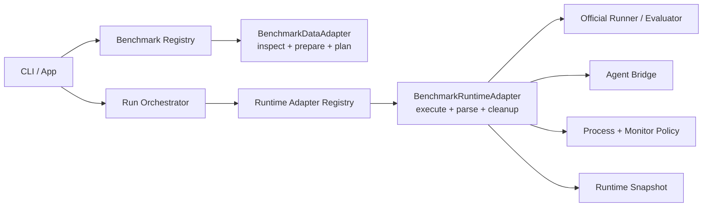

# Benchmark Adapter Layer Architecture Design

- Status: Ready for architecture review
- Date: 2026-06-04
- Scope: benchmark data adapters, runtime adapters, execution/result contracts, observability, testing, and migration plan
- Source request: create a dedicated architecture design for completing the adapter layer

## Requester Review Summary

- Key decision: keep MVP adapter support in-process and Rust-first; do not introduce a dynamic plugin runtime yet.
- Key decision: split adapter responsibility into data/planning adapters and runtime/execution adapters.
- Key decision: benchmark adapters consume already materialized agent runtime configuration; they must not reinterpret raw agent profile policy.
- Key decision: Terminal-Bench remains the hardening reference; SWE-bench Pro becomes the patch-style reference.
- Must confirm before implementation: whether to add a new `harnesslab-runtime-adapters` crate now, or first extract runtime traits inside `harnesslab-cli/src/runner/external`.
- Status reason: existing docs already define much of the target contract, but current code only exposes `descriptor()` and `plan(split)` at the adapter crate boundary; runtime behavior still lives in benchmark-specific CLI branches.

## 1. Background

HarnessLab's product goal is benchmark-first: users should run mainstream benchmark ecosystems without writing HarnessLab-specific adapters themselves. The adapter layer is the boundary that translates upstream benchmark data, tasks, official runners, evaluator outputs, and failure modes into HarnessLab's stable run contract.

The current implementation is functional for MVP smoke paths:

- `crates/harnesslab-adapters` exposes a `BenchmarkAdapter` trait with `descriptor()` and `plan(split)`.
- `terminal-bench`, `swe-bench-pro`, `fake-terminal`, and `fake-patch` have planning adapters.
- Real runtime logic for Terminal-Bench and SWE-bench Pro is implemented in `crates/harnesslab-cli/src/runner/external/*`.
- Terminal-Bench has extensive runtime hardening: official `tb run`, Python bridge, watchdogs, cleanup, result parsing, platform policy, and QEMU task compatibility.
- SWE-bench Pro has a real patch-style path: instance extraction, workspace prep, agent run, patch capture, official evaluator, and result mapping.

The architectural gap is that adapter runtime behavior is not yet a first-class contract. Adding more benchmarks would require more branching in the CLI runner instead of implementing a clean adapter interface.

## 2. Goals

1. Make benchmark data discovery, task planning, runtime execution, result mapping, cleanup, and replay snapshotting explicit contracts.
2. Keep the user-facing run experience stable: `harnesslab run --agent <profile> --benchmark <name> --split <split>`.
3. Make new benchmark families cheap to add without touching core orchestration logic.
4. Preserve benchmark-specific behavior where it belongs: official runner command construction, platform policy, evaluator parsing, upstream error translation, and cleanup tokens live in the runtime adapter.
5. Keep global orchestration benchmark-agnostic: scheduling, attempt directories, event persistence, process execution, result persistence, health aggregation, and report generation remain shared.
6. Make every adapter behavior testable through registry entries, seeded failure fixtures, and real smoke checks.

## 3. Non-Goals

- No dynamic plugin runtime in MVP.
- No Python adapter runtime as a HarnessLab-owned plugin mechanism. Python is allowed only when an upstream benchmark requires a bridge or helper.
- No benchmark adapter may own global run state, report rendering, or scheduler policy.
- No adapter may silently downgrade execution failures into benchmark failures.
- No adapter may interpret raw `skills/tools/hooks` profile policy. It receives `MaterializedAgentProfile`.

## 4. Target Architecture

The adapter layer has two first-class contracts:



### 4.1 Core Contract Types

`harnesslab-core` owns serializable, adapter-neutral data types:

- `BenchmarkDescriptor`
- `BenchmarkSplit`
- `DataState`
- `PreparedBenchmark`
- `TaskDescriptor`
- `BenchmarkPlan`
- `TaskPlan`
- `ExternalRunnerSpec`
- `TaskAttemptResult`
- `FailureClass`
- `FailureCode`

Core should also add or stabilize these pure data contracts before runtime extraction:

- `BenchmarkDataSnapshot`: immutable data version, manifest path, selected split, selected task ids, upstream source refs.
- `RuntimeTaskSnapshot`: task-level upstream metadata needed for replay without rescanning mutable data.
- `RuntimePolicySnapshot`: timeouts, progress files, activity patterns, platform policy, cleanup tokens, env policy, and command redaction metadata.
- `RuntimeResultProjection`: normalized score, failure class/code, warnings, usage, artifact refs, upstream raw result refs.

Core must not know how to execute Docker, official CLIs, Python helpers, or agent bridge code.

### 4.2 Data Adapter Contract

`crates/harnesslab-adapters` should own data discovery and task planning:

```rust
pub trait BenchmarkDataAdapter {
    fn descriptor(&self) -> BenchmarkDescriptor;
    fn inspect_data(&self) -> BenchmarkDataState;
    fn prepare(&self, split: &str) -> Result<PreparedBenchmark, AdapterError>;
    fn list_tasks(&self, prepared: &PreparedBenchmark) -> Result<Vec<TaskDescriptor>, AdapterError>;
    fn create_task_plan(
        &self,
        prepared: &PreparedBenchmark,
        task: &TaskDescriptor,
    ) -> Result<TaskPlan, AdapterError>;
    fn snapshot_task(
        &self,
        prepared: &PreparedBenchmark,
        task: &TaskDescriptor,
    ) -> Result<RuntimeTaskSnapshot, AdapterError>;
}
```

MVP migration rule:

- Keep the current `plan(split)` as a compatibility wrapper.
- Internally implement `prepare -> list_tasks -> create_task_plan`.
- Convert tests from "plan happens to work" to "each contract step is independently verified".

### 4.3 Runtime Adapter Contract

Runtime adapters belong at the application boundary because they depend on filesystem layout, process execution, official runner command lines, agent bridge behavior, cleanup, and event logging.

Recommended MVP path:

- First extract a trait inside `crates/harnesslab-cli/src/runner/external`.
- Move to a separate crate only after Terminal-Bench and SWE-bench Pro both implement the trait cleanly.

Target trait:

```rust
pub trait BenchmarkRuntimeAdapter {
    fn kind(&self) -> ExternalRunnerKind;

    fn preflight(&self, ctx: RuntimePreflightContext<'_>) -> Result<RuntimePreflightReport>;

    fn prepare_attempt(
        &self,
        ctx: RuntimeAttemptContext<'_>,
    ) -> Result<RuntimePreparedAttempt>;

    fn execute_attempt(
        &self,
        ctx: RuntimeAttemptContext<'_>,
        prepared: RuntimePreparedAttempt,
    ) -> Result<TaskAttemptResult>;

    fn cleanup_task(
        &self,
        ctx: RuntimeAttemptContext<'_>,
        phase: CleanupPhase,
    ) -> Result<CleanupReport>;

    fn cleanup_run(&self, ctx: RuntimeRunContext<'_>) -> Result<CleanupReport>;
}
```

The orchestrator calls the trait; it does not match on benchmark kind except through the runtime registry.

### 4.4 Runtime Attempt Context

The runtime adapter receives a bounded context:

- run id and attempt id
- run directory and attempt directory
- immutable `RunSpec`
- raw and public-redacted `AgentProfile`
- raw and public-redacted `MaterializedAgentProfile`
- `TaskPlan`
- `ExternalRunnerSpec`
- event writer
- process executor handle
- artifact writer helpers

The adapter must not reach into unrelated global state. Any environment variable diagnostic override must be named, documented, and emitted to `events.jsonl`.

### 4.5 Runtime Prepared Attempt

`RuntimePreparedAttempt` is the adapter-owned execution contract for one attempt:

- official runner command or multi-step execution plan
- working directory
- env policy
- stdin policy
- stdout/stderr paths
- hard timeout
- no-output timeout
- progress file paths
- no-output activity patterns
- official result path
- public command snapshot
- cleanup tokens
- expected artifact paths
- replay materials

Terminal-Bench can use a mostly single official-runner command. SWE-bench Pro can represent a multi-phase attempt: metadata extraction, workspace preparation, agent execution, patch capture, evaluator execution, and result projection.

## 5. Ownership Boundaries

| Concern | Owner |
| --- | --- |
| Descriptor and split metadata | Data adapter |
| Local data readiness and cache inspection | Data adapter |
| Dataset preparation and task selection | Data adapter |
| Stable task ids and source refs | Data adapter |
| Official runner command and env | Runtime adapter |
| Agent bridge behavior | Runtime adapter |
| Process execution primitive | Shared infra, invoked through orchestrator/runtime context |
| Timeout and no-output policy values | Runtime adapter proposes, process executor enforces |
| Official result parsing | Runtime adapter |
| Failure class/code mapping | Runtime adapter, constrained by core taxonomy |
| Attempt result persistence | Orchestrator/shared store |
| Report rendering | Report service |
| Run health aggregation | Run monitor |
| Replay command and snapshot storage | Orchestrator, with adapter-provided materials |

## 6. Style-Specific Contracts

### 6.1 Terminal-Style Adapter

Terminal-style adapters model tasks where the agent writes commands or files inside an execution environment and an upstream verifier produces the score.

Required behavior:

- Convert upstream task metadata into an agent instruction.
- Preserve upstream verifier limits; user run timeout may cap HarnessLab execution but must not inflate official verifier timeout.
- Separate benchmark verdicts from HarnessLab execution failures.
- Capture agent stdout/stderr, official runner logs, verifier logs, and task artifacts.
- Provide progress paths and activity patterns for no-output watchdogs.
- Emit runtime policy to `events.jsonl` before launch.
- Map output-format failures to `benchmark/agent_output_parse_error` when the upstream benchmark treats malformed agent output as a verdict.

Terminal-Bench is the reference implementation.

### 6.2 Patch-Style Adapter

Patch-style adapters model tasks where the agent edits a repository and the benchmark evaluates a patch.

Required behavior:

- Extract instance metadata into an attempt-local file.
- Prepare a clean workspace per attempt.
- Run the agent in the prepared workspace.
- Capture diff and prediction artifacts before evaluation.
- Reject empty or invalid diffs as benchmark failures, not evaluator infrastructure failures.
- Run official evaluator and map parser/evaluator failures precisely.
- Store raw evaluator output and normalized result.

SWE-bench Pro is the reference implementation.

## 7. Observability Contract

Every runtime adapter must emit a consistent event sequence:

1. `external_runner_preflight`
2. `external_runner_started`
3. `external_runner_runtime_config`
4. style-specific setup/workspace events
5. `external_result_parse_failed` when parsing fails
6. `external_runner_cleanup`
7. `task_attempt_finished`

Runtime config events must include:

- official runner name and version when available
- dataset path and runtime dataset path
- platform policy
- hard timeout and no-output timeout
- progress paths
- activity patterns
- cleanup token shape, redacted if needed
- official result path
- command snapshot path

Secrets must be redacted in public artifacts. Raw logs may exist only where the existing redaction and artifact policy allows them.

## 8. Error Semantics

Adapter failure mapping must follow this rule:

- HarnessLab could not run, monitor, clean up, or parse required official artifacts: `execution_failure`.
- Official benchmark completed and judged the agent: `benchmark_failure` or success.
- Official benchmark advisory verdict that does not invalidate HarnessLab execution: warning.
- Missing or malformed upstream data before task start: preflight/data readiness blocker.

Specific invariants:

- `external_runner_timeout`, `external_runner_no_progress`, `external_runner_setup_failed`, and `agent_cleanup_failed` are execution failures.
- Terminal-Bench official `agent_timeout` is benchmark failure unless HarnessLab killed the official runner.
- Terminal-Bench official `parse_error` maps to `benchmark/agent_output_parse_error`.
- SWE-bench Pro empty patch maps to `benchmark/no_valid_diff`.
- Evaluator crash caused by HarnessLab workspace/setup issues maps to execution failure; evaluator verdict against a valid patch maps to benchmark failure.

## 9. Replay And Snapshot Contract

Replay must not depend on mutable local benchmark data silently changing.

Each run snapshot should include:

- `benchmark.snapshot.json`: selected benchmark, split, task ids, data snapshot, warnings.
- `task-runtime.snapshot.json`: one per task or embedded in attempt metadata, containing upstream source refs and runtime task metadata.
- `external-runtime.snapshot.json`: one per attempt, containing runtime policy, official command, result paths, cleanup tokens, and adapter version.
- `agent-runtime.materialized.json`: already handled by agent registry; runtime adapters consume it.

Replay behavior:

- If upstream data is missing but snapshot contains enough attempt materials, replay may proceed only for supported adapter paths.
- If required official evaluator data is missing, replay blocks before task execution with a precise readiness error.
- If runtime adapter version changes, replay records a warning unless a future policy makes it blocking.

## 10. Testing Strategy

Add or tighten tests around these groups:

| ID Family | Purpose |
| --- | --- |
| `ADAPT-DATA-*` | data inspection, prepare idempotency, split readiness, task descriptors, source refs |
| `ADAPT-RUNTIME-*` | runtime registry, preflight, runtime policy snapshots, cleanup reports |
| `TB-*` | Terminal-Bench official runner command, timeout policy, result mapping, QEMU compatibility, cleanup |
| `SWEPRO-*` | SWE-bench Pro metadata extraction, workspace prep, patch capture, evaluator mapping |
| `INT-*` | real smoke paths through `harnesslab run` |
| `SEC-*` | redaction and public artifact scans |

Each adapter contract test must assert both the behavior and the failure classification. Selectors in `scripts/test-after-change.sh --select` must guard against zero-test false passes.

## 11. Migration Plan

### Slice A: Contract Inventory

- Compare `docs/architecture.md`, `docs/mvp-development-spec.md`, and current code contracts.
- Add a failing test that proves the current `BenchmarkAdapter` cannot expose `prepare/list_tasks/snapshot_task` independently.
- Register initial `ADAPT-DATA-*` requirements.

### Slice B: Data Adapter Completion

- Extend the data adapter trait behind compatibility wrappers.
- Implement `prepare`, `list_tasks`, and `snapshot_task` for fake-terminal and fake-patch first.
- Port Terminal-Bench and SWE-bench Pro planning to the same flow.
- Keep `plan(split)` as a wrapper until callers migrate.

### Slice C: Runtime Adapter Registry

- Introduce a runtime adapter trait inside `crates/harnesslab-cli/src/runner/external`.
- Replace direct `match ExternalRunnerKind` branches with a registry dispatch.
- Keep benchmark-specific modules, but hide them behind the trait.

### Slice D: Terminal-Bench Runtime Extraction

- Extract Terminal-Bench preflight, runtime policy, command construction, result parsing, cleanup, and replay materials into a `TerminalBenchRuntimeAdapter`.
- Preserve existing behavior and selectors.
- Add runtime snapshot assertions for platform, timeout, progress, and cleanup policy.

### Slice E: SWE-bench Pro Runtime Extraction

- Extract SWE-bench Pro metadata, workspace prep, agent run, patch capture, evaluator execution, and result mapping into `SweBenchProRuntimeAdapter`.
- Add seeded failure tests for missing metadata, invalid patch, evaluator parse failure, and workspace prep failure.

### Slice F: Snapshot And Replay Hardening

- Persist adapter-provided runtime snapshots.
- Add replay warnings for runtime adapter version mismatch.
- Add replay blockers for missing official evaluator materials.

### Slice G: Docs And User-Facing Diagnostics

- Update architecture and MVP spec to reflect the implemented trait names.
- Update development operations with the new adapter event sequence.
- Update doctor/readiness output to name the failing adapter phase.

### Slice H: Full Gate And Review

- Register all new requirements in `tests/REQUIREMENTS.toml` and `tests/TEST_REGISTRY.toml`.
- Add `scripts/test-after-change.sh --select` routes.
- Run targeted adapter selectors, Python bridge tests, and full gate.
- Run adversarial review because implementation will touch code.

## 12. Adversarial Review And Re-Review Plan

This architecture work must use adversarial review as a gate, not as a final
rubber stamp. Reviewers must be fresh internal subagent sessions and must
receive only a neutral navigation packet. Do not pass the full main-agent chat,
hidden reasoning, or persuasive summaries.

### 12.1 Review Reports

Use these project-root reports:

- Design review: `vs_review/YYYY-MM-DD-benchmark-adapter-architecture-review.md`
- Implementation review: append to the same report while the target remains the
  same architecture track.
- If a slice materially changes scope, create
  `vs_review/YYYY-MM-DD-benchmark-adapter-<slice>-review.md` and link it from
  the main report.

Every report must include:

- review target and target files
- exact navigation packet sent to reviewers
- reviewer launch records with fresh-session evidence
- reviewer outputs
- main-agent triage for every finding: `accept`, `reject`, or `defer`
- validation evidence for accepted findings
- closure status

### 12.2 Round 0: Design Review Before Implementation

Run this before treating this architecture plan as implementation-ready.

Reviewer roles:

- `architecture-adversary`: challenge contract boundaries, dependency direction,
  abstraction level, migration sequence, and whether runtime extraction belongs
  in CLI first.
- `test-validity-adversary`: challenge whether `ADAPT-DATA-*`,
  `ADAPT-RUNTIME-*`, `TB-*`, and `SWEPRO-*` can actually prove behavior instead
  of only testing wrappers.
- `observability-adversary`: challenge whether event logs, runtime snapshots,
  cleanup reports, and replay diagnostics are enough to debug failures after a
  real benchmark run.

Optional fourth reviewer:

- `security-adversary`, only if the implementation slice changes auth env,
  host process execution, Docker socket handling, command redaction, or secret
  artifacts.

Design review navigation packet must point reviewers to:

- `docs/plans/2026-06-04-benchmark-adapter-architecture-design.md`
- `docs/architecture.md`, section 6
- `docs/mvp-development-spec.md`, section 7
- `crates/harnesslab-adapters/src/registry.rs`
- `crates/harnesslab-cli/src/runner/external.rs`
- `crates/harnesslab-cli/src/runner/external/terminal_bench.rs`
- `crates/harnesslab-cli/src/runner/external/swe_bench_pro.rs`
- `tests/TEST_REGISTRY.toml`
- `scripts/test-after-change.sh`

Design review closure criteria:

- no untriaged findings
- no unresolved blocking findings
- accepted blocking findings have been fixed in the plan
- the fixed plan has received a focused fresh closure review

### 12.3 Implementation Slice Reviews

Each implementation slice must receive a focused review after local validation.
Do not batch all slices into one final review if the slice changed architecture,
execution behavior, failure mapping, replay, or tests.

| Slice | Review Focus | Required Reviewer Roles |
| --- | --- | --- |
| Slice A: Contract Inventory | whether the gap inventory is complete and test ids are meaningful | `architecture-adversary`, `test-validity-adversary` |
| Slice B: Data Adapter Completion | data readiness, prepare idempotency, stable task ids, source refs, compatibility wrapper | `architecture-adversary`, `test-validity-adversary` |
| Slice C: Runtime Adapter Registry | dispatch ownership, no hidden benchmark branching, dependency direction | `architecture-adversary`, `implementation-adversary` |
| Slice D: Terminal-Bench Runtime Extraction | behavior preservation, timeout/watchdog, cleanup, QEMU, result mapping | `implementation-adversary`, `test-validity-adversary`, `observability-adversary` |
| Slice E: SWE-bench Pro Runtime Extraction | workspace prep, patch capture, evaluator mapping, host/sandbox execution boundaries | `implementation-adversary`, `test-validity-adversary` |
| Slice F: Snapshot And Replay Hardening | replay readiness, mutable data protection, adapter version warnings | `architecture-adversary`, `test-validity-adversary`, `observability-adversary` |
| Slice G: Docs And Diagnostics | user-facing phase names, doctor/readiness clarity, operational reuse | `documentation-skill-adversary`, `observability-adversary` |
| Slice H: Full Gate And Review | traceability, selector coverage, full gate evidence, closure state | `test-validity-adversary`, `architecture-adversary` |

### 12.4 Blocking Finding Re-Review Rule

Any accepted blocking finding triggers a mandatory fresh re-review after the
fix. The task cannot be closed until that focused closure round passes, unless
the user explicitly accepts the remaining risk.

Closure re-review packet must include:

- original finding id and reviewer role
- broken assumption and failure scenario
- accepted fix or plan change
- files changed
- exact validation run
- residual risk
- request to falsify only the closure claim, not to restart broad review unless
  the fix changes scope

Closure reviewer selection:

- Use the same role family as the original blocking finding when possible.
- Add `test-validity-adversary` when the fix relies on new tests.
- Add `observability-adversary` when the fix relies on logs, events, snapshots,
  or diagnostics.
- Use a fresh internal subagent session even if the reviewer role name is the
  same as an earlier round.

### 12.5 Severity And Triage Rules

Use these review decisions:

- `accept`: valid finding; change design, code, tests, logs, docs, or
  operations flow and record evidence.
- `reject`: invalid for this task; cite concrete evidence that defeats the
  failure scenario.
- `defer`: valid but out of current scope; identify where it will be tracked.
  Blocking findings must not be deferred unless the user explicitly accepts the
  risk.

Severity thresholds:

- Blocking: invalid architecture boundary, silent failure mapping, unproven
  runtime behavior, replay corruption risk, secret leakage risk, missing
  high-impact tests, or user-facing diagnostics that would misclassify real
  benchmark results.
- Major: likely regression, maintenance trap, incomplete observability, weak
  but non-critical validation, or unclear migration ownership.
- Minor: wording, local cleanup, or low-risk clarity improvements.

### 12.6 Timeout And Degraded Review Handling

Reviewer timeout is not a pass.

- Use `complex` timeout for design and runtime extraction reviews.
- Use `high-risk` timeout for accepted blocking closure reviews.
- Each reviewer role gets one primary fresh attempt and one replacement fresh
  attempt if the primary is lost or times out.
- If both attempts fail, record the role as degraded and do not close the
  review. Ask the user whether to retry, narrow scope, change reviewer role, or
  explicitly accept the review gap.

### 12.7 Final Review Closure Checklist

Before claiming the adapter architecture track is complete:

- `/vs_review/` report exists and is committed.
- Every review round has launch records proving fresh context.
- Every finding has `accept`, `reject`, or `defer`.
- Every accepted blocking finding has a linked fresh closure review.
- Deferred major findings are tracked in a concrete future plan or issue.
- Targeted selectors passed.
- Full `scripts/test-after-change.sh` passed after the final code change.
- Final response names report path, reviewer roles, closure status, and
  unresolved risks.

## 13. Acceptance Matrix

| Requirement | Proof |
| --- | --- |
| Adapter data contract is explicit | `ADAPT-DATA-*` tests for descriptor, inspect, prepare, list, snapshot |
| Runtime adapter dispatch is generic | `ADAPT-RUNTIME-*` registry tests and no direct CLI branch outside registry |
| Terminal-Bench behavior preserved | existing `TB-*`, `INT-021..046`, Python bridge tests |
| SWE-bench Pro behavior preserved | `SWEPRO-*` and smoke evaluator contract |
| Runtime config is observable | events and `external-runtime.snapshot.json` assertions |
| Failure mapping is stable | seeded failure fixtures per style |
| Replay does not rely on mutable data silently | replay readiness and adapter version snapshot tests |
| User docs match behavior | architecture, MVP spec, development operations updates |
| Full system remains healthy | `scripts/test-after-change.sh` |

## 14. Risks

- Over-abstracting too early could hide benchmark-specific reality. Mitigation: extract from Terminal-Bench and SWE-bench Pro behavior that already exists, not from imagined future adapters.
- A single command-based runtime plan may not fit patch-style evaluation. Mitigation: let runtime adapters execute multi-step attempts through a shared context instead of forcing one command shape.
- Moving runtime logic into `harnesslab-adapters` too early would drag process/filesystem dependencies into the data adapter crate. Mitigation: keep runtime extraction in CLI first.
- Replay snapshots can become large. Mitigation: snapshot references, policy, hashes, and bounded metadata; keep raw logs in attempt artifacts.
- Official benchmark changes can break parsing. Mitigation: keep upstream raw result artifacts and adapter version warnings.

## 15. Open Questions

1. Should runtime adapter extraction stay inside `harnesslab-cli` for the first implementation, or should a new crate be introduced immediately?
2. Should `PreparedBenchmark` become persisted before every run even when no preparation was needed?
3. Should real external benchmark smoke checks be mandatory in the default full gate or remain explicit verifier scripts until CI resources are stable?
4. Should `ExternalRunnerKind` remain a closed enum for MVP, or move toward string-based adapter ids before dynamic plugins exist?

## 16. Done Definition

This architecture track is complete when:

1. Data and runtime adapter contracts are implemented as first-class interfaces.
2. Terminal-Bench and SWE-bench Pro both dispatch through the runtime adapter registry.
3. Current Terminal-Bench hardening behavior is preserved by tests.
4. SWE-bench Pro patch-style failures are covered by seeded tests.
5. Adapter runtime snapshots are persisted and replay-aware.
6. Test registry entries and selectors cover all new contract surfaces.
7. Full local gate passes.
8. Fresh adversarial review closes all accepted blockers.
