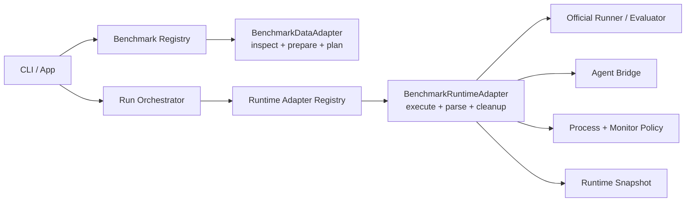

# Benchmark Adapter Layer Architecture Design

## Plan Metadata

- Created: 2026-06-04
- Updated: 2026-06-05
- Version: 0.10
- Status: Implementing overall adapter architecture; Phase 1 data adapter
  lifecycle is implemented, verified, and adversarially reviewed with no
  remaining blockers. Phase 2 snapshot authority has started; missing
  authoritative benchmark snapshots now block replay by default, and new runs
  now write task runtime snapshots. External-task replay now blocks empty,
  missing, or divergent task runtime snapshot authority. Drift checks,
  external runtime snapshot schemas, and legacy degraded replay policy remain
  open.
- Owner / Responsible: Unknown; must be assigned before Phase 0 starts.
- Related Systems: `crates/harnesslab-adapters`, `crates/harnesslab-cli/src/runner/external`,
  test registry, replay artifacts, doctor/readiness diagnostics, development
  operations docs.
- Related Links: `vs_review/2026-06-04-benchmark-adapter-architecture-review.md`,
  `docs/architecture.md`, `docs/mvp-development-spec.md`,
  `docs/development-operations.md`, `docs/test-engineering.md`.
- Risk Level: High
- Plan Type: Full
- Scope: benchmark data adapters, runtime adapters, execution/result contracts,
  observability, testing, release gates, rollback/fallback, and migration plan.
- Source request: create a dedicated architecture design for completing the
  adapter layer, then optimize it into an executable software engineering plan.

## Requester Review Summary

- Key decision: keep MVP adapter support in-process and Rust-first; do not introduce a dynamic plugin runtime yet.
- Key decision: split adapter responsibility into data/planning adapters and runtime/execution adapters.
- Key decision: benchmark adapters consume already materialized agent runtime configuration; they must not reinterpret raw agent profile policy.
- Key decision: Terminal-Bench remains the hardening reference; SWE-bench Pro becomes the patch-style reference.
- Must confirm before implementation: whether to add a new `harnesslab-runtime-adapters` crate now, or first extract runtime traits inside `harnesslab-cli/src/runner/external`.
- Status reason: Phase 1 has landed the data adapter lifecycle, while runtime
  behavior still lives in benchmark-specific CLI branches and remains Phase 3+
  scope.

### Plan Optimization Findings

This plan is being treated as a Full software engineering plan because it
changes architecture, execution behavior, replay authority, artifact contracts,
and user-facing diagnostics. The optimized plan must therefore be executable and
reviewable, not only descriptive.

Findings from the plan review:

- Phase decomposition exists and covers discovery, data contracts, snapshot
  authority, runtime registry, benchmark-specific extraction, redaction,
  documentation, and final closure.
- Phase gates need to be interpreted as hard constraints: a phase is not
  complete when code lands; it is complete only when the required evidence,
  tests, review closure, docs, and fallback readiness are recorded.
- Owner, release window, CI resource guarantees, and some adapter-id design
  choices remain unknown. They are not invented in this plan; they are bound to
  explicit phase gates or open questions.
- Current implementation evidence must stay separate from target architecture
  claims. Planned IDs count as planning inventory only until they have active
  tests, selector routes, and validation evidence.
- Phase 1 boundary claims now have a dedicated review artifact:
  `docs/plans/2026-06-04-benchmark-adapter-phase-1-boundary.md`.
- Phase 1 closure passed fresh Round 7 adversarial review and Round 8 delta
  review after the Round 6 fixes for module path attributes,
  multiline/aliased runtime paths, `std::fs` read allowlisting, and
  `ADAPT-DATA-004` coverage wording.
- Phase 2 now has a live inventory artifact:
  `docs/plans/2026-06-05-benchmark-adapter-phase-2-inventory.md`.

## Plan Classification And Risk Assessment

- Task classification: architecture change, refactor, and migration.
- Complexity: High.
- Required plan depth: Full plan with explicit phase gates.
- Risk rationale: the change touches core benchmark execution, replay authority,
  result classification, public/private runtime artifacts, and user-facing
  diagnostics. Regressions can make benchmark results incorrect even when CLI
  execution appears successful.

| Risk Driver | Why It Matters | Plan Response |
| --- | --- | --- |
| Runtime dispatch migration | Direct benchmark branches can survive unnoticed and make new adapters expensive to add. | Phase 3 requires registry dispatch proof and no hidden benchmark branch outside the registry boundary. |
| Replay authority change | Mutable benchmark data can corrupt replay or bind replay to a different task. | Phase 2 moves replay validation before runtime extraction and blocks silent live replanning. |
| Official runner behavior | Wrapper tests alone cannot prove Terminal-Bench or SWE-bench Pro compatibility. | Phases 4 and 5 require official runner/evaluator preservation proof. |
| Public/private artifacts | Runtime commands and env policy can leak secrets if snapshots are not split and scanned. | Phase 6 requires public/private artifacts plus fake secret scans before full gate. |
| Review gap | Architecture changes can pass local tests while violating ownership boundaries. | Every implementation phase has a focused adversarial review gate. |

## Problem Definition

Current behavior:

- Data planning adapters exist, but the adapter crate boundary only exposes
  `descriptor()` and `plan(split)`.
- Terminal-Bench and SWE-bench Pro runtime behavior is implemented in
  benchmark-specific CLI runner branches.
- Replay and runtime artifact authority are not yet expressed as first-class
  adapter contracts.

Expected behavior:

- Data discovery, task planning, runtime execution, result projection, cleanup,
  replay snapshots, redaction, and diagnostics are explicit adapter contracts.
- Core orchestration dispatches benchmark runtime behavior through a registry,
  without direct benchmark-specific execution branches.
- Each contract surface has registry-backed requirements, selectors, failure
  fixtures, and at least one real official runner/evaluator preservation proof
  per external benchmark family.

Gap:

- The current implementation is functional for MVP smoke paths, but it is not
  yet a scalable adapter architecture. Adding a benchmark would still require
  modifying orchestration logic, and some proof claims would be misleading
  until the registry and selector surfaces are explicit.

## 1. Background

HarnessLab's product goal is benchmark-first: users should run mainstream benchmark ecosystems without writing HarnessLab-specific adapters themselves. The adapter layer is the boundary that translates upstream benchmark data, tasks, official runners, evaluator outputs, and failure modes into HarnessLab's stable run contract.

The current implementation is functional for MVP smoke paths:

- `crates/harnesslab-adapters` exposes a `BenchmarkAdapter` trait with `descriptor()` and `plan(split)`.
- `terminal-bench`, `swe-bench-pro`, `fake-terminal`, and `fake-patch` have planning adapters.
- Real runtime logic for Terminal-Bench and SWE-bench Pro is implemented in `crates/harnesslab-cli/src/runner/external/*`.
- Terminal-Bench has extensive runtime hardening: official `tb run`, Python bridge, watchdogs, cleanup, result parsing, platform policy, and QEMU task compatibility.
- SWE-bench Pro has a real patch-style path: instance extraction, workspace prep, agent run, patch capture, official evaluator, and result mapping.

The architectural gap is that adapter runtime behavior is not yet a first-class contract. Adding more benchmarks would require more branching in the CLI runner instead of implementing a clean adapter interface.

## 2. Goals

1. Make benchmark data discovery, task planning, runtime execution, result mapping, cleanup, and replay snapshotting explicit contracts.
2. Keep the user-facing run experience stable: `harnesslab run --agent <profile> --benchmark <name> --split <split>`.
3. Make new benchmark families cheap to add without touching core orchestration logic.
4. Preserve benchmark-specific behavior where it belongs: official runner command construction, platform policy, evaluator parsing, upstream error translation, and cleanup tokens live in the runtime adapter.
5. Keep global orchestration benchmark-agnostic: scheduling, attempt directories, event persistence, process execution, result persistence, health aggregation, and report generation remain shared.
6. Make every adapter behavior testable through registry entries, seeded failure fixtures, and real smoke checks.

## 3. Non-Goals

- No dynamic plugin runtime in MVP.
- No Python adapter runtime as a HarnessLab-owned plugin mechanism. Python is allowed only when an upstream benchmark requires a bridge or helper.
- No benchmark adapter may own global run state, report rendering, or scheduler policy.
- No adapter may silently downgrade execution failures into benchmark failures.
- No adapter may interpret raw `skills/tools/hooks` profile policy. It receives `MaterializedAgentProfile`.

### Cross-Phase Invariants

These invariants apply to every phase and override lower-level implementation
convenience:

| Invariant | Enforcement Point | Failure Handling |
| --- | --- | --- |
| No proof claim without a requirement row, test registry row, and selector route. | Phase 0 meta-tests and every later selector update. | Block phase closure and update the registry before accepting the proof. |
| Planned proof IDs do not prove behavior. | Test registry status, selector routing, and review reports. | Treat as inventory only until active tests and validation evidence exist. |
| Data adapters do not execute processes, inspect ambient env, or own attempt directories. | Phase 1 review and data adapter tests. | Move the concern to runtime adapter context or block the trait change. |
| Runtime adapters consume materialized agent runtime config, not raw profile policy. | Phase 3 preflight tests and compatibility allowlist checks. | Add a named compatibility exception with redaction and tests, or block cutover. |
| Replay must not silently rebind to mutable live benchmark data. | Phase 2 replay tests and Phase 6 replay hardening. | Block replay or require explicit legacy degraded mode with warning. |
| Public artifacts must not contain private command/env material. | Phase 6 fake secret scans and public/private artifact tests. | Block public artifact/report publication for the affected adapter path. |
| Accepted blocking review findings require fresh closure re-review. | `/vs_review/` report and final closure checklist. | Keep the phase open unless the user explicitly accepts residual risk. |

## Constraints, Assumptions, And Dependencies

### Facts

- Current data adapters are in `crates/harnesslab-adapters`.
- Current real external runtime logic is in `crates/harnesslab-cli/src/runner/external`.
- Terminal-Bench has the strongest current runtime hardening surface.
- SWE-bench Pro is the patch-style benchmark reference path.
- Current proof surfaces must be treated as incomplete until planned IDs are
  registered in requirements, test registry, and selector routing.

### Assumptions

| Assumption | Verification Method | If Assumption Fails |
| --- | --- | --- |
| Runtime extraction can start inside `harnesslab-cli` before a new runtime crate exists. | Phase 0 compares current dependency direction and confirms no new crate is needed for the first two runtime adapters. | Record the crate decision in the decision log and add a foundation phase before Phase 3. |
| Current Terminal-Bench behavior can be preserved while moving dispatch behind a trait. | Phase 4 runs existing `TB-*`, `INT-021..046`, Python bridge tests, and official-runner preservation proof. | Keep legacy Terminal-Bench path behind a temporary compatibility gate and do not proceed to Phase 8. |
| SWE-bench Pro can expose stable phase diagnostics without changing the user CLI. | Phase 5 verifies seeded failure cases and stable phase events. | Treat SWE-bench Pro extraction as blocked and keep it outside the registry cutover. |
| CI/local environments can run the required external benchmark verifier scripts. | Phase 0 records which selectors are local-only versus full-gate candidates. | Keep verifier scripts explicit and require manual evidence in the review report. |

### Dependencies

| Dependency | Type | Current Status | Blocking Risk | Handling Plan |
| --- | --- | --- | --- | --- |
| Terminal-Bench official runner and fixture data | third-party / data | Ready for existing smoke paths | Official behavior can regress while wrapper tests pass. | Preserve existing verifier script and require official-runner proof in Phase 4. |
| SWE-bench Pro parquet data and evaluator source | third-party / data | Ready for existing smoke paths | Missing evaluator/source materials can make replay or scoring invalid. | Snapshot evaluator/source identity and add blockers in Phases 2, 5, and 6. |
| Test registry and selector routing | system | Partial | Claimed IDs can pass without executing tests. | Phase 0 adds meta-tests and counted selectors before any ID family counts as proof. |
| Event/log storage and attempt artifacts | system | Ready but incomplete for adapter runtime snapshots | Operators may not be able to diagnose adapter phase failures. | Phases 4-7 require event compatibility, cleanup reports, and public/private snapshots. |
| Security/redaction review | review | Unknown | Public artifacts can leak command or env secrets. | Phase 6 requires fake secret scans and security-adversary review focus. |

## Alternatives And Tradeoffs

| Alternative | Benefit | Cost / Risk | Decision |
| --- | --- | --- | --- |
| Extract runtime adapters into a new crate immediately. | Cleaner package boundary from the start. | Risk of dragging process, filesystem, and CLI dependencies into the wrong layer before the shape is proven. | Defer; extract inside CLI first unless Phase 0 proves a crate is required. |
| Keep all runtime matching in the CLI runner. | Lowest short-term implementation movement. | New benchmarks require core runner edits and adapter behavior remains untestable as a contract. | Reject for this architecture track. |
| Move all adapter behavior into `harnesslab-adapters`. | Single adapter crate owns everything. | Data adapters would absorb process execution, filesystem, official CLI, and logging responsibilities. | Reject for MVP; keep data/runtime contracts separate. |
| Allow silent live-data replanning during replay. | More replays may continue when snapshots are missing. | Replay can bind to changed data and produce false evidence. | Reject by default; only explicit legacy degraded replay may remain. |

## 4. Target Architecture

The adapter layer has two first-class contracts:



### 4.1 Core Contract Types

`harnesslab-core` owns serializable, adapter-neutral data types:

- `BenchmarkDescriptor`
- `BenchmarkSplit`
- `DataState`
- `PreparedBenchmark`
- `TaskDescriptor`
- `BenchmarkPlan`
- `TaskPlan`
- `ExternalRunnerSpec`
- `TaskAttemptResult`
- `FailureClass`
- `FailureCode`

Core should also add or stabilize these pure data contracts before runtime extraction:

- `BenchmarkDataSnapshot`: immutable data version, manifest path, selected split, selected task ids, upstream source refs.
- `RuntimeTaskSnapshot`: task-level upstream metadata needed for replay without rescanning mutable data.
- `RuntimePolicySnapshot`: timeouts, progress files, activity patterns, platform policy, cleanup tokens, env policy, and command redaction metadata.
- `RuntimeResultProjection`: normalized score, failure class/code, warnings, usage, artifact refs, upstream raw result refs.

Core must not know how to execute Docker, official CLIs, Python helpers, or agent bridge code.

### 4.2 Data Adapter Contract

`crates/harnesslab-adapters` should own data discovery and task planning:

```rust
pub trait BenchmarkDataAdapter {
    fn descriptor(&self) -> BenchmarkDescriptor;
    fn inspect_data(&self) -> BenchmarkDataState;
    fn prepare(&self, split: &str) -> Result<PreparedBenchmark, AdapterError>;
    fn list_tasks(&self, prepared: &PreparedBenchmark) -> Result<Vec<TaskDescriptor>, AdapterError>;
    fn create_task_plan(
        &self,
        prepared: &PreparedBenchmark,
        task: &TaskDescriptor,
    ) -> Result<TaskPlan, AdapterError>;
    fn snapshot_task(
        &self,
        prepared: &PreparedBenchmark,
        task: &TaskDescriptor,
    ) -> Result<RuntimeTaskSnapshot, AdapterError>;
}
```

MVP migration rule:

- Keep the current `plan(split)` as a compatibility wrapper.
- Internally implement `prepare -> list_tasks -> create_task_plan`.
- Convert tests from "plan happens to work" to "each contract step is independently verified".

### 4.3 Runtime Adapter Contract

Runtime adapters belong at the application boundary because they depend on filesystem layout, process execution, official runner command lines, agent bridge behavior, cleanup, and event logging.

Recommended MVP path:

- First extract a trait inside `crates/harnesslab-cli/src/runner/external`.
- Move to a separate crate only after Terminal-Bench and SWE-bench Pro both implement the trait cleanly.

Target trait:

```rust
pub trait BenchmarkRuntimeAdapter {
    fn kind(&self) -> ExternalRunnerKind;

    fn preflight(&self, ctx: RuntimePreflightContext<'_>) -> Result<RuntimePreflightReport>;

    fn prepare_attempt(
        &self,
        ctx: RuntimeAttemptContext<'_>,
    ) -> Result<RuntimePreparedAttempt>;

    fn execute_attempt(
        &self,
        ctx: RuntimeAttemptContext<'_>,
        prepared: RuntimePreparedAttempt,
    ) -> Result<TaskAttemptResult>;

    fn cleanup_task(
        &self,
        ctx: RuntimeAttemptContext<'_>,
        phase: CleanupPhase,
    ) -> Result<CleanupReport>;

    fn cleanup_run(&self, ctx: RuntimeRunContext<'_>) -> Result<CleanupReport>;
}
```

The orchestrator calls the trait; it does not match on benchmark kind except through the runtime registry.

### 4.4 Runtime Attempt Context

The runtime adapter receives a bounded context:

- run id and attempt id
- run directory and attempt directory
- immutable `RunSpec`
- private and public `BenchmarkAgentRuntimeConfig`
- `TaskPlan`
- `ExternalRunnerSpec`
- event writer
- process executor handle
- artifact writer helpers

The adapter must not reach into unrelated global state. Any environment variable diagnostic override must be named, documented, and emitted to `events.jsonl`.

Raw `AgentProfile` is not part of the normal runtime adapter contract. If a
temporary compatibility path needs a raw profile field, the adapter must declare
that field in a compatibility allowlist, redact it in public artifacts, and
carry a test proving the field is not used to reinterpret raw `skills`, `tools`,
`hooks`, auth inheritance, or setup policy.

### 4.5 Benchmark-Facing Agent Runtime Config

`BenchmarkAgentRuntimeConfig` is the only agent contract a runtime adapter should
consume after agent registry materialization.

It should contain:

- rendered agent command template, with private and public-redacted forms
- input mode and benchmark bridge mode
- declared environment pass-through, already resolved by the agent materializer
- setup script/materialized setup refs, not raw setup policy
- known benchmark labels such as Terminal-Bench import path/model, already
  normalized into typed fields
- host-agent execution support flags, including whether non-current `run_as`
  is enforceable for this benchmark path
- secret redaction references for adapter-owned snapshots and events

It must not expose:

- raw `skills/tools/hooks` policy
- raw auth inheritance policy
- raw setup policy except through explicit compatibility fields
- ambient parent process environment

### 4.6 Runtime Prepared Attempt

`RuntimePreparedAttempt` is the adapter-owned execution contract for one attempt:

- official runner command or multi-step execution plan
- working directory
- env policy
- stdin policy
- stdout/stderr paths
- hard timeout
- no-output timeout
- progress file paths
- no-output activity patterns
- official result path
- public command snapshot
- cleanup tokens
- expected artifact paths
- replay materials
- immutable input identity materials

Terminal-Bench can use a mostly single official-runner command. SWE-bench Pro can represent a multi-phase attempt: metadata extraction, workspace preparation, agent execution, patch capture, evaluator execution, and result projection.

### 4.7 Runtime Registry And Preflight

The runtime registry owns every benchmark-kind-specific runtime decision. The
orchestrator may look up a runtime adapter by `ExternalRunnerKind`, but it must
not contain benchmark-specific validation branches outside the registry boundary.

Registry-dispatched `preflight` must own:

- benchmark-specific profile compatibility checks
- host-agent versus sandbox-agent execution support
- Terminal-Bench import-path requirements
- SWE-bench Pro gold-agent host path constraints
- official runner/evaluator readiness
- missing data/evaluator/source diagnostics
- adapter version and snapshot compatibility checks

`validate_profile_for_plan`, `host_agent_execution_reason`, and direct
benchmark-specific label parsing in CLI runner code must move behind this
preflight boundary or become generic calls into runtime adapter metadata.

### 4.8 Snapshot Authority

Replay must have a single authority chain. Mutable local paths inside
`TaskPlan.external_runner` are not sufficient as replay authority.

Target authority order:

1. `benchmark.snapshot.json`: selected benchmark, split, task ids, data snapshot
   id, and source refs chosen for the run.
2. `task-runtime.snapshot.json`: task-level immutable workload identity,
   including upstream task metadata hash, attempt-local dataset manifest when
   mutated, and evaluator/source refs needed to recreate the attempt.
3. `external-runtime.private.json`: private runtime policy and command material
   required for replay.
4. `external-runtime.public.json`: public redacted runtime policy, command
   summary, official result refs, cleanup evidence, and final/official verdict
   provenance for report/debugging.

`TaskPlan.external_runner` remains a launch hint for new runs during the
migration, not a durable replay authority. Replay must trust the snapshots above
when present. The existing behavior where replay can silently re-plan from live
adapter data after `benchmark.snapshot.json` is missing must be retired as part
of this architecture track and replaced with a readiness blocker or an explicit
legacy degraded replay mode.

## 5. Ownership Boundaries

| Concern | Owner |
| --- | --- |
| Descriptor and split metadata | Data adapter |
| Local data readiness and cache inspection | Data adapter |
| Dataset preparation and task selection | Data adapter |
| Stable task ids and source refs | Data adapter |
| Official runner command and env | Runtime adapter |
| Agent bridge behavior | Runtime adapter |
| Process execution primitive | Shared infra, invoked through orchestrator/runtime context |
| Timeout and no-output policy values | Runtime adapter proposes, process executor enforces |
| Official result parsing | Runtime adapter |
| Failure class/code mapping | Runtime adapter, constrained by core taxonomy |
| Attempt result persistence | Orchestrator/shared store |
| Report rendering | Report service |
| Run health aggregation | Run monitor |
| Replay command and snapshot storage | Orchestrator, with adapter-provided materials |

## 6. Style-Specific Contracts

### 6.1 Terminal-Style Adapter

Terminal-style adapters model tasks where the agent writes commands or files inside an execution environment and an upstream verifier produces the score.

Required behavior:

- Convert upstream task metadata into an agent instruction.
- Preserve upstream verifier limits; user run timeout may cap HarnessLab execution but must not inflate official verifier timeout.
- Separate benchmark verdicts from HarnessLab execution failures.
- Capture agent stdout/stderr, official runner logs, verifier logs, and task artifacts.
- Provide progress paths and activity patterns for no-output watchdogs.
- Emit runtime policy to `events.jsonl` before launch.
- Map output-format failures to `benchmark/agent_output_parse_error` when the upstream benchmark treats malformed agent output as a verdict.

Terminal-Bench is the reference implementation.

### 6.2 Patch-Style Adapter

Patch-style adapters model tasks where the agent edits a repository and the benchmark evaluates a patch.

Required behavior:

- Extract instance metadata into an attempt-local file.
- Prepare a clean workspace per attempt.
- Run the agent in the prepared workspace.
- Capture diff and prediction artifacts before evaluation.
- Reject empty or invalid diffs as benchmark failures, not evaluator infrastructure failures.
- Run official evaluator and map parser/evaluator failures precisely.
- Store raw evaluator output and normalized result.

SWE-bench Pro is the reference implementation.

## 7. Observability Contract

Adapter extraction must not regress the existing operator contract. Existing
operator-critical event names stay queryable unless a migration emits both the
old and new names and updates tests and runbooks in the same change.

Required common events:

| Phase | Event | Required Fields |
| --- | --- | --- |
| preflight | `external_runner_preflight` | adapter id, runner kind, agent bridge mode, readiness status, blocking reason if any |
| launch | `external_runner_started` | dataset path, runtime dataset path, official run id or evaluator id, output root |
| runtime policy | `external_runner_configured` | process timeout, no-output timeout, activity grace, progress paths, activity patterns, platform policy, official result path, command snapshot path |
| activity | `external_runner_activity` | no-output window, observed activity, progress file, last progress timestamp when available |
| no progress | `external_runner_no_progress` | progress paths, last progress timestamp, last activity, grace exhausted, termination reason |
| hard timeout | `external_runner_timeout` | hard-timeout value, elapsed duration, kill reason, official run/evaluator id, process termination reason, whether official result existed before timeout |
| setup failure | `external_runner_setup_failed` | failing phase, evidence source/log path, official run/evaluator id, mapped final failure class/code, whether pending tasks should abort |
| parse failure | `external_result_parse_failed` | official result path, parser, raw failure summary, final mapped failure |
| cleanup | style-specific cleanup event plus `external_runner_cleanup` when generic cleanup is introduced | phase, matched resources, removed resources, survivor resources, whether cleanup overrides benchmark verdict |
| finish | `task_attempt_finished` | final failure class/code, official failure class/code, benchmark score, health impact, warnings |

Terminal-Bench compatibility events that must remain queryable:

- `external_runner_configured`
- `terminal_bench_dataset_prepared`
- `external_runner_activity`
- `external_runner_no_progress`
- `external_runner_timeout`
- `external_runner_setup_failed`
- `terminal_bench_cleanup`

SWE-bench Pro must use stable phase events instead of only free-form messages:

- `swe_bench_pro_metadata_extraction_started`
- `swe_bench_pro_workspace_prep_started`
- `swe_bench_pro_agent_started`
- `swe_bench_pro_patch_captured`
- `swe_bench_pro_evaluator_started`
- `swe_bench_pro_cleanup`

`CleanupReport` must be structured. Minimum fields:

- phase: `pre_task`, `post_task`, or `run`
- adapter id
- official run id or evaluator id
- match tokens, redacted if needed
- matched projects/resources
- removed projects/resources
- survivor projects/resources
- cleanup exit status or error code
- whether cleanup changed final failure classification
- public message and private details path

The final result must preserve verdict provenance:

- official benchmark failure class/code
- official benchmark score
- final HarnessLab failure class/code
- override reason when HarnessLab timeout, no-progress, setup failure, parse failure, or cleanup failure changes the final result

Secrets must be redacted in public artifacts. Raw logs may exist only where the
existing redaction and artifact policy allows them.

### 7.1 Public And Private Runtime Artifacts

Runtime adapter snapshots must have an explicit public/private boundary:

- `external-runtime.private.json`: private command, env policy, raw cleanup
  tokens, private paths, redaction basis, and replay materials needed to rerun.
- `external-runtime.public.json`: redacted command summary, public env names
  only, redacted cleanup token shape, official result refs, policy summary,
  official-vs-final verdict provenance, and adapter version.

Forbidden in public adapter artifacts:

- secret values
- unredacted auth paths when they reveal secret material
- full command strings containing token-like values
- raw environment maps
- private cleanup tokens that can identify secret-bearing processes

Required tests:

- fake secret scan across adapter events, `external-runtime.public.json`, report
  data, and replay warnings
- public artifact absence test for raw command/env material
- private artifact existence test when replay needs private materials

## 8. Error Semantics

Adapter failure mapping must follow this rule:

- HarnessLab could not run, monitor, clean up, or parse required official artifacts: `execution_failure`.
- Official benchmark completed and judged the agent: `benchmark_failure` or success.
- Official benchmark advisory verdict that does not invalidate HarnessLab execution: warning.
- Missing or malformed upstream data before task start: preflight/data readiness blocker.

Specific invariants:

- `external_runner_timeout`, `external_runner_no_progress`, `external_runner_setup_failed`, and `agent_cleanup_failed` are execution failures.
- Terminal-Bench official `agent_timeout` is benchmark failure unless HarnessLab killed the official runner.
- Terminal-Bench official `parse_error` maps to `benchmark/agent_output_parse_error`.
- SWE-bench Pro empty patch maps to `benchmark/no_valid_diff`.
- Evaluator crash caused by HarnessLab workspace/setup issues maps to execution failure; evaluator verdict against a valid patch maps to benchmark failure.

## 9. Replay And Snapshot Contract

Replay must not depend on mutable local benchmark data silently changing.

Each run snapshot should include:

- `benchmark.snapshot.json`: selected benchmark, split, task ids, data snapshot id, warnings, and source refs.
- `task-runtime.snapshot.json`: one per task or embedded in attempt metadata, containing upstream source refs, upstream task metadata hash, selected task instruction hash, and runtime task metadata.
- `external-runtime.private.json`: one per attempt, containing private runtime policy, official command, env policy, cleanup tokens, redaction basis, and replay materials.
- `external-runtime.public.json`: one per attempt, containing redacted runtime policy, official result paths, cleanup evidence summary, adapter version, official runner/evaluator identity, and final/official verdict provenance.
- `agent-runtime.materialized.json`: already handled by agent registry; runtime adapters consume it.

Replay behavior:

- Replay must trust persisted snapshots over live adapter planning.
- If `benchmark.snapshot.json` or the required runtime snapshots are missing for an external benchmark, replay must block before task execution unless the user explicitly selects a legacy degraded replay mode.
- Legacy degraded replay must emit a warning that it may bind to live mutable benchmark data.
- If upstream data is missing but snapshot contains enough attempt materials, replay may proceed only for supported adapter paths.
- If required official evaluator data is missing, replay blocks before task execution with a precise readiness error.
- If runtime adapter version changes, replay records a warning unless a future policy makes it blocking.
- If official runner/evaluator version, evaluator source hash, attempt-local dataset manifest hash, extracted SWE sample hash, or mutated runtime input hash differs from the source run, replay must warn or block according to adapter policy before execution.

Immutable identity requirements:

- Terminal-Bench must snapshot official runner identity, source dataset dir id,
  runtime dataset path, and attempt-local dataset manifest/hash when the adapter
  mutates or copies QEMU tasks.
- SWE-bench Pro must snapshot parquet file identity, extracted sample hash,
  evaluator source ref/hash, workspace preparation inputs, and prediction schema
  version.
- Adapter-owned mutated inputs must be hashed after mutation and before launch.

## 10. Testing Strategy

Add or tighten tests around these groups:

| ID Family | Purpose |
| --- | --- |
| `ADAPT-DATA-*` | data inspection, prepare idempotency, split readiness, task descriptors, source refs |
| `ADAPT-RUNTIME-*` | runtime registry, preflight, runtime policy snapshots, cleanup reports |
| `TB-*` | Terminal-Bench official runner command, timeout policy, result mapping, QEMU compatibility, cleanup |
| `SWEPRO-*` | SWE-bench Pro metadata extraction, workspace prep, patch capture, evaluator mapping |
| `INT-*` | real smoke paths through `harnesslab run` |
| `SEC-*` | redaction and public artifact scans |

These ID families do not count as proof until they exist in all three places:

1. `tests/REQUIREMENTS.toml`
2. `tests/TEST_REGISTRY.toml`
3. `scripts/test-after-change.sh --select`

Each adapter contract test must assert both the behavior and the failure
classification. Selectors in `scripts/test-after-change.sh --select` must guard
against zero-test false passes with exact expected test counts for grouped
selectors.

Concrete initial IDs:

- `ADAPT-DATA-001`: descriptor and inspect-data do not mutate local cache.
- `ADAPT-DATA-002`: prepare is idempotent and never returns ready for partial or corrupted data.
- `ADAPT-DATA-003`: list_tasks returns stable task ids and source refs.
- `ADAPT-DATA-004`: snapshot_task captures replay-sufficient task identity.
- `ADAPT-DATA-005`: create_task_plan returns stable executable task plans from prepared data and task descriptors.
- `ADAPT-RUNTIME-001`: runtime registry dispatches preflight and execute without direct benchmark-specific CLI branches outside the registry boundary.
- `ADAPT-RUNTIME-002`: runtime preflight owns host/sandbox support checks and benchmark-facing agent bridge compatibility.
- `ADAPT-RUNTIME-003`: external-runtime public/private snapshots are written with required fields.
- `ADAPT-RUNTIME-004`: cleanup report is structured and can override official benchmark verdict with audit evidence.
- `ADAPT-RUNTIME-005`: runtime event taxonomy preserves operator-critical Terminal-Bench events, including `external_runner_configured`, `terminal_bench_dataset_prepared`, `external_runner_activity`, `external_runner_no_progress`, `external_runner_timeout`, `external_runner_setup_failed`, cleanup events, and stable SWE-bench Pro phase events.
- `SWEPRO-001`: metadata extraction failure is classified and observable.
- `SWEPRO-002`: workspace preparation failure is classified and observable.
- `SWEPRO-003`: invalid patch and empty patch are distinct benchmark failures.
- `SWEPRO-004`: evaluator parse corruption is classified separately from agent patch failure.
- `SWEPRO-005`: replay/readiness uses stored runtime materials instead of silent live replanning.

`INT-011` must not remain an umbrella proof for SWE-bench Pro. Split the current
`int_011_*` cases into separate registry IDs/selectors, or route `INT-011`
through a counted grouped selector that proves every intended `int_011_*` test
ran. Required artifacts for external runtime proofs must match
`docs/test-engineering.md`: run metadata, command snapshot, profile/runtime
snapshots, `events.jsonl`, per-attempt `result.json`, logs, patch artifacts for
patch-style tasks, and report artifacts.

Fixture shims remain useful seeded failure tests, but they are not sufficient as
the only preservation proof for official benchmark behavior. Each benchmark
family needs at least one explicit official-runner preservation proof:

- Terminal-Bench: real official `tb run` path or verifier script that proves
  CLI argument shape, result schema, timeout mapping, and non-QEMU
  `DOCKER_DEFAULT_PLATFORM=linux/amd64`.
- SWE-bench Pro: real official evaluator path or verifier script that proves
  parquet extraction, evaluator invocation, prediction schema, and output parse.

Add meta-tests that fail when a claimed adapter ID family appears in this plan
but is absent from `REQUIREMENTS`, `TEST_REGISTRY`, or selector routing.

## 11. Phased Execution Plan

### Phase Execution Contract

Each phase is an independently closable engineering slice. A phase can close
only when all of these are true:

1. Entry criteria were checked and the evidence is recorded.
2. Implementation tasks landed only within the intended ownership boundary.
3. Deliverables are present in code, tests, docs, artifacts, or review reports.
4. Validation commands ran with passing standards recorded, including zero-test
   and under-count protections where selectors are grouped.
5. Risks with active trigger signals were mitigated or the fallback path was
   exercised/documented.
6. Required adversarial review completed, every finding was triaged, and every
   accepted blocking finding received a fresh closure re-review.
7. The next phase gate is explicitly satisfied; otherwise the work returns to
   the owning phase.

### Phase Evidence Ledger

Every phase must leave a reviewer-visible evidence trail. The exact evidence
can be expanded during implementation, but the minimum ledger is fixed here.

| Phase | Required Evidence Location | Minimum Evidence | Closure Constraint |
| --- | --- | --- | --- |
| Phase 0 | `vs_review/2026-06-04-benchmark-adapter-phase-0-review.md`, `artifacts/test-traceability.json`, `artifacts/adapter-proof-inventory.json` | Registry/meta-test output, selector-count evidence, current gap sentinel, `INT-011` proof shape | No claimed adapter proof ID can be absent from requirements, registry, or selector routing. |
| Phase 1 | Phase 1 review section or slice report, adapter crate tests | `ADAPT-DATA-001..005`, compatibility wrapper proof, stable source-ref/task-plan evidence | New data trait cannot depend on process execution, event writers, or attempt directories. |
| Phase 2 | Replay slice report, replay artifacts | Snapshot schema evidence, replay blocker/warning tests, drift tests, `INT-013` update | External replay cannot silently replan from live mutable data by default. |
| Phase 3 | Runtime registry slice report | `ADAPT-RUNTIME-001..002`, branch inventory before/after, preflight report evidence | Orchestrator cannot keep hidden benchmark-specific runtime execution branches outside registry dispatch. |
| Phase 4 | Terminal-Bench extraction report | Existing `TB-*`, `INT-021..046`, Python bridge, event assertions, official-runner proof | Terminal-Bench timeout, setup, cleanup, QEMU, and platform semantics must match the pre-extraction path. |
| Phase 5 | SWE-bench Pro extraction report | `SWEPRO-001..004`, official evaluator proof, phase event evidence | Metadata, workspace, patch, evaluator, and parse failures must be distinguishable. |
| Phase 6 | Snapshot/redaction report | `ADAPT-RUNTIME-003..005`, `SWEPRO-005`, `SEC-*`, fake secret scans | Public runtime artifacts, events, reports, and replay warnings cannot expose private runtime material. |
| Phase 7 | Docs/diagnostics report or review section | Architecture/MVP/operations/user docs diff, doctor/readiness output checks | User-facing docs and diagnostics cannot describe planned-only behavior as implemented. |
| Phase 8 | Final `/vs_review/` closure report | Full targeted selector set, full gate, final review closure, rollback/fallback notes | No untriaged finding, unresolved blocker, or missing required evidence may remain. |

### Phase Completion Threshold Constraints

These are the hard phase-level thresholds. If a threshold fails, the phase is
not complete even if the implementation appears to work manually.

| Phase | Completion Threshold |
| --- | --- |
| Phase 0 | Proof registration is mechanically enforced, `INT-011` cannot over-claim, and planned adapter IDs are visibly planned rather than silently passing as behavior. |
| Phase 1 | The data adapter lifecycle is independently testable from inspect through task snapshot, with `plan(split)` preserved only as a compatibility wrapper. |
| Phase 2 | Replay authority is snapshot-backed, drift-aware, and fails closed unless explicit legacy degraded replay is chosen. |
| Phase 3 | Runtime preflight and execution dispatch are registry-owned, with raw profile access removed or explicitly allowlisted and tested. |
| Phase 4 | Terminal-Bench behavior is equivalent before and after extraction according to existing selectors and official-runner proof. |
| Phase 5 | SWE-bench Pro runtime phases are first-class and evaluator behavior is proven beyond fixture-only shims. |
| Phase 6 | Public/private runtime snapshot boundaries are test-enforced and replay hardening handles missing or changed evaluator materials. |
| Phase 7 | Docs, doctor/readiness diagnostics, event names, and artifact names match implemented code. |
| Phase 8 | Acceptance matrix, full gate, rollback/fallback readiness, and fresh adversarial closure all pass. |

### Phase Gate Overview

| Phase | Primary Outcome | Exit Gate | Cannot Proceed If |
| --- | --- | --- | --- |
| Phase 0: Contract Inventory | Proof surfaces and gaps are explicit before implementation. | Claimed ID families are registered or meta-tests fail them; `INT-011` is split or count-routed. | Any planned proof ID can still pass without a registered requirement, registry row, and selector. |
| Phase 1: Data Adapter Completion | Data adapter contract exposes inspect, prepare, list, plan, and snapshot steps. | `ADAPT-DATA-001..005` pass and `plan(split)` compatibility remains green. | `prepare` can report ready for partial/corrupted data, task ids/source refs are unstable, or task plans are not reproducible. |
| Phase 2: Snapshot Authority And Replay | Replay authority no longer depends on mutable live planning. | Replay blocks or warns according to persisted snapshot authority; `INT-013` reflects the new contract. | Silent live replanning remains the default for external benchmarks. |
| Phase 3: Runtime Adapter Registry | Runtime preflight/execute/cleanup dispatch is registry-owned. | `ADAPT-RUNTIME-001..002` prove generic dispatch and preflight ownership. | CLI runner still contains benchmark-specific runtime branches outside registry lookup. |
| Phase 4: Terminal-Bench Runtime Extraction | Terminal-Bench behavior runs through `TerminalBenchRuntimeAdapter`. | Existing `TB-*`, `INT-021..046`, Python bridge tests, event assertions, and official-runner proof pass. | Timeout, setup-failure, cleanup, QEMU, or platform behavior changes without explicit proof. |
| Phase 5: SWE-bench Pro Runtime Extraction | SWE-bench Pro patch-style runtime runs through `SweBenchProRuntimeAdapter`. | `SWEPRO-001..004` plus official evaluator proof pass. | Patch, workspace, evaluator, or phase diagnostics are ambiguous or unclassified. |
| Phase 6: Runtime Snapshot, Redaction, And Replay Hardening | Adapter runtime snapshots are persisted and safe to expose. | `ADAPT-RUNTIME-003..005`, `SWEPRO-005`, and `SEC-*` scans pass. | Public artifacts can contain private command/env material or replay uses missing evaluator materials. |
| Phase 7: Docs And Diagnostics | User docs and doctor/readiness output match implemented behavior. | Docs are updated and diagnostics name adapter phase, readiness blocker, and remediation. | Docs describe planned trait names or diagnostics not present in code. |
| Phase 8: Full Gate And Review | Architecture track is ready to close. | Targeted selectors, Python bridge tests, full gate, and fresh adversarial closure pass. | Any blocker is untriaged, accepted blockers lack closure review, or full gate is not green. |

### Phase 0: Contract Inventory (Slice A)

#### Objective

Make every planned adapter proof surface explicit before implementation changes
can claim coverage.

#### Entry Criteria

- The current architecture plan and review report are committed.
- The implementer has inspected current adapter, runner, test registry, and
  selector surfaces.

#### Entry Criteria Checks

| Entry Criterion | Check Method | Evidence / Output | Owner |
| --- | --- | --- | --- |
| Current baseline is known | `git status --branch --short` and review report existence check | Clean worktree or documented pending doc-only changes; report path present | Implementation owner |
| Current proof surfaces are known | Inspect `tests/REQUIREMENTS.toml`, `tests/TEST_REGISTRY.toml`, and `scripts/test-after-change.sh` | Inventory of missing `ADAPT-*`, `SWEPRO-*`, and `INT-011` coverage | Implementation owner |

#### Design Approach

Front-load proof registration so no later phase can count unregistered IDs,
umbrella selectors, or zero-test passes as evidence.

#### Implementation Tasks

- Compare `docs/architecture.md`, `docs/mvp-development-spec.md`, and current
  code contracts.
- Add an active gap sentinel that proves the current `BenchmarkAdapter` does
  not expose `inspect_data/prepare/list_tasks/create_task_plan/snapshot_task`
  independently. The sentinel must fail once Phase 1 starts adding those
  methods, so it is a temporary Phase 0 proof and not positive contract
  coverage.
- Register concrete `ADAPT-DATA-*`, `ADAPT-RUNTIME-*`, and `SWEPRO-*`
  requirements, registry entries, and selector routes before using them as
  proof.
- Split or count-route `INT-011` so every intended SWE-bench Pro failure/smoke
  case is actually exercised.
- Add a test-registry meta-check for claimed-but-unregistered adapter ID
  families.

#### Deliverables

- Gap inventory.
- Registered requirement rows and test registry rows.
- Selector routes with exact expected counts.
- Meta-test for claimed-but-unregistered adapter ID families.

#### Testing And Validation

| Validation Item | Method | Passing Standard |
| --- | --- | --- |
| Claimed proof IDs cannot be missing | Run the new registry meta-test | Missing IDs fail the test instead of passing silently |
| `INT-011` is not misleading | Run split selectors or counted grouped selector | Every intended `int_011_*` case is executed and counted |
| Current contract gap is visible | Run the active gap sentinel before implementation | Sentinel passes only while the current trait lacks the independent data-adapter methods and fails once Phase 1 starts adding them |

#### Exit Criteria

- All planned ID families are registered or explicitly rejected from the plan.
- Selectors fail on zero-test or under-count execution.
- `INT-011` no longer acts as an umbrella proof without per-case evidence.

#### Review Plan

Run a focused implementation slice review with `architecture-adversary` and
`test-validity-adversary`.

#### Risks And Fallback

| Risk | Impact | Trigger Signal | Mitigation | Fallback |
| --- | --- | --- | --- | --- |
| Meta-tests are too broad | Valid local tests become hard to run | Selector runtime grows unexpectedly or unrelated tests fail | Keep meta-tests scoped to claimed adapter IDs and selector count checks | Keep the old selector names, but require explicit count assertions before Phase 1 |

#### Gate To Next Phase

Proceed to Phase 1 only after the focused review has no unresolved blocking
findings and the proof registry cannot silently over-claim coverage.

### Phase 1: Data Adapter Completion (Slice B)

#### Objective

Make benchmark data discovery and planning independently testable contracts
without breaking existing `plan(split)` callers.

#### Entry Criteria

- Phase 0 exit criteria are met.
- Compatibility wrapper behavior for existing adapters is captured by tests.

#### Entry Criteria Checks

| Entry Criterion | Check Method | Evidence / Output | Owner |
| --- | --- | --- | --- |
| Proof registry is ready | Run Phase 0 meta-test selector | Nonzero expected count and green result | Implementation owner |
| Existing adapter behavior is baselined | Run current adapter crate tests | Passing baseline or documented known failures | Implementation owner |

#### Design Approach

Implement `prepare`, `list_tasks`, `create_task_plan`, and `snapshot_task`
behind compatibility wrappers. Use fake adapters first, then move
Terminal-Bench and SWE-bench Pro planning onto the same flow.

#### Implementation Tasks

- Extend the data adapter trait behind compatibility wrappers.
- Implement the new flow for fake-terminal and fake-patch.
- Port Terminal-Bench and SWE-bench Pro planning to the same flow.
- Keep `plan(split)` as a wrapper until all callers migrate.

#### Implementation Evidence

Status as of 2026-06-04:

- `harnesslab-core` now owns `BenchmarkDataState` and
  `RuntimeTaskSnapshot` as serializable adapter-neutral contracts.
- `BenchmarkAdapter` now exposes `inspect_data`, `prepare`, `list_tasks`,
  `create_task_plan`, `snapshot_task`, and a default `plan(split)` wrapper.
- fake-terminal, fake-patch, Terminal-Bench, and SWE-bench Pro all implement
  the lifecycle behind the compatibility wrapper.
- SWE-bench Pro data planning no longer executes `uv`, Python, pandas, or
  pyarrow from the adapter crate. Task ids come from stable evaluator
  `run_scripts/<instance_id>` directories; runtime metadata extraction remains
  in the runtime adapter path.
- Terminal-Bench and SWE-bench Pro tests were split into dedicated test files
  so production adapter files stay below the 500-line code-file constraint.
- `ADAPT-DATA-000` is now a planned retired sentinel; `ADAPT-DATA-001..005`
  are active selector-backed proofs.
- Focused adversarial review found Phase 1 proof gaps around partial data,
  SWE prepared-state authority, snapshot breadth, and data/runtime boundary
  checks. The implementation now stores selected task ids, source manifest
  path, and prepared data snapshot hash in `PreparedBenchmark`; SWE later
  lifecycle steps use prepared identity and fail explicitly on post-prepare
  drift. The coverage matrix is tracked in
  `docs/plans/2026-06-04-benchmark-adapter-phase-1-coverage.md`.

Status update as of 2026-06-05:

- The `ADAPT-DATA-001` boundary proof was upgraded from substring scanning to a
  structured contract check over production dependencies, parsed `use` imports,
  forbidden runtime symbols, and forbidden runtime calls after comments and
  string literals are stripped.
- Round 3 review found that the initial structured contract still allowed
  unscanned helper modules, renamed runtime packages, ambient environment
  inspection, and generic attempt-directory ownership. The boundary proof now
  discovers production source files from the non-test module graph rooted at
  `crates/harnesslab-adapters/src/lib.rs`, validates dependency alias/package
  pairs, rejects `std::env`, rejects write-oriented filesystem calls, and scans
  production string literals for runtime path tokens.
- The boundary contract is documented in
  `docs/plans/2026-06-04-benchmark-adapter-phase-1-boundary.md` and registered
  in the `ADAPT-DATA-001` file-pattern surface.
- `ADAPT-DATA-004` now proves FakePatch snapshot identity is
  mutation-sensitive by comparing `success` and `no-diff` patch-style tasks and
  requiring both `instruction_hash` and `task_plan_hash` to differ.

#### Deliverables

- Data adapter trait extension.
- Implementations for fake-terminal, fake-patch, Terminal-Bench, and
  SWE-bench Pro.
- Stable task descriptors and source refs.
- Task-level runtime snapshots sufficient for replay identity.

#### Testing And Validation

| Validation Item | Method | Passing Standard |
| --- | --- | --- |
| Data inspect does not mutate cache | `ADAPT-DATA-001` | Descriptor and inspect-data leave cache unchanged |
| Prepare is idempotent | `ADAPT-DATA-002` | Repeated prepare returns stable readiness and rejects partial/corrupted data |
| Tasks are stable | `ADAPT-DATA-003` | Task ids and source refs are deterministic |
| Task snapshot is replay-sufficient | `ADAPT-DATA-004` | Snapshot contains immutable workload identity |
| Task plans are reproducible | `ADAPT-DATA-005` | `create_task_plan` returns stable executable `TaskPlan` values from prepared data and task descriptors |
| Compatibility remains intact | Existing adapter tests | `plan(split)` callers continue to pass |

Current validation evidence:

- `cargo test -p harnesslab-adapters -- --nocapture`: 28 passed.
- `cargo test -p harnesslab-core -- --nocapture`: 48 passed.
- `cargo test -p xtask -- --nocapture`: 19 passed.
- `scripts/test-after-change.sh --select ADAPT-DATA-001`: 1 passed.
- `scripts/test-after-change.sh --select ADAPT-DATA-002`: 1 passed.
- `scripts/test-after-change.sh --select ADAPT-DATA-003`: 1 passed.
- `scripts/test-after-change.sh --select ADAPT-DATA-004`: 1 passed.
- `scripts/test-after-change.sh --select ADAPT-DATA-005`: 1 passed.
- `scripts/test-after-change.sh --select META-002`: registry and
  traceability passed with 42 requirements, 168 tests, and 16 adapter claims.
- `scripts/test-after-change.sh --select META-008`: adapter selectors passed
  with active=5 and planned=11.
- `cargo test -p harnesslab-cli --test benchmark_contract -- --nocapture`:
  6 passed.
- `cargo test -p harnesslab-cli --test external_smoke_contract
  int_011_swe_bench_pro_smoke_runs_external_evaluator_contract --
  --nocapture`: 1 passed.
- `git diff --check`: passed.
- Code file line counts checked; touched code files are below the 500-line
  repository constraint, including `data_boundary_contract.rs` at 380 lines,
  `data_boundary_scan.rs` at 229 lines, and `data_contract_tests.rs` at 404
  lines.

#### Exit Criteria

- `ADAPT-DATA-001..005` pass.
- Existing adapter crate tests pass.
- No runtime process execution dependency is introduced into the data adapter
  contract.
- Focused Phase 1 adversarial review has no accepted blocking findings.

#### Review Plan

Run a focused slice review with `architecture-adversary` and
`test-validity-adversary`.

#### Risks And Fallback

| Risk | Impact | Trigger Signal | Mitigation | Fallback |
| --- | --- | --- | --- | --- |
| Data trait absorbs runtime concerns | Adapter crate becomes harder to maintain | New data adapter methods need process, env, or attempt-dir state | Keep runtime-only fields in `TaskPlan` hints or runtime snapshots | Revert the specific method shape and keep `plan(split)` until Phase 2 clarifies snapshot ownership |

#### Gate To Next Phase

Proceed to Phase 2 only after data snapshot identity is stable enough to serve
as replay input.

### Phase 2: Snapshot Authority And Replay Contract (Slice C)

#### Objective

Make replay deterministic by using persisted snapshots as authority instead of
silently replanning from mutable local benchmark data.

#### Entry Criteria

- Phase 1 exits with stable task descriptors and task runtime snapshots.
- Current replay behavior and `INT-013` expectations are documented.

#### Entry Criteria Checks

| Entry Criterion | Check Method | Evidence / Output | Owner |
| --- | --- | --- | --- |
| Task identity is available | Inspect `ADAPT-DATA-004` artifacts | Snapshot contains source refs and task metadata hash | Implementation owner |
| Current replay fallback is known | Inspect replay path and `INT-013` | Documented current fallback behavior | Implementation owner |

#### Design Approach

Split replay authority across benchmark, task-runtime, and external-runtime
snapshots. Retire silent live replanning or make it an explicit legacy degraded
mode selected by the user.

#### Implementation Tasks

- Define what remains in `BenchmarkPlan` and `TaskPlan`.
- Define what moves to `task-runtime.snapshot.json`.
- Define what moves to `external-runtime.private.json` and
  `external-runtime.public.json`.
- Persist task runtime snapshots from the adapter data lifecycle into
  `benchmark.snapshot.json` and per-task artifacts.
- Retire silent replay live replanning for external benchmarks.
- Add replay drift checks for dataset, evaluator, source, and official runner
  identity.
- Update `INT-013` to reflect the new replay authority.

#### Implementation Evidence

Status as of 2026-06-05:

- `runner::replay_plan_from_source` no longer falls back to live adapter
  planning when `benchmark.snapshot.json` is missing.
- Missing `benchmark.snapshot.json` now returns a replay blocker before a new
  replay run is created or any task can execute.
- `INT-013` has been updated from fallback success to missing authoritative
  snapshot blocking.
- `BenchmarkPlan.task_runtime_snapshots` now stores adapter-generated
  `RuntimeTaskSnapshot` entries for new runs, and each task directory writes a
  matching `task-runtime.snapshot.json` beside `task.snapshot.json`.
- Model validation now rejects non-empty runtime snapshot lists that are
  missing task ids, duplicate task ids, or bound to a different benchmark/split,
  while preserving old snapshot compatibility when the field is absent.
- `REPLAY-007` proves the new run path writes both the benchmark-level runtime
  snapshot list and the per-task runtime snapshot artifact, including the
  binding between `task.snapshot.json` and `task_plan_hash`.
- `REPLAY-008` proves external-task replay blocks before creating a new replay
  run when task runtime snapshot authority is empty, missing, or divergent.
- SWE-bench Pro now writes `external-runtime.private.json` and
  `external-runtime.public.json` for each attempt. Public snapshots redact local
  runtime paths and omit private path fields and redaction basis; private
  snapshots retain dataset/source paths, raw phase commands, working
  directories, replay material checksums, and public/private runtime
  fingerprints.
- Replay now treats attempt-level external runtime snapshots as readiness
  authority for external tasks and blocks before creating a new replay run if
  those snapshots are missing, incomplete, or diverge from the authoritative
  plan and fingerprint chain.
- `SWEPRO-005` proves SWE-bench Pro replay uses stored runtime materials and
  fails closed when public/private runtime material authority is missing or
  divergent.
- Phase 2 remains open for drift detection, explicit legacy degraded replay
  policy, broader `external-runtime.*.json` generalization/redaction scans, and
  the decision whether per-task runtime snapshots should be projected during
  run setup instead of attempt execution.

#### Deliverables

- Snapshot schema definitions and artifact paths.
- Replay blocker/warning policy.
- Updated replay tests and `INT-013` contract.

#### Testing And Validation

| Validation Item | Method | Passing Standard |
| --- | --- | --- |
| Missing authoritative snapshot blocks replay | Replay readiness test | External benchmark replay blocks before task execution |
| Task runtime snapshot is persisted | `REPLAY-007` | New runs write matching `BenchmarkPlan.task_runtime_snapshots` and per-task `task-runtime.snapshot.json` |
| External-task runtime snapshot authority is required | `REPLAY-008` | Replay blocks empty, missing, or divergent task runtime authority before creating a replay run |
| SWE external runtime materials are required | `SWEPRO-005` | SWE-bench Pro writes public/private attempt runtime snapshots and replay blocks missing or divergent runtime material authority before creating a replay run |
| Mutable data drift is detected | Replay drift fixture | Dataset/evaluator/source mismatch warns or blocks by adapter policy |
| Legacy degraded replay is explicit if retained | CLI/replay test | Degraded mode emits warning and cannot run silently |
| SWE replay avoids live replanning | `SWEPRO-005` | Stored runtime materials are used as authority |

#### Exit Criteria

- Replay no longer silently binds external benchmark attempts to live mutable
  data.
- `INT-013` asserts the new authority chain.
- New runs persist task runtime snapshots at the benchmark and task artifact
  levels.
- Missing evaluator/source materials produce precise readiness blockers.

#### Review Plan

Run focused review with `architecture-adversary`, `test-validity-adversary`,
and `observability-adversary`.

#### Risks And Fallback

| Risk | Impact | Trigger Signal | Mitigation | Fallback |
| --- | --- | --- | --- | --- |
| Replay compatibility breaks old runs | Users cannot inspect prior attempts | Replay fails because older artifacts lack required snapshots | Add explicit legacy degraded replay with warning and limited support | Keep old replay path only behind explicit legacy flag and exclude it from normal proof |

#### Gate To Next Phase

Proceed to Phase 3 only after snapshot authority is stable enough for runtime
adapters to write and consume.

### Phase 3: Runtime Adapter Registry (Slice D)

#### Objective

Move benchmark-specific runtime decisions behind a registry-dispatched runtime
adapter contract.

#### Entry Criteria

- Phase 2 snapshot authority is defined.
- The current external runner branch points and profile validation paths are
  inventoried.

#### Entry Criteria Checks

| Entry Criterion | Check Method | Evidence / Output | Owner |
| --- | --- | --- | --- |
| Snapshot inputs are ready | Inspect Phase 2 schemas and tests | Runtime adapter input contract is documented | Implementation owner |
| Benchmark-specific branches are known | `rg` current external runner dispatch and validation points | List of branches to move behind registry | Implementation owner |

#### Design Approach

Introduce `BenchmarkRuntimeAdapter` inside the CLI external runner boundary
first. The orchestrator may look up an adapter by `ExternalRunnerKind`, but
benchmark-specific preflight, execute, cleanup, and replay compatibility belong
inside adapter implementations.

#### Implementation Tasks

- Introduce the runtime adapter trait in
  `crates/harnesslab-cli/src/runner/external`.
- Replace direct `match ExternalRunnerKind` runtime branches with registry
  dispatch.
- Move benchmark-specific profile validation, host/sandbox gating, and agent
  bridge compatibility behind preflight.
- Replace raw-profile adapter access with `BenchmarkAgentRuntimeConfig`, or
  mark a temporary compatibility exception with tests.

#### Deliverables

- Runtime adapter trait and registry.
- Preflight context and report contract.
- Generic orchestrator dispatch.
- Compatibility allowlist tests if any raw-profile access remains.

#### Testing And Validation

| Validation Item | Method | Passing Standard |
| --- | --- | --- |
| Runtime dispatch is generic | `ADAPT-RUNTIME-001` | Preflight and execute route through registry without direct benchmark runtime branches |
| Preflight owns compatibility | `ADAPT-RUNTIME-002` | Host/sandbox and bridge checks are adapter preflight outputs |
| Raw profile is not reinterpreted | Compatibility test if exception exists | Raw `skills/tools/hooks`, auth inheritance, and setup policy are not consumed by adapters |

#### Exit Criteria

- CLI runner has no benchmark-specific runtime execution branch outside the
  registry boundary.
- Runtime preflight diagnostics are emitted as adapter-owned events or reports.
- Any temporary compatibility exception is named, redacted, and tested.

#### Review Plan

Run focused review with `architecture-adversary` and `implementation-adversary`.

#### Risks And Fallback

| Risk | Impact | Trigger Signal | Mitigation | Fallback |
| --- | --- | --- | --- | --- |
| Registry adds abstraction without removing branches | Maintenance cost rises without architectural benefit | `rg` still finds direct benchmark execution branches in orchestrator code | Add branch-boundary tests and review checks | Keep the registry behind a feature path until branches are removed, and do not enter Phase 4 |

#### Gate To Next Phase

Proceed to Phase 4 only after the runtime registry is the single dispatch point
for external benchmark execution.

### Phase 4: Terminal-Bench Runtime Extraction (Slice E)

#### Objective

Extract Terminal-Bench runtime behavior into `TerminalBenchRuntimeAdapter` while
preserving the currently hardened official runner path.

#### Entry Criteria

- Phase 3 runtime registry exits cleanly.
- Existing Terminal-Bench tests and verifier scripts are green or have
  documented known failures unrelated to this migration.

#### Entry Criteria Checks

| Entry Criterion | Check Method | Evidence / Output | Owner |
| --- | --- | --- | --- |
| Runtime registry works | Run `ADAPT-RUNTIME-001..002` | Passing dispatch and preflight tests | Implementation owner |
| Terminal-Bench baseline is known | Run current `TB-*`, `INT-021..046`, and Python bridge verifier | Baseline results archived in review report | Implementation owner |

#### Design Approach

Move Terminal-Bench preflight, command construction, runtime policy, result
parsing, timeout/watchdog handling, cleanup, and replay materials into the
runtime adapter without changing the user CLI.

#### Implementation Tasks

- Extract Terminal-Bench preflight and runtime policy.
- Extract official `tb run` command construction.
- Extract result parsing, failure mapping, timeout mapping, and cleanup report.
- Preserve existing operator-critical event names or dual-emit migration aliases.
- Assert `external_runner_timeout` and `external_runner_setup_failed` stay
  queryable with diagnostic fields.
- Add runtime snapshot assertions for platform, timeout, progress,
  official-vs-final verdict provenance, cleanup report, and redaction.

#### Deliverables

- `TerminalBenchRuntimeAdapter`.
- Preserved Terminal-Bench event taxonomy.
- Runtime snapshot and cleanup report coverage.
- Official-runner preservation proof.

#### Testing And Validation

| Validation Item | Method | Passing Standard |
| --- | --- | --- |
| Existing behavior is preserved | Run `TB-*`, `INT-021..046`, and Python bridge tests | All previously passing Terminal-Bench selectors pass |
| Official runner path is preserved | Real official `tb run` verifier or equivalent script | CLI args, result schema, timeout mapping, and non-QEMU platform policy are proven |
| Operator events remain queryable | `ADAPT-RUNTIME-005` event assertions | Required event names and fields are present |
| Cleanup is auditable | Cleanup report test | Cleanup report can override official verdict with evidence when needed |

#### Exit Criteria

- Terminal-Bench runs through the runtime registry.
- Existing hardened behavior is preserved by tests and official-runner proof.
- Timeout, setup failure, no-progress, QEMU, cleanup, and platform policy have
  explicit assertions.

#### Review Plan

Run focused review with `implementation-adversary`, `test-validity-adversary`,
and `observability-adversary`.

#### Risks And Fallback

| Risk | Impact | Trigger Signal | Mitigation | Fallback |
| --- | --- | --- | --- | --- |
| Behavior changes during extraction | Benchmark results or diagnostics regress | Existing `TB-*` or official-runner proof fails | Extract in small commits and compare before/after artifacts | Keep the pre-extraction Terminal-Bench path available behind the registry until parity is proven |

#### Gate To Next Phase

Proceed to Phase 5 only after Terminal-Bench registry execution is behaviorally
equivalent to the old path.

### Phase 5: SWE-bench Pro Runtime Extraction (Slice F)

#### Objective

Extract SWE-bench Pro patch-style runtime behavior into
`SweBenchProRuntimeAdapter` with stable phase diagnostics and evaluator proof.

#### Entry Criteria

- Phase 4 exits with registry execution proven for Terminal-Bench.
- SWE-bench Pro metadata, workspace, patch, and evaluator baseline behavior is
  documented.

#### Entry Criteria Checks

| Entry Criterion | Check Method | Evidence / Output | Owner |
| --- | --- | --- | --- |
| Registry path is stable | Run Phase 4 Terminal-Bench selectors | Passing evidence in review report | Implementation owner |
| SWE baseline is known | Run current SWE-bench Pro smoke/fixture tests | Baseline output and known gaps documented | Implementation owner |

#### Design Approach

Represent SWE-bench Pro as a multi-phase runtime attempt: metadata extraction,
workspace preparation, agent execution, patch capture, evaluator execution, and
result projection.

#### Implementation Tasks

- Extract metadata extraction and workspace preparation.
- Extract agent run, patch capture, and evaluator invocation.
- Extract result mapping and official-vs-final verdict provenance.
- Add seeded failure tests for missing metadata, invalid patch, evaluator parse
  failure, and workspace preparation failure.
- Add stable phase events for metadata extraction, workspace prep, agent start,
  patch capture, evaluator start, and cleanup.

#### Deliverables

- `SweBenchProRuntimeAdapter`.
- Stable SWE-bench Pro phase events.
- Seeded failure fixtures.
- Official evaluator preservation proof.

#### Testing And Validation

| Validation Item | Method | Passing Standard |
| --- | --- | --- |
| Metadata failures are classified | `SWEPRO-001` | Metadata failure is observable and not confused with agent failure |
| Workspace failures are classified | `SWEPRO-002` | Workspace prep failure is observable and separately classified |
| Patch failures are distinct | `SWEPRO-003` | Invalid patch and empty patch are distinct benchmark failures |
| Evaluator parse failures are distinct | `SWEPRO-004` | Evaluator corruption is not mapped as agent patch failure |
| Official evaluator path is preserved | Real evaluator verifier or equivalent script | Parquet extraction, evaluator invocation, prediction schema, and parse are proven |

#### Exit Criteria

- SWE-bench Pro runs through the runtime registry.
- Patch-style phases are observable and separately classified.
- Official evaluator proof exists beyond fixture shims.

#### Review Plan

Run focused review with `implementation-adversary`, `test-validity-adversary`,
and `observability-adversary`.

#### Risks And Fallback

| Risk | Impact | Trigger Signal | Mitigation | Fallback |
| --- | --- | --- | --- | --- |
| Multi-phase execution is forced into a single-command shape | SWE diagnostics and replay become brittle | Phase events or artifacts cannot identify where failure occurred | Keep `RuntimePreparedAttempt` flexible for multi-step execution | Block SWE-bench Pro registry cutover until phase artifacts are first-class |

#### Gate To Next Phase

Proceed to Phase 6 only after SWE-bench Pro runtime phases, failure classes, and
official evaluator proof are stable.

### Phase 6: Runtime Snapshot, Redaction, And Replay Hardening (Slice G)

#### Objective

Persist adapter runtime snapshots and prove that public artifacts are safe,
replay-aware, and diagnostically useful.

#### Entry Criteria

- Phases 4 and 5 both dispatch through runtime adapters.
- Snapshot authority from Phase 2 is available to runtime adapters.

#### Entry Criteria Checks

| Entry Criterion | Check Method | Evidence / Output | Owner |
| --- | --- | --- | --- |
| Runtime adapters are active | Run Terminal-Bench and SWE registry selectors | Both families dispatch through runtime registry | Implementation owner |
| Snapshot schemas are ready | Inspect Phase 2 schemas | Public/private runtime fields are defined | Implementation owner |

#### Design Approach

Write private runtime material only to private snapshots, expose bounded redacted
runtime summaries publicly, and scan all public adapter-owned artifacts for fake
secret leaks.

#### Implementation Tasks

- Persist adapter-provided runtime snapshots.
- Add replay warnings for runtime adapter version mismatch.
- Add replay blockers for missing official evaluator materials.
- Add fake secret scans for adapter events, public runtime snapshots, report
  data, and replay warnings.
- Assert public/private forbidden field boundaries.

#### Deliverables

- `external-runtime.private.json`.
- `external-runtime.public.json`.
- Runtime snapshot tests.
- Fake secret scan tests.
- Replay hardening tests.

#### Testing And Validation

| Validation Item | Method | Passing Standard |
| --- | --- | --- |
| Runtime snapshots are written | `ADAPT-RUNTIME-003` | Required public/private fields exist in correct artifacts |
| Cleanup report is structured | `ADAPT-RUNTIME-004` | Cleanup report carries phase, success, evidence, and final verdict effect |
| Event taxonomy is preserved | `ADAPT-RUNTIME-005` | Terminal-Bench and SWE phase events stay queryable |
| Replay uses stored materials | `SWEPRO-005` | Missing, removed, or divergent stored runtime materials block replay before task execution |
| Public artifacts do not leak secrets | `SEC-*` fake secret scans | Fake secrets are absent from public snapshots, events, reports, and warnings |

#### Exit Criteria

- Public/private artifact split is enforced by tests.
- Missing evaluator/source materials block replay before task execution.
- Runtime adapter version drift is recorded as warning or blocker by policy.

#### Review Plan

Run focused review with `security-adversary`, `test-validity-adversary`, and
`observability-adversary`.

#### Risks And Fallback

| Risk | Impact | Trigger Signal | Mitigation | Fallback |
| --- | --- | --- | --- | --- |
| Redaction misses private runtime material | Secret leakage in public artifacts | Fake secret appears in public scan | Use typed public/private artifact writers and forbidden-field tests | Block public artifact/report publication for affected adapter path |

#### Gate To Next Phase

Proceed to Phase 7 only after public artifacts are safe and replay hardening
tests pass.

### Phase 7: Docs And User-Facing Diagnostics (Slice H)

#### Objective

Make user-facing docs and readiness diagnostics match the implemented adapter
architecture.

#### Entry Criteria

- Phase 6 exits with stable artifact names, event names, and replay policy.
- Implemented trait and diagnostic names are final for this track.

#### Entry Criteria Checks

| Entry Criterion | Check Method | Evidence / Output | Owner |
| --- | --- | --- | --- |
| Runtime vocabulary is stable | Inspect implemented traits, events, and artifacts | Final names list | Implementation owner |
| Docs needing updates are known | Inspect architecture, MVP spec, operations, and user docs | Docs update checklist | Implementation owner |

#### Design Approach

Update docs after implementation vocabulary stabilizes so user-facing
diagnostics do not describe planned names that the code does not emit.

#### Implementation Tasks

- Update architecture and MVP spec to reflect implemented trait names.
- Update development operations with the new adapter event sequence.
- Update doctor/readiness output to name the failing adapter phase.
- Update user-facing docs to explain replay blockers, degraded replay if
  retained, and adapter phase diagnostics.

#### Deliverables

- Updated architecture and MVP docs.
- Updated development operations guide.
- Updated doctor/readiness diagnostics.
- User-facing adapter/replay diagnostics documentation.

#### Testing And Validation

| Validation Item | Method | Passing Standard |
| --- | --- | --- |
| Docs match implementation | Search docs for obsolete trait/artifact names | No stale planned names remain without a legacy note |
| Doctor names failing phase | Readiness/doctor test or smoke check | Output names adapter, phase, missing dependency, and remediation |
| Operations can query events | Event query example or scripted check | Required adapter events are queryable by name |

#### Exit Criteria

- User-facing docs and operator docs match implemented behavior.
- Doctor/readiness output identifies failing adapter phase and remediation.
- No doc claims an unimplemented adapter contract as complete.

#### Review Plan

Run focused review with `documentation-skill-adversary` and
`observability-adversary`.

#### Risks And Fallback

| Risk | Impact | Trigger Signal | Mitigation | Fallback |
| --- | --- | --- | --- | --- |
| Docs overstate implementation state | Users trust features that are not active | Search finds planned-only names in user-facing docs | Tie docs to implemented artifact/event names and Done Definition | Mark the relevant doc section as planned and block Phase 8 closure |

#### Gate To Next Phase

Proceed to Phase 8 only after docs and diagnostics are aligned with code and
test evidence.

### Phase 8: Full Gate And Review (Slice I)

#### Objective

Close the adapter architecture track with complete tests, evidence, review
closure, and rollback/fallback readiness.

#### Entry Criteria

- Phases 0-7 exit criteria are met.
- No unresolved blocking review findings remain from earlier phases.

#### Entry Criteria Checks

| Entry Criterion | Check Method | Evidence / Output | Owner |
| --- | --- | --- | --- |
| All phase gates are closed | Review phase evidence and `/vs_review/` report | Phase checklist with no unresolved blockers | Implementation owner |
| Full selector set is registered | Inspect requirements, registry, and selector routing | All planned IDs present and routable | Implementation owner |

#### Design Approach

Treat the final gate as evidence consolidation, not discovery. If final review
finds a structural blocker, return to the affected phase and re-run its focused
validation.

#### Implementation Tasks

- Register all new requirements in `tests/REQUIREMENTS.toml` and
  `tests/TEST_REGISTRY.toml`.
- Add or confirm `scripts/test-after-change.sh --select` routes.
- Run targeted adapter selectors, Python bridge tests, official verifier
  scripts, and full gate.
- Run adversarial review because implementation touches code.
- Archive evidence in the review report.

#### Deliverables

- Full gate evidence.
- Closed adversarial review report.
- Final adapter architecture implementation summary.
- Rollback/fallback readiness notes.

#### Testing And Validation

| Validation Item | Method | Passing Standard |
| --- | --- | --- |
| Targeted adapter selectors pass | Run `ADAPT-DATA-*`, `ADAPT-RUNTIME-*`, `TB-*`, `SWEPRO-*`, `INT-*`, and `SEC-*` selectors | All selected tests pass with nonzero expected counts |
| Python bridge remains healthy | Run Terminal-Bench Python bridge verifier | Existing bridge checks pass |
| Full system remains healthy | Run `scripts/test-after-change.sh` | Full local gate passes |
| Review is closed | Fresh adversarial review and closure rounds | No untriaged or unresolved blocking findings |

#### Exit Criteria

- Acceptance matrix is satisfied.
- Full local gate passes after the final code change.
- `/vs_review/` report contains fresh-session launch evidence, triage,
  validation evidence, and closure state.

#### Review Plan

Run final review with `test-validity-adversary` and `architecture-adversary`.
Add `observability-adversary` or `security-adversary` if the final delta
changes events, snapshots, redaction, or runtime execution boundaries.

#### Risks And Fallback

| Risk | Impact | Trigger Signal | Mitigation | Fallback |
| --- | --- | --- | --- | --- |
| Final gate uncovers a cross-phase regression | Track cannot close | Full gate or final review fails | Map failure to owning phase and rerun focused validation | Revert or disable the affected registry path while preserving data adapter changes that already passed |

#### Gate To Next Phase

There is no next implementation phase. The track can close only when the Done
Definition, Acceptance Matrix, and review closure checklist all pass.

## 12. Adversarial Review And Re-Review Plan

This architecture work must use adversarial review as a gate, not as a final
rubber stamp. Reviewers must be fresh internal subagent sessions and must
receive only a neutral navigation packet. Do not pass the full main-agent chat,
hidden reasoning, or persuasive summaries.

### 12.1 Review Reports

Use these project-root reports:

- Design review: `vs_review/YYYY-MM-DD-benchmark-adapter-architecture-review.md`
- Implementation review: append to the same report while the target remains the
  same architecture track.
- If a slice materially changes scope, create
  `vs_review/YYYY-MM-DD-benchmark-adapter-<slice>-review.md` and link it from
  the main report.

Every report must include:

- review target and target files
- exact navigation packet sent to reviewers
- reviewer launch records with fresh-session evidence
- reviewer outputs
- main-agent triage for every finding: `accept`, `reject`, or `defer`
- validation evidence for accepted findings
- closure status

### 12.2 Round 0: Design Review Before Implementation

Run this before treating this architecture plan as implementation-ready.

Reviewer roles:

- `architecture-adversary`: challenge contract boundaries, dependency direction,
  abstraction level, migration sequence, and whether runtime extraction belongs
  in CLI first.
- `test-validity-adversary`: challenge whether `ADAPT-DATA-*`,
  `ADAPT-RUNTIME-*`, `TB-*`, and `SWEPRO-*` can actually prove behavior instead
  of only testing wrappers.
- `observability-adversary`: challenge whether event logs, runtime snapshots,
  cleanup reports, and replay diagnostics are enough to debug failures after a
  real benchmark run.

Optional fourth reviewer:

- `security-adversary`, only if the implementation slice changes auth env,
  host process execution, Docker socket handling, command redaction, or secret
  artifacts.

Design review navigation packet must point reviewers to:

- `docs/plans/2026-06-04-benchmark-adapter-architecture-design.md`
- `docs/architecture.md`, section 6
- `docs/mvp-development-spec.md`, section 7
- `crates/harnesslab-adapters/src/registry.rs`
- `crates/harnesslab-cli/src/runner/external.rs`
- `crates/harnesslab-cli/src/runner/external/terminal_bench.rs`
- `crates/harnesslab-cli/src/runner/external/swe_bench_pro.rs`
- `tests/TEST_REGISTRY.toml`
- `scripts/test-after-change.sh`

Design review closure criteria:

- no untriaged findings
- no unresolved blocking findings
- accepted blocking findings have been fixed in the plan
- the fixed plan has received a focused fresh closure review

### 12.3 Implementation Slice Reviews

Each implementation slice must receive a focused review after local validation.
Do not batch all slices into one final review if the slice changed architecture,
execution behavior, failure mapping, replay, or tests.

| Slice | Review Focus | Required Reviewer Roles |
| --- | --- | --- |
| Slice A: Contract Inventory | whether gap inventory, concrete test ids, selector routing, and current `INT-011` replacement are meaningful | `architecture-adversary`, `test-validity-adversary` |
| Slice B: Data Adapter Completion | data readiness, prepare idempotency, stable task ids, source refs, compatibility wrapper | `architecture-adversary`, `test-validity-adversary` |
| Slice C: Snapshot Authority And Replay Contract | snapshot authority, replay fallback removal, mutable data protection, adapter version warnings | `architecture-adversary`, `test-validity-adversary`, `observability-adversary` |
| Slice D: Runtime Adapter Registry | dispatch ownership, preflight ownership, raw profile access removal, no hidden benchmark branching | `architecture-adversary`, `implementation-adversary` |
| Slice E: Terminal-Bench Runtime Extraction | behavior preservation, timeout/watchdog, cleanup, QEMU, result mapping, event compatibility | `implementation-adversary`, `test-validity-adversary`, `observability-adversary` |
| Slice F: SWE-bench Pro Runtime Extraction | workspace prep, patch capture, evaluator mapping, phase diagnostics, host/sandbox execution boundaries | `implementation-adversary`, `test-validity-adversary`, `observability-adversary` |
| Slice G: Runtime Snapshot, Redaction, And Replay Hardening | public/private artifact split, fake secret scans, replay materials, official-vs-final verdict provenance | `security-adversary`, `test-validity-adversary`, `observability-adversary` |
| Slice H: Docs And Diagnostics | user-facing phase names, doctor/readiness clarity, operational reuse | `documentation-skill-adversary`, `observability-adversary` |
| Slice I: Full Gate And Review | traceability, selector coverage, full gate evidence, closure state | `test-validity-adversary`, `architecture-adversary` |

### 12.4 Blocking Finding Re-Review Rule

Any accepted blocking finding triggers a mandatory fresh re-review after the
fix. The task cannot be closed until that focused closure round passes, unless
the user explicitly accepts the remaining risk.

Closure re-review packet must include:

- original finding id and reviewer role
- broken assumption and failure scenario
- accepted fix or plan change
- files changed
- exact validation run
- residual risk
- request to falsify only the closure claim, not to restart broad review unless
  the fix changes scope

Closure reviewer selection:

- Use the same role family as the original blocking finding when possible.
- Add `test-validity-adversary` when the fix relies on new tests.
- Add `observability-adversary` when the fix relies on logs, events, snapshots,
  or diagnostics.
- Use a fresh internal subagent session even if the reviewer role name is the
  same as an earlier round.

### 12.5 Severity And Triage Rules

Use these review decisions:

- `accept`: valid finding; change design, code, tests, logs, docs, or
  operations flow and record evidence.
- `reject`: invalid for this task; cite concrete evidence that defeats the
  failure scenario.
- `defer`: valid but out of current scope; identify where it will be tracked.
  Blocking findings must not be deferred unless the user explicitly accepts the
  risk.

Severity thresholds:

- Blocking: invalid architecture boundary, silent failure mapping, unproven
  runtime behavior, replay corruption risk, secret leakage risk, missing
  high-impact tests, or user-facing diagnostics that would misclassify real
  benchmark results.
- Major: likely regression, maintenance trap, incomplete observability, weak
  but non-critical validation, or unclear migration ownership.
- Minor: wording, local cleanup, or low-risk clarity improvements.

### 12.6 Timeout And Degraded Review Handling

Reviewer timeout is not a pass.

- Use `complex` timeout for design and runtime extraction reviews.
- Use `high-risk` timeout for accepted blocking closure reviews.
- Each reviewer role gets one primary fresh attempt and one replacement fresh
  attempt if the primary is lost or times out.
- If both attempts fail, record the role as degraded and do not close the
  review. Ask the user whether to retry, narrow scope, change reviewer role, or
  explicitly accept the review gap.

### 12.7 Final Review Closure Checklist

Before claiming the adapter architecture track is complete:

- `/vs_review/` report exists and is committed.
- Every review round has launch records proving fresh context.
- Every finding has `accept`, `reject`, or `defer`.
- Every accepted blocking finding has a linked fresh closure review.
- Deferred major findings are tracked in a concrete future plan or issue.
- Targeted selectors passed.
- Full `scripts/test-after-change.sh` passed after the final code change.
- Final response names report path, reviewer roles, closure status, and
  unresolved risks.

## 13. Acceptance Matrix

| Requirement | Proof |
| --- | --- |
| Adapter data contract is explicit | concrete registered `ADAPT-DATA-001..005` tests for descriptor, inspect, prepare, list, source refs, task-plan creation, and task snapshot |
| Runtime adapter dispatch is generic | concrete registered `ADAPT-RUNTIME-001..005` tests for preflight, execute, cleanup, runtime snapshots, event taxonomy, and no direct benchmark-specific CLI branch outside registry |
| Terminal-Bench behavior preserved | existing `TB-*`, `INT-021..046`, Python bridge tests, and at least one official-runner preservation proof |
| SWE-bench Pro behavior preserved | concrete registered `SWEPRO-001..005` tests and at least one official evaluator preservation proof |
| Runtime config is observable | `external_runner_configured`, adapter phase events, cleanup reports, `external-runtime.public.json`, and `external-runtime.private.json` assertions |
| Failure mapping is stable | seeded failure fixtures per style |
| Replay does not rely on mutable data silently | replay readiness tests for missing snapshot blocker, mutable data drift detection, adapter version warning, and explicit legacy degraded replay if retained |
| Public artifacts do not leak secrets | `SEC-*` scans for adapter runtime snapshots, events, report data, and replay warnings |
| Current registry proof is not misleading | meta-test for claimed adapter ID families and split or count-route coverage for current `INT-011` cases |
| User docs match behavior | architecture, MVP spec, development operations updates |
| Full system remains healthy | `scripts/test-after-change.sh` |

## 14. Risks, Dependencies, And Mitigations

| Risk | Probability | Impact | Trigger Signal | Mitigation | Fallback |
| --- | --- | --- | --- | --- | --- |
| Over-abstracting too early | Medium | High | Runtime trait needs imagined fields not used by Terminal-Bench or SWE-bench Pro | Extract from existing behavior only and keep runtime extraction inside CLI first | Revert or narrow the trait shape before Phase 4 |
| Single-command runtime model does not fit patch-style evaluation | Medium | High | SWE-bench Pro cannot expose metadata/workspace/patch/evaluator phase failures | Allow multi-step `RuntimePreparedAttempt` and stable phase events | Block SWE-bench Pro registry cutover until the contract supports multi-phase execution |
| Runtime logic moves into data adapter crate | Low | High | Data adapter methods need process, env, filesystem attempt dirs, or event writer | Keep runtime adapters at CLI boundary | Move runtime-specific fields back behind runtime adapter context |
| Replay snapshots grow too large | Medium | Medium | Attempt snapshots include raw logs or unbounded upstream data | Snapshot refs, hashes, policy, and bounded metadata only | Store bulky data as attempt artifacts and reference it |
| Official benchmark changes break parsing | Medium | High | Official runner/evaluator verifier fails after upstream change | Preserve raw upstream outputs and adapter version warnings | Block affected adapter path until parser and proof are updated |
| Public runtime artifacts leak sensitive data | Low | High | Fake secret scan finds private command/env material in public artifacts | Typed public/private writers and forbidden-field tests | Block public artifact/report publication for the affected path |

The dependency table in `Constraints, Assumptions, And Dependencies` remains the
source of record for dependency status. Any dependency marked `Unknown` must be
resolved by its owning phase gate before the affected implementation can close.

## 15. Release, Rollback, And Fallback Strategy

### Release Strategy

- Release method: merge after Phase 8 evidence is complete; no production
  deployment window is assumed by this plan.
- Canary scope: local and CI selector gates first; external official
  runner/evaluator verifiers remain explicit if CI resources cannot run them by
  default.
- Expansion criteria: all registered selectors pass with nonzero expected
  counts, official preservation proofs pass, and review closure has no
  unresolved blockers.
- Pause criteria: any P0/P1 test failure, result classification regression,
  public artifact secret leak, replay authority blocker, or unresolved
  adversarial blocking finding.
- Owner: Unknown; assign before Phase 0 starts.
- Release window: Unknown; do not invent one in this plan.

### Rollback Strategy

- Rollbackable changes: trait extraction, registry routing, docs, tests, event
  additions, and snapshot writers can be reverted or disabled by restoring the
  previous module path.
- Non-directly rollbackable changes: persisted snapshot schema changes require
  compatibility handling for already-written attempts.
- Rollback triggers: full gate failure after merge, official runner proof
  regression, public artifact secret leak, replay corruption, or user-facing
  diagnostic misclassification.
- Rollback steps: revert the affected implementation commit, restore legacy
  runtime dispatch for the affected benchmark path, rerun targeted selectors,
  and record rollback evidence in the review report.
- Rollback validation: old path selectors pass and public artifacts no longer
  contain the offending fields.

### Fallback / Degradation Strategy

- Terminal-Bench and SWE-bench Pro runtime extraction must keep the pre-extraction
  path available until parity is proven.
- Legacy degraded replay, if retained, must require explicit user selection and
  emit a warning that replay may bind to mutable live data.
- If redaction fails, block public artifact/report publication for the affected
  adapter path while keeping private attempt artifacts for debugging.
- If official verifier scripts are unavailable in default CI, require manual
  verifier evidence in the review report before Phase 8 closure.

## 16. Data Migration Strategy

This track does not migrate production user data. It does introduce local run
artifact schema changes and replay authority changes, so artifact migration rules
still apply.

| Data / Artifact | Change | Idempotency / Retry | Validation | Rollback / Compensation |
| --- | --- | --- | --- | --- |
| `benchmark.snapshot.json` | Adds selected benchmark, split, task ids, data snapshot id, warnings, and source refs | Safe to rewrite for a run before attempts start | Replay readiness tests and drift checks | Preserve old run artifacts; legacy degraded replay only by explicit selection |
| `task-runtime.snapshot.json` | Adds immutable task identity, source refs, upstream metadata hash, instruction hash, task plan hash, and external runner binding | Safe to regenerate only from prepared immutable data before attempt execution | `ADAPT-DATA-004`, `REPLAY-007`, and future drift replay tests | Block replay when missing unless legacy degraded mode is selected |
| `external-runtime.private.json` | Stores private runtime command and env policy | Written once per attempt; retry writes must replace atomically | `ADAPT-RUNTIME-003` private field assertions | Delete/regenerate attempt artifacts before rerun |
| `external-runtime.public.json` | Stores redacted runtime summary and provenance | Written once per attempt; retry writes must replace atomically | `SEC-*` fake secret scans and public field assertions | Block report publication if scan fails |

## 17. API / Compatibility Strategy

- User CLI remains stable: `harnesslab run --agent <profile> --benchmark <name>
  --split <split>`.
- `plan(split)` remains as a compatibility wrapper until callers migrate to
  `prepare -> list_tasks -> create_task_plan`.
- `ExternalRunnerKind` remains the MVP registry key unless Phase 0 resolves the
  open question in favor of string-based adapter ids.
- Raw `AgentProfile` access is not part of the normal runtime adapter contract.
  Any temporary compatibility exception must be allowlisted, redacted, and
  tested.
- Event names with current operator value must be preserved or dual-emitted
  during migration.
- Snapshot schema changes must support old attempts through explicit legacy
  degraded replay or readiness blockers; silent fallback is not allowed.

## 18. Security And Permission Review

- Permission boundary: data adapters must not execute processes, inspect ambient
  parent environment, or interpret raw agent policy.
- Sensitive data boundary: private command, env policy, cleanup tokens, and
  redaction basis belong only in `external-runtime.private.json`.
- Public artifact boundary: `external-runtime.public.json`, report data,
  events, and replay warnings must not contain private env values, secret-like
  tokens, raw auth inheritance policy, or raw setup policy.
- Abuse cases to review: malicious benchmark metadata injecting command args,
  public artifact leakage of agent secrets, replay binding to changed data, and
  host-agent execution paths bypassing adapter preflight.
- Audit logging: adapter phase events, cleanup reports, official-vs-final
  verdict provenance, replay warnings, and readiness blockers must be queryable.
- Security review gate: Phase 6 requires `security-adversary` focus when
  redaction, host execution, Docker socket handling, or private runtime material
  changes.

## 19. Observability And Success Metrics

| Metric / Signal | Source | Success Standard |
| --- | --- | --- |
| Adapter dispatch path | Events and tests | Every external benchmark attempt names the runtime adapter kind and phase |
| Phase failure classification | `events.jsonl`, result artifacts, seeded fixtures | Metadata, workspace, agent, patch, evaluator, timeout, setup, cleanup, and replay failures are distinguishable |
| Runtime snapshot completeness | `external-runtime.*.json` tests | Required public/private fields exist and forbidden public fields are absent |
| Replay readiness | Replay tests and warnings | Missing required snapshots/evaluator materials block before execution unless explicit degraded replay is selected |
| Official behavior preservation | Verifier scripts and existing selectors | Terminal-Bench and SWE-bench Pro official paths pass preservation proof |
| Secret exposure prevention | `SEC-*` scans | Fake secrets are absent from public events, snapshots, reports, and warnings |

## 20. Post-Release Verification And Cleanup

- Verify all full-gate evidence after merge or release.
- Review first successful Terminal-Bench and SWE-bench Pro runs through the
  runtime registry and confirm event/query examples work.
- Confirm old direct runtime branches are removed or explicitly marked as
  temporary compatibility code with an owner and removal condition.
- Remove compatibility wrappers only after callers have migrated and tests prove
  no remaining dependency on the old path.
- Update the review report with final evidence, unresolved risks, and any
  deferred follow-up plan.

## 21. Open Questions

1. Should runtime adapter extraction stay inside `harnesslab-cli` for the first implementation, or should a new crate be introduced immediately?
2. Should `PreparedBenchmark` become persisted before every run even when no preparation was needed?
3. Should real external benchmark smoke checks be mandatory in the default full gate or remain explicit verifier scripts until CI resources are stable?
4. Should `ExternalRunnerKind` remain a closed enum for MVP, or move toward string-based adapter ids before dynamic plugins exist?
5. Should legacy degraded replay be retained at all, or should external benchmark replay always block when authoritative snapshots are missing?
6. Who owns implementation and final release approval for this track?

### Open Question Resolution Gates

| Open Question | Blocks Phase | Required Resolution Evidence |
| --- | --- | --- |
| Runtime trait location: CLI first or new crate now | Phase 3 | Decision log update plus dependency-direction check from Phase 0/3 inventory. |
| Whether `PreparedBenchmark` is persisted for every run | Phase 2 | Snapshot schema decision and replay test expectation. |
| Whether official benchmark smoke checks are mandatory in default full gate | Phase 8 | CI capability decision or manual-evidence requirement in the final review report. |
| Whether `ExternalRunnerKind` remains the MVP registry key | Phase 3 | Runtime registry API decision and compatibility test coverage. |
| Whether legacy degraded replay is retained | Phase 2 | User/product decision reflected in replay CLI/tests and user-facing docs. |
| Implementation and release approval owner | Phase 0 | Owner field updated or phase closure explicitly blocked. |

## 22. Done Definition

This architecture track is complete when:

1. Data and runtime adapter contracts are implemented as first-class interfaces.
2. Terminal-Bench and SWE-bench Pro both dispatch through the runtime adapter registry.
3. Current Terminal-Bench hardening behavior is preserved by tests.
4. SWE-bench Pro patch-style failures are covered by seeded tests.
5. Adapter runtime snapshots are persisted and replay-aware.
6. Public adapter runtime artifacts have secret-scan coverage.
7. Test registry entries and selectors cover all new contract surfaces, including `ADAPT-DATA-*`, `ADAPT-RUNTIME-*`, `SWEPRO-*`, and the former `INT-011` umbrella cases.
8. Full local gate passes.
9. Fresh adversarial review closes all accepted blockers.
10. Release, rollback, fallback, observability, and post-release cleanup evidence are recorded.

## 23. Decision Log

| Decision | Status | Rationale | Revisit Trigger |
| --- | --- | --- | --- |
| Keep MVP adapter support in-process and Rust-first. | Accepted | Dynamic plugins are not required for MVP and would add runtime surface area. | New benchmark adapters require out-of-tree contribution before MVP scope closes. |
| Split data/planning adapters from runtime/execution adapters. | Accepted | Data adapters should not own process, filesystem, event writer, or cleanup concerns. | Runtime contract cannot remain stable across Terminal-Bench and SWE-bench Pro. |
| Extract runtime traits inside CLI first. | Proposed | Current runtime dependencies live at the application boundary. | Phase 0 proves a new crate is cleaner without pulling CLI dependencies into adapter data code. |
| Retire silent replay live replanning by default. | Accepted | Silent replanning can corrupt replay authority. | User explicitly accepts legacy degraded replay as a product behavior. |

## 24. Change Log

| Version | Date | Change |
| --- | --- | --- |
| 0.1 | 2026-06-04 | Initial adapter architecture design and adversarial review closure. |
| 0.2 | 2026-06-04 | Reworked plan using `se-good-plan`: added metadata, risk classification, assumptions, dependencies, alternatives, phase gates, rollback/fallback, security, observability, decision log, and quality checklist. |
| 0.3 | 2026-06-04 | Strengthened the plan as an executable phase-gated document: added optimization findings, cross-phase invariants, phase execution contract, evidence ledger, hard completion thresholds, and open-question resolution gates. |
| 0.4 | 2026-06-05 | Added Phase 1 data adapter lifecycle implementation evidence and selector coverage artifacts. |
| 0.5 | 2026-06-05 | Hardened Phase 1 boundary proof around module graph discovery, dependency purity, runtime imports, and filesystem ownership. |
| 0.6 | 2026-06-05 | Recorded Round 6 accepted blocker fixes for module path attributes, multiline/aliased runtime paths, filesystem allowlisting, and `ADAPT-DATA-004` wording. |
| 0.7 | 2026-06-05 | Closed Phase 1 with passing Round 7 adversarial review and Round 8 delta review. |
| 0.8 | 2026-06-05 | Started Phase 2 snapshot authority by removing silent replay live replanning when `benchmark.snapshot.json` is missing and updating `INT-013` to the fail-closed contract. |
| 0.9 | 2026-06-05 | Added `task-runtime.snapshot.json` persistence and `REPLAY-007` proof while keeping Phase 2 open for drift checks, external runtime snapshots, legacy replay policy, and `SWEPRO-005`. |
| 0.10 | 2026-06-05 | Added `REPLAY-008` fail-closed external-task replay checks for empty, missing, and divergent task runtime snapshot authority. |
| 0.11 | 2026-06-05 | Added SWE-bench Pro `external-runtime.public/private.json` snapshots and `SWEPRO-005` replay readiness proof for stored runtime materials. |

## 25. Plan Quality Checklist

- [x] Background and problem definition are clear.
- [x] Goals are measurable through the Acceptance Matrix and test ID families.
- [x] Facts, assumptions, constraints, dependencies, risks, and open questions
      are separated.
- [x] Complexity and plan depth are justified as High / Full.
- [x] Work is divided into progressive phases.
- [x] Each phase has entry criteria, checks, tasks, deliverables, validation,
      exit criteria, review plan, risks, fallback, and next gate.
- [x] Each phase has hard completion thresholds and a required evidence ledger.
- [x] High-risk unknowns are investigated in Phase 0 and Phase 2 before runtime
      extraction.
- [x] Risks include trigger signals, mitigations, and fallback paths.
- [x] Tests and validation have passing standards.
- [x] Release, rollback, fallback, observability, and post-release validation are
      included.
- [x] Local artifact schema changes include idempotency, validation, and
      compensation rules.
- [x] Security-sensitive public/private artifact boundaries, abuse cases, audit
      logging, and review gates are included.
- [x] The plan does not invent owner, deadline, staffing, release date, or
      deployment window values.
