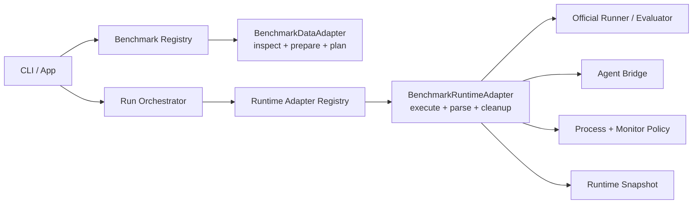

# Benchmark Adapter Layer Architecture Design

- Status: Reviewed and ready for implementation planning
- Date: 2026-06-04
- Scope: benchmark data adapters, runtime adapters, execution/result contracts, observability, testing, and migration plan
- Source request: create a dedicated architecture design for completing the adapter layer

## Requester Review Summary

- Key decision: keep MVP adapter support in-process and Rust-first; do not introduce a dynamic plugin runtime yet.
- Key decision: split adapter responsibility into data/planning adapters and runtime/execution adapters.
- Key decision: benchmark adapters consume already materialized agent runtime configuration; they must not reinterpret raw agent profile policy.
- Key decision: Terminal-Bench remains the hardening reference; SWE-bench Pro becomes the patch-style reference.
- Must confirm before implementation: whether to add a new `harnesslab-runtime-adapters` crate now, or first extract runtime traits inside `harnesslab-cli/src/runner/external`.
- Status reason: existing docs already define much of the target contract, but current code only exposes `descriptor()` and `plan(split)` at the adapter crate boundary; runtime behavior still lives in benchmark-specific CLI branches.

## 1. Background

HarnessLab's product goal is benchmark-first: users should run mainstream benchmark ecosystems without writing HarnessLab-specific adapters themselves. The adapter layer is the boundary that translates upstream benchmark data, tasks, official runners, evaluator outputs, and failure modes into HarnessLab's stable run contract.

The current implementation is functional for MVP smoke paths:

- `crates/harnesslab-adapters` exposes a `BenchmarkAdapter` trait with `descriptor()` and `plan(split)`.
- `terminal-bench`, `swe-bench-pro`, `fake-terminal`, and `fake-patch` have planning adapters.
- Real runtime logic for Terminal-Bench and SWE-bench Pro is implemented in `crates/harnesslab-cli/src/runner/external/*`.
- Terminal-Bench has extensive runtime hardening: official `tb run`, Python bridge, watchdogs, cleanup, result parsing, platform policy, and QEMU task compatibility.
- SWE-bench Pro has a real patch-style path: instance extraction, workspace prep, agent run, patch capture, official evaluator, and result mapping.

The architectural gap is that adapter runtime behavior is not yet a first-class contract. Adding more benchmarks would require more branching in the CLI runner instead of implementing a clean adapter interface.

## 2. Goals

1. Make benchmark data discovery, task planning, runtime execution, result mapping, cleanup, and replay snapshotting explicit contracts.
2. Keep the user-facing run experience stable: `harnesslab run --agent <profile> --benchmark <name> --split <split>`.
3. Make new benchmark families cheap to add without touching core orchestration logic.
4. Preserve benchmark-specific behavior where it belongs: official runner command construction, platform policy, evaluator parsing, upstream error translation, and cleanup tokens live in the runtime adapter.
5. Keep global orchestration benchmark-agnostic: scheduling, attempt directories, event persistence, process execution, result persistence, health aggregation, and report generation remain shared.
6. Make every adapter behavior testable through registry entries, seeded failure fixtures, and real smoke checks.

## 3. Non-Goals

- No dynamic plugin runtime in MVP.
- No Python adapter runtime as a HarnessLab-owned plugin mechanism. Python is allowed only when an upstream benchmark requires a bridge or helper.
- No benchmark adapter may own global run state, report rendering, or scheduler policy.
- No adapter may silently downgrade execution failures into benchmark failures.
- No adapter may interpret raw `skills/tools/hooks` profile policy. It receives `MaterializedAgentProfile`.

## 4. Target Architecture

The adapter layer has two first-class contracts:



### 4.1 Core Contract Types

`harnesslab-core` owns serializable, adapter-neutral data types:

- `BenchmarkDescriptor`
- `BenchmarkSplit`
- `DataState`
- `PreparedBenchmark`
- `TaskDescriptor`
- `BenchmarkPlan`
- `TaskPlan`
- `ExternalRunnerSpec`
- `TaskAttemptResult`
- `FailureClass`
- `FailureCode`

Core should also add or stabilize these pure data contracts before runtime extraction:

- `BenchmarkDataSnapshot`: immutable data version, manifest path, selected split, selected task ids, upstream source refs.
- `RuntimeTaskSnapshot`: task-level upstream metadata needed for replay without rescanning mutable data.
- `RuntimePolicySnapshot`: timeouts, progress files, activity patterns, platform policy, cleanup tokens, env policy, and command redaction metadata.
- `RuntimeResultProjection`: normalized score, failure class/code, warnings, usage, artifact refs, upstream raw result refs.

Core must not know how to execute Docker, official CLIs, Python helpers, or agent bridge code.

### 4.2 Data Adapter Contract

`crates/harnesslab-adapters` should own data discovery and task planning:

```rust
pub trait BenchmarkDataAdapter {
    fn descriptor(&self) -> BenchmarkDescriptor;
    fn inspect_data(&self) -> BenchmarkDataState;
    fn prepare(&self, split: &str) -> Result<PreparedBenchmark, AdapterError>;
    fn list_tasks(&self, prepared: &PreparedBenchmark) -> Result<Vec<TaskDescriptor>, AdapterError>;
    fn create_task_plan(
        &self,
        prepared: &PreparedBenchmark,
        task: &TaskDescriptor,
    ) -> Result<TaskPlan, AdapterError>;
    fn snapshot_task(
        &self,
        prepared: &PreparedBenchmark,
        task: &TaskDescriptor,
    ) -> Result<RuntimeTaskSnapshot, AdapterError>;
}
```

MVP migration rule:

- Keep the current `plan(split)` as a compatibility wrapper.
- Internally implement `prepare -> list_tasks -> create_task_plan`.
- Convert tests from "plan happens to work" to "each contract step is independently verified".

### 4.3 Runtime Adapter Contract

Runtime adapters belong at the application boundary because they depend on filesystem layout, process execution, official runner command lines, agent bridge behavior, cleanup, and event logging.

Recommended MVP path:

- First extract a trait inside `crates/harnesslab-cli/src/runner/external`.
- Move to a separate crate only after Terminal-Bench and SWE-bench Pro both implement the trait cleanly.

Target trait:

```rust
pub trait BenchmarkRuntimeAdapter {
    fn kind(&self) -> ExternalRunnerKind;

    fn preflight(&self, ctx: RuntimePreflightContext<'_>) -> Result<RuntimePreflightReport>;

    fn prepare_attempt(
        &self,
        ctx: RuntimeAttemptContext<'_>,
    ) -> Result<RuntimePreparedAttempt>;

    fn execute_attempt(
        &self,
        ctx: RuntimeAttemptContext<'_>,
        prepared: RuntimePreparedAttempt,
    ) -> Result<TaskAttemptResult>;

    fn cleanup_task(
        &self,
        ctx: RuntimeAttemptContext<'_>,
        phase: CleanupPhase,
    ) -> Result<CleanupReport>;

    fn cleanup_run(&self, ctx: RuntimeRunContext<'_>) -> Result<CleanupReport>;
}
```

The orchestrator calls the trait; it does not match on benchmark kind except through the runtime registry.

### 4.4 Runtime Attempt Context

The runtime adapter receives a bounded context:

- run id and attempt id
- run directory and attempt directory
- immutable `RunSpec`
- private and public `BenchmarkAgentRuntimeConfig`
- `TaskPlan`
- `ExternalRunnerSpec`
- event writer
- process executor handle
- artifact writer helpers

The adapter must not reach into unrelated global state. Any environment variable diagnostic override must be named, documented, and emitted to `events.jsonl`.

Raw `AgentProfile` is not part of the normal runtime adapter contract. If a
temporary compatibility path needs a raw profile field, the adapter must declare
that field in a compatibility allowlist, redact it in public artifacts, and
carry a test proving the field is not used to reinterpret raw `skills`, `tools`,
`hooks`, auth inheritance, or setup policy.

### 4.5 Benchmark-Facing Agent Runtime Config

`BenchmarkAgentRuntimeConfig` is the only agent contract a runtime adapter should
consume after agent registry materialization.

It should contain:

- rendered agent command template, with private and public-redacted forms
- input mode and benchmark bridge mode
- declared environment pass-through, already resolved by the agent materializer
- setup script/materialized setup refs, not raw setup policy
- known benchmark labels such as Terminal-Bench import path/model, already
  normalized into typed fields
- host-agent execution support flags, including whether non-current `run_as`
  is enforceable for this benchmark path
- secret redaction references for adapter-owned snapshots and events

It must not expose:

- raw `skills/tools/hooks` policy
- raw auth inheritance policy
- raw setup policy except through explicit compatibility fields
- ambient parent process environment

### 4.6 Runtime Prepared Attempt

`RuntimePreparedAttempt` is the adapter-owned execution contract for one attempt:

- official runner command or multi-step execution plan
- working directory
- env policy
- stdin policy
- stdout/stderr paths
- hard timeout
- no-output timeout
- progress file paths
- no-output activity patterns
- official result path
- public command snapshot
- cleanup tokens
- expected artifact paths
- replay materials
- immutable input identity materials

Terminal-Bench can use a mostly single official-runner command. SWE-bench Pro can represent a multi-phase attempt: metadata extraction, workspace preparation, agent execution, patch capture, evaluator execution, and result projection.

### 4.7 Runtime Registry And Preflight

The runtime registry owns every benchmark-kind-specific runtime decision. The
orchestrator may look up a runtime adapter by `ExternalRunnerKind`, but it must
not contain benchmark-specific validation branches outside the registry boundary.

Registry-dispatched `preflight` must own:

- benchmark-specific profile compatibility checks
- host-agent versus sandbox-agent execution support
- Terminal-Bench import-path requirements
- SWE-bench Pro gold-agent host path constraints
- official runner/evaluator readiness
- missing data/evaluator/source diagnostics
- adapter version and snapshot compatibility checks

`validate_profile_for_plan`, `host_agent_execution_reason`, and direct
benchmark-specific label parsing in CLI runner code must move behind this
preflight boundary or become generic calls into runtime adapter metadata.

### 4.8 Snapshot Authority

Replay must have a single authority chain. Mutable local paths inside
`TaskPlan.external_runner` are not sufficient as replay authority.

Target authority order:

1. `benchmark.snapshot.json`: selected benchmark, split, task ids, data snapshot
   id, and source refs chosen for the run.
2. `task-runtime.snapshot.json`: task-level immutable workload identity,
   including upstream task metadata hash, attempt-local dataset manifest when
   mutated, and evaluator/source refs needed to recreate the attempt.
3. `external-runtime.private.json`: private runtime policy and command material
   required for replay.
4. `external-runtime.public.json`: public redacted runtime policy, command
   summary, official result refs, cleanup evidence, and final/official verdict
   provenance for report/debugging.

`TaskPlan.external_runner` remains a launch hint for new runs during the
migration, not a durable replay authority. Replay must trust the snapshots above
when present. The existing behavior where replay can silently re-plan from live
adapter data after `benchmark.snapshot.json` is missing must be retired as part
of this architecture track and replaced with a readiness blocker or an explicit
legacy degraded replay mode.

## 5. Ownership Boundaries

| Concern | Owner |
| --- | --- |
| Descriptor and split metadata | Data adapter |
| Local data readiness and cache inspection | Data adapter |
| Dataset preparation and task selection | Data adapter |
| Stable task ids and source refs | Data adapter |
| Official runner command and env | Runtime adapter |
| Agent bridge behavior | Runtime adapter |
| Process execution primitive | Shared infra, invoked through orchestrator/runtime context |
| Timeout and no-output policy values | Runtime adapter proposes, process executor enforces |
| Official result parsing | Runtime adapter |
| Failure class/code mapping | Runtime adapter, constrained by core taxonomy |
| Attempt result persistence | Orchestrator/shared store |
| Report rendering | Report service |
| Run health aggregation | Run monitor |
| Replay command and snapshot storage | Orchestrator, with adapter-provided materials |

## 6. Style-Specific Contracts

### 6.1 Terminal-Style Adapter

Terminal-style adapters model tasks where the agent writes commands or files inside an execution environment and an upstream verifier produces the score.

Required behavior:

- Convert upstream task metadata into an agent instruction.
- Preserve upstream verifier limits; user run timeout may cap HarnessLab execution but must not inflate official verifier timeout.
- Separate benchmark verdicts from HarnessLab execution failures.
- Capture agent stdout/stderr, official runner logs, verifier logs, and task artifacts.
- Provide progress paths and activity patterns for no-output watchdogs.
- Emit runtime policy to `events.jsonl` before launch.
- Map output-format failures to `benchmark/agent_output_parse_error` when the upstream benchmark treats malformed agent output as a verdict.

Terminal-Bench is the reference implementation.

### 6.2 Patch-Style Adapter

Patch-style adapters model tasks where the agent edits a repository and the benchmark evaluates a patch.

Required behavior:

- Extract instance metadata into an attempt-local file.
- Prepare a clean workspace per attempt.
- Run the agent in the prepared workspace.
- Capture diff and prediction artifacts before evaluation.
- Reject empty or invalid diffs as benchmark failures, not evaluator infrastructure failures.
- Run official evaluator and map parser/evaluator failures precisely.
- Store raw evaluator output and normalized result.

SWE-bench Pro is the reference implementation.

## 7. Observability Contract

Adapter extraction must not regress the existing operator contract. Existing
operator-critical event names stay queryable unless a migration emits both the
old and new names and updates tests and runbooks in the same change.

Required common events:

| Phase | Event | Required Fields |
| --- | --- | --- |
| preflight | `external_runner_preflight` | adapter id, runner kind, agent bridge mode, readiness status, blocking reason if any |
| launch | `external_runner_started` | dataset path, runtime dataset path, official run id or evaluator id, output root |
| runtime policy | `external_runner_configured` | process timeout, no-output timeout, activity grace, progress paths, activity patterns, platform policy, official result path, command snapshot path |
| activity | `external_runner_activity` | no-output window, observed activity, progress file, last progress timestamp when available |
| no progress | `external_runner_no_progress` | progress paths, last progress timestamp, last activity, grace exhausted, termination reason |
| hard timeout | `external_runner_timeout` | hard-timeout value, elapsed duration, kill reason, official run/evaluator id, process termination reason, whether official result existed before timeout |
| setup failure | `external_runner_setup_failed` | failing phase, evidence source/log path, official run/evaluator id, mapped final failure class/code, whether pending tasks should abort |
| parse failure | `external_result_parse_failed` | official result path, parser, raw failure summary, final mapped failure |
| cleanup | style-specific cleanup event plus `external_runner_cleanup` when generic cleanup is introduced | phase, matched resources, removed resources, survivor resources, whether cleanup overrides benchmark verdict |
| finish | `task_attempt_finished` | final failure class/code, official failure class/code, benchmark score, health impact, warnings |

Terminal-Bench compatibility events that must remain queryable:

- `external_runner_configured`
- `terminal_bench_dataset_prepared`
- `external_runner_activity`
- `external_runner_no_progress`
- `external_runner_timeout`
- `external_runner_setup_failed`
- `terminal_bench_cleanup`

SWE-bench Pro must use stable phase events instead of only free-form messages:

- `swe_bench_pro_metadata_extraction_started`
- `swe_bench_pro_workspace_prep_started`
- `swe_bench_pro_agent_started`
- `swe_bench_pro_patch_captured`
- `swe_bench_pro_evaluator_started`
- `swe_bench_pro_cleanup`

`CleanupReport` must be structured. Minimum fields:

- phase: `pre_task`, `post_task`, or `run`
- adapter id
- official run id or evaluator id
- match tokens, redacted if needed
- matched projects/resources
- removed projects/resources
- survivor projects/resources
- cleanup exit status or error code
- whether cleanup changed final failure classification
- public message and private details path

The final result must preserve verdict provenance:

- official benchmark failure class/code
- official benchmark score
- final HarnessLab failure class/code
- override reason when HarnessLab timeout, no-progress, setup failure, parse failure, or cleanup failure changes the final result

Secrets must be redacted in public artifacts. Raw logs may exist only where the
existing redaction and artifact policy allows them.

### 7.1 Public And Private Runtime Artifacts

Runtime adapter snapshots must have an explicit public/private boundary:

- `external-runtime.private.json`: private command, env policy, raw cleanup
  tokens, private paths, redaction basis, and replay materials needed to rerun.
- `external-runtime.public.json`: redacted command summary, public env names
  only, redacted cleanup token shape, official result refs, policy summary,
  official-vs-final verdict provenance, and adapter version.

Forbidden in public adapter artifacts:

- secret values
- unredacted auth paths when they reveal secret material
- full command strings containing token-like values
- raw environment maps
- private cleanup tokens that can identify secret-bearing processes

Required tests:

- fake secret scan across adapter events, `external-runtime.public.json`, report
  data, and replay warnings
- public artifact absence test for raw command/env material
- private artifact existence test when replay needs private materials

## 8. Error Semantics

Adapter failure mapping must follow this rule:

- HarnessLab could not run, monitor, clean up, or parse required official artifacts: `execution_failure`.
- Official benchmark completed and judged the agent: `benchmark_failure` or success.
- Official benchmark advisory verdict that does not invalidate HarnessLab execution: warning.
- Missing or malformed upstream data before task start: preflight/data readiness blocker.

Specific invariants:

- `external_runner_timeout`, `external_runner_no_progress`, `external_runner_setup_failed`, and `agent_cleanup_failed` are execution failures.
- Terminal-Bench official `agent_timeout` is benchmark failure unless HarnessLab killed the official runner.
- Terminal-Bench official `parse_error` maps to `benchmark/agent_output_parse_error`.
- SWE-bench Pro empty patch maps to `benchmark/no_valid_diff`.
- Evaluator crash caused by HarnessLab workspace/setup issues maps to execution failure; evaluator verdict against a valid patch maps to benchmark failure.

## 9. Replay And Snapshot Contract

Replay must not depend on mutable local benchmark data silently changing.

Each run snapshot should include:

- `benchmark.snapshot.json`: selected benchmark, split, task ids, data snapshot id, warnings, and source refs.
- `task-runtime.snapshot.json`: one per task or embedded in attempt metadata, containing upstream source refs, upstream task metadata hash, selected task instruction hash, and runtime task metadata.
- `external-runtime.private.json`: one per attempt, containing private runtime policy, official command, env policy, cleanup tokens, redaction basis, and replay materials.
- `external-runtime.public.json`: one per attempt, containing redacted runtime policy, official result paths, cleanup evidence summary, adapter version, official runner/evaluator identity, and final/official verdict provenance.
- `agent-runtime.materialized.json`: already handled by agent registry; runtime adapters consume it.

Replay behavior:

- Replay must trust persisted snapshots over live adapter planning.
- If `benchmark.snapshot.json` or the required runtime snapshots are missing for an external benchmark, replay must block before task execution unless the user explicitly selects a legacy degraded replay mode.
- Legacy degraded replay must emit a warning that it may bind to live mutable benchmark data.
- If upstream data is missing but snapshot contains enough attempt materials, replay may proceed only for supported adapter paths.
- If required official evaluator data is missing, replay blocks before task execution with a precise readiness error.
- If runtime adapter version changes, replay records a warning unless a future policy makes it blocking.
- If official runner/evaluator version, evaluator source hash, attempt-local dataset manifest hash, extracted SWE sample hash, or mutated runtime input hash differs from the source run, replay must warn or block according to adapter policy before execution.

Immutable identity requirements:

- Terminal-Bench must snapshot official runner identity, source dataset dir id,
  runtime dataset path, and attempt-local dataset manifest/hash when the adapter
  mutates or copies QEMU tasks.
- SWE-bench Pro must snapshot parquet file identity, extracted sample hash,
  evaluator source ref/hash, workspace preparation inputs, and prediction schema
  version.
- Adapter-owned mutated inputs must be hashed after mutation and before launch.

## 10. Testing Strategy

Add or tighten tests around these groups:

| ID Family | Purpose |
| --- | --- |
| `ADAPT-DATA-*` | data inspection, prepare idempotency, split readiness, task descriptors, source refs |
| `ADAPT-RUNTIME-*` | runtime registry, preflight, runtime policy snapshots, cleanup reports |
| `TB-*` | Terminal-Bench official runner command, timeout policy, result mapping, QEMU compatibility, cleanup |
| `SWEPRO-*` | SWE-bench Pro metadata extraction, workspace prep, patch capture, evaluator mapping |
| `INT-*` | real smoke paths through `harnesslab run` |
| `SEC-*` | redaction and public artifact scans |

These ID families do not count as proof until they exist in all three places:

1. `tests/REQUIREMENTS.toml`
2. `tests/TEST_REGISTRY.toml`
3. `scripts/test-after-change.sh --select`

Each adapter contract test must assert both the behavior and the failure
classification. Selectors in `scripts/test-after-change.sh --select` must guard
against zero-test false passes with exact expected test counts for grouped
selectors.

Concrete initial IDs:

- `ADAPT-DATA-001`: descriptor and inspect-data do not mutate local cache.
- `ADAPT-DATA-002`: prepare is idempotent and never returns ready for partial or corrupted data.
- `ADAPT-DATA-003`: list_tasks returns stable task ids and source refs.
- `ADAPT-DATA-004`: snapshot_task captures replay-sufficient task identity.
- `ADAPT-RUNTIME-001`: runtime registry dispatches preflight and execute without direct benchmark-specific CLI branches outside the registry boundary.
- `ADAPT-RUNTIME-002`: runtime preflight owns host/sandbox support checks and benchmark-facing agent bridge compatibility.
- `ADAPT-RUNTIME-003`: external-runtime public/private snapshots are written with required fields.
- `ADAPT-RUNTIME-004`: cleanup report is structured and can override official benchmark verdict with audit evidence.
- `ADAPT-RUNTIME-005`: runtime event taxonomy preserves operator-critical Terminal-Bench events, including `external_runner_configured`, `terminal_bench_dataset_prepared`, `external_runner_activity`, `external_runner_no_progress`, `external_runner_timeout`, `external_runner_setup_failed`, cleanup events, and stable SWE-bench Pro phase events.
- `SWEPRO-001`: metadata extraction failure is classified and observable.
- `SWEPRO-002`: workspace preparation failure is classified and observable.
- `SWEPRO-003`: invalid patch and empty patch are distinct benchmark failures.
- `SWEPRO-004`: evaluator parse corruption is classified separately from agent patch failure.
- `SWEPRO-005`: replay/readiness uses stored runtime materials instead of silent live replanning.

`INT-011` must not remain an umbrella proof for SWE-bench Pro. Split the current
`int_011_*` cases into separate registry IDs/selectors, or route `INT-011`
through a counted grouped selector that proves every intended `int_011_*` test
ran. Required artifacts for external runtime proofs must match
`docs/test-engineering.md`: run metadata, command snapshot, profile/runtime
snapshots, `events.jsonl`, per-attempt `result.json`, logs, patch artifacts for
patch-style tasks, and report artifacts.

Fixture shims remain useful seeded failure tests, but they are not sufficient as
the only preservation proof for official benchmark behavior. Each benchmark
family needs at least one explicit official-runner preservation proof:

- Terminal-Bench: real official `tb run` path or verifier script that proves
  CLI argument shape, result schema, timeout mapping, and non-QEMU
  `DOCKER_DEFAULT_PLATFORM=linux/amd64`.
- SWE-bench Pro: real official evaluator path or verifier script that proves
  parquet extraction, evaluator invocation, prediction schema, and output parse.

Add meta-tests that fail when a claimed adapter ID family appears in this plan
but is absent from `REQUIREMENTS`, `TEST_REGISTRY`, or selector routing.

## 11. Migration Plan

### Slice A: Contract Inventory

- Compare `docs/architecture.md`, `docs/mvp-development-spec.md`, and current code contracts.
- Add a failing test that proves the current `BenchmarkAdapter` cannot expose `prepare/list_tasks/snapshot_task` independently.
- Register concrete `ADAPT-DATA-*`, `ADAPT-RUNTIME-*`, and `SWEPRO-*` requirements, registry entries, and selector routes before using them as proof.
- Split or count-route `INT-011` so every intended SWE-bench Pro failure/smoke case is actually exercised.
- Add a test-registry meta-check for claimed-but-unregistered adapter ID families.

### Slice B: Data Adapter Completion

- Extend the data adapter trait behind compatibility wrappers.
- Implement `prepare`, `list_tasks`, and `snapshot_task` for fake-terminal and fake-patch first.
- Port Terminal-Bench and SWE-bench Pro planning to the same flow.
- Keep `plan(split)` as a wrapper until callers migrate.

### Slice C: Snapshot Authority And Replay Contract

- Define what remains in `BenchmarkPlan` and `TaskPlan`, what moves to
  `task-runtime.snapshot.json`, and what moves to `external-runtime.private.json`
  / `external-runtime.public.json`.
- Retire silent replay live replanning for external benchmarks. Replace the
  current fallback behavior with a readiness blocker or explicit legacy degraded
  replay mode.
- Add replay drift checks for dataset/evaluator/source/official runner identity.
- Update the current `INT-013` contract to reflect the new replay authority.

### Slice D: Runtime Adapter Registry

- Introduce a runtime adapter trait inside `crates/harnesslab-cli/src/runner/external`.
- Replace direct `match ExternalRunnerKind` branches with registry dispatch for
  preflight, execute, cleanup, and replay compatibility.
- Move benchmark-specific profile validation, host/sandbox gating, and agent
  bridge compatibility behind registry-dispatched preflight.
- Replace raw-profile adapter access with `BenchmarkAgentRuntimeConfig` or mark
  a temporary compatibility exception with tests.
- Keep benchmark-specific modules, but hide them behind the trait.

### Slice E: Terminal-Bench Runtime Extraction

- Extract Terminal-Bench preflight, runtime policy, command construction, result parsing, cleanup, and replay materials into a `TerminalBenchRuntimeAdapter`.
- Preserve existing behavior and selectors.
- Preserve existing operator-critical event names or dual-emit migration aliases.
- Assert `external_runner_timeout` and `external_runner_setup_failed` stay queryable with hard-timeout/setup-failure diagnostic fields.
- Add runtime snapshot assertions for platform, timeout, progress, official-vs-final verdict provenance, cleanup report, and public/private redaction.

### Slice F: SWE-bench Pro Runtime Extraction

- Extract SWE-bench Pro metadata, workspace prep, agent run, patch capture, evaluator execution, and result mapping into `SweBenchProRuntimeAdapter`.
- Add seeded failure tests for missing metadata, invalid patch, evaluator parse failure, and workspace prep failure.
- Add stable phase events for metadata extraction, workspace prep, agent start, patch capture, evaluator start, and cleanup.

### Slice G: Runtime Snapshot, Redaction, And Replay Hardening

- Persist adapter-provided runtime snapshots.
- Add replay warnings for runtime adapter version mismatch.
- Add replay blockers for missing official evaluator materials.
- Add fake secret scans for adapter events, public runtime snapshots, report data, and replay warnings.

### Slice H: Docs And User-Facing Diagnostics

- Update architecture and MVP spec to reflect the implemented trait names.
- Update development operations with the new adapter event sequence.
- Update doctor/readiness output to name the failing adapter phase.

### Slice I: Full Gate And Review

- Register all new requirements in `tests/REQUIREMENTS.toml` and `tests/TEST_REGISTRY.toml`.
- Add `scripts/test-after-change.sh --select` routes.
- Run targeted adapter selectors, Python bridge tests, and full gate.
- Run adversarial review because implementation will touch code.

## 12. Adversarial Review And Re-Review Plan

This architecture work must use adversarial review as a gate, not as a final
rubber stamp. Reviewers must be fresh internal subagent sessions and must
receive only a neutral navigation packet. Do not pass the full main-agent chat,
hidden reasoning, or persuasive summaries.

### 12.1 Review Reports

Use these project-root reports:

- Design review: `vs_review/YYYY-MM-DD-benchmark-adapter-architecture-review.md`
- Implementation review: append to the same report while the target remains the
  same architecture track.
- If a slice materially changes scope, create
  `vs_review/YYYY-MM-DD-benchmark-adapter-<slice>-review.md` and link it from
  the main report.

Every report must include:

- review target and target files
- exact navigation packet sent to reviewers
- reviewer launch records with fresh-session evidence
- reviewer outputs
- main-agent triage for every finding: `accept`, `reject`, or `defer`
- validation evidence for accepted findings
- closure status

### 12.2 Round 0: Design Review Before Implementation

Run this before treating this architecture plan as implementation-ready.

Reviewer roles:

- `architecture-adversary`: challenge contract boundaries, dependency direction,
  abstraction level, migration sequence, and whether runtime extraction belongs
  in CLI first.
- `test-validity-adversary`: challenge whether `ADAPT-DATA-*`,
  `ADAPT-RUNTIME-*`, `TB-*`, and `SWEPRO-*` can actually prove behavior instead
  of only testing wrappers.
- `observability-adversary`: challenge whether event logs, runtime snapshots,
  cleanup reports, and replay diagnostics are enough to debug failures after a
  real benchmark run.

Optional fourth reviewer:

- `security-adversary`, only if the implementation slice changes auth env,
  host process execution, Docker socket handling, command redaction, or secret
  artifacts.

Design review navigation packet must point reviewers to:

- `docs/plans/2026-06-04-benchmark-adapter-architecture-design.md`
- `docs/architecture.md`, section 6
- `docs/mvp-development-spec.md`, section 7
- `crates/harnesslab-adapters/src/registry.rs`
- `crates/harnesslab-cli/src/runner/external.rs`
- `crates/harnesslab-cli/src/runner/external/terminal_bench.rs`
- `crates/harnesslab-cli/src/runner/external/swe_bench_pro.rs`
- `tests/TEST_REGISTRY.toml`
- `scripts/test-after-change.sh`

Design review closure criteria:

- no untriaged findings
- no unresolved blocking findings
- accepted blocking findings have been fixed in the plan
- the fixed plan has received a focused fresh closure review

### 12.3 Implementation Slice Reviews

Each implementation slice must receive a focused review after local validation.
Do not batch all slices into one final review if the slice changed architecture,
execution behavior, failure mapping, replay, or tests.

| Slice | Review Focus | Required Reviewer Roles |
| --- | --- | --- |
| Slice A: Contract Inventory | whether gap inventory, concrete test ids, selector routing, and current `INT-011` replacement are meaningful | `architecture-adversary`, `test-validity-adversary` |
| Slice B: Data Adapter Completion | data readiness, prepare idempotency, stable task ids, source refs, compatibility wrapper | `architecture-adversary`, `test-validity-adversary` |
| Slice C: Snapshot Authority And Replay Contract | snapshot authority, replay fallback removal, mutable data protection, adapter version warnings | `architecture-adversary`, `test-validity-adversary`, `observability-adversary` |
| Slice D: Runtime Adapter Registry | dispatch ownership, preflight ownership, raw profile access removal, no hidden benchmark branching | `architecture-adversary`, `implementation-adversary` |
| Slice E: Terminal-Bench Runtime Extraction | behavior preservation, timeout/watchdog, cleanup, QEMU, result mapping, event compatibility | `implementation-adversary`, `test-validity-adversary`, `observability-adversary` |
| Slice F: SWE-bench Pro Runtime Extraction | workspace prep, patch capture, evaluator mapping, phase diagnostics, host/sandbox execution boundaries | `implementation-adversary`, `test-validity-adversary`, `observability-adversary` |
| Slice G: Runtime Snapshot, Redaction, And Replay Hardening | public/private artifact split, fake secret scans, replay materials, official-vs-final verdict provenance | `security-adversary`, `test-validity-adversary`, `observability-adversary` |
| Slice H: Docs And Diagnostics | user-facing phase names, doctor/readiness clarity, operational reuse | `documentation-skill-adversary`, `observability-adversary` |
| Slice I: Full Gate And Review | traceability, selector coverage, full gate evidence, closure state | `test-validity-adversary`, `architecture-adversary` |

### 12.4 Blocking Finding Re-Review Rule

Any accepted blocking finding triggers a mandatory fresh re-review after the
fix. The task cannot be closed until that focused closure round passes, unless
the user explicitly accepts the remaining risk.

Closure re-review packet must include:

- original finding id and reviewer role
- broken assumption and failure scenario
- accepted fix or plan change
- files changed
- exact validation run
- residual risk
- request to falsify only the closure claim, not to restart broad review unless
  the fix changes scope

Closure reviewer selection:

- Use the same role family as the original blocking finding when possible.
- Add `test-validity-adversary` when the fix relies on new tests.
- Add `observability-adversary` when the fix relies on logs, events, snapshots,
  or diagnostics.
- Use a fresh internal subagent session even if the reviewer role name is the
  same as an earlier round.

### 12.5 Severity And Triage Rules

Use these review decisions:

- `accept`: valid finding; change design, code, tests, logs, docs, or
  operations flow and record evidence.
- `reject`: invalid for this task; cite concrete evidence that defeats the
  failure scenario.
- `defer`: valid but out of current scope; identify where it will be tracked.
  Blocking findings must not be deferred unless the user explicitly accepts the
  risk.

Severity thresholds:

- Blocking: invalid architecture boundary, silent failure mapping, unproven
  runtime behavior, replay corruption risk, secret leakage risk, missing
  high-impact tests, or user-facing diagnostics that would misclassify real
  benchmark results.
- Major: likely regression, maintenance trap, incomplete observability, weak
  but non-critical validation, or unclear migration ownership.
- Minor: wording, local cleanup, or low-risk clarity improvements.

### 12.6 Timeout And Degraded Review Handling

Reviewer timeout is not a pass.

- Use `complex` timeout for design and runtime extraction reviews.
- Use `high-risk` timeout for accepted blocking closure reviews.
- Each reviewer role gets one primary fresh attempt and one replacement fresh
  attempt if the primary is lost or times out.
- If both attempts fail, record the role as degraded and do not close the
  review. Ask the user whether to retry, narrow scope, change reviewer role, or
  explicitly accept the review gap.

### 12.7 Final Review Closure Checklist

Before claiming the adapter architecture track is complete:

- `/vs_review/` report exists and is committed.
- Every review round has launch records proving fresh context.
- Every finding has `accept`, `reject`, or `defer`.
- Every accepted blocking finding has a linked fresh closure review.
- Deferred major findings are tracked in a concrete future plan or issue.
- Targeted selectors passed.
- Full `scripts/test-after-change.sh` passed after the final code change.
- Final response names report path, reviewer roles, closure status, and
  unresolved risks.

## 13. Acceptance Matrix

| Requirement | Proof |
| --- | --- |
| Adapter data contract is explicit | concrete registered `ADAPT-DATA-001..004` tests for descriptor, inspect, prepare, list, source refs, and task snapshot |
| Runtime adapter dispatch is generic | concrete registered `ADAPT-RUNTIME-001..005` tests for preflight, execute, cleanup, runtime snapshots, event taxonomy, and no direct benchmark-specific CLI branch outside registry |
| Terminal-Bench behavior preserved | existing `TB-*`, `INT-021..046`, Python bridge tests, and at least one official-runner preservation proof |
| SWE-bench Pro behavior preserved | concrete registered `SWEPRO-001..005` tests and at least one official evaluator preservation proof |
| Runtime config is observable | `external_runner_configured`, adapter phase events, cleanup reports, `external-runtime.public.json`, and `external-runtime.private.json` assertions |
| Failure mapping is stable | seeded failure fixtures per style |
| Replay does not rely on mutable data silently | replay readiness tests for missing snapshot blocker, mutable data drift detection, adapter version warning, and explicit legacy degraded replay if retained |
| Public artifacts do not leak secrets | `SEC-*` scans for adapter runtime snapshots, events, report data, and replay warnings |
| Current registry proof is not misleading | meta-test for claimed adapter ID families and split or count-route coverage for current `INT-011` cases |
| User docs match behavior | architecture, MVP spec, development operations updates |
| Full system remains healthy | `scripts/test-after-change.sh` |

## 14. Risks

- Over-abstracting too early could hide benchmark-specific reality. Mitigation: extract from Terminal-Bench and SWE-bench Pro behavior that already exists, not from imagined future adapters.
- A single command-based runtime plan may not fit patch-style evaluation. Mitigation: let runtime adapters execute multi-step attempts through a shared context instead of forcing one command shape.
- Moving runtime logic into `harnesslab-adapters` too early would drag process/filesystem dependencies into the data adapter crate. Mitigation: keep runtime extraction in CLI first.
- Replay snapshots can become large. Mitigation: snapshot references, policy, hashes, and bounded metadata; keep raw logs in attempt artifacts.
- Official benchmark changes can break parsing. Mitigation: keep upstream raw result artifacts and adapter version warnings.

## 15. Open Questions

1. Should runtime adapter extraction stay inside `harnesslab-cli` for the first implementation, or should a new crate be introduced immediately?
2. Should `PreparedBenchmark` become persisted before every run even when no preparation was needed?
3. Should real external benchmark smoke checks be mandatory in the default full gate or remain explicit verifier scripts until CI resources are stable?
4. Should `ExternalRunnerKind` remain a closed enum for MVP, or move toward string-based adapter ids before dynamic plugins exist?
5. Should legacy degraded replay be retained at all, or should external benchmark replay always block when authoritative snapshots are missing?

## 16. Done Definition

This architecture track is complete when:

1. Data and runtime adapter contracts are implemented as first-class interfaces.
2. Terminal-Bench and SWE-bench Pro both dispatch through the runtime adapter registry.
3. Current Terminal-Bench hardening behavior is preserved by tests.
4. SWE-bench Pro patch-style failures are covered by seeded tests.
5. Adapter runtime snapshots are persisted and replay-aware.
6. Public adapter runtime artifacts have secret-scan coverage.
7. Test registry entries and selectors cover all new contract surfaces, including `ADAPT-DATA-*`, `ADAPT-RUNTIME-*`, `SWEPRO-*`, and the former `INT-011` umbrella cases.
8. Full local gate passes.
9. Fresh adversarial review closes all accepted blockers.
