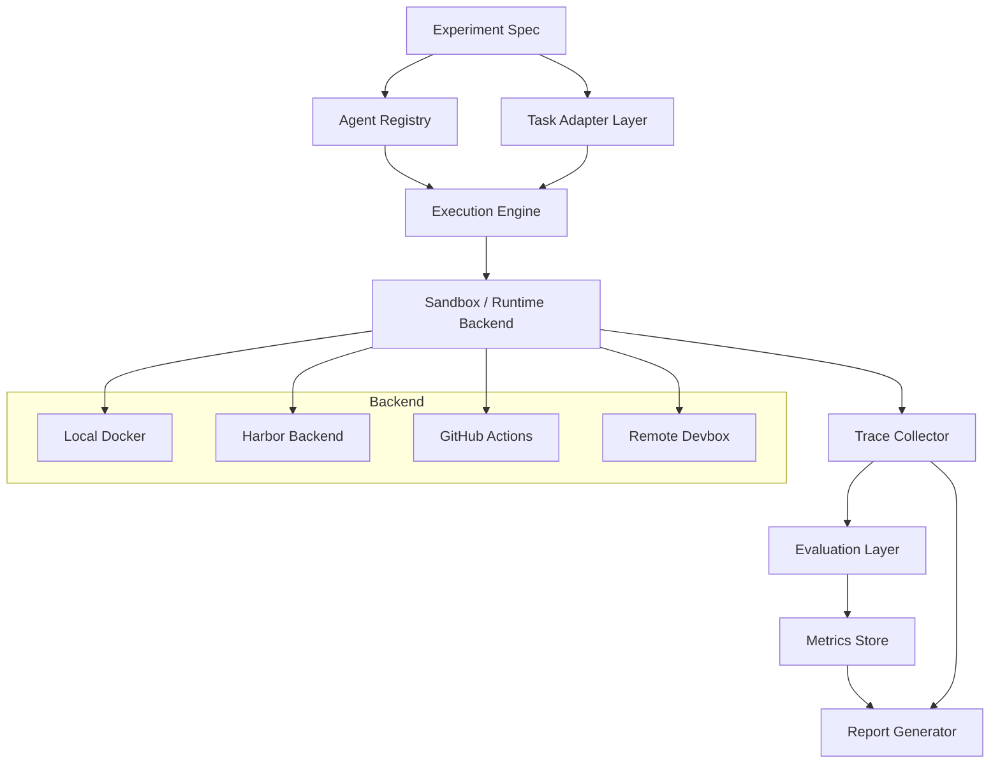

# HarnessLab 产品需求文档

> Benchmark your coding agents like software, not vibes.
>
> 将 agent / harness 当作可演进的软件系统，通过可复现实验自动化完成横向对比、版本回归、能力画像与失败归因。

## 1. 文档信息

| 项目 | 内容 |
|---|---|
| 产品名 | HarnessLab |
| 文档类型 | PRD / Product Requirement Document |
| 当前阶段 | Concept / MVP Definition |
| 目标用户 | Coding agent / agent harness 开发者、独立开发者、AI 工程团队、企业内部平台团队 |
| 初始场景 | Coding agent / harness 的横向测评、版本回归、策略消融 |
| 更新日期 | 2026-05-25 |

## 2. 一句话定位

HarnessLab 是一个面向 agent / harness 的评测自动化平台：用户可以用配置文件注册任意 CLI agent，选择任务集与实验矩阵，系统自动运行、采集 trace、计算指标，并生成横向对比、版本回归和失败归因报告。

## 3. 背景与问题

当前 agent / harness 的质量判断仍高度依赖用户体感：

- 某个 coding agent “好不好用”，通常来自个人使用体验，而不是可控实验。
- 不同 harness 之间的差异经常被模型能力、任务难度、预算上限、环境差异混在一起。
- 自研 agent 或魔改 agent 接入现有 benchmark harness 的成本偏高，经常需要写专门 adapter。
- harness 的多版本演进缺乏回归测试机制，无法稳定回答“新版本到底更强还是退步”。
- agent 的失败原因缺乏结构化归因，常见情况是只知道任务失败，但不知道失败发生在规划、工具调用、状态跟踪、验证还是恢复阶段。

HarnessLab 的核心判断是：未来 harness 会百花齐放，个人和企业都会基于通用基座模型定制自己的 agent / harness。这个趋势会带来一个新的基础设施需求：**像测试普通软件一样测试 agent / harness。**

## 4. 产品目标

### 4.1 核心目标

1. 降低任意 agent / harness 接入评测系统的门槛。
2. 支持多 agent、多模型、多任务、多预算、多版本的实验矩阵。
3. 自动采集运行过程 trace，将 agent 行为过程转化为可比较数据。
4. 生成横向对比、版本回归、策略消融和失败归因报告。
5. 让 harness 质量从“体感判断”转向“实验条件下的可复现对比”。

### 4.2 非目标

早期版本不追求：

- 构建大型原创 benchmark 数据集。
- 做复杂 Web SaaS 和多人权限系统。
- 替代 Harbor、Terminal-Bench、SWE-bench 等现有任务/运行生态。
- 做通用模型评测排行榜。
- 一开始就覆盖所有 agent 类型，例如浏览器 agent、办公 agent、移动端 agent。

MVP 应专注于 **Coding Agent / Harness Regression Lab**。

## 5. 产品原则

| 原则 | 说明 |
|---|---|
| Command-first | 优先支持通过命令行注册任意 CLI agent，而不是强迫用户写 SDK adapter。 |
| Experiment-first | 产品中心不是单次 benchmark，而是实验矩阵、对照组、重复运行和版本对比。 |
| Trace-first | 不只记录 pass/fail，更要记录 agent 如何完成或失败。 |
| Reproducible | 同一配置应尽量可复现，包括任务环境、预算、版本、运行参数。 |
| Harness-aware | 评测对象不是单纯模型，而是 model + harness + tools + policy + budget 的系统组合。 |
| Backend-neutral | 初期可以复用 Harbor / Docker / local runner，但上层实验控制逻辑应保持独立。 |

## 6. 核心概念

| 概念 | 定义 |
|---|---|
| Agent | 具体可执行的 agent 实例，例如 Claude Code、Codex CLI、OpenCode、WhaleCode、claude-ds。 |
| Harness | 驱动 agent 工作的系统层，包括任务分解、上下文管理、工具调用、验证策略、恢复策略等。 |
| Agent Registry | 注册 agent 的配置文件，描述安装方式、运行命令、环境变量、日志路径、能力约束等。 |
| Taskset | 一组被测任务，可来自 Terminal-Bench、SWE-bench、本地任务集或企业内部任务集。 |
| Experiment | 一次实验定义，包含 agent 矩阵、任务集、预算、重复次数、评测指标和报告设置。 |
| Run | 某个 agent 在某个 task 上的一次实际运行。 |
| Trial | 同一配置下的重复运行，用于评估稳定性和 pass@k。 |
| Trace | agent 运行过程中的结构化事件流，包括命令、文件编辑、测试、工具调用、状态变化等。 |
| Metric | 从结果和过程提取的指标，例如 pass_rate、cost、wall_time、failed_command_rate。 |
| Report | 对实验结果的聚合分析，包括排行榜、回归表、失败分类、成本-质量曲线等。 |

## 7. 典型用户

### 7.1 独立 agent 开发者

例如 WhaleCode 这类自研 coding agent 的开发者，需要频繁验证：

- 新版本是否退步。
- DeepSeek / Claude / GPT / Qwen 等不同模型在同一 harness 下表现如何。
- task map、multi-agent、evidence-chain debug、external evaluator 等策略是否真的有效。

### 7.2 企业内部 AI 平台团队

企业可能会定制内部 coding agent / repo agent / devops agent，需要：

- 在内部代码库和任务集上做私有评测。
- 对不同模型、预算、工具权限进行可控实验。
- 在 CI 中做 harness 回归测试。
- 生成可审计的实验报告。

### 7.3 Agent 研究者 / Benchmark 构建者

需要更容易地运行对照实验、消融实验和过程分析，而不是只看最终 pass/fail。

## 8. 核心使用流程

```text
1. 注册 agent
   └── 在 agents.yaml 中配置 whalecode、claude-ds、codex、opencode 等命令

2. 选择任务集
   └── Terminal-Bench 子集 / SWE-bench 子集 / 本地自定义任务

3. 定义实验矩阵
   └── agent × model × taskset × budget × version × runs_per_task

4. 执行实验
   └── HarnessLab 调用 backend runner，隔离环境，控制预算，采集日志

5. 采集 trace
   └── stdout / stderr / command events / file diffs / test events / cost / time

6. 计算指标
   └── pass_rate / pass@k / flaky_rate / cost / wall_time / process metrics

7. 生成报告
   └── leaderboard / regression / ablation / failure taxonomy / trace links
```

## 9. 系统架构



## 10. MVP 范围

### 10.1 P0 必须支持

| 模块 | P0 要求 |
|---|---|
| Agent Registry | 通过 YAML 注册任意 CLI agent。 |
| Command Agent | 支持 command 类型 agent，允许配置 install、env、run、cwd、timeout、logs。 |
| Task Adapter | 支持本地任务集；可选接入 Terminal-Bench 子集。 |
| Experiment Matrix | 支持多个 agent × 多个 task × runs_per_task。 |
| Runner | 支持本地 Docker 或本地 workspace 执行。 |
| Trace | 保存 stdout、stderr、exit code、wall time、文件 diff、测试命令结果。 |
| Metrics | 计算 pass_rate、wall_time、failed_run、flaky_rate、basic cost 字段。 |
| Report | 生成 Markdown / HTML 报告。 |

### 10.2 P0 暂不支持

| 暂不支持 | 原因 |
|---|---|
| 大规模云并发 | 过早，会拖慢 MVP。 |
| 完整 Web UI | CLI + 静态 HTML 报告先验证需求。 |
| 完整 LLM Judge 平台 | 先基于测试、规则和 trace 进行分析。 |
| 企业权限系统 | 非早期核心。 |
| 全 benchmark 生态覆盖 | 先做 coding agent 场景。 |

## 11. Agent Registry 设计

### 11.1 设计目标

Agent Registry 的目标是让用户通过“填命令”接入 agent：

```text
填命令 → 跑实验 → 出报告
```

而不是：

```text
实现接口 → 写 adapter → 调试 runner → 再跑 benchmark
```

### 11.2 agents.yaml 示例

```yaml
version: 1

defaults:
  timeout_sec: 1800
  cwd: "{workspace}"
  prompt_delivery: file

agents:
  whalecode:
    type: command
    description: "WhaleCode coding agent"
    install:
      - npm install -g whalecode
    env:
      DEEPSEEK_API_KEY: "${DEEPSEEK_API_KEY}"
    run: |
      whalecode run \
        --prompt-file "{instruction_file}" \
        --workspace "{workspace}" \
        --trajectory "{trace_file}" \
        --no-interactive
    logs:
      stdout: "{logs_dir}/stdout.txt"
      stderr: "{logs_dir}/stderr.txt"
      trajectory: "{logs_dir}/trajectory.jsonl"

  claude-ds:
    type: command
    description: "Claude Code routed to DeepSeek-compatible backend"
    env:
      ANTHROPIC_BASE_URL: "${DEEPSEEK_BASE_URL}"
      ANTHROPIC_API_KEY: "${DEEPSEEK_API_KEY}"
      ANTHROPIC_MODEL: "deepseek-chat"
    run: |
      claude-ds --print < "{instruction_file}"
    logs:
      stdout: "{logs_dir}/stdout.txt"
      stderr: "{logs_dir}/stderr.txt"
```

### 11.3 Command Agent 最低要求

为了稳定接入评测系统，CLI agent 最好满足：

| 要求 | 说明 |
|---|---|
| 非交互模式 | 能无人值守运行。 |
| prompt-file 或 stdin | 避免长 prompt 参数转义问题。 |
| workspace 参数 | 能在指定任务目录内执行。 |
| 明确退出 | 任务完成或失败后进程应退出。 |
| 日志输出 | 至少支持 stdout / stderr，最好支持 trajectory。 |
| 无强登录态依赖 | 避免依赖本机 Keychain、浏览器 OAuth、交互登录。 |

## 12. Experiment Spec 设计

### 12.1 实验矩阵

```yaml
experiment:
  name: whalecode_debug_ablation
  description: Compare WhaleCode harness variants on debugging tasks

matrix:
  agents:
    - whalecode_baseline
    - whalecode_evidence_chain
    - whalecode_task_map
    - claude_ds
  tasksets:
    - terminal_bench_debug_subset
    - local_debug_tasks
  runs_per_task: 3
  timeout_sec: 1800
  max_cost_usd: 5.00

controls:
  same_budget: true
  reset_environment: true
  collect_traces: true
  randomize_task_order: true

metrics:
  outcome:
    - pass_rate
    - partial_score
    - flaky_rate
  efficiency:
    - wall_time
    - token_count
    - cost_usd
  process:
    - command_count
    - failed_command_rate
    - test_run_count
    - repeated_action_rate

report:
  format:
    - markdown
    - html
  include:
    - leaderboard
    - regression_table
    - ablation_summary
    - failure_taxonomy
    - trace_links
    - cost_quality_frontier
```

### 12.2 关键实验类型

| 实验类型 | 说明 |
|---|---|
| 横向对比 | 比较 Claude Code、Codex、OpenCode、WhaleCode、claude-ds 等 agent。 |
| 版本回归 | 比较 whalecode v0.1.4 与 v0.1.5。 |
| 模型替换 | 固定 harness，比较 DeepSeek、Claude、GPT、Qwen、Gemini。 |
| 策略消融 | 关闭 / 开启 task map、evidence-chain、external evaluator。 |
| 预算敏感性 | 比较 10min、30min、2h 或不同 token/cost 上限。 |
| 稳定性测试 | 同一配置重复运行 N 次，计算 pass@k、flaky_rate。 |

## 13. 指标体系

### 13.1 结果指标

| 指标 | 说明 |
|---|---|
| pass_rate | 任务成功率。 |
| pass@k | 同一任务重复 k 次至少成功一次的概率。 |
| strict_score | 完全通过测试或验证。 |
| partial_score | 部分测试通过或部分目标达成。 |
| regression_rate | 新版本相对旧版本退步比例。 |
| flaky_rate | 同配置多次运行结果不稳定程度。 |

### 13.2 过程指标

| 指标 | 说明 |
|---|---|
| turn_count | agent step / message 数。 |
| tool_call_count | 工具调用次数。 |
| command_count | shell 命令数量。 |
| edit_count | 文件编辑次数。 |
| test_run_count | 自测次数。 |
| failed_command_rate | 失败命令比例。 |
| repeated_action_rate | 重复无效动作比例。 |
| context_growth | 上下文增长速度。 |
| recovery_events | 从错误中恢复的次数。 |

### 13.3 成本指标

| 指标 | 说明 |
|---|---|
| wall_time | 总耗时。 |
| tokens_in | 输入 token 数。 |
| tokens_out | 输出 token 数。 |
| cost_usd | 估算成本。 |
| cpu_usage | CPU 资源开销。 |
| memory_peak | 峰值内存。 |
| disk_io | 磁盘读写。 |

### 13.4 Harness 质量指标

| 指标 | 说明 |
|---|---|
| planning_quality | 是否形成合理计划和任务分解。 |
| evidence_usage | 是否基于证据推进，而不是盲猜。 |
| state_tracking | 是否维护任务状态和未完成事项。 |
| tool_selection_quality | 工具选择是否合理。 |
| self_debug_quality | 失败后是否有效排查。 |
| verification_behavior | 是否主动验证结果。 |
| loop_avoidance | 是否避免无效循环。 |
| scope_control | 是否避免无关改动。 |
| artifact_quality | 最终代码、配置、文档质量。 |

P0 阶段可以先做可自动提取的指标；P1 再引入 LLM judge 或人工抽样标注。

## 14. Trace Schema 初版

Trace 是 HarnessLab 的核心壁垒。它不只记录“结果”，而是记录 agent 的运行过程。

### 14.1 Trace Event 示例

```json
{
  "run_id": "run_001",
  "agent": "whalecode_task_map",
  "task_id": "debug_async_deadlock",
  "events": [
    {
      "type": "plan",
      "timestamp": "2026-05-25T10:00:00Z",
      "content": "Investigate failing async test"
    },
    {
      "type": "command",
      "timestamp": "2026-05-25T10:01:00Z",
      "command": "pytest tests/test_async.py -q",
      "exit_code": 1,
      "duration_ms": 5400
    },
    {
      "type": "file_edit",
      "timestamp": "2026-05-25T10:03:00Z",
      "path": "src/runner.py",
      "diff_summary": "+12 -4"
    },
    {
      "type": "verification",
      "timestamp": "2026-05-25T10:05:00Z",
      "command": "pytest -q",
      "passed": true
    }
  ]
}
```

### 14.2 P0 Trace Event 类型

| 类型 | 说明 |
|---|---|
| run_started | 一次 run 开始。 |
| run_finished | 一次 run 结束。 |
| command | shell 命令执行。 |
| file_edit | 文件修改。 |
| test_run | 测试命令执行。 |
| verification | 最终验证。 |
| error | 执行异常。 |
| budget_update | token、cost、time 更新。 |

### 14.3 P1 Trace Event 类型

| 类型 | 说明 |
|---|---|
| plan | 计划生成。 |
| hypothesis | debug 假设。 |
| evidence | 证据记录。 |
| evaluator_feedback | 外部 evaluator 反馈。 |
| task_node_created | 任务空间节点创建。 |
| task_node_resolved | 任务空间节点完成。 |
| reflection | 反思或策略调整。 |

## 15. 失败归因体系

P0 阶段先做粗粒度失败分类：

| 失败类型 | 说明 |
|---|---|
| environment_setup_failure | 环境安装、依赖、路径、权限问题。 |
| instruction_misread | 误读任务目标。 |
| wrong_root_cause | debug 根因判断错误。 |
| incomplete_solution | 解决方案未完成。 |
| verification_missing | 未进行有效验证。 |
| test_failure_remaining | 最终仍有测试失败。 |
| timeout | 超时。 |
| budget_exhausted | token / cost / step 预算耗尽。 |
| loop_detected | 重复执行无效动作。 |
| scope_drift | 偏离任务目标或做了无关改动。 |
| infra_error | runner / sandbox / API 等基础设施异常。 |

失败归因的目标不是一开始做到完全自动准确，而是先形成统一分类和报告结构，后续再通过规则、trace 分析、LLM judge、人工标注逐步提升准确率。

## 16. 报告设计

### 16.1 报告应回答的问题

| 问题 | 报告模块 |
|---|---|
| 谁赢了？ | Leaderboard |
| 赢在哪里？ | Metric breakdown |
| 贵在哪里？ | Cost / quality frontier |
| 稳定吗？ | pass@k / flaky_rate |
| 新版本是否退步？ | Regression table |
| 哪种 harness 策略有效？ | Ablation summary |
| 为什么失败？ | Failure taxonomy |
| 失败过程能否复盘？ | Trace links / run detail |

### 16.2 报告示例

```text
Experiment: whalecode_debug_ablation

Summary:
- Best pass_rate: whalecode_task_map_eval
- Best cost/performance: whalecode_evidence_chain
- Most stable: claude_ds
- Most common failure: incorrect diagnosis after first failed test

Leaderboard:
1. whalecode_task_map_eval    pass_rate 52%   cost $3.20/task
2. claude_ds                  pass_rate 47%   cost $2.80/task
3. whalecode_evidence_chain   pass_rate 44%   cost $2.10/task
4. whalecode_baseline         pass_rate 31%   cost $1.60/task

Regression:
- whalecode v0.1.5 improved debugging tasks by +8%
- but regressed setup/configuration tasks by -5%

Failure Taxonomy:
- environment setup failure: 18%
- wrong root-cause hypothesis: 24%
- stopped before verification: 21%
- repeated ineffective commands: 14%
- excessive context drift: 9%
```

## 17. CLI 设计草案

```bash
# 初始化项目
harnesslab init

# 校验 agent 注册表
harnesslab agents validate -f agents.yaml

# 列出 agent
harnesslab agents list

# 运行实验
harnesslab run -f experiments/debug_ablation.yaml

# 只跑前 5 个任务做 smoke test
harnesslab run -f experiments/debug_ablation.yaml --limit 5

# 查看结果
harnesslab report runs/2026-05-25-whalecode-debug-ablation

# 对比两次实验
harnesslab compare runs/baseline runs/new-version
```

## 18. 推荐初始仓库结构

```text
HarnessLab/
  docs/
    prd.md
    architecture.md
    trace-schema.md
    agent-registry.md
  examples/
    agents.yaml
    experiments/
      debug-ablation.yaml
    tasks/
      hello-debug-task/
  src/
    harnesslab/
      registry/
      tasks/
      runner/
      trace/
      metrics/
      report/
  tests/
  README.md
```

MVP 可以先只创建 `docs/prd.md`，后续按模块逐步补齐。

## 19. 与现有工具的关系

HarnessLab 不需要正面替代现有 benchmark 或 runner。更合理的定位是：

```text
HarnessLab = Experiment Control Plane
Harbor / Docker / Local Runner = Execution Backend
Terminal-Bench / SWE-bench / Custom Tasks = Task Source
```

早期策略：

1. 优先实现自有 local runner，保证最小闭环。
2. 可选接入 Harbor 作为 backend，复用已有 benchmark 生态。
3. 将差异化放在 agent registry、实验矩阵、trace schema、失败归因和报告系统。

## 20. Roadmap

### P0：本地 CLI MVP

目标：任意 CLI agent 通过 YAML 注册后，可以在本地任务集上跑横向对比，并输出报告。

- agents.yaml 注册表。
- command agent runner。
- local taskset。
- basic Docker / local workspace 执行。
- stdout / stderr / exit code / wall time / file diff trace。
- pass_rate / wall_time / flaky_rate。
- Markdown / HTML 报告。

### P1：Coding Agent Regression Lab

目标：成为 coding agent / harness 的版本回归测试工具。

- Terminal-Bench 子集 adapter。
- Git repo task adapter。
- 多版本 agent 对比。
- ablation experiment。
- cost / token 统计。
- trace schema 标准化。
- 初版 failure taxonomy。
- GitHub Actions 集成。

### P2：Harness Analysis Platform

目标：从结果评测进入过程评测。

- LLM judge / evaluator 插件。
- task map / evidence chain 可视化。
- process quality metrics。
- benchmark report dashboard。
- 多 backend：Harbor、remote devbox、CI、cloud worker。
- 团队共享报告。

### P3：Enterprise / Research Layer

目标：支持企业内部私有任务集和研究级实验。

- 私有任务集管理。
- 权限、审计、成本预算。
- 长期趋势分析。
- 自定义失败分类器。
- 人工标注闭环。
- agent behavior dataset export。

## 21. 风险与应对

| 风险 | 说明 | 应对 |
|---|---|---|
| 任务集建设过重 | 自建 benchmark 成本高。 | 早期复用现有任务集 + 少量本地 smoke tasks。 |
| Trace 标准化困难 | 不同 agent 输出差异大。 | P0 从 stdout/stderr/file diff 抽象，P1 增加可选 trajectory schema。 |
| 指标容易误导 | pass_rate 不能完全代表 harness 质量。 | 同时展示过程指标、成本指标和失败分类。 |
| LLM judge 不稳定 | 自动归因可能误判。 | P0 用规则，P1 加 judge，P2 引入人工抽样校准。 |
| Runner 工程量大 | 沙箱、并发、隔离都复杂。 | 初期 local runner + Docker，后续接 Harbor。 |
| 用户配置成本高 | YAML 太复杂会劝退。 | 提供模板、init wizard、agent recipes。 |

## 22. 成功标准

### MVP 成功标准

- 能用 YAML 注册 `whalecode` 和 `claude-ds`。
- 能在同一任务集上运行至少 2 个 agent。
- 能重复运行同一任务并计算稳定性。
- 能生成包含 leaderboard、失败任务列表、trace 链接的报告。
- 能用于 WhaleCode 的一次真实版本回归测试。

### 进一步成功标准

- 每次 WhaleCode 版本发布前都能跑 smoke benchmark。
- 能清晰回答某个 harness 策略是否有效。
- 能发现“体感上不明显但实验上明显”的回归。
- 能让外部用户快速接入自己的 CLI agent。

## 23. 初始 Milestones

| Milestone | 目标 | 产出 |
|---|---|---|
| M1 | PRD 与核心抽象确定 | docs/prd.md、trace schema 草案、agent registry 草案 |
| M2 | CLI 骨架 | harnesslab init / agents validate / run |
| M3 | Command Agent Runner | 可运行 whalecode / claude-ds |
| M4 | Local Task Adapter | 可定义本地任务和验证脚本 |
| M5 | Basic Report | Markdown / HTML 对比报告 |
| M6 | Dogfood | 用 HarnessLab 测 WhaleCode 的两个版本 |

## 24. 开放问题

1. 初始技术栈采用 Python、Node.js 还是 Rust？
2. P0 是否直接依赖 Docker，还是同时支持无容器 local mode？
3. agent trajectory 是否定义强 schema，还是先做宽松 JSONL？
4. 是否优先接入 Terminal-Bench，还是先做自定义本地任务格式？
5. WhaleCode 是否需要专门增加 eval-friendly CLI 参数？
6. 报告系统先用静态 HTML，还是直接做轻量 Web UI？
7. 是否将 HarnessLab 定位为独立产品，还是 WhaleCode 生态下的配套工具？

## 25. 当前建议

建议先做极窄 MVP：

```text
Command Agent Registry + Local Task Runner + Trace Collector + Markdown/HTML Report
```

第一批 dogfood 对象：

- `whalecode_baseline`
- `whalecode_evidence_chain`
- `whalecode_task_map`
- `claude-ds`

第一批任务类型：

- 小型 repo debug task。
- 依赖安装 / 配置修复 task。
- 测试失败定位 task。
- 简单 feature implementation task。

第一批报告重点：

- pass_rate。
- wall_time。
- failed_command_rate。
- test_run_count。
- flaky_rate。
- failure taxonomy。

核心判断：HarnessLab 的长期壁垒不是“能跑 benchmark”，而是 **把 agent / harness 的行为过程转化为可比较、可回归、可归因的实验数据**。
