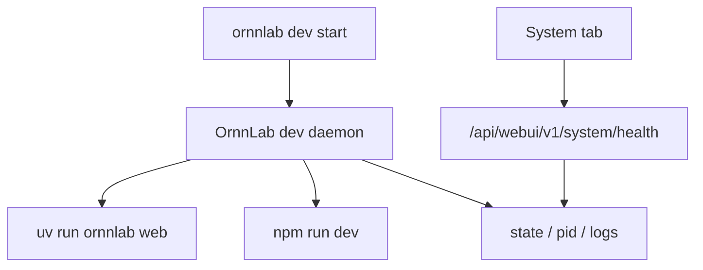

# v1.0.5 应用级守护进程

- 状态：In Progress
- 创建：2026-07-13
- 范围：本地开发态 OrnnLab WebUI 前后端服务守护，不包含系统级开机自启动
- 关联文档：[PRD](../prd.md)、[技术设计](../technical-design.md)、[工程计划](../engineering-plan.md)

## 文档入口

| 文档 | 负责内容 |
|---|---|
| [工程设计](engineering-design.md) | 实施计划、阶段门、完整性矩阵、日志链、测试、回滚与审查标准 |
| 本 README | 产品背景、范围、用户可见入口和状态模型概要 |

## 1. 背景

当前本地联调主要依赖 `run_dev.sh` 和 `ornnlab dev` 前台启动。它们适合一次性调试，但不适合长时间使用 WebUI：终端关闭、父进程异常、后端或前端单独崩溃时，浏览器会保留旧页面，真实请求却开始失败，用户只能看到类似 `The API request could not be completed.` 的兜底错误。

v1.0.5 需要增加应用级守护进程能力，让 OrnnLab 可以主动启动、关闭、重启并观察本地 WebUI 服务状态。该能力只服务当前用户会话和当前 OrnnLab 应用，不做 macOS launchd、systemd、Windows Service 或开机自启动。

## 2. 产品目标

- 用户可以用一个稳定入口启动本地 WebUI 前后端服务。
- 服务异常退出后，由 OrnnLab 应用级守护进程自动拉起。
- 用户可以主动停止守护服务，停止后不会后台自动复活。
- System 页的 `OrnnLab Service` 状态能对应真实守护状态，而不是静态 mock 或前台脚本残留。
- 启动、重启、退出、崩溃、健康检查失败都有日志，便于定位。

## 3. 非目标

- 不做开机自启动、登录自启动或系统服务安装。
- 不修改用户 shell 配置，不写入 LaunchAgents、systemd unit、Windows Service。
- 不替代 Harbor、Docker 或 Hub 的生命周期管理。
- 不在前端失败时静默回退 mock。
- 不把守护进程做成多用户或远程服务。

## 4. 用户可见入口

### 4.1 CLI

建议新增或扩展 `ornnlab dev` 子命令：

| 命令 | 语义 |
|---|---|
| `ornnlab dev start` | 后台启动应用级守护进程；守护进程启动后端和前端 |
| `ornnlab dev stop` | 主动停止守护进程及其前后端子进程 |
| `ornnlab dev restart` | 先 stop，再 start |
| `ornnlab dev status` | 返回守护进程、后端、前端、端口、模式和健康检查结果 |
| `ornnlab dev logs` | 打印或 tail 守护进程、后端、前端日志 |

保留 `run_dev.sh` 作为前台调试入口。前台入口不承担自动重启职责。

### 4.2 WebUI System 页

System 页 `OrnnLab Service` 行应对齐 CLI 能力：

- 状态：`Running`、`Stopped`、`Starting`、`Degraded`、`Restarting`、`Error`
- 值：前端 URL、后端 URL、API 模式、守护 PID
- 路径：日志目录或 pid/state 文件路径
- 操作：`检查更新`、`重启`

当守护进程不可用时，System 页不能假装服务正常；应显示可理解的失败原因，例如“未由守护进程启动”或“后端健康检查失败”。

## 5. 状态模型

| 状态 | 判定 |
|---|---|
| `Stopped` | state 文件不存在，或 pid 不存在，且端口未被 OrnnLab 管理进程占用 |
| `Starting` | 守护进程已启动但前端或后端健康检查未通过 |
| `Running` | 守护进程、后端健康端点、前端 proxy 健康端点均可用 |
| `Degraded` | 守护进程存在，但后端或前端任一健康检查失败，且正在重启 |
| `Restarting` | 用户主动触发 restart，或崩溃后处于退避重启窗口 |
| `Error` | 达到最大连续重启次数，或端口被非 OrnnLab 进程占用，或依赖命令缺失 |

## 6. 技术方案

### 6.1 进程结构



守护进程由 `ornnlab dev start` 启动并脱离当前终端。守护进程负责启动、监控和终止后端与前端两个子进程。后端仍监听 `ORNNLAB_PORT`，前端仍监听 `ORNNLAB_FRONTEND_PORT`，前端 API 模式仍通过 `ORNNLAB_API_TARGET` 指向后端。

### 6.2 状态文件

建议写入当前用户目录，避免污染仓库：

```text
~/.ornnlab/dev-service/state.json
~/.ornnlab/dev-service/daemon.pid
~/.ornnlab/dev-service/backend.pid
~/.ornnlab/dev-service/frontend.pid
~/.ornnlab/dev-service/logs/daemon.log
~/.ornnlab/dev-service/logs/backend.log
~/.ornnlab/dev-service/logs/frontend.log
```

`state.json` 至少包含：

- `daemonPid`
- `backendPid`
- `frontendPid`
- `backendUrl`
- `frontendUrl`
- `dataMode`
- `startedAt`
- `lastHealthCheckAt`
- `lastRestartAt`
- `restartCount`
- `status`
- `lastError`

### 6.3 自动重启策略

- 后端或前端异常退出时，守护进程进入 `Degraded`，记录退出码和最后日志片段。
- 重启使用退避策略：1s、2s、5s、10s、30s，最多连续 5 次。
- 连续失败达到阈值后进入 `Error`，不再自动重启，等待用户 `restart`。
- 用户执行 `stop` 后进入 `Stopped`，不得被守护进程自动拉起。
- 端口被非 OrnnLab 进程占用时进入 `Error`，不得强杀未知进程。

### 6.4 健康检查

守护进程只使用当前产品契约检查健康：

- 后端：`GET /api/webui/v1/system/health`
- 前端 proxy：`GET <frontendUrl>/api/webui/v1/system/health`

不得重新引入旧 `/api/system/status` 或旧产品路由。

### 6.5 日志

守护进程需要记录结构化事件，至少包括：

| 事件 | 字段 |
|---|---|
| `dev_service.start_requested` | port、frontendPort、dataMode |
| `dev_service.started` | daemonPid、backendPid、frontendPid、frontendUrl |
| `dev_service.health_check_failed` | target、status、error |
| `dev_service.child_exited` | child、pid、exitCode、signal |
| `dev_service.restart_scheduled` | child、attempt、delayMs |
| `dev_service.restart_gave_up` | child、attempts、lastError |
| `dev_service.stop_requested` | daemonPid |
| `dev_service.stopped` | reason |

日志用于 System 页、CLI `logs` 和后续用户问题定位。

## 7. 前后端接口影响

现阶段不新增一套并行的 dev-service API，避免 v1.0.5 同时维护多套系统服务接口。直接升级现有 WebUI v1 接口：

| API | 作用 |
|---|---|
| `GET /api/webui/v1/system/health` | `OrnnLab Service` 行从 dev-service state 派生真实状态、URL 和日志目录 |
| `POST /api/webui/v1/system/service/restart` | 在 daemon 启动后端时通过 `ORNNLAB_RESTART_COMMAND` 接入 `ornnlab dev restart` |

这些接口只管理 OrnnLab dev service，不管理 Docker、Harbor Hub 或系统服务。停止服务首版保留在 CLI：`ornnlab dev stop`，避免用户在 WebUI 中停止承载当前页面的后端后无法获得明确反馈。

## 8. 验收标准

- 给定没有服务运行，执行 `ornnlab dev start` 后，`status` 显示守护进程、后端、前端均为 `Running`。
- 给定服务正在运行，杀掉后端子进程后，守护进程自动重启后端，并在日志中记录退出和重启事件。
- 给定服务正在运行，杀掉前端子进程后，守护进程自动重启前端，并恢复 Codex Web Preview 可访问性。
- 给定用户执行 `ornnlab dev stop`，前端、后端和守护进程全部退出，端口释放，且不会自动复活。
- 给定端口被未知进程占用，`start` 失败并进入可诊断错误状态，不强杀未知进程。
- 给定连续重启超过阈值，守护进程停止自动重启并提示用户查看日志。
- System 页的 `OrnnLab Service` 与 `ornnlab dev status` 一致。

## 9. 测试计划

- 单元测试：状态文件读写、PID 存活判断、端口占用判断、退避策略、日志事件格式。
- 集成测试：使用随机端口启动守护进程，验证 start/status/stop/restart。
- 崩溃测试：手动终止后端或前端子进程，验证自动重启和日志。
- 退出清理测试：stop 后端口可重新 bind，健康端点不可达。
- 前端测试：System 页展示 Running/Degraded/Error/Stopped 状态和操作按钮。

## 10. 实施切片

| Slice | 内容 | 退出条件 |
|---|---|---|
| S7-01 | 设计与契约 | 已完成：专题目录、工程设计和接口方向已收敛 |
| S7-02 | daemon 核心 | 已完成：start/status/stop、state、logs、健康检查 |
| S7-03 | 自动重启 | 已完成：子进程退出检测、退避重启、失败日志 |
| S7-04 | WebUI 接入 | 已完成：System health 读取真实守护状态；WebUI 停止服务暂不开放 |
| S7-05 | 回归与审查 | 进行中：首轮 subagent 阻断项已修复并通过全量门禁，待复审 |

## 11. 开放问题

- `ornnlab dev start` 是否默认打开浏览器，还是只打印 URL。
- System 页是否在后续版本开放 `停止服务` 按钮，并设计停止后用户可恢复的反馈方式。
- `logs` 默认打印最近多少行，是否支持 `--follow`。
- 守护进程实现放在 Node 侧还是 Python 侧。产品上无差异，但会影响跨平台进程管理细节。
