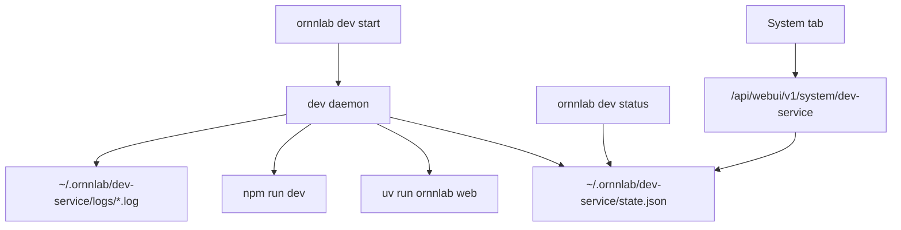

# v1.0.5 应用级守护进程工程设计

- Created: 2026-07-13
- Updated: 2026-07-13
- Version: 0.1
- Status: Draft
- Owner / Responsible: Unknown
- Related Systems: `ornnlab dev`、`run_dev.sh`、`/api/webui/v1/system/*`、System 页、Vite dev server、FastAPI WebUI API
- Related Links: [主题索引](README.md)、[v1.0.5 PRD](../prd.md)、[v1.0.5 技术设计](../technical-design.md)、[v1.0.5 工程计划](../engineering-plan.md)
- Risk Level: Medium
- Plan Type: Standard

## 1. 任务分类

- 类型：Feature Development + DevOps / CI
- 风险等级：Medium
- 原因：该能力会改变本地前后端服务启动、停止、重启和 System 页状态来源，涉及 CLI、后端 API、前端 UI、进程管理、日志和测试门禁；但不涉及生产数据迁移、远程服务、鉴权边界或系统级服务安装。

## 2. 背景

当前全栈联调依赖 `run_dev.sh` 或前台 `ornnlab dev`。它们适合调试，但不适合长时间使用 WebUI。终端关闭或前后端任一子进程异常退出后，浏览器页面仍停留在旧状态，真实 API 请求会失败，用户只能看到统一兜底错误。

v1.0.5 需要应用级守护进程：用户主动启动后，OrnnLab 在当前用户会话内后台管理前端和后端进程；用户主动停止后，服务必须停止且不能自动复活。该能力不安装系统服务，不做开机或登录自启动。

## 3. 问题定义

| 项 | 内容 |
|---|---|
| 当前行为 | 本地服务依赖前台终端；服务掉线后 System 页和浏览器状态不能准确说明根因 |
| 期望行为 | OrnnLab 提供应用级服务管理入口，能启动、停止、重启、查看状态和日志，并能在非用户主动停止的崩溃场景自动恢复 |
| 差距 | 缺少 daemon 生命周期、状态文件、崩溃重启、真实 System 状态 API、前端操作和对应测试 |
| 受影响模块 | CLI / npm launcher、WebUI system API、System 页、测试脚本、文档 |
| 用户影响 | 减少本地联调服务掉线后的排查成本，避免把服务不可用误判为 Harbor 或数据错误 |

## 4. 目标与收益

| 目标 | 可验证收益 | 验证方式 |
|---|---|---|
| 应用级后台启动 | 用户不需要保持终端打开即可访问 WebUI | `ornnlab dev start` 后关闭启动终端，`status` 和健康端点仍可用 |
| 主动停止 | 用户能明确停止服务且端口释放 | `ornnlab dev stop` 后 5173/8765 不再监听，服务不自动复活 |
| 崩溃重启 | 后端或前端单独崩溃后自动恢复 | 杀掉子进程后守护进程重启对应服务，System 页恢复 Running |
| 真实状态展示 | System 页能区分 Running、Stopped、Degraded、Error | 通过模拟各状态验证 UI 文案、操作和 API 返回一致 |
| 可诊断日志 | 操作者能知道服务在哪个环节失败 | 日志包含 start、health、child exit、restart、give up、stop 事件 |

## 5. 非目标

- 不做 macOS launchd、Linux systemd、Windows Service。
- 不做开机自启动或登录自启动。
- 不强杀非 OrnnLab 管理的端口占用进程。
- 不管理 Docker daemon、Harbor Hub 或 Harbor registry 服务生命周期。
- 不在 API 失败时回退 mock。
- 不把 `run_dev.sh` 改成唯一正式守护入口；它保留为前台调试脚本。

## 6. 约束与假设

| 类型 | 内容 | 验证方式 | 如果不成立 |
|---|---|---|---|
| 约束 | 只能做应用级守护，不能做系统级自启动 | PRD 与主题 README | 调整范围，不进入 launchd/systemd |
| 约束 | 前端 API 模式仍只访问 `/api/webui/v1` | 前端 API client 与 Vite proxy 测试 | 阻断进入实现 |
| 约束 | 状态和日志不能包含 token、API key 或用户密钥 | code review 与日志测试 | 阻断合并 |
| 假设 | 当前 `ornnlab dev` Node launcher 是跨平台入口 | 检查 `bin/ornnlab.js` 与 `lib/dev.js` | 若不成立，Phase 0 改为选择 Python/Node 实现 |
| 假设 | 当前用户目录 `~/.ornnlab` 可写 | 启动前检查 | 不可写则进入 Error 并显示原因 |

## 7. 依赖

| Dependency | Type | Current Status | Blocking Risk | Handling Plan |
|---|---|---|---|---|
| `uv run ornnlab web` | system | Ready | 后端无法启动则 daemon 无法 Running | Phase 1 启动前依赖检查 |
| `npm run dev` | system | Ready | 前端无法启动则 proxy 不可用 | Phase 1 启动前依赖检查 |
| `/api/webui/v1/system/health` | API | Ready | 健康判断无可信来源 | 只使用该端点，不引入旧 API |
| 跨平台进程终止 | environment | Partial | Windows/macOS/Linux 子进程收敛不一致 | 复用现有 launcher 跨平台进程管理经验，并增加随机端口集成测试 |
| System 页 | UI | Ready | 状态展示可能继续使用旧 mock 语义 | Phase 3 统一接入真实 dev service DTO |

## 8. 当前状态

- `run_dev.sh` 可以前台启动 FastAPI 和 Vite，并在退出时收敛子进程。
- `ornnlab dev` 已作为发布入口存在，当前语义是前台服务启动器，不是应用级守护进程。
- System 页已有 `OrnnLab Service` 行，但状态还未绑定应用级 daemon state。
- 文档已明确不做系统级自启动。

## 9. 总体技术设计

### 9.1 进程模型



### 9.2 状态目录

```text
~/.ornnlab/dev-service/
  daemon.pid
  backend.pid
  frontend.pid
  state.json
  logs/
    daemon.log
    backend.log
    frontend.log
```

### 9.3 CLI 契约

| 命令 | 预期行为 |
|---|---|
| `ornnlab dev start` | 如果未运行，后台启动 daemon；如果已运行，返回当前状态，不重复启动 |
| `ornnlab dev stop` | 停止 daemon、后端、前端，释放端口，写入 stopped 状态 |
| `ornnlab dev restart` | 执行 stop 后 start，保留日志连续性 |
| `ornnlab dev status` | 读取 state + pid + health check，输出机器可读和人类可读状态 |
| `ornnlab dev logs` | 输出 daemon/backend/frontend 日志，支持后续扩展 `--follow` |

### 9.4 API 契约草案

| API | 行为 |
|---|---|
| `GET /api/webui/v1/system/dev-service` | 返回 daemon 状态、URL、PID、日志路径、最近错误 |
| `POST /api/webui/v1/system/dev-service/restart` | 请求应用级服务重启，返回 Operation |
| `POST /api/webui/v1/system/dev-service/stop` | 请求应用级服务停止，返回 Operation 或明确错误 |

## 10. 阶段总览

| Phase | Independent Verification | Forbidden Future Dependency | Exit Evidence | Completion Required Before Next Phase | Proceed Decision |
|---|---|---|---|---|---|
| Phase 0 | 现状 inventory、接口确认、实现侧选择记录 | 不能靠后续实现来补范围定义 | 设计审查通过，无阻断 open question | 100% complete | pause until reviewed |
| Phase 1 | CLI start/status/stop 集成测试 | 不依赖 System 页 | 随机端口启动、状态读取、停止释放端口通过 | 100% complete | pause |
| Phase 2 | 崩溃重启和日志测试 | 不依赖前端 UI | kill 子进程后自动恢复，失败阈值可验证 | 100% complete | pause |
| Phase 3 | System API + UI 测试和 Storybook | 不依赖真实崩溃测试 | Running/Stopped/Degraded/Error UI 状态可验证 | 100% complete | pause |
| Phase 4 | 全量门禁、Codex Web Preview、对抗性审查 | 不依赖后续清理 | 测试、手动验收、审查无阻断 | 100% complete | proceed only after approval |

## 11. 分阶段执行计划

### Phase 0: 现状确认与接口冻结

#### Objective

确认实现位置、命令契约、状态文件路径、API 草案和测试边界，避免实现阶段反复改入口。

#### Entry Criteria

- 主题 README 和本文档存在。
- PRD 已明确“不做系统级开机自启动”。

#### Entry Criteria Checks

| Entry Criterion | Check Method | Evidence / Output | Owner |
|---|---|---|---|
| 文档范围明确 | 读取 PRD 与 README | 链接指向 dev-daemon 主题目录 | Unknown |
| 当前启动器清楚 | 检查 `run_dev.sh`、`bin/ornnlab.js`、`lib/dev.js` | inventory 记录 | Unknown |

#### Design Approach

优先复用现有 `ornnlab dev` 跨平台启动入口；`run_dev.sh` 保持前台调试，不承担后台重启。Phase 0 只冻结接口和边界，不写生产代码。

#### Implementation Tasks

- 读取当前 launcher、system API、System 页状态来源。
- 确认 daemon 状态 JSON schema。
- 确认 CLI 输出格式和 exit code。
- 确认 `GET /system/dev-service` DTO。

#### Deliverables

- 更新后的工程设计。
- 状态 schema 草案。
- 测试清单。

#### Implementation Completeness Evidence

| Plan Item | Production Code Path | Integration Entry | Test Evidence | Runtime / Log Evidence | Mock / Stub Exposure | Status |
|---|---|---|---|---|---|---|
| 接口冻结 | docs only | docs | 文档治理测试 | none | none | planned |

#### Logging And Observability Design

| Change Link | Key State | Success Signal | Failure Signal | Failure Reason Field | Correlation / Trace Field | Log Level | Consumer |
|---|---|---|---|---|---|---|---|
| plan | reviewed | plan approved | blocker found | reason | doc_path | info | maintainer |

#### Testing And Validation

| Validation Type | Validation Item | Method | Passing Standard |
|---|---|---|---|
| Correctness | 文档清单 | `test_rebrand_verification.py` | v1.0.5 文档清单包含主题文档 |
| Correctness | 链接 | `rg` 检查旧路径 | 无断链和旧路径 |

#### Exit Criteria

- CLI、API、状态文件和日志事件命名无阻断问题。
- 用户确认可以进入实现。

#### Review Plan

- 执行一次对抗性审查，重点查是否误引入系统级服务、自启动或旧 API。

#### Risks And Fallback

| Risk | Impact | Trigger Signal | Mitigation | Fallback |
|---|---|---|---|---|
| 范围扩大到系统服务 | 高 | 文档或实现出现 launchd/systemd | 阶段门禁止 | 回退到应用级 daemon |

#### Gate To Next Phase

| Gate Condition | Verification Evidence | Completion Status | User Approval Required | Proceed Decision |
|---|---|---|---|---|
| 范围和接口冻结 | 审查记录和文档链接 | incomplete | yes | pause |

### Phase 1: Daemon 生命周期核心

#### Objective

实现 `start/status/stop`，证明后台服务可以启动、状态可读、停止后端口释放。

#### Entry Criteria

- Phase 0 完成。
- 状态 schema 和日志目录确认。

#### Entry Criteria Checks

| Entry Criterion | Check Method | Evidence / Output | Owner |
|---|---|---|---|
| daemon 路径可写 | 启动前写入测试 | 成功或明确 Error | Unknown |
| 端口可用 | 端口探测 | 未被非 OrnnLab 进程占用 | Unknown |

#### Design Approach

`ornnlab dev start` 派生 detached daemon。daemon 启动 backend 与 frontend，写入 pid/state/log。`status` 不信任单一 state 文件，必须结合 pid 存活和健康检查。`stop` 通过 daemon pid 或 state 中子 pid 收敛进程树。

#### Implementation Tasks

- 增加 CLI 子命令解析。
- 增加 state 读写模块。
- 增加进程树启动和停止模块。
- 增加健康检查模块。
- 增加随机端口集成测试。

#### Deliverables

- CLI 生命周期生产代码。
- state/log 文件。
- launcher 集成测试。

#### Implementation Completeness Evidence

| Plan Item | Production Code Path | Integration Entry | Test Evidence | Runtime / Log Evidence | Mock / Stub Exposure | Status |
|---|---|---|---|---|---|---|
| start | `bin/ornnlab.js` / `lib/dev*.js` | `ornnlab dev start` | 随机端口 start test | `dev_service.started` | none | planned |
| status | `lib/dev*.js` | `ornnlab dev status` | status test | `dev_service.status_checked` | none | planned |
| stop | `lib/dev*.js` | `ornnlab dev stop` | 端口释放 test | `dev_service.stopped` | none | planned |

#### Logging And Observability Design

| Change Link | Key State | Success Signal | Failure Signal | Failure Reason Field | Correlation / Trace Field | Log Level | Consumer |
|---|---|---|---|---|---|---|---|
| start request | started | daemon pid written | dependency missing | reason | service_id | info/error | user |
| backend start | healthy | health endpoint 200 | health timeout | error_code | service_id | info/error | user |
| frontend start | healthy | proxy health 200 | vite failed | error_code | service_id | info/error | user |
| stop | stopped | ports released | process still alive | pid | service_id | info/warn | user |

#### Testing And Validation

| Validation Type | Validation Item | Method | Passing Standard |
|---|---|---|---|
| Correctness | start/status/stop | shell integration with random ports | commands exit 0 and state matches |
| Correctness | port release | bind same ports after stop | bind succeeds |
| Observability | logs | inspect daemon log | required events present |
| Benefit | terminal independence | start then parent shell exits | service remains healthy |

#### Exit Criteria

- `start/status/stop` 均通过随机端口测试。
- stop 后端口释放。
- 日志事件可定位失败阶段。

#### Review Plan

- Code review 重点查 detached 进程、PID stale、端口占用和跨平台路径。

#### Risks And Fallback

| Risk | Impact | Trigger Signal | Mitigation | Fallback |
|---|---|---|---|---|
| stale PID 导致误判 Running | 中 | pid 不存在但 state 仍 Running | status 合并 pid + health | 清理 state 并返回 Stopped |
| stop 杀错进程 | 高 | pid 被复用 | state 记录命令和 start time | 拒绝停止并提示用户 |

#### Gate To Next Phase

| Gate Condition | Verification Evidence | Completion Status | User Approval Required | Proceed Decision |
|---|---|---|---|---|
| 生命周期核心可用 | CLI 集成测试和日志 | incomplete | no | pause |

### Phase 2: 崩溃重启与错误收敛

#### Objective

实现后端/前端异常退出自动重启、退避、最大失败阈值和未知端口保护。

#### Entry Criteria

- Phase 1 完成。
- daemon 已能持续监控子进程。

#### Entry Criteria Checks

| Entry Criterion | Check Method | Evidence / Output | Owner |
|---|---|---|---|
| 子进程可识别 | state 中有 backend/frontend pid | pid 对应进程存在 | Unknown |
| 健康检查可靠 | backend/proxy endpoint 可请求 | 200 或明确错误 | Unknown |

#### Design Approach

daemon 监控子进程退出和健康检查失败。非用户 stop 的退出触发退避重启。连续失败达到阈值后进入 Error 并停止自动重启。端口被未知进程占用时拒绝强杀。

#### Implementation Tasks

- 增加 child exit watcher。
- 增加 restart backoff。
- 增加 failure threshold。
- 增加 unknown port owner 检测。
- 增加 kill-child 自动恢复测试。

#### Deliverables

- 自动重启逻辑。
- Error/Degraded 状态。
- 崩溃测试。

#### Implementation Completeness Evidence

| Plan Item | Production Code Path | Integration Entry | Test Evidence | Runtime / Log Evidence | Mock / Stub Exposure | Status |
|---|---|---|---|---|---|---|
| child watcher | daemon runtime | process monitor | kill backend/frontend test | `dev_service.child_exited` | none | planned |
| restart backoff | daemon runtime | process monitor | retry timing test | `dev_service.restart_scheduled` | none | planned |
| give up | daemon runtime | process monitor | forced failure test | `dev_service.restart_gave_up` | none | planned |

#### Logging And Observability Design

| Change Link | Key State | Success Signal | Failure Signal | Failure Reason Field | Correlation / Trace Field | Log Level | Consumer |
|---|---|---|---|---|---|---|---|
| child monitor | exited | exit observed | pid unknown | reason | service_id, child | warn | user |
| restart | scheduled | child healthy again | restart failed | error_code | service_id, attempt | info/error | user |
| threshold | gave_up | Error state written | none | last_error | service_id | error | user |

#### Testing And Validation

| Validation Type | Validation Item | Method | Passing Standard |
|---|---|---|---|
| Correctness | backend crash recovery | kill backend pid | backend health returns 200 after restart |
| Correctness | frontend crash recovery | kill frontend pid | frontend proxy health returns 200 after restart |
| Correctness | give up | force invalid command | status becomes Error and no infinite loop |
| Observability | failure reason | inspect state/log | reason field present |
| Benefit | recovery toil | manual restart not required | one kill scenario self-recovers |

#### Exit Criteria

- backend/frontend kill tests pass.
- give-up path test pass.
- Unknown port owner not killed.

#### Review Plan

- 对抗性审查重点查“自动重启是否可能违背用户 stop 意图”和“是否可能杀错进程”。

#### Risks And Fallback

| Risk | Impact | Trigger Signal | Mitigation | Fallback |
|---|---|---|---|---|
| stop 后自动复活 | 高 | stop 后又出现子进程 | stop 写入 desiredState=stopped | 手动 kill daemon 并清理 state |
| 重启风暴 | 中 | restart count 快速增加 | backoff + max attempts | 进入 Error |

#### Gate To Next Phase

| Gate Condition | Verification Evidence | Completion Status | User Approval Required | Proceed Decision |
|---|---|---|---|---|
| 崩溃恢复可信 | kill/restart/give-up tests | incomplete | no | pause |

### Phase 3: System API 与前端接入

#### Objective

让 System 页展示真实应用级 dev service 状态，并提供重启/停止操作。

#### Entry Criteria

- Phase 2 完成。
- dev service 状态 DTO 已稳定。

#### Entry Criteria Checks

| Entry Criterion | Check Method | Evidence / Output | Owner |
|---|---|---|---|
| DTO 字段稳定 | contract review | 字段列表冻结 | Unknown |
| mock 对等 | mock client 有同 DTO 状态 | MSW/storybook 覆盖 | Unknown |

#### Design Approach

后端 System API 从 state 文件和健康检查读取真实状态。前端 System 页通过同一个 `WebUiClient` 访问，不直接读取浏览器状态。Storybook 覆盖 Running/Stopped/Degraded/Error。

#### Implementation Tasks

- 增加 `DevServiceDto`。
- 增加 `/system/dev-service` 读接口。
- 增加 restart/stop 操作接口。
- System 页接入状态和操作。
- Storybook 增加状态 story。

#### Deliverables

- API + frontend + mock/MSW 对等实现。
- System 页可视状态。
- Storybook 约束。

#### Implementation Completeness Evidence

| Plan Item | Production Code Path | Integration Entry | Test Evidence | Runtime / Log Evidence | Mock / Stub Exposure | Status |
|---|---|---|---|---|---|---|
| status API | `ornnlab/api/webui.py` + service | `GET /system/dev-service` | API test | request log | mock mirrors API | planned |
| restart/stop API | system service | `POST /system/dev-service/*` | operation test | operation log | mock mirrors API | planned |
| System UI | `frontend/src/screens` | System tab | frontend test + Storybook | browser/manual evidence | Storybook states | planned |

#### Logging And Observability Design

| Change Link | Key State | Success Signal | Failure Signal | Failure Reason Field | Correlation / Trace Field | Log Level | Consumer |
|---|---|---|---|---|---|---|---|
| API read | status_returned | DTO emitted | state unreadable | error_code | request_id | info/warn | UI |
| restart action | operation_started | restart op completed | restart failed | error_code | request_id, operation_id | info/error | UI |
| stop action | operation_started | stop op completed | stop failed | error_code | request_id, operation_id | info/error | UI |

#### Testing And Validation

| Validation Type | Validation Item | Method | Passing Standard |
|---|---|---|---|
| Correctness | API DTO | backend test | all states map correctly |
| Correctness | UI states | frontend test | labels/actions match state |
| Correctness | Storybook | storybook build/test | all state stories render |
| Observability | operation logs | inspect logs | operation id links user action |
| Benefit | user clarity | manual Codex Web Preview | stopped/degraded not shown as healthy |

#### Exit Criteria

- API tests pass.
- frontend tests and Storybook pass.
- System 页在 Codex Web Preview 中可见状态准确。

#### Review Plan

- 前端治理审查：确认没有直接 fetch、没有 mock fallback、组件有 Storybook。

#### Risks And Fallback

| Risk | Impact | Trigger Signal | Mitigation | Fallback |
|---|---|---|---|---|
| UI 显示 Running 但服务不可用 | 高 | proxy health fail | DTO 以健康检查为准 | 显示 Degraded/Error |
| stop 从 WebUI 触发后页面失联 | 中 | stop 成功后 API 不可达 | UI 预先展示停止中说明 | 用户用 CLI start 恢复 |

#### Gate To Next Phase

| Gate Condition | Verification Evidence | Completion Status | User Approval Required | Proceed Decision |
|---|---|---|---|---|
| System 页对齐 daemon | API/frontend/storybook/Codex Preview | incomplete | no | pause |

### Phase 4: 全量验证、发布与回滚

#### Objective

证明应用级守护进程可进入 v1.0.5 主线，并保留前台 `run_dev.sh` 作为可回退路径。

#### Entry Criteria

- Phase 1-3 均完成。
- 无 P0/P1 阻断审查问题。

#### Entry Criteria Checks

| Entry Criterion | Check Method | Evidence / Output | Owner |
|---|---|---|---|
| 全量测试可跑 | 本地门禁 | test log | Unknown |
| 回滚路径存在 | `run_dev.sh` 仍可用 | launcher test | Unknown |

#### Design Approach

发布前把 daemon 纳入全量门禁和文档。若 daemon 出现阻断问题，回退到前台启动路径，System 页隐藏或标记应用级守护不可用，不影响 API 主线能力。

#### Implementation Tasks

- 跑 `scripts/test-after-change-web.sh`。
- 跑 daemon 专项集成测试。
- Codex Web Preview 验收 System 页。
- 执行对抗性审查。
- 更新工程计划状态。

#### Deliverables

- 质量门证据。
- 审查记录。
- 更新后的工程计划。

#### Implementation Completeness Evidence

| Plan Item | Production Code Path | Integration Entry | Test Evidence | Runtime / Log Evidence | Mock / Stub Exposure | Status |
|---|---|---|---|---|---|---|
| full gate | repo scripts | CI/local | full gate log | runtime logs | none | planned |
| rollback | `run_dev.sh` | shell | run-dev test | run_dev logs | none | planned |

#### Logging And Observability Design

| Change Link | Key State | Success Signal | Failure Signal | Failure Reason Field | Correlation / Trace Field | Log Level | Consumer |
|---|---|---|---|---|---|---|---|
| release validation | validated | all gates passed | gate failed | failed_gate | commit_sha | info/error | maintainer |
| rollback | fallback_ready | run_dev works | fallback failed | reason | commit_sha | info/error | maintainer |

#### Testing And Validation

| Validation Type | Validation Item | Method | Passing Standard |
|---|---|---|---|
| Correctness | full regression | `scripts/test-after-change-web.sh` | all pass |
| Correctness | daemon regression | daemon integration script | all pass |
| Observability | logs | inspect event sequence | all key states visible |
| Benefit | reduced manual recovery | kill child process in manual smoke | service recovers without manual restart |
| Review | adversarial review | Codex/subagent review | no blockers |

#### Exit Criteria

- Full gate pass.
- Codex Web Preview pass.
- 对抗性审查无阻断项。
- 工程计划 Stage 7 对应项更新。

#### Review Plan

- 对抗性审查重点：
  - 是否误做系统级自启动。
  - 是否可能杀错非 OrnnLab 进程。
  - stop 后是否可能自动复活。
  - System 页是否有 mock/fake 状态。
  - 日志是否泄露敏感信息。

#### Risks And Fallback

| Risk | Impact | Trigger Signal | Mitigation | Fallback |
|---|---|---|---|---|
| daemon 发布后不稳定 | 中 | 重启失败或端口残留 | 保留 `run_dev.sh` | 禁用 daemon 入口，回退前台启动 |
| WebUI stop 导致用户无法恢复 | 中 | 用户停止后不知道怎么启动 | stop 确认中提示 CLI start | 文档和 toast 指引 |

#### Gate To Next Phase

| Gate Condition | Verification Evidence | Completion Status | User Approval Required | Proceed Decision |
|---|---|---|---|---|
| Stage 7 可关闭 | full gate + preview + review | incomplete | yes | pause |

## 12. 实施完整性矩阵

| Plan Item | Expected Behavior | Production Code Path | Integration Entry | Test Evidence | Runtime / Log Evidence | Mock / Stub Exposure | Status |
|---|---|---|---|---|---|---|---|
| CLI start | 后台启动 dev service | `bin/ornnlab.js`、`lib/dev*.js` | `ornnlab dev start` | launcher integration | `dev_service.started` | none | planned |
| CLI stop | 主动停止且不复活 | `lib/dev*.js` | `ornnlab dev stop` | port release test | `dev_service.stopped` | none | planned |
| CLI status | 显示真实 daemon/health 状态 | `lib/dev*.js` | `ornnlab dev status` | status test | `dev_service.status_checked` | none | planned |
| 自动重启 | 非用户停止的崩溃自动恢复 | daemon runtime | child monitor | kill-child test | `dev_service.restart_scheduled` | none | planned |
| System API | 后端返回真实 dev service 状态 | `ornnlab/api/webui.py`、system service | `/api/webui/v1/system/dev-service` | API test | request/operation log | mock mirrors contract | planned |
| System UI | 展示状态和操作 | frontend screens/components | System tab | frontend + Storybook | Codex Preview evidence | Storybook states | planned |

## 13. 风险、依赖与缓解

| Risk | Probability | Impact | Trigger Signal | Mitigation | Fallback |
|---|---:|---:|---|---|---|
| PID stale 或复用 | Medium | High | status 指向错误进程 | 记录 start time、command、端口 owner | 返回 Error，要求用户处理 |
| 跨平台进程树清理失败 | Medium | High | stop 后端口仍占用 | 复用现有跨平台测试经验 | 保留 run_dev 前台路径 |
| 自动重启掩盖真实错误 | Medium | Medium | restart count 增长 | 最大重试阈值 + Error 状态 | 停止自动重启 |
| 日志泄露环境变量 | Low | High | log 中出现 API key | 日志脱敏和 review | 阻断发布 |
| System 页状态滞后 | Medium | Medium | UI 与 CLI status 不一致 | 统一 API 状态源 | UI 展示 unknown/degraded |

## 14. 测试与验证策略

| Validation Type | Test Type | Scope | Execution Method | Passing Standard |
|---|---|---|---|---|
| Correctness | Unit | state、PID、backoff、日志格式 | Node/Python 单测 | targeted logic pass |
| Correctness | Integration | CLI start/status/stop | 随机端口脚本 | 端口健康和释放符合预期 |
| Correctness | Failure-mode | kill backend/frontend | 集成脚本 | 自动恢复或进入 Error |
| Correctness | API | system dev service endpoints | pytest | ApiResponse 和状态映射正确 |
| Correctness | Frontend | System 页 | Vitest + Storybook | 各状态 UI 正确 |
| Benefit | Manual smoke | Codex Web Preview | 手动杀子进程观察恢复 | 用户无需手动重启 |
| Security | Log review | daemon/backend/frontend logs | 测试和审查 | 不泄露 secrets |

## 15. 发布、回滚与降级

### Release Strategy

- Release method: 随 v1.0.5 主线提交进入本地包。
- Canary scope: 本地开发环境，不做远程生产流量。
- Expansion criteria: 本地全量门禁、Codex Web Preview、对抗性审查均无阻断。
- Pause criteria: stop 后自动复活、杀错进程、端口无法释放、日志泄露敏感信息。
- Owner: Unknown。
- Release window: Unknown。

### Rollback Strategy

- Rollbackable changes: CLI daemon 入口、System 页 daemon 状态、API endpoints。
- Non-directly rollbackable changes: 无数据迁移；state/log 文件可安全遗留或清理。
- Rollback triggers: P0/P1 进程管理错误、无法 stop、影响 `run_dev.sh`。
- Rollback steps: 禁用 daemon 子命令或隐藏 System 操作，保留 `run_dev.sh`。
- Rollback validation: `run_dev.sh` 仍能启动 API 模式并通过健康检查。
- Owner: Unknown。

### Fallback / Degradation Strategy

- Degradable capability: 应用级守护进程。
- Trigger: daemon 状态 Error 或不可用。
- User-visible impact: System 页提示守护不可用，用户可用前台 `run_dev.sh` 或普通 `ornnlab dev`。
- System behavior while degraded: 不回退 mock，不伪造 Running。
- Recovery steps: 用户执行 `ornnlab dev restart` 或前台启动。

## 16. 可观测性与收益指标

| Metric | Current Baseline | Target | Alert Threshold | Observation Window |
|---|---:|---:|---:|---|
| dev service crash recovery success | Unknown | backend/frontend 单次 kill 后自动恢复 | 连续 5 次失败 | 单次本地 smoke |
| stop port release success | Unknown | stop 后端口 100% 可重新 bind | 任一端口残留 | 每次 integration test |
| manual restart toil | 需要用户手动重启 | 常见子进程崩溃无需手动重启 | 用户仍需手动恢复 | Codex Preview smoke |
| state accuracy | Unknown | CLI status 与 System 页一致 | 任一状态不一致 | 每次 frontend/API test |

## 17. 变更链日志矩阵

| Change Link | Key State | Success Signal | Failure Signal | Failure Reason Field | Correlation / Trace Field | Log Level | Consumer |
|---|---|---|---|---|---|---|---|
| CLI request | requested | command accepted | invalid command/state | reason | service_id | info/error | user |
| daemon bootstrap | starting | pid/state created | dependency missing | error_code | service_id | info/error | user |
| backend lifecycle | healthy | health 200 | exit/timeout | exit_code/error_code | service_id, child | info/warn/error | user |
| frontend lifecycle | healthy | proxy health 200 | exit/timeout | exit_code/error_code | service_id, child | info/warn/error | user |
| restart loop | restarting | child healthy | max attempts reached | last_error | service_id, attempt | info/error | user |
| System API | status_returned | DTO returned | state unreadable | error_code | request_id | info/warn | UI |
| stop | stopped | ports released | pid remains | pid/reason | service_id | info/warn/error | user |

## 18. 开放问题

- `ornnlab dev logs` 首版是否必须支持 `--follow`。
- `ornnlab dev start` 是否自动打开浏览器。
- System 页是否首版就暴露 `停止服务`，还是先仅暴露 `重启`。
- daemon 实现最终放在 Node 侧还是 Python 侧；当前倾向 Node 侧，因为 `ornnlab dev` 发布入口已在 Node。

## 19. 变更记录

| 日期 | 版本 | 变更 |
|---|---|---|
| 2026-07-13 | 0.1 | 初版工程设计，补齐阶段门、日志链、验证、回滚和完整性矩阵 |

## 20. 计划质量检查

- [x] 问题定义清晰。
- [x] 目标包含收益和验证方式。
- [x] 非目标明确排除系统级自启动。
- [x] 阶段可独立验证。
- [x] 每阶段包含门禁和暂停条件。
- [x] 包含生产路径完整性矩阵。
- [x] 包含变更链日志设计。
- [x] 包含回滚和降级策略。
- [x] 不把 mock、scaffold 或协议当作完成证据。
