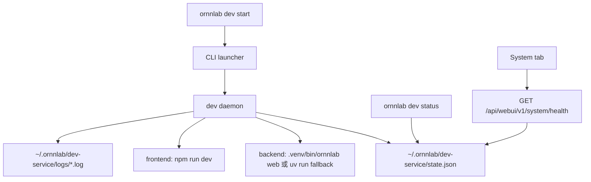
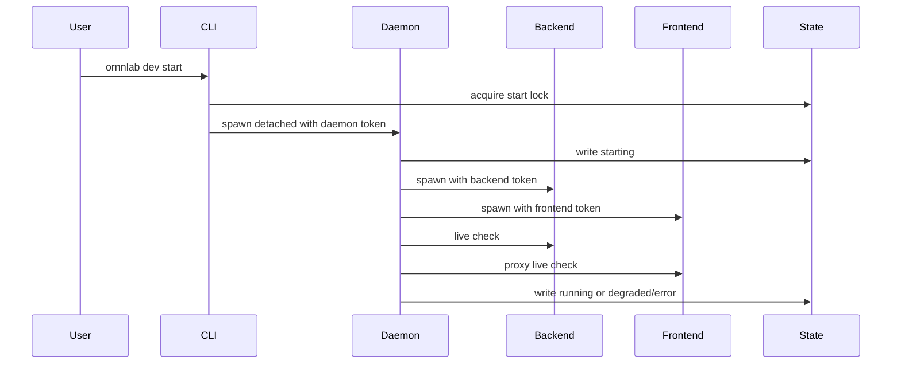

# v1.0.5 应用级守护进程实现设计

- Created: 2026-07-13
- Updated: 2026-07-13
- Version: 0.1
- Status: Completed
- Owner / Responsible: Unknown
- Related Systems: `ornnlab dev`、`lib/dev-daemon.js`、`/api/webui/v1/system/live`、`/api/webui/v1/system/health`、System 页、Vite dev server、FastAPI WebUI API
- Related Links: [主题入口](README.md)、[工程计划](engineering-design.md)、[v1.0.5 PRD](../prd.md)
- Risk Level: Medium
- Plan Type: Standard

## 1. 设计目标

应用级守护进程用于管理本地开发态 OrnnLab WebUI 前后端服务。它只在用户主动启动后运行，只服务当前用户会话，不安装系统服务，不做开机自启动。

核心目标：

- 用户通过 `ornnlab dev start` 后，可以稳定访问 WebUI。
- 前端或后端非主动退出时，守护进程能自动拉起。
- 用户通过 `ornnlab dev stop` 后，daemon、backend、frontend 都必须停止，且不能自动复活。
- `ornnlab dev status` 和 System 页必须基于同一份真实状态，不允许静态 mock 或只看 state 文件。
- 日志必须能说明启动、健康检查、重启、停止、失败原因，并避免泄露密钥。

## 2. 非目标

- 不做 macOS `launchd`、Linux `systemd`、Windows Service。
- 不做登录自启动或开机自启动。
- 不管理 Docker、Harbor Hub、Harbor registry 生命周期。
- 不强杀非 OrnnLab 管理的未知进程。
- 不在前端 API 失败时回退 mock。
- 不新增一套并行旧接口；直接使用 WebUI v1 System API。

## 3. 进程拓扑



职责边界：

| 组件 | 职责 | 不负责 |
|---|---|---|
| CLI launcher | 解析 `start/stop/restart/status/logs`，派生 daemon，读取状态 | 长驻监控 |
| daemon | 启动、监控、重启、停止 backend/frontend，写 state/log | UI 渲染、Harbor 业务逻辑 |
| backend System API | 将 daemon state 转成 System 页可展示 DTO | 直接启动或停止子进程 |
| System 页 | 展示真实状态、触发重启 | 自行推断进程健康 |

## 4. 状态目录与权限

状态目录固定在当前用户目录：

```text
~/.ornnlab/dev-service/
  state.json
  daemon.pid
  backend.pid
  frontend.pid
  logs/
    daemon.log
    backend.log
    frontend.log
```

权限要求：

| 路径 | 权限 | 原因 |
|---|---|---|
| `~/.ornnlab/dev-service` | `0700` | 目录中有 PID、URL、日志路径 |
| `state.json` | `0600` | state 中包含运行命令、路径和 token 指纹 |
| `*.pid` | `0600` | 防止其他用户误读本地进程信息 |
| `logs/*.log` | `0600` | 日志可能包含后端或前端输出，必须默认私有 |

如果已有日志文件权限更宽，daemon 启动时必须主动 `chmod 0600`。

## 5. State Schema

`state.json` 是 CLI、daemon、System API 的共享事实源，但不能单独作为 Running 依据。任何 Running/Degraded 判断都必须结合 PID 身份校验和健康检查。

```json
{
  "schemaVersion": 1,
  "status": "running",
  "reason": null,
  "startedAt": "2026-07-13T10:00:00.000Z",
  "updatedAt": "2026-07-13T10:00:05.000Z",
  "frontendUrl": "http://127.0.0.1:5173",
  "backendUrl": "http://127.0.0.1:8765",
  "dataMode": "live",
  "daemon": {
    "pid": 12345,
    "token": "random-process-token",
    "command": "ornnlab dev _daemon"
  },
  "backend": {
    "pid": 12346,
    "token": "random-child-token",
    "restartAttempts": 0,
    "lastExit": null
  },
  "frontend": {
    "pid": 12347,
    "token": "random-child-token",
    "restartAttempts": 0,
    "lastExit": null
  },
  "logs": {
    "daemon": "~/.ornnlab/dev-service/logs/daemon.log",
    "backend": "~/.ornnlab/dev-service/logs/backend.log",
    "frontend": "~/.ornnlab/dev-service/logs/frontend.log"
  },
  "lastHealthCheck": {
    "backend": "ok",
    "frontend": "ok",
    "checkedAt": "2026-07-13T10:00:05.000Z"
  }
}
```

状态枚举：

| 状态 | 含义 |
|---|---|
| `stopped` | daemon 不存在，或用户主动停止完成 |
| `starting` | daemon 存在，但 backend/frontend 尚未全部健康 |
| `running` | daemon、backend、frontend 均通过身份校验和健康检查 |
| `degraded` | daemon 存在，但 backend/frontend 任一不可用，且尚未达到失败阈值 |
| `restarting` | 用户触发 restart，或 daemon 正在退避重启子进程 |
| `error` | 达到最大重启次数、端口冲突、依赖缺失或状态不可信 |

## 6. 进程身份校验

不能只用 PID 判断进程归属，因为 PID 可能复用。每个 daemon 和 child wrapper 都必须带随机 token。macOS 下 `ps` 不能稳定读取子进程环境变量，因此当前实现不依赖 env token 做身份判断，而是让 daemon 子命令和 child wrapper 的命令行携带随机 token，并通过进程命令行校验。

启动时：

- daemon 启动参数：`ornnlab dev _daemon --token <random>`
- backend wrapper 启动参数：`node lib/dev-child-wrapper.js --token <random> --role backend -- <backend command>`
- frontend wrapper 启动参数：`node lib/dev-child-wrapper.js --token <random> --role frontend -- <frontend command>`
- token 写入 `state.json`

校验时：

| 校验项 | 规则 |
|---|---|
| PID 存活 | 进程存在只是必要条件，不是充分条件 |
| token 匹配 | 必须能从受管进程命令行中读到匹配 token |
| command 辅助校验 | command 只能辅助诊断，不能替代 token |
| token 不可读 | fail closed：视为身份不可信，不执行强杀 |

停止策略：

1. 读取 state。
2. 对 daemon、backend、frontend 分别执行身份校验。
3. 只停止身份可信的进程。
4. 对身份不可信但端口占用的进程，返回错误并提示用户人工处理，不强杀。

## 7. 生命周期

### 7.1 Start



Start 必须满足：

- 已运行时不重复启动，直接返回当前状态。
- 端口被未知进程占用时进入 `error`，不得强杀。
- 后端或前端启动失败时进入 `degraded` 或 `error`，并写明失败原因。

### 7.2 Stop

Stop 是用户主动动作，优先级高于自动重启。

流程：

1. 写入 `stopRequested=true` 或等价内存状态。
2. 禁止 daemon 在 stop 期间自动重启 child。
3. 对 frontend/backend/daemon 依次发送 `SIGTERM`。
4. 等待退出；超时后对身份可信进程发送 `SIGKILL`。
5. 再次验证端口释放。
6. 写入 `stopped`。

Stop 不能只杀 daemon。否则 child 可能变成孤儿进程，导致端口仍占用。

### 7.3 Restart

Restart 等价于受控 `stop + start`，但要保留日志连续性。

规则：

- 用户主动 restart 写入 `restarting`。
- restart 失败必须返回可诊断错误。
- 如果当前 WebUI 由该 backend 承载，System 页触发 restart 后要允许短暂断连，并通过 toast 或状态刷新恢复。

### 7.4 Child Crash Recovery

后端或前端异常退出：

1. daemon 记录 `child_exited`。
2. 如果不是用户主动 stop，进入 `degraded`。
3. 根据 child 独立计数退避重启。
4. 只重置恢复成功的 child 的 retry counter。
5. 只有 backend 和 frontend 都健康时才能写回 `running`。

退避建议：

```text
1s -> 2s -> 5s -> 10s -> 30s
```

连续失败达到阈值后进入 `error`，等待用户主动 restart。

启动健康检查默认等待 300 秒，并通过 `dev_service.start_requested.startupTimeoutMs` 写入日志。这个默认值覆盖 Harbor/Python 冷启动、首次 import、依赖缓存刷新、外置卷冷读等场景；仍可通过 `ORNNLAB_STARTUP_TIMEOUT_SECONDS` 临时覆盖，合法范围 1-300 秒。

## 8. 健康检查

后端健康：

```text
GET http://127.0.0.1:<backendPort>/api/webui/v1/system/live
```

前端健康：

```text
GET http://127.0.0.1:<frontendPort>/api/webui/v1/system/live
```

判定规则：

| 场景 | CLI status | System 页 |
|---|---|---|
| daemon、backend、frontend 均可信且健康 | `running` | Healthy / Running |
| daemon 可信，backend 不健康 | `degraded` | Warning / Degraded |
| daemon 可信，frontend 不健康 | `degraded` | Warning / Degraded |
| daemon 不可信或缺失 | `stopped` 或 `error` | Unavailable / Stopped |
| state 缺失 | `stopped` | Unavailable / Stopped |
| token 不匹配 | `error` | Failed / Untrusted process |

## 9. 日志与脱敏

日志目标：

- 用户能知道服务为什么失败。
- 开发者能复现启动链路。
- 日志不能泄露密钥。

事件日志：

| Event | Level | Fields |
|---|---|---|
| `dev_service.start_requested` | info | `frontendPort`, `backendPort`, `dataMode` |
| `dev_service.started` | info | `daemonPid`, `backendPid`, `frontendPid` |
| `dev_service.health_check_failed` | warn | `target`, `url`, `reason` |
| `dev_service.child_exited` | warn | `child`, `pid`, `exitCode`, `signal` |
| `dev_service.restart_scheduled` | info | `child`, `attempt`, `delayMs` |
| `dev_service.restart_gave_up` | error | `child`, `attempts`, `lastError` |
| `dev_service.stop_requested` | info | `daemonPid` |
| `dev_service.stopped` | info | `reason` |

脱敏规则：

| 类型 | 示例 | 输出 |
|---|---|---|
| key/value | `ANTHROPIC_API_KEY=abc` | `ANTHROPIC_API_KEY=[REDACTED]` |
| token | `TOKEN=abc` | `TOKEN=[REDACTED]` |
| Authorization | `Authorization: Bearer abc` | `Authorization: Bearer [REDACTED]` |
| JSON 字段 | `"api_key":"abc"` | `"api_key":"[REDACTED]"` |

实现要求：

- 日志写入前按行缓冲，避免 secret 跨 chunk 时漏脱敏。
- stdout/stderr 都必须走同一脱敏管线。
- 旧日志权限过宽时，启动时修正为 `0600`。

## 10. CLI 契约

| 命令 | 成功行为 | 失败行为 |
|---|---|---|
| `ornnlab dev start` | 后台启动 daemon，打印 URL 和状态 | 打印端口冲突、依赖缺失、权限错误 |
| `ornnlab dev stop` | 停止 daemon/backend/frontend，释放端口 | 不强杀身份不可信进程，返回错误 |
| `ornnlab dev restart` | 受控 stop + start | 任一步失败都返回失败原因 |
| `ornnlab dev status` | 返回真实聚合状态 | state 损坏时返回 error，不假装 running |
| `ornnlab dev logs` | 输出日志路径或最近日志 | 日志不存在时说明尚未启动 |

`--json` 输出应稳定，供后端 System API 或测试读取。

## 11. WebUI 与 API 契约

首版只升级现有 WebUI v1 System API：

| API | 行为 |
|---|---|
| `GET /api/webui/v1/system/live` | daemon 专用轻量探活，只返回服务是否可响应 |
| `GET /api/webui/v1/system/health` | 返回 `OrnnLab Service` 判别联合成员和 System 页完整体检 |
| `POST /api/webui/v1/system/service/restart` | 触发应用级服务重启 |

System 页只展示：

- 当前状态。
- frontend URL。
- 日志目录。
- 重启操作。

不展示：

- 启动命令全文。
- token。
- 系统级服务设置。
- 旧接口状态。

## 12. 测试设计

### 12.1 Node launcher tests

| 测试 | 断言 |
|---|---|
| start/status/stop | daemon、backend、frontend 状态正确，端口释放 |
| stale PID | token 不匹配时不认为 Running，不误杀 |
| stop orphan prevention | child 忽略 SIGTERM 时最终被收敛或明确失败 |
| backend crash restart | backend 退出后重启并恢复 Running |
| frontend crash restart | frontend 退出后重启并恢复 Running |
| retry limit | 连续失败进入 Error，不无限重启 |
| overlapping failures | 单 child 恢复不重置另一 child retry，不误报 Running |
| log redaction | secret 和 Authorization Bearer 被脱敏，日志权限为 `0600` |

### 12.2 Python API tests

| 测试 | 断言 |
|---|---|
| missing state | System health 返回 Stopped/Unavailable |
| valid daemon + invalid child | System health 返回 Degraded/Failed |
| valid all | System health 返回 Running/Healthy |
| restart command absent | 返回可诊断错误 |

### 12.3 Frontend tests and Storybook

| 场景 | 断言 |
|---|---|
| Running | System 页展示 Running 和 URL |
| Starting | 展示启动中，不显示错误态 |
| Degraded | 展示降级原因和日志路径 |
| Error | 展示失败原因和重启入口 |
| Stopped | 展示未运行状态 |

Storybook 需要覆盖上述状态，并用 `play` assertions 验证关键文本和状态标签。

## 13. 发布与回滚

发布路径：

1. 合入 CLI daemon。
2. System API 读取真实 state。
3. System 页接入新 DTO。
4. 保留 `run_dev.sh` 作为前台调试 fallback。

回滚策略：

- 如果 daemon 阻塞本地开发，回滚 `ornnlab dev start/stop/status` 到前台模式。
- `run_dev.sh` 不被删除，因此可立即恢复手工联调。
- state 目录是用户态缓存，可安全提示用户删除 `~/.ornnlab/dev-service`。

## 14. 验收门禁

| Gate | 必须证据 |
|---|---|
| 正确性 | Node launcher tests、Python API tests、frontend tests 全部通过 |
| 运行时 | 本地随机端口 start/status/stop/restart 通过 |
| 安全 | 日志权限和脱敏测试通过 |
| 可观测 | daemon/backend/frontend 日志包含关键状态和失败原因 |
| UI | Storybook 状态覆盖并有断言 |
| 审查 | subagent 对抗性审查无 P0/P1 阻断 |

## 15. 当前开放问题

| 问题 | 影响 | 处理方式 |
|---|---|---|
| Windows 下如何可靠读取受管 wrapper 命令行 token | 影响跨平台身份校验 | 若无法可靠读取，Windows 对停止未知 PID fail closed |
| WebUI 是否开放停止服务按钮 | 停止后当前页面会断连 | 首版只放 CLI stop，后续单独设计 |
| logs 是否支持 `--follow` | 影响排障体验 | 首版可只输出路径或最近日志，后续扩展 |
