# Harbor CLI-to-UI 替代架构

- Status: Draft
- Created: 2026-06-28
- Updated: 2026-06-28
- Harbor CLI baseline: `0.13.2`
- Source: 本机 `harbor --help` 与主要子命令 help。
- Frontend decision: [v1.0.5 前端重建架构决策](frontend-rebuild-architecture.md)

## 1. 核心判断

v1.0.5 的关键不是把 Harbor CLI 命令搬到 Web 上显示，而是把 Harbor 日常操作改造成
用户可点击、可配置、可观察、可恢复的 UI 工作流。

CLI 仍保留为高级调试、自动化和审计入口。Web 的主路径不得要求用户复制一段命令再回到
terminal 执行。

前端实现不沿用旧 Vue demo。v1.0.5 应重建为与 Harbor 官方 `apps/viewer`
一致的 React/Vite/React Router/Tailwind/shadcn 架构，并用 Harbor Hub 作为视觉参考。

## 2. 操作域架构

```mermaid
flowchart TD
  A["Harbor operations"] --> B["Run jobs"]
  A --> C["Manage datasets and child tasks"]
  A --> D["Inspect jobs, child trials, and artifacts"]
  A --> E["Publish and share"]
  A --> F["Diagnose and maintain"]
  A --> G["Develop packages and adapters"]
  A --> H["Manage agents and rankings"]

  B --> B1["JobConfig single-page form"]
  B --> B2["Job detail"]
  B --> B3["Status stream and resume"]

  C --> C1["Dataset catalog"]
  C --> C2["Dataset detail task browser"]
  C --> C3["Dataset editor"]

  D --> D1["Job detail trial browser"]
  D --> D2["Artifact viewer"]
  D --> D3["Analysis report"]

  E --> E1["Auth status"]
  E --> E2["Upload/share dialog"]
  E --> E3["Leaderboard submission"]

  F --> F1["System status"]
  F --> F2["Cache cleanup plan"]
  F --> F3["Quality checks"]

  G --> G1["Scaffold wizard"]
  G --> G2["Adapter review"]

  H --> H1["Agents catalog"]
  H --> H2["Custom agent profiles"]
  H --> H3["Dataset scoped leaderboard"]
```

## 3. CLI 操作清单与 UI 替代形态

| Harbor 操作 | CLI 命令 | 用户意图 | UI 替代形态 | v1.0.5 建议 |
|---|---|---|---|---|
| 启动 job | `harbor run`, `harbor job start` | 配置并运行 benchmark job | JobConfig 单页表单 + 配置预览 + Run 按钮 + 事件流 | P0 |
| 恢复 job | `harbor job resume` | 从 job 目录恢复失败/中断 job | Run detail 的 Resume 面板，支持 error type filter | P0 |
| 总结 job | `harbor job summarize` | 聚合失败原因 | Report 页的 Generate Summary 操作 | P1 |
| 下载 job | `harbor job download` | 拉取 Hub 上的 job 和 trials | Job detail 的 Download action | P2 |
| 上传 job | `harbor upload`, `harbor run --upload` | 把本地结果上传到 Hub | Upload dialog，选择 visibility/share target | P1/P2 待定 |
| 分享 job | `harbor job share` | 给 org/user 添加访问权限 | Share dialog，org/user token chips + confirmation | P1/P2 待定 |
| 提交榜单 | `harbor leaderboard submit` | 将已上传 job 提交 leaderboard | Leaderboard submission wizard | P1/P2 待定 |
| 认证 | `harbor auth login/status/logout` | 登录、查看账号、退出 | Header auth status + System auth actions | P1 |
| 数据集列表 | `harbor dataset list` | 浏览 registry 数据集 | Datasets catalog，搜索/分页/详情 | P0 |
| 数据集初始化 | `harbor dataset init`, `harbor init --dataset` | 创建 dataset skeleton | Dataset create wizard | P2 |
| 数据集下载 | `harbor dataset download`, `harbor download` | 下载 registry dataset | Dataset detail 的 Download action | P1 |
| 数据集可见性 | `harbor dataset visibility` | 切换 public/private | Dataset settings visibility control | P2 |
| task 初始化 | `harbor task init`, `harbor init --task` | 创建 task skeleton | Dataset detail 内的 Task create wizard | P2 |
| task 下载 | `harbor task download`, `harbor download` | 下载 registry task | Dataset detail 的 task action | P1 |
| task 环境启动 | `harbor task start-env` | 单独启动 task 环境调试 | Dataset detail / Task detail 的 Start Environment panel | P1/P2 |
| task debug/check | `harbor task debug`, `harbor task check`, `harbor check` | 检查 task 质量与失败原因 | Dataset detail 内的 Task diagnostics report | P1 |
| task 更新/注释/迁移 | `harbor task update/annotate/migrate` | 维护 task package | Dataset detail 内的 Task authoring tools | P3 |
| 编辑 dataset manifest | `harbor add/remove/sync` | 向 dataset.toml 添加、移除、同步 digest | Dataset detail 的 Add / Remove / Sync action | P1 |
| 浏览 artifacts | `harbor view` | 打开 jobs/tasks 轨迹浏览器 | Job detail 内的 artifacts/trials 入口或受管 viewer launcher | P0/P1 |
| trial 运行 | `harbor trial start` | 单 trial 调试 | Dataset task detail 的 Run single task，结果进入 Job detail 的 trial list | P2 |
| trial 总结/下载 | `harbor trial summarize/download` | 分析或拉取单 trial | Job detail 内的 Trial action menu | P2 |
| trajectory 分析 | `harbor analyze` | 分析 job/trial 轨迹 | Analysis report generator | P1 |
| 插件列表 | `harbor plugins list` | 查看可用 job plugins | JobConfig Integrations picker | P1 |
| adapter 初始化/审查 | `harbor adapter init/review` | 开发 Harbor adapter | Adapter developer tools | P3 |
| agent 选择/配置 | Harbor built-in agents + `harbor run --agent/--agent-import-path` | 选择可运行 agent 和运行时 agent 配置 | Agents 页展示可用 agent、adapter 信息；JobConfig 中选择或填写 import path | P0 |
| cache 清理 | `harbor cache clean` | 清理 Harbor cache | System cache clean action，必须先预览影响 | P2 |
| publish tasks/datasets | `harbor publish` | 发布 package 到 registry | Publish wizard，tags/concurrency/visibility/no-tasks | P2 |

双向一致性约束：v1.0.5 demo 中的操作按钮必须能追溯到上表中的 Harbor CLI 命令或子命令。
当前 Harbor `0.13.x` 没有公开 `job cancel`、`job clone`、`agent validate`、`agent compile`、
`agent edit/delete` 或 `system doctor` 命令，因此这些操作不能作为 Harbor WebUI action 展示。
如果后续需要 OrnnLab 本地进程取消、配置模板保存或系统诊断，必须在独立的 OrnnLab 能力文档中定义，
不能混入 Harbor 能力清单。

## 4. JobConfig UI 分层

`harbor run` 参数面最大，v1.0.5 的 New Job 页面不采用步骤条，也不把所有参数平铺在一个大表单中。
页面按使用频率和功能领域拆成子 tab：常用参数默认可见，低频参数进入 Agent、环境、验证、运行策略、
Hub/产物等领域 tab。用户仍然在同一个页面内完成配置、预览和运行。

| UI 区域 | 替代 CLI 参数域 | UI 控件 |
|---|---|---|
| Source | `--path`, `--dataset`, `--task`, `--registry-url`, `--registry-path` | Dataset selector、Task picker、本地路径选择、registry source |
| Filter | `--include-task-name`, `--exclude-task-name`, `--n-tasks` | filter chips、glob input、任务预览、limit stepper |
| Agent | `--agent`, `--agent-import-path`, `--model`, `--agent-kwarg`, `--agent-env`, `--mcp-config`, `--skill` | Agent profile selector、model multi-select、env editor、MCP/skills picker |
| Environment | `--env`, `--force-build`, `--delete`, resource override, mounts, docker compose overlay | Environment segmented control、resource fields、mount editor |
| Verification | `--verifier-env`, `--verifier-import-path`, `--verifier-kwarg`, verification toggle | Verifier config panel、env editor、enable/disable toggle |
| Runtime | `--job-name`, `--jobs-dir`, `--n-attempts`, `--n-concurrent`, retry, timeouts, artifacts | Name/path fields、steppers、timeout controls、artifact path list |
| Hub | `--upload`, `--public/--private`, `--share-org`, `--share-user` | Upload toggle、visibility radio、share target chips |
| Preview | `--config` equivalent | Generated JobConfig preview、equivalent CLI display、Run button |

默认进入 Common tab，只展示最短闭环和高频字段：job name、jobs dir、dataset、task include/exclude、
task limit、agent、model、environment、concurrency、attempts、debug、yes、env_file。其余字段不删除，
必须保留在对应领域 tab，保证 WebUI 与 Harbor `run` 参数覆盖面一致。

## 5. 推荐的页面架构

### Jobs

- 默认一级页面：用户打开 WebUI 后首先进入 Jobs。
- Job list：本地 jobs。
- New job：JobConfig 单页多 tab 表单，常用字段直接可见，高级字段按功能领域进入子 tab。
- Job detail：点击 job 列表行后从右侧 drawer 滑出，展示 events、logs、trials、artifacts、config、summary、download、upload/share、resume。
- Trial 是 Job 的子概念，不作为 v1.0.5 一级页面。所有 trial 进度、得分、耗时、token 成本、
  retries、log path 和 artifact evidence 都从 Job detail 进入。
- Job recovery：失败分类、原始错误、可执行恢复动作。

### Datasets

- Catalog：官方 Harbor Hub 风格表格，支持搜索、分页、registry source。
- Dataset detail：点击 dataset 列表行后从右侧 drawer 滑出，展示 task 列表、版本、manifest 路径、下载/同步/发布入口。
- Task 是 Dataset 的子概念，不作为 v1.0.5 一级页面。所有 task 浏览、搜索、描述、下载、
  check/debug、start-env、run single task 都从 Dataset detail 进入。
- Dataset editor：替代 `add/remove/sync`，只展示 Harbor 当前支持的 Add / Remove / Sync 操作。

### Agents

- 一级页面：展示 Harbor 支持的 built-in agents、JobConfig 可用 agent 配置和 adapter 信息。
- 每个 agent 显示名称、类型、adapter/import path、支持模型、配置状态、来源和更新时间。
- Agent detail：点击 agent 列表行后从右侧 drawer 滑出，展示 adapter、models、source、配置状态，以及 `adapter init/review`。
- New Job 的 Agent 字段必须从 Agents 页的可用配置中选择，不再让用户临时拼自由文本。

### Leaderboard

- 一级页面：展示各 dataset 下的得分排名。
- 一次只展示一个 dataset 的 ranking，用户通过 dataset 搜索框过滤下拉列表并切换。
- 行级指标包含 rank、agent、model、score、trials、cost、duration、job id。

### Artifacts

- Artifact viewer：从 Job detail 或 Trial detail 进入，展示 trajectory、logs、artifacts、analysis。
- Viewer strategy：v1.0.5 可以先受管启动 `harbor view`，但 UI 必须表现为 Job/Trial detail 内的 artifacts 入口。

### System

- Harbor version、Docker daemon、registry/auth、cache。
- `cache clean` 只能走 cleanup plan：先扫描、展示影响、再执行可恢复/最小破坏动作。

### Hub

- Auth status：login/logout/status。
- Upload/share：job 上传与权限管理。
- Leaderboard submission：metadata、job UUID、submission UUID、validation report。

## 6. v1.0.5 Launch Slice 建议

P0 应覆盖“普通用户不回 CLI 即可跑完一次 Harbor job”的最短闭环：

1. Datasets catalog + task preview。
2. Agents catalog：built-in/custom agents 与配置状态。
3. JobConfig 单页多 tab 表单：Common、Agent、Environment、Verifier、Runtime、Hub/Artifacts、Preview。
4. Run / Resume。
5. Job detail：events、job log、result、config、trial list、artifact path。
6. Leaderboard：按 dataset 展示 score 排名。
7. System：Harbor、Docker、registry/auth、cache 状态。

P1 再覆盖“结果解释和复用”：

1. Artifact/Trial viewer。
2. Analyze / summarize report。
3. Dataset editor 的 add/remove/sync。
4. Plugins picker。
5. Auth status。

P2 决定是否进入 Hub 闭环：

1. Upload/share。
2. Leaderboard submit。
3. Dataset/task download。
4. Publish wizard。

## 7. 需要决策的问题

1. v1.0.5 是否只承诺 P0，还是必须包含 P1 的 artifact/trial viewer？
2. Hub upload/share/leaderboard submit 是否进入 v1.0.5，还是作为 v1.0.6？
3. Dataset editor 是否进入 v1.0.5？如果进入，它会明显扩大前端表单和 manifest diff 工作量。
4. `harbor view` 是先作为受管 viewer 启动，还是首版自研完整 Trial/Artifact viewer？
5. Jobs 导航是否完全替代当前 Experiments 导航，但内部仍保留 Experiment 作为 OrnnLab 的产品组织层？

已决策：旧 Vue demo 不作为演进基线，正式前端必须重建并对齐 Harbor 官方 Viewer 架构。

## 8. 验收原则

- 每个 P0 UI 操作必须标注它替代的 Harbor CLI 操作。
- 每个会写文件、启动环境、上传、分享、清理缓存的操作都必须有确认或预览。
- 每个 job 必须保留 `harbor.config.json`、等价 CLI、原始 artifact path 和失败证据。
- UI 不能只展示命令让用户复制执行；CLI 展示只能作为审计和高级调试辅助。
- 普通 WebUI 主界面不常驻展示 CLI 命令文本；按钮与 Harbor 命令的映射维护在功能清单、测试或调试详情中。
