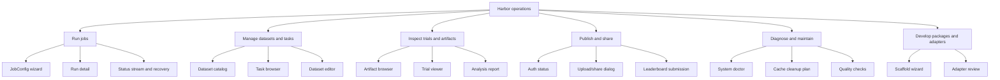

# Harbor CLI-to-UI 替代架构

- Status: Draft
- Created: 2026-06-28
- Updated: 2026-06-28
- Harbor CLI baseline: `0.13.2`
- Source: 本机 `harbor --help` 与主要子命令 help。

## 1. 核心判断

v1.0.5 的关键不是把 Harbor CLI 命令搬到 Web 上显示，而是把 Harbor 日常操作改造成
用户可点击、可配置、可观察、可恢复的 UI 工作流。

CLI 仍保留为高级调试、自动化和审计入口。Web 的主路径不得要求用户复制一段命令再回到
terminal 执行。

## 2. 操作域架构

## 3. CLI 操作清单与 UI 替代形态

| Harbor 操作 | CLI 命令 | 用户意图 | UI 替代形态 | v1.0.5 建议 |
|---|---|---|---|---|
| 启动 job | `harbor run`, `harbor job start` | 配置并运行 benchmark job | JobConfig 分步向导 + Review + Run 按钮 + 事件流 | P0 |
| 恢复 job | `harbor job resume` | 从 job 目录恢复失败/中断 job | Run detail 的 Resume 面板，支持 error type filter | P0 |
| 取消/重试 job | 当前 OrnnLab subprocess control + Harbor artifacts | 停止、重跑、复用配置 | Run detail 的 Cancel / Retry / Clone Template | P0 |
| 总结 job | `harbor job summarize` | 聚合失败原因 | Report 页的 Generate Summary 操作 | P1 |
| 下载 job | `harbor job download` | 拉取 Hub 上的 job 和 trials | Jobs 页 Import from Hub 表单 | P2 |
| 上传 job | `harbor upload`, `harbor run --upload` | 把本地结果上传到 Hub | Upload dialog，选择 visibility/share target | P1/P2 待定 |
| 分享 job | `harbor job share` | 给 org/user 添加访问权限 | Share dialog，org/user token chips + confirmation | P1/P2 待定 |
| 提交榜单 | `harbor leaderboard submit` | 将已上传 job 提交 leaderboard | Leaderboard submission wizard | P1/P2 待定 |
| 认证 | `harbor auth login/status/logout` | 登录、查看账号、退出 | Header/Auth panel + auth status card | P1 |
| 数据集列表 | `harbor dataset list` | 浏览 registry 数据集 | Datasets catalog，搜索/分页/详情 | P0 |
| 数据集初始化 | `harbor dataset init`, `harbor init --dataset` | 创建 dataset skeleton | Dataset create wizard | P2 |
| 数据集下载 | `harbor dataset download`, `harbor download` | 下载 registry dataset | Dataset detail 的 Download action | P1 |
| 数据集可见性 | `harbor dataset visibility` | 切换 public/private | Dataset settings visibility control | P2 |
| task 初始化 | `harbor task init`, `harbor init --task` | 创建 task skeleton | Task create wizard | P2 |
| task 下载 | `harbor task download`, `harbor download` | 下载 registry task | Task detail 的 Download action | P1 |
| task 环境启动 | `harbor task start-env` | 单独启动 task 环境调试 | Task detail 的 Start Environment panel | P1/P2 |
| task debug/check | `harbor task debug`, `harbor task check`, `harbor check` | 检查 task 质量与失败原因 | Task diagnostics report | P1 |
| task 更新/注释/迁移 | `harbor task update/annotate/migrate` | 维护 task package | Task authoring tools | P3 |
| 编辑 dataset manifest | `harbor add/remove/sync` | 向 dataset.toml 添加、移除、同步 digest | Dataset editor，显示 manifest diff + confirm | P1 |
| 浏览 artifacts | `harbor view` | 打开 jobs/tasks 轨迹浏览器 | Artifacts/Trials 内嵌浏览入口或受管 viewer launcher | P0/P1 |
| trial 运行 | `harbor trial start` | 单 trial 调试 | Trial detail / Task detail 的 Run single trial | P2 |
| trial 总结/下载 | `harbor trial summarize/download` | 分析或拉取单 trial | Trial viewer action menu | P2 |
| trajectory 分析 | `harbor analyze` | 分析 job/trial 轨迹 | Analysis report generator | P1 |
| 插件列表 | `harbor plugins list` | 查看可用 job plugins | JobConfig Integrations picker | P1 |
| adapter 初始化/审查 | `harbor adapter init/review` | 开发 Harbor adapter | Adapter developer tools | P3 |
| cache 清理 | `harbor cache clean` | 清理 Docker/cache | System cleanup plan，必须先预览影响 | P2 |
| publish tasks/datasets | `harbor publish` | 发布 package 到 registry | Publish wizard，tags/concurrency/visibility/no-tasks | P2 |

## 4. JobConfig UI 分层

`harbor run` 参数面最大，应拆成稳定的 UI 子域，而不是一个长表单。

| UI step | 替代 CLI 参数域 | UI 控件 |
|---|---|---|
| Source | `--path`, `--dataset`, `--task`, `--registry-url`, `--registry-path` | Dataset selector、Task picker、本地路径选择、registry source |
| Filter | `--include-task-name`, `--exclude-task-name`, `--n-tasks` | filter chips、glob input、任务预览、limit stepper |
| Agent | `--agent`, `--agent-import-path`, `--model`, `--agent-kwarg`, `--agent-env`, `--mcp-config`, `--skill` | Agent profile selector、model multi-select、env editor、MCP/skills picker |
| Environment | `--env`, `--force-build`, `--delete`, resource override, mounts, docker compose overlay | Environment segmented control、resource fields、mount editor |
| Verification | `--verifier-env`, `--verifier-import-path`, `--verifier-kwarg`, verification toggle | Verifier config panel、env editor、enable/disable toggle |
| Runtime | `--job-name`, `--jobs-dir`, `--n-attempts`, `--n-concurrent`, retry, timeouts, artifacts | Name/path fields、steppers、timeout controls、artifact path list |
| Hub | `--upload`, `--public/--private`, `--share-org`, `--share-user` | Upload toggle、visibility radio、share target chips |
| Review | `--config` equivalent | Generated JobConfig preview、equivalent CLI display、Run button |

## 5. 推荐的页面架构

### Datasets

- Catalog：官方 Harbor Hub 风格表格，支持搜索、分页、registry source。
- Dataset detail：task 列表、版本、manifest 路径、下载/同步/发布入口。
- Dataset editor：替代 `add/remove/sync`，所有 manifest 修改都先展示 diff。

### Tasks

- Task list/detail：展示 task metadata、package source、local path、environment readiness。
- Task diagnostics：替代 `task check/debug` 和 `check`。
- Start environment：高风险操作，默认放在 detail 的高级面板。

### Jobs

- Job list：本地 jobs 与可导入 Hub jobs。
- New job：JobConfig wizard。
- Job detail：events、logs、trials、artifacts、config、summary、upload/share、resume/cancel/retry。
- Job recovery：失败分类、原始错误、可执行恢复动作。

### Trials / Artifacts

- Trial list：按 task、attempt、status、reward/score 过滤。
- Trial detail：trajectory、logs、artifacts、analysis。
- Viewer strategy：v1.0.5 可以先受管启动 `harbor view`，但 UI 必须表现为 OrnnLab 的 Artifacts/Trials 入口。

### System

- Harbor version、Docker daemon、registry/auth、cache、orphan containers。
- `cache clean` 只能走 cleanup plan：先扫描、展示影响、再执行可恢复/最小破坏动作。

### Hub

- Auth status：login/logout/status。
- Upload/share：job 上传与权限管理。
- Leaderboard submission：metadata、job UUID、submission UUID、validation report。

## 6. v1.0.5 Launch Slice 建议

P0 应覆盖“普通用户不回 CLI 即可跑完一次 Harbor job”的最短闭环：

1. Datasets catalog + task preview。
2. JobConfig wizard：Source、Filter、Agent、Environment、Runtime、Review。
3. Run / Cancel / Retry / Resume。
4. Job detail：events、job log、result、config、trial list、artifact path。
5. System doctor：Harbor、Docker、dataset、agent config、orphan containers。

P1 再覆盖“结果解释和复用”：

1. Artifact/Trial viewer。
2. Analyze / summarize report。
3. Dataset editor 的 add/remove/sync。
4. Plugins picker。
5. Auth status。

P2 决定是否进入 Hub 闭环：

1. Upload/share。
2. Leaderboard submit。
3. Dataset/task download。
4. Publish wizard。

## 7. 需要决策的问题

1. v1.0.5 是否只承诺 P0，还是必须包含 P1 的 artifact/trial viewer？
2. Hub upload/share/leaderboard submit 是否进入 v1.0.5，还是作为 v1.0.6？
3. Dataset editor 是否进入 v1.0.5？如果进入，它会明显扩大前端表单和 manifest diff 工作量。
4. `harbor view` 是先作为受管 viewer 启动，还是首版自研完整 Trial/Artifact viewer？
5. Jobs 导航是否完全替代当前 Experiments 导航，但内部仍保留 Experiment 作为 OrnnLab 的产品组织层？

## 8. 验收原则

- 每个 P0 UI 操作必须标注它替代的 Harbor CLI 操作。
- 每个会写文件、启动环境、上传、分享、清理缓存的操作都必须有确认或预览。
- 每个 job 必须保留 `harbor.config.json`、等价 CLI、原始 artifact path 和失败证据。
- UI 不能只展示命令让用户复制执行；CLI 展示只能作为审计和高级调试辅助。
