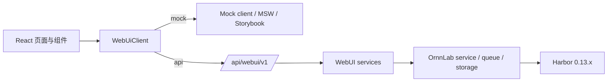

# v1.0.5 技术设计

- 状态：Active
- 更新：2026-07-19
- 范围：Harbor WebUI、`/api/webui/v1`、mock/API 双模式与前后端联调边界

## 1. 权威关系

- 产品范围与用户语义见 [PRD](prd.md)。
- 阶段状态与验收记录见 [工程计划](engineering-plan.md)。
- 路由、DTO、包络、错误和异步操作见 [WebUI API 契约](../../architecture/frontend-api-contract.md)。
- 本文只描述当前实现的架构与约束，不把计划中的依赖或历史专题资料当作已落地事实。

## 2. 当前架构



前端通过 `VITE_ORNNLAB_DATA_MODE` 选择运行模式：直接运行 `npm run dev` 时默认 `mock`，值为 `api` 时调用 `/api/webui/v1`。`run_dev.sh` 是全栈联调入口，默认以 `api` 启动并通过 `ORNNLAB_API_TARGET` 配置 Vite proxy；两种模式共享 DTO、ViewModel、页面和 Operation 状态流，API 模式不得回退到 mock。mock 与后端执行相同的 Agent 来源和删除约束。

异步操作状态持久化在 `webui_operations`。资源读取模型负责合并活动 operation，使下载进度能够跨列表刷新、搜索刷新和前端重挂载恢复；服务启动时会把失去进程内执行任务的 `queued/running` operation 对账为 `OPERATION_INTERRUPTED`，避免显示永久的伪活动状态。

后端只注册 `ornnlab.api.webui`。旧的 experiments、runs、benchmarks、leaderboard、system、agents、templates 产品路由已删除，不提供兼容入口。

## 3. 前端分层

| 目录 | 责任 | 约束 |
|---|---|---|
| `frontend/src/app/` | 路由状态、偏好、全局资源装配 | 不读取 mock fixture，不直接 fetch |
| `frontend/src/domain/` | UI 领域模型与草稿状态 | 不导入 API 或 mock |
| `frontend/src/api/` | DTO、HTTP/mock client、请求映射、ViewModel、resource hook、Operation 轮询 | 不放 React 页面，不兼容旧路由 |
| `frontend/src/mocks/` | 离线数据、MSW、Storybook 与测试夹具 | 只模拟正式 contract，不扩散产品能力 |
| `frontend/src/screens/` | 页面级资源组合与导航 | 不适配后端旧字段 |
| `frontend/src/ui/components/` | 共享控件、详情、表格、确认与状态组件 | 每个可复用可见组件有 Storybook 注册 |
| `frontend/src/styles/` | token、布局、控件、表格、surface、页面专属层 | 不恢复巨型样式文件 |

当前依赖为 React 19、Vite、TypeScript、ESLint、Vitest、Storybook、MSW 和 lucide-react。React Router、TanStack Query/Table、Radix/shadcn 不在当前实现与依赖中，不应写成现有架构。

## 4. 数据与契约边界

### 4.1 DTO 和 ViewModel

后端返回的 Job、Dataset、Trial、Agent、Environment、Leaderboard、System DTO 均保持结构化值：金额为数字、Token 为百万数量、时长为秒、得分为结构化分数。`frontend/src/api/viewModels.ts` 是唯一的展示格式化层；页面不得把格式化字符串回传给 API。

`DatasetTaskDto.environment` 是 Harbor `TaskConfig.environment` 的只读结构化摘要，仅对本地可解析的单项详情返回。Task 目录先建立只包含目录标识的轻量索引，`GET /datasets/{ref}/tasks` 只读取轻量路径状态、做名称过滤和分页，默认每页 20 条；不得为 Task 请求递归统计 Dataset 大小，也不导入 Harbor Task 模型或解析 Task 配置。目录索引按 Dataset 根目录修改时间在服务进程内缓存。用户展开 Task 时，`GET /datasets/{ref}/task-detail?task=` 才解析一个完整 `DatasetTaskDto`。`containerImages` 同时解析 Harbor `docker_image` 和 Dockerfile 外部 `FROM`，区分预构建环境镜像与 Dockerfile 基础镜像，并按 OCI Distribution API 读取公开 Registry 声明的 `os/architecture/variant`，按镜像引用去重并在服务进程内缓存。失败返回空平台集合，前端显示“未知”。未下载的远程 Task 详情返回 `null`，且 UI 不推断主机兼容性。

`RunDraft` 是 UI 草稿，`runDraftToCreateJobRequest` 将其映射到真实 Harbor `JobConfig` 可接受的运行级字段。Agent 保存可选模型集合，New Job 的 `modelName` 是本次运行的唯一选择；凭证、Skills、MCP 和 kwargs 从 Agent 配置映射，环境细节从 Environment 模板映射。

### 4.2 Harbor 能力映射

| 资源 | OrnnLab 持久化 | Harbor 真实对象/字段 |
|---|---|---|
| Job | `runs`、`experiments`、`webui_job_configs` | `JobConfig` overrides、队列与 Harbor job 目录 |
| Agent | `agents.config_json`（唯一配置源） | `AgentConfig`: `name`/`import_path`、model、env、kwargs、skills、MCP、超时 |
| Environment | `webui_environment_profiles` | `EnvironmentConfig`: type/import path、资源 policy/override、mounts、compose、env、kwargs、allowed hosts |
| Dataset | `webui_datasets`、`webui_dataset_preferences`、`webui_dataset_downloads` | Dataset 列表、导入、任意父目录下载、移动、重新定位、同步、删除本地数据 |
| Operation | `webui_operations` | OrnnLab 异步任务与状态，而非虚构 Harbor 资源 |

Harbor 当前没有通用 Dataset `split` 配置、custom verifier WebUI payload、Environment `docker_image`/`network_mode`/`healthcheck`/`workdir` 字段，也没有可枚举的 GPU/TPU 型号。它们不出现在当前 contract。

运行态 Job 的 `runs.result_path` 仅在 Harbor 进程返回后持久化。`WebUiJobService` 在该字段为空且状态为 running 时，使用经过单层子目录校验的 `job_dir/harbor_job_name/result.json` 读取当前 Job 的 `n_total_trials` 与 stats；禁止退回共享 `jobsDir/result.json`，避免把其他或历史 Job 的结果当成当前进度。显式任务数量仍以 `runs.n_tasks × n_attempts` 作为结果文件尚未出现时的计划回退。

### 4.3 Job 删除边界

- `WebUiJobDeletionService` 只接受 `completed/failed/cancelled/interrupted`。queued/running 必须先通过现有取消流程收敛，禁止在 Worker 仍可能写入时删除。
- 数据库删除在一个 SQLite 事务内按依赖顺序清理 Job 关联的 `webui_operations`、Run/Experiment 事件、`webui_job_configs`、`queue_items` 和 `runs`；仅当 Experiment 不再包含其他 Run 时删除 Experiment 及其事件。排行榜没有独立副本，删除 Run 后自然消失。
- 文件清理只接受可证明归属的根：`experiments/<run_id>`、无剩余 Run 时的 `experiments/<experiment_id>`，以及 `jobsDir/<harbor_job_name>` 或 `jobsDir/<job_name>` 的单层原生 Harbor 子目录。删除前校验 `result_path`、`report_path` 和事件镜像均位于这些根下；共享父目录、符号链接、目录穿越或外部直写文件会拒绝整个请求。
- 文件清理在数据库事务提交前执行；文件失败会回滚数据库删除。删除具有不可恢复性，前端确认框明确列出记录、排行榜与产物影响。Dataset、Agent、Environment 和共享 `jobsDir` 不属于删除范围。

### 4.4 Dataset 存储归属

- `managed`：用户选择每次 Registry 下载的父目录，OrnnLab 在其下创建 `Dataset name + version` 的唯一子目录，并写入 `.ornnlab-dataset.json` 作为归属标记。只有带该标记的目录可移动或被 OrnnLab 删除；目标已存在时拒绝，绝不覆盖。
- `external`：本地导入仅保存目录注册，不复制、移动或删除文件。目录被用户移动或删除后，DTO 返回 `path-unavailable`；用户可重新定位或移除注册。
- 最近一次成功下载/移动选择的父目录保存在 `webui_dataset_preferences`，作为下一次位置选择的默认值。下载中的临时目标记录在 `webui_dataset_downloads`，取消或失败时仅清理带归属标记的临时目录。
- 本地 API 的 `POST /system/directory-picker` 在系统原生目录选择器中选择绝对路径；WebUI 只显示回传路径，不从浏览器文件控件推断目录。mock 模式明确返回不可用，禁止伪造选择结果。

### 4.5 Agent 和 Environment 的可写边界

- `Agent` 在 OrnnLab 中是可复用的 Harbor `AgentConfig` 模板，不代表修改 Harbor 的 Agent 实现。它组合 Harness、可选模型集合、环境变量、kwargs、Skills、MCP 和超时配置。
- New Job 必须从所选 Agent 的 `models` 中选择一个 `modelName`。后端校验 `modelName in agent.models`，将选择保存在 Job 配置快照中，并以该值覆盖 Harbor `AgentConfig.model_name`；禁止默认取列表首项或接受集合外模型。
- `/harnesses` 从 Harbor `AgentName` 和适配器 descriptor 动态生成只读模板及能力，不持久化、不进入 Agent 列表，也不能直接用于 Job。
- `/agents` 只读取 `agents.config_json` 中用户保存的 Agent profile。新建时必须选择 Harness；保存时由 `AgentConfig.model_validate` 校验；创建后 Harness 不可更换，Profile 可编辑、删除。新库 Agent 列表为空，不再合并或物化运行时预置项。
- `agents.config_json` 是 Agent 模板的唯一持久化配置源。运行时直接将其编译为 Harbor `AgentConfig`；不再生成或读取旧 AgentProfile 文件，不再维护 ProfileCompiler、generated-agent 目录或第二张 WebUI 配置表。
- Agent 的 `modelPricing` 与 `models` 一一对应。`reported` 读取 Harbor 原始 `cost_usd`；`litellm` 在 Job 创建时从 `litellm.model_cost` 解析；`custom` 使用用户填写的每百万 Token 三段价格。解析结果写入 `webui_job_configs.config_json.pricing`，作为历史 Job 的不可变价格快照。
- `GET /model-pricing/preview?modelName=` 复用 `model_pricing.catalog_pricing` 返回当前安装的 LiteLLM 目录价格。Agent 编辑器只在 `litellm` 模式请求并展示该结果，且与 Job 创建时的快照解析同源；`reported` 模式不请求目录价，只说明任务完成后读取 Harness 上报总成本。目录未命中时 API 返回显式错误，前端显示价格不可用，不静默填零。
- `model_pricing.calculate_cost` 统一服务 Job、Trial 与 Leaderboard：Harbor `n_input_tokens` 包含缓存，未缓存输入为 `n_input_tokens - n_cache_tokens`。快照模式不改写 Harbor `result.json`；缓存价格有差异但 `n_cache_tokens` 缺失时返回空成本并输出不含价格值的结构化警告。
- Harness 专属参数优先从 Harbor descriptor 读取。`CLI_FLAGS` 以及与其同名的 `ENV_VARS` 都视为同一个类型化 Harness 参数，写入 `kwargs`，不得在环境变量区域重复出现。Harbor 的 `ENV_VARS` 不是完整的运行变量目录；OrnnLab 还维护经过对应适配器源码验证的补充目录。Claude Code 按 Anthropic API、Claude OAuth、Amazon Bedrock 三种认证方式提供互斥变量子集，公共运行变量始终可选，`CLAUDE_FORCE_OAUTH`、`CLAUDE_CODE_USE_BEDROCK` 等内部开关由认证方式自动编译，不直接暴露。用户仍可添加自定义变量。API 中 `value: null` 的继承语义在编译 Harbor `AgentConfig` 时转换为 `${VARIABLE_NAME}`，固定值保持原值。
- Agent 不配置网络白名单。OrnnLab 将网络策略统一收敛到 Environment 模板；这是产品边界裁剪，不映射 Harbor `AgentConfig.extra_allowed_hosts`。
- Harness 通用能力全集包括 model、env、kwargs、Skills、MCP servers、执行/启动/最大超时；Harness 专属参数通过结构化 capability 定义选择框、数字、开关或文本交互。网络访问继续归 Environment 管理，MCP 不承担安装或容器部署编排。
- built-in Environment 由 Harbor `EnvironmentType` 枚举生成，只读但可复制。custom Environment 保存前由 `EnvironmentConfig.model_validate` 校验。
- `suppress_override_warnings` 已被 Harbor 标记为无效，不暴露。

### 4.6 宿主代理到 Docker Environment 的运行时适配

`ContainerProxyRuntime` 是应用级瞬态服务，由 FastAPI lifespan 启动，并在 worker
停止后关闭。它只读取 OrnnLab 进程的标准代理变量，不修改全局 `os.environ`，
也不把自动发现结果写回 Agent、Environment 或 `webui_job_configs`。

真正的代理 policy 在 `ExperimentService._run_one()` 执行期、Harbor config 构建前
生成。Agent 与 Environment 的显式 env 先合并成变量名集合；某一代理大小写组被显式
声明后，runtime 不再读取、校验或转换该组的宿主值。这样显式配置可以在不关闭其他
自动组的情况下恢复运行。若 Agent 或 Environment 声明 `extra_allowed_hosts`，runtime 默认整体跳过
自动代理并记录 `docker_proxy_policy_skipped`；显式 Profile proxy 仍由用户配置直接进入
Harbor。`HarborConfigBuilder` 只把
`${ORNNLAB_CONTAINER_*_PROXY}` 模板作为 Environment env 默认值写入 artifact，使 setup、
Agent 与 Verifier 共享同一代理策略。实际派生 URL 只通过受管 Harbor 子进程的 `env`
传递；`ManagedSubprocessHarborRunner` 在受限临时目录解析 Environment 模板，Harbor
退出或取消后删除临时配置。OrnnLab 自有 artifact 和结构化日志不保存 endpoint；Harbor
原生恢复所需的 Job lock 与 trial config 会快照已解析 relay 地址。自动模式已拒绝带凭据
的回环代理，避免认证信息进入这类 Harbor 原生文件。

`docker_proxy_target` 是独立能力层。`DOCKER_CONTEXT` 存在时覆盖 `DOCKER_HOST`；否则
`DOCKER_HOST` 覆盖当前默认 Context。provider 通过显式 CLI `--context` / `--host` 保证
endpoint、`docker info` 与 `network inspect` 始终查询同一 daemon，再读取 OS 与 security
options，将目标分类为本地 rootful Linux、Docker Desktop、rootless、远程/虚拟化或
不支持的本地目标。只有本地 rootful Linux 才继续读取默认 host gateway，并以“实际
可以 bind”作为最终能力检查；不按设备路径、用户名、固定网段或代理产品名分支。
非回环代理不需要宿主 relay，也不依赖 Docker discovery，可直接注入；其 DNS 与路由
仍必须由目标容器网络保证。

回环 HTTP/SOCKS 代理使用 host gateway 上的随机高位 TCP relay。每次 Job 创建独立
policy，policy 准备中途取消、Job 启动失败、取消或 Harbor 结束时立即关闭 listener 与
现有转发连接；应用 shutdown 只负责回收异常遗留资源。relay 不监听 `0.0.0.0`。
自动代理属于默认出网便利能力，不能与目标白名单同时启用；存在白名单或同一 daemon
运行互不信任容器时，应使用显式受控代理。带认证信息或 HTTPS TLS 的回环代理仍快速失败，
因为 artifact 敏感字段和 TLS hostname 约束不足。`python-api` engine 同样拒绝需要
runtime env 的自动代理；默认 `subprocess` engine 支持该能力。
`ORNNLAB_DOCKER_PROXY_MODE=off` 是显式退出开关。

稳定日志事件包括 `docker_proxy_detection`、`docker_proxy_target_classified`、
`docker_proxy_bridge_started`、`docker_proxy_policy_prepared`、
`docker_proxy_policy_skipped`、`docker_proxy_policy_released`、`docker.proxy.injected`、
`docker_proxy_upstream_failed` 和 `docker_proxy_runtime_stopped`。Job 事件保存代理
变量名、strategy、target kind 和 relay 数量，不保存 endpoint 或原始 URL。Docker
target 发现、unsupported target 与 bind 失败统一分类为
`proxy_configuration_failure` / `docker_proxy_unavailable`。
`harbor_subprocess.runtime_config_prepared` 只记录本次解析的变量数量，用于确认
Environment 全生命周期注入已生效。

事件写入经过统一 payload 安全边界：`harbor.job.running` 只保存 Job、Agent、Environment 的非敏感摘要、能力快照和产物路径，不保存完整 Harbor config；通用脱敏器覆盖认证、密码、secret、API key 和单数 token 键，同时保留 `n_input_tokens` 等用量指标。migration `009_redact_harbor_running_events.sql` 清除数据库历史完整配置，应用启动时同步清理 `experiments/*/ornnlab-events.jsonl` 历史镜像，并以 `event_history.redacted` 记录清理数量。

## 5. API 与异步操作

所有 API 都使用 `/api/webui/v1`、`ApiResponse<T>` 和 request id。错误通过 FastAPI 统一转为 `VALIDATION_ERROR`、`INVALID_REQUEST`、`RESOURCE_NOT_FOUND`、`RESOURCE_IMMUTABLE`、`OPERATION_CONFLICT` 或 `INTERNAL_ERROR`。

耗时操作使用持久化 `Operation`：创建后为 `queued`，后台执行为 `running`，终态为 `completed`、`failed` 或 `cancelled`。前端 `useOperation` 按状态轮询 `GET /operations/{id}`；可刷新资源的瞬时状态不得仅依赖该组件内 operation ID。Dataset 读模型会把活动下载 Operation 合并为 `download.status = downloading` 和持久化进度，页面重新挂载后通过资源轮询继续恢复状态。Job 事件通过 `GET /jobs/{jobId}/events` 拉取。SSE 不属于 v1.0.5 Stage 3 的实现范围。

同步完成的 CRUD 仍返回 completed Operation，以保持所有写操作的统一状态模型。Operation 取消会取消已登记的 asyncio task，并把持久化状态写为 `cancelled`。

## 6. Storybook、i18n 与样式治理

- `.storybook/preview.ts` 提供 theme、locale、MSW 与 a11y 配置；a11y 违规按 error 处理。
- 共享控件包括 `CustomSelect`、`EditableStringList`、`KeyValueControl`、`McpServersControl`、`TpuSpecControl`、`DetailDrawer`、确认框和状态组件。任何同类控件必须复用或先抽象再实现。
- 新增用户文案进入 `i18n.zh.ts` 与 `i18n.en.ts`，组件不根据翻译文本分支状态。
- 默认抽屉宽度为最小可用宽度，左侧 resize handle 贯穿视口高度；抽屉内部表格与表单允许纵向滚动，不允许无界横向撑开。

## 7. 测试与运行门禁

前端：

```bash
cd frontend
npm run typecheck
npm test
npm run lint
npm run build
npm run storybook:test
npm run storybook:build
```

后端：

```bash
.venv/bin/python -m pytest tests/python -q
.venv/bin/python -m ruff check ornnlab tests/python
```

API 集成测试必须覆盖统一包络、旧路由 404、资源 CRUD、真实 Harbor schema 校验、Job 映射、Operation 轮询/取消、Dataset 导入、系统操作失败语义和被移除字段拒绝。操作服务会输出提交、完成、失败与取消日志，便于联调定位。

视觉验收使用 Codex Web Preview，不使用独立 Playwright 流程；直接 UI 预览保持 mock 模式，真实 API 联调使用 `run_dev.sh` 或显式设置 `VITE_ORNNLAB_DATA_MODE=api`。

## 8. 发布前启动与配置约束

- `npm run dev` 未指定 `VITE_ORNNLAB_DATA_MODE` 时默认 mock，供离线界面开发；显式值只能是 `api` 或 `mock`。
- `npm run build` 默认 API，并拒绝显式 `mock` 或任何非法模式，避免将静默 mock 包作为产品产物发布。
- `run_dev.sh` 是 POSIX 开发联调入口，使用随机/自定义端口时必须同时设置 `ORNNLAB_PORT` 与 `ORNNLAB_FRONTEND_PORT`；它在后端和 Vite proxy 健康后才输出成功状态。
- 发布入口 `ornnlab dev` 使用 Node 实现，支持 macOS、Linux、Windows。它默认 API 模式、先等待后端健康、再验证前端 proxy；任何服务异常退出或终止信号都会停止另一个子进程。
- `scripts/test-run-dev-api.sh` 和 `npm run test:launcher` 都使用隔离的 `ORNNLAB_HOME`，不得读写用户实际实验数据。
