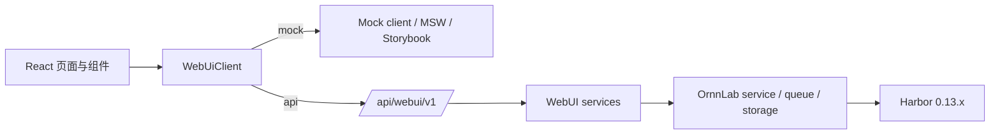

# v1.0.5 技术设计

- 状态：Active
- 更新：2026-07-10
- 范围：Harbor WebUI、`/api/webui/v1`、mock/API 双模式与前后端联调边界

## 1. 权威关系

- 产品范围与用户语义见 [PRD](prd.md)。
- 阶段状态与验收记录见 [工程计划](engineering-plan.md)。
- 路由、DTO、包络、错误和异步操作见 [WebUI API 契约](../../architecture/frontend-api-contract.md)。
- 本文只描述当前实现的架构与约束，不把计划中的依赖或历史专题资料当作已落地事实。

## 2. 当前架构



前端通过 `VITE_ORNNLAB_DATA_MODE` 选择运行模式：默认 `mock`，值为 `api` 时调用 `/api/webui/v1`。两种模式共享 DTO、ViewModel、页面和 Operation 状态流；mock 不能放宽后端会拒绝的约束，例如 built-in Agent 不能直接创建 Job。

后端只注册 `ornnlab.api.webui`。旧的 experiments、runs、benchmarks、leaderboard、system、agents、templates 产品路由已删除，不提供兼容入口。

## 3. 前端分层

| 目录 | 责任 | 约束 |
|---|---|---|
| `frontend/src/app/` | 路由状态、偏好、全局资源装配 | 不读取 mock fixture，不直接 fetch |
| `frontend/src/domain/` | UI 领域模型与草稿状态 | 不导入 API 或 mock |
| `frontend/src/api/` | DTO、HTTP/mock client、请求映射、ViewModel、resource hook、Operation 轮询 | 不放 React 页面，不兼容旧路由 |
| `frontend/src/mocks/` | 离线数据、MSW、Storybook 与测试夹具 | 只模拟正式 contract，不扩散产品能力 |
| `frontend/src/screens/` | 页面级资源组合与导航 | 不适配后端旧字段 |
| `frontend/src/ui/components/` | 共享控件、详情、表格、确认与状态组件 | 每个可复用可见组件有 Storybook 注册 |
| `frontend/src/styles/` | token、布局、控件、表格、surface、页面专属层 | 不恢复巨型样式文件 |

当前依赖为 React 19、Vite、TypeScript、ESLint、Vitest、Storybook、MSW 和 lucide-react。React Router、TanStack Query/Table、Radix/shadcn 不在当前实现与依赖中，不应写成现有架构。

## 4. 数据与契约边界

### 4.1 DTO 和 ViewModel

后端返回的 Job、Dataset、Trial、Agent、Environment、Leaderboard、System DTO 均保持结构化值：金额为数字、Token 为百万数量、时长为秒、得分为结构化分数。`frontend/src/api/viewModels.ts` 是唯一的展示格式化层；页面不得把格式化字符串回传给 API。

`RunDraft` 是 UI 草稿，`runDraftToCreateJobRequest` 将其映射到真实 Harbor `JobConfig` 可接受的运行级字段。模型、凭证、Skills、MCP 和 kwargs 只从 custom Agent profile 映射；环境细节从 Environment 模板映射。

### 4.2 Harbor 能力映射

| 资源 | OrnnLab 持久化 | Harbor 真实对象/字段 |
|---|---|---|
| Job | `runs`、`experiments`、`webui_job_configs` | `JobConfig` overrides、队列与 Harbor job 目录 |
| Agent | `agents`、`webui_agent_configs` | `AgentConfig`: `name`/`import_path`、model、env、kwargs、skills、MCP、超时 |
| Environment | `webui_environment_profiles` | `EnvironmentConfig`: type/import path、资源 policy/override、mounts、compose、env、kwargs、allowed hosts |
| Dataset | `webui_datasets` 与 Harbor registry/local path | Dataset 列表、导入、下载、同步、删除本地数据 |
| Operation | `webui_operations` | OrnnLab 异步任务与状态，而非虚构 Harbor 资源 |

Harbor 当前没有通用 Dataset `split` 配置、custom verifier WebUI payload、Environment `docker_image`/`network_mode`/`healthcheck`/`workdir` 字段，也没有可枚举的 GPU/TPU 型号。它们不出现在当前 contract。

### 4.3 Agent 和 Environment 的可写边界

- built-in Agent 是运行时从 Harbor `AgentName` 枚举生成的只读 Harness 目录；无模型、凭证或 MCP 假配置。创建 Job 必须选择 custom Agent profile。
- custom Agent 必须是 Harbor `AgentName`，或者提供 `import_path` 的 custom harness。保存时由 `AgentConfig.model_validate` 校验。
- built-in Environment 由 Harbor `EnvironmentType` 枚举生成，只读但可复制。custom Environment 保存前由 `EnvironmentConfig.model_validate` 校验。
- `suppress_override_warnings` 已被 Harbor 标记为无效，不暴露。

## 5. API 与异步操作

所有 API 都使用 `/api/webui/v1`、`ApiResponse<T>` 和 request id。错误通过 FastAPI 统一转为 `VALIDATION_ERROR`、`INVALID_REQUEST`、`RESOURCE_NOT_FOUND`、`RESOURCE_IMMUTABLE`、`OPERATION_CONFLICT` 或 `INTERNAL_ERROR`。

耗时操作使用持久化 `Operation`：创建后为 `queued`，后台执行为 `running`，终态为 `completed`、`failed` 或 `cancelled`。前端 `useOperation` 按状态轮询 `GET /operations/{id}`；Job 事件通过 `GET /jobs/{jobId}/events` 拉取。SSE 不属于 v1.0.5 Stage 3 的实现范围。

同步完成的 CRUD 仍返回 completed Operation，以保持所有写操作的统一状态模型。Operation 取消会取消已登记的 asyncio task，并把持久化状态写为 `cancelled`。

## 6. Storybook、i18n 与样式治理

- `.storybook/preview.ts` 提供 theme、locale、MSW 与 a11y 配置；a11y 违规按 error 处理。
- 共享控件包括 `CustomSelect`、`EditableStringList`、`KeyValueControl`、`McpServersControl`、`TpuSpecControl`、`DetailDrawer`、确认框和状态组件。任何同类控件必须复用或先抽象再实现。
- 新增用户文案进入 `i18n.zh.ts` 与 `i18n.en.ts`，组件不根据翻译文本分支状态。
- 默认抽屉宽度为最小可用宽度，左侧 resize handle 贯穿视口高度；抽屉内部表格与表单允许纵向滚动，不允许无界横向撑开。

## 7. 测试与运行门禁

前端：

```bash
cd frontend
npm run typecheck
npm test
npm run lint
npm run build
npm run storybook:test
npm run storybook:build
```

后端：

```bash
.venv/bin/python -m pytest tests/python -q
.venv/bin/python -m ruff check ornnlab tests/python
```

API 集成测试必须覆盖统一包络、旧路由 404、资源 CRUD、真实 Harbor schema 校验、Job 映射、Operation 轮询/取消、Dataset 导入、系统操作失败语义和被移除字段拒绝。操作服务会输出提交、完成、失败与取消日志，便于联调定位。

视觉验收使用 Codex Web Preview，不使用独立 Playwright 流程；默认 UI 预览保持 mock 模式，真实 API 联调显式设置 `VITE_ORNNLAB_DATA_MODE=api`。
