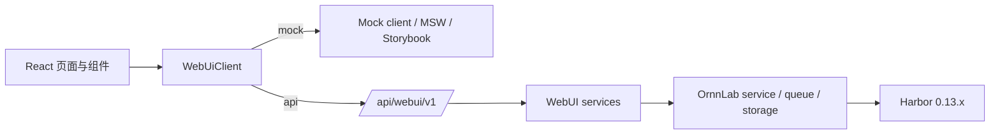

# v1.0.5 技术设计

- 状态：Active
- 更新：2026-07-11
- 范围：Harbor WebUI、`/api/webui/v1`、mock/API 双模式与前后端联调边界

## 1. 权威关系

- 产品范围与用户语义见 [PRD](prd.md)。
- 阶段状态与验收记录见 [工程计划](engineering-plan.md)。
- 路由、DTO、包络、错误和异步操作见 [WebUI API 契约](../../architecture/frontend-api-contract.md)。
- 本文只描述当前实现的架构与约束，不把计划中的依赖或历史专题资料当作已落地事实。

## 2. 当前架构



前端通过 `VITE_ORNNLAB_DATA_MODE` 选择运行模式：直接运行 `npm run dev` 时默认 `mock`，值为 `api` 时调用 `/api/webui/v1`。`run_dev.sh` 是全栈联调入口，默认以 `api` 启动并通过 `ORNNLAB_API_TARGET` 配置 Vite proxy；两种模式共享 DTO、ViewModel、页面和 Operation 状态流，API 模式不得回退到 mock。mock 与后端执行相同的 Agent 来源和删除约束。

后端只注册 `ornnlab.api.webui`。旧的 experiments、runs、benchmarks、leaderboard、system、agents、templates 产品路由已删除，不提供兼容入口。

## 3. 前端分层

| 目录 | 责任 | 约束 |
|---|---|---|
| `frontend/src/app/` | 路由状态、偏好、全局资源装配 | 不读取 mock fixture，不直接 fetch |
| `frontend/src/domain/` | UI 领域模型与草稿状态 | 不导入 API 或 mock |
| `frontend/src/api/` | DTO、HTTP/mock client、请求映射、ViewModel、resource hook、Operation 轮询 | 不放 React 页面，不兼容旧路由 |
| `frontend/src/mocks/` | 离线数据、MSW、Storybook 与测试夹具 | 只模拟正式 contract，不扩散产品能力 |
| `frontend/src/screens/` | 页面级资源组合与导航 | 不适配后端旧字段 |
| `frontend/src/ui/components/` | 共享控件、详情、表格、确认与状态组件 | 每个可复用可见组件有 Storybook 注册 |
| `frontend/src/styles/` | token、布局、控件、表格、surface、页面专属层 | 不恢复巨型样式文件 |

当前依赖为 React 19、Vite、TypeScript、ESLint、Vitest、Storybook、MSW 和 lucide-react。React Router、TanStack Query/Table、Radix/shadcn 不在当前实现与依赖中，不应写成现有架构。

## 4. 数据与契约边界

### 4.1 DTO 和 ViewModel

后端返回的 Job、Dataset、Trial、Agent、Environment、Leaderboard、System DTO 均保持结构化值：金额为数字、Token 为百万数量、时长为秒、得分为结构化分数。`frontend/src/api/viewModels.ts` 是唯一的展示格式化层；页面不得把格式化字符串回传给 API。

`RunDraft` 是 UI 草稿，`runDraftToCreateJobRequest` 将其映射到真实 Harbor `JobConfig` 可接受的运行级字段。Agent 保存可选模型集合，New Job 的 `modelName` 是本次运行的唯一选择；凭证、Skills、MCP 和 kwargs 从 Agent 配置映射，环境细节从 Environment 模板映射。

### 4.2 Harbor 能力映射

| 资源 | OrnnLab 持久化 | Harbor 真实对象/字段 |
|---|---|---|
| Job | `runs`、`experiments`、`webui_job_configs` | `JobConfig` overrides、队列与 Harbor job 目录 |
| Agent | `agents.config_json`（唯一配置源） | `AgentConfig`: `name`/`import_path`、model、env、kwargs、skills、MCP、超时 |
| Environment | `webui_environment_profiles` | `EnvironmentConfig`: type/import path、资源 policy/override、mounts、compose、env、kwargs、allowed hosts |
| Dataset | `webui_datasets`、`webui_dataset_preferences`、`webui_dataset_downloads` | Dataset 列表、导入、任意父目录下载、移动、重新定位、同步、删除本地数据 |
| Operation | `webui_operations` | OrnnLab 异步任务与状态，而非虚构 Harbor 资源 |

Harbor 当前没有通用 Dataset `split` 配置、custom verifier WebUI payload、Environment `docker_image`/`network_mode`/`healthcheck`/`workdir` 字段，也没有可枚举的 GPU/TPU 型号。它们不出现在当前 contract。

### 4.3 Dataset 存储归属

- `managed`：用户选择每次 Registry 下载的父目录，OrnnLab 在其下创建 `Dataset name + version` 的唯一子目录，并写入 `.ornnlab-dataset.json` 作为归属标记。只有带该标记的目录可移动或被 OrnnLab 删除；目标已存在时拒绝，绝不覆盖。
- `external`：本地导入仅保存目录注册，不复制、移动或删除文件。目录被用户移动或删除后，DTO 返回 `path-unavailable`；用户可重新定位或移除注册。
- 最近一次成功下载/移动选择的父目录保存在 `webui_dataset_preferences`，作为下一次位置选择的默认值。下载中的临时目标记录在 `webui_dataset_downloads`，取消或失败时仅清理带归属标记的临时目录。
- 本地 API 的 `POST /system/directory-picker` 在系统原生目录选择器中选择绝对路径；WebUI 只显示回传路径，不从浏览器文件控件推断目录。mock 模式明确返回不可用，禁止伪造选择结果。

### 4.3 Agent 和 Environment 的可写边界

- `Agent` 在 OrnnLab 中是可复用的 Harbor `AgentConfig` 模板，不代表修改 Harbor 的 Agent 实现。它组合 Harness、可选模型集合、环境变量、kwargs、Skills、MCP 和超时配置。
- New Job 必须从所选 Agent 的 `models` 中选择一个 `modelName`。后端校验 `modelName in agent.models`，将选择保存在 Job 配置快照中，并以该值覆盖 Harbor `AgentConfig.model_name`；禁止默认取列表首项或接受集合外模型。
- Agent 资源是 OrnnLab 对 Harbor 运行参数的可复用配置层。运行时从 Harbor `AgentName` 生成的 built-in 记录是系统预置 Agent：可编辑名称及该 Harness 支持的配置字段，可直接用于 Job，但不能删除或更换 Harness。首次保存或首次用于 Job 时，后端以相同 ID 将其物化到 OrnnLab Agent 存储，不修改 Harbor 源码或枚举。
- 自定义 Agent 必须选择 Harbor `AgentName`，或者提供 `import_path` 的 custom harness。详情只展示该 Harness 实际支持的配置子集，保存时由 `AgentConfig.model_validate` 校验。列表合并运行时预置项和已物化配置，以持久化配置覆盖同 ID 默认值。
- `agents.config_json` 是 Agent 模板的唯一持久化配置源。运行时直接将其编译为 Harbor `AgentConfig`；不再生成或读取旧 AgentProfile 文件，不再维护 ProfileCompiler、generated-agent 目录或第二张 WebUI 配置表。
- Harness 专属参数优先从 Harbor `CLI_FLAGS`、`ENV_VARS` descriptor 读取合法类型、枚举与默认值，统一作为构造 `kwargs` 传给 Harbor。`ENV_VARS` descriptor 的 `kwarg` 是 Harbor 的配置入口，其 `env`/`env_fallback` 只是 Harness 内部映射，前端不得把 `api_key` 等 kwarg 误写成同名容器环境变量。
- Agent 不配置网络白名单。OrnnLab 将网络策略统一收敛到 Environment 模板；这是产品边界裁剪，不映射 Harbor `AgentConfig.extra_allowed_hosts`。
- Harness 通用能力全集包括 model、env、kwargs、Skills、MCP servers、执行/启动/最大超时；Harness 专属参数通过结构化 capability 定义选择框、数字、开关或文本交互。网络访问继续归 Environment 管理，MCP 不承担安装或容器部署编排。
- built-in Environment 由 Harbor `EnvironmentType` 枚举生成，只读但可复制。custom Environment 保存前由 `EnvironmentConfig.model_validate` 校验。
- `suppress_override_warnings` 已被 Harbor 标记为无效，不暴露。

## 5. API 与异步操作

所有 API 都使用 `/api/webui/v1`、`ApiResponse<T>` 和 request id。错误通过 FastAPI 统一转为 `VALIDATION_ERROR`、`INVALID_REQUEST`、`RESOURCE_NOT_FOUND`、`RESOURCE_IMMUTABLE`、`OPERATION_CONFLICT` 或 `INTERNAL_ERROR`。

耗时操作使用持久化 `Operation`：创建后为 `queued`，后台执行为 `running`，终态为 `completed`、`failed` 或 `cancelled`。前端 `useOperation` 按状态轮询 `GET /operations/{id}`；Job 事件通过 `GET /jobs/{jobId}/events` 拉取。SSE 不属于 v1.0.5 Stage 3 的实现范围。

同步完成的 CRUD 仍返回 completed Operation，以保持所有写操作的统一状态模型。Operation 取消会取消已登记的 asyncio task，并把持久化状态写为 `cancelled`。

## 6. Storybook、i18n 与样式治理

- `.storybook/preview.ts` 提供 theme、locale、MSW 与 a11y 配置；a11y 违规按 error 处理。
- 共享控件包括 `CustomSelect`、`EditableStringList`、`KeyValueControl`、`McpServersControl`、`TpuSpecControl`、`DetailDrawer`、确认框和状态组件。任何同类控件必须复用或先抽象再实现。
- 新增用户文案进入 `i18n.zh.ts` 与 `i18n.en.ts`，组件不根据翻译文本分支状态。
- 默认抽屉宽度为最小可用宽度，左侧 resize handle 贯穿视口高度；抽屉内部表格与表单允许纵向滚动，不允许无界横向撑开。

## 7. 测试与运行门禁

前端：

```bash
cd frontend
npm run typecheck
npm test
npm run lint
npm run build
npm run storybook:test
npm run storybook:build
```

后端：

```bash
.venv/bin/python -m pytest tests/python -q
.venv/bin/python -m ruff check ornnlab tests/python
```

API 集成测试必须覆盖统一包络、旧路由 404、资源 CRUD、真实 Harbor schema 校验、Job 映射、Operation 轮询/取消、Dataset 导入、系统操作失败语义和被移除字段拒绝。操作服务会输出提交、完成、失败与取消日志，便于联调定位。

视觉验收使用 Codex Web Preview，不使用独立 Playwright 流程；直接 UI 预览保持 mock 模式，真实 API 联调使用 `run_dev.sh` 或显式设置 `VITE_ORNNLAB_DATA_MODE=api`。

## 8. 发布前启动与配置约束

- `npm run dev` 未指定 `VITE_ORNNLAB_DATA_MODE` 时默认 mock，供离线界面开发；显式值只能是 `api` 或 `mock`。
- `npm run build` 默认 API，并拒绝显式 `mock` 或任何非法模式，避免将静默 mock 包作为产品产物发布。
- `run_dev.sh` 是 POSIX 开发联调入口，使用随机/自定义端口时必须同时设置 `ORNNLAB_PORT` 与 `ORNNLAB_FRONTEND_PORT`；它在后端和 Vite proxy 健康后才输出成功状态。
- 发布入口 `ornnlab dev` 使用 Node 实现，支持 macOS、Linux、Windows。它默认 API 模式、先等待后端健康、再验证前端 proxy；任何服务异常退出或终止信号都会停止另一个子进程。
- `scripts/test-run-dev-api.sh` 和 `npm run test:launcher` 都使用隔离的 `ORNNLAB_HOME`，不得读写用户实际实验数据。
