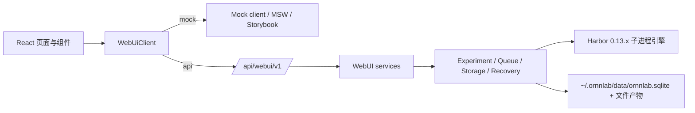

# OrnnLab 项目概览

- 运行日期：2026-08-06
- 覆盖范围：基于 `git log`（最新 `95b9c50`）与工作区当前状态
- 质量基线（本次实测）：Python `187 passed, 4 skipped`；前端 `32 个测试文件 / 117 tests passed`，typecheck 与 lint 全绿

## 1. 这个仓库是什么

OrnnLab（仓库名仍为 HarnessLab）是一个**基于 Harbor 0.13.x 的本地 agent 评测实验控制台**。它不再是自研 Rust benchmark 运行时，而是把「执行」交给 Harbor：Harbor 拥有基准执行、环境生命周期、agent 执行、验证与原始 Job 产物；OrnnLab 拥有本地产品层——声明式 agent 注册、实验/运行管理、诊断、报告摘要与排行榜视图。

当前产品线为 v1.0.5（Harbor WebUI 产品化），Python 包版本 `0.2.0`（FastAPI app title 为 `0.3.0`），npm launcher 版本 `0.1.3`。仓库中保留的 Rust/terminal-bench 资料均为归档参考，不是当前实现路径。

## 2. 为什么架构是现在这样

历史上有两轮关键转向：

1. **从自研 Rust 运行时转向 Harbor 引擎**：benchmark 执行、环境生命周期、验证与原始产物全部下沉到 Harbor，避免重复造运行时（见 `docs/archive/stubs/rust-legacy-fate.md`）。
2. **从 Vue demo 转向 Harbor 官方 Viewer 架构**：前端重建为 React 19 + Vite + TypeScript，与 Harbor 官方 Viewer 的组件分层一致（`docs/archive/v1.0.5-stage-1-2-reference/`）。

由此形成了「唯一契约」原则：后端只注册 `/api/webui/v1`，旧产品路由全部删除；前端以 `WebUiClient` 为唯一访问面，支持 `mock`（开发默认）与 `api`（生产默认）双模式且互不回退。

## 3. 顶层架构快照

两条主链路：

- **API 链路**：`frontend/src/api/webUiClient.ts`（HTTP）→ `ornnlab/api/webui.py` → `ornnlab/services/*` → SQLite / Harbor。
- **执行链路**：`QueueWorkerService` 出队 → `ExperimentService._run_one` → `HarborConfigBuilder.build` 写 `harbor.config.json` → `ManagedSubprocessHarborRunner` 跑 `harbor run --config` → 读取 `result.json` → 更新 `runs` 并写报告摘要。

## 4. 主要工作流

### 安装与启动

`npm install -g ornnlab && ornnlab`：npm launcher（`bin/ornnlab.js` + `lib/`）检查 `git`/`uv`/Node/npm（Docker 可选），把源码检出到 `~/.ornnlab/launcher/source`，`uv sync` + `npm ci`，然后启动后端 `127.0.0.1:8765` 与前端 `127.0.0.1:5173`。开发者直接 `uv run ornnlab web` + `npm --prefix frontend run dev`，或用 `run_dev.sh` 全栈联调（默认 API 模式）。

### 后端启动装配

`create_app`（S01）依次完成：目录与 SQLite 迁移初始化 → 历史事件脱敏 → `RunRecoveryService.reconcile_startup()` 恢复上次中断的运行 → `DockerOrphanService.cleanup_orphans()` 清理孤儿容器 → `WebUiOperationService.reconcile_interrupted()` 把失去进程的 Operation 标记失败 → lifespan 启动容器代理与队列 worker。

### 创建并执行 Job

`POST /api/webui/v1/jobs`（S02/S03）→ `WebUiJobService.create_job`：校验 Agent 与所选模型 → `ExperimentService.create` 写 `experiments`/`runs` → 落 `webui_job_configs`（含 `harbor_overrides` 与价格快照）→ 若 `run_immediately` 则入队并启动 worker。worker 并发出队（S07/S08）→ `_run_one`（S04）构建 Harbor 配置并托管子进程执行（S06）→ 结果写回 `runs` 并生成报告摘要（见 `02-core-logic.md` 的完整走查）。

### 异步 Operation

数据集导入/下载/移动/同步、Job resume、系统更新/重启/缓存清理等通过 `WebUiOperationService.submit` 持久化到 `webui_operations`，前端轮询进度（S09）。服务重启时未完成项被对账为 `OPERATION_INTERRUPTED`。

### Job 删除

仅终态 Job 可删；在同一事务内清理 operation/事件/config/queue/runs（必要时连同 Experiment），产物目录先做归属校验再删除（S11）。删除不可恢复，前端有确认框。

### 价格与成本

创建 Job 时对所选模型打价格快照（`reported`/`custom`/`litellm` 三种来源），结束后按 token 用量重算成本（S12）。

## 5. 关键不变量

- `/api/webui/v1` 是唯一产品 API，旧路由已删除；前端 API 模式出错**不得**回退 mock（S13）。
- Agent 配置唯一事实源是 `agents.config_json`；Environment 模板在 `webui_environment_profiles`；Job 配置快照在 `webui_job_configs`。
- Job 运行中事件会脱敏（`harbor.job.running` payload 去掉 `config`，S14）。
- Docker 资源带 `ORNNLAB_MANAGED/INSTANCE/RUN` 标签，按 `instance_id` 隔离，启动与终态都会回收。
- Job 删除只接受终态；产物路径必须可证明归属，删除失败回滚数据库事务（S11）。
- 价格 `reported` 来源信任 Harbor 报告的 `cost_usd`；`litellm`/`custom` 来源按费率计算（S12）。
- 单代码文件原则上不超过 500 行，CI 有行数门禁。

## 6. 风险与当前缺口

- **Stage 6（Dataset 存储位置管理）仍在进行中**：S6-06 等待对抗性审查结论（`docs/releases/v1.0.5/engineering-plan.md`）。
- **真实执行依赖 Docker + Harbor**：无 Docker 时 WebUI 可浏览/管理，但 Job 无法真实运行；CI 中真实 Harbor 冒烟是手动可选输入。
- **CI 自动触发被禁用**：`.github/workflows/ci.yml` 只保留 `workflow_dispatch`（用户要求），回归靠 `scripts/test-after-change-web.sh` 本地门禁。
- **边界临界文件**：`webui_dataset_service.py`（498 行）、`webui_job_service.py`（491 行）已接近 500 行门禁，后续扩展应考虑拆解。
- **前端手写基础设施**：hash 路由、资源 hooks 与轮询是手写实现，未引入 React Router / TanStack Query；新增页面需遵守分层约束（`frontend/src/api`、`domain`、`mocks`、`screens`、`ui/components` 不越层）。
- **仓库内存在被忽略目录**：`jobs/`（示例 Harbor Job 产物）、`artifacts/`（验证产物）、`frontend/dist/` 均被 `.gitignore` 忽略，不属于事实源。

## 7. 推荐阅读顺序

1. `README.md` — 项目定位与入口。
2. `docs/releases/v1.0.5/README.md` — 当前版本权威文档索引。
3. `docs/releases/v1.0.5/technical-design.md` — 架构、Harbor 映射、数据边界与前端分层。
4. `docs/architecture/frontend-api-contract.md` — 唯一 API 契约。
5. `docs/releases/v1.0.5/engineering-plan.md` — 阶段状态与验收矩阵。
6. `ornnlab/app.py` → `ornnlab/api/webui.py` → `ornnlab/services/`（先看 `experiment_service.py`、`harbor_engine.py`、`worker_service.py`、`queue_service.py`）。
7. `frontend/src/api/runtimeClient.ts` → `webUiClient.ts` → `contract.ts` → `App.tsx`。
8. `scripts/test-after-change-web.sh` — 全量门禁脚本。

配套文件：`01-directory-map.md`（目录职责）、`02-core-logic.md`（核心逻辑走查）、`03-code-evidence.md`（代码证据 S01–S15）。
