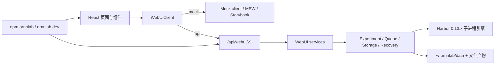

# OrnnLab 项目概览

- 运行日期：2026-08-18
- 覆盖范围：`main` @ `4b8a668`（v1.0.5 发布件已合入）
- 相对上一份摘要（`summary-my-repo/2026-08-06-v1/`）：版本号已统一为 `1.0.5`；Stage 6–12 全部闭环；Job 恢复/重跑、两轴状态、环境变量可见性、跨平台 CI 已落地

## 1. 这个仓库是什么

仓库名仍是 **HarnessLab**，当前产品名是 **OrnnLab 1.0.5**：一个基于 Harbor `0.13.x` 的本地 agent 评测实验控制台。

职责切分是硬边界：

- **Harbor** 拥有基准执行、环境生命周期、agent 执行、验证和原始 Job 产物。
- **OrnnLab** 拥有本地产品层：声明式 Agent 注册、Job/实验管理、诊断、报告摘要、排行榜、应用级守护进程和 Docker 归属回收。

它不再是自研 Rust benchmark 运行时，也不再是 Vue demo。活跃实现是：

- Python / FastAPI 后端（`ornnlab/`，版本 `1.0.5`）
- React 19 + Vite 前端（`frontend/`，版本 `1.0.5`）
- npm launcher（根 `package.json` 的 `ornnlab@1.0.5`）
- SQLite + `~/.ornnlab/data` 文件产物

目标读者是后续维护者：需要知道“改哪里、不能破坏什么、真实执行走哪条路径”。

当前成熟度：**v1.0.5 Released**（2026-08-17）。工程计划 Stage 0–12 标记 Done；发布笔记记录本地全量门禁与云端三平台 CI 通过。直接 `npm run dev` 仍默认 mock；`run_dev.sh` / `ornnlab dev` / 生产构建默认 API。

## 2. 为什么架构是现在这样

历史上有两轮关键转向：

1. **从自研 Rust 运行时转向 Harbor 引擎**：避免重复造执行内核。归档决策见 `docs/archive/stubs/rust-legacy-fate.md`。
2. **从 Vue demo 转向 Harbor Viewer 对齐的 React 前端**：页面分层、DTO、Operation 轮询与 Harbor 官方 Viewer 思路一致。

由此形成三条不可回退的原则：

- 后端只注册 `/api/webui/v1`，旧产品路由全部删除（S01, S02）。
- 前端以 `WebUiClient` 为唯一访问面；API 模式出错不得回退 mock；生产构建拒绝 mock（S13, S16）。
- 可见按钮必须落到 Harbor、OrnnLab 服务或本机真实能力，不把 Harbor 不支持的字段伪装成产品功能。

内部仍用 `experiments` + `runs` 持久化一个 WebUI Job；对外不再暴露实验/run 术语。

## 3. 顶层架构快照

两条主链路：

- **产品 API**：`frontend/src/api/runtimeClient.ts` → `ornnlab/api/webui.py` → `ornnlab/services/webui_*` → SQLite / Harbor。
- **执行内核**：`QueueWorkerService` 出队 → `ExperimentService._run_one` → `HarborConfigBuilder` 写 `harbor.config.json` → `ManagedSubprocessHarborRunner` 跑 `harbor run --config` → 读 `result.json` → 条件更新 `runs`。

另外两条独立控制面：

- **异步 Operation**：数据集下载/迁移、Job resume/rerun-failed、系统更新/清理。前端轮询，无 SSE（S09）。
- **应用级 daemon**：`ornnlab dev start/stop/restart/status/logs`，只管理当前用户会话中的前后端进程，不做开机自启（S17）。

## 4. 主要工作流

### 安装与启动

`npm install -g ornnlab && ornnlab`：检查 `git`/`uv`/Node/npm（Docker 可选），源码检出到 `~/.ornnlab/launcher/source`，`uv sync` + `npm ci`，再启动后端 `127.0.0.1:8765` 与前端 `127.0.0.1:5173`（S17）。开发者也可 `uv run ornnlab web` + `npm --prefix frontend run dev`，或 `run_dev.sh`（默认 API 模式）。

### 后端启动装配

`create_app`（S01）依次：目录与 SQLite 迁移 → 历史事件脱敏 → 恢复上次中断的 running run → 清理当前实例孤儿 Docker 资源 → 对账失去进程的 Operation / Dataset 下载 → lifespan 启动容器代理与队列 worker。

### 创建并执行 Job

`POST /jobs`（S02, S03）校验已保存 Agent 与所选模型 → 创建 `experiments`/`runs` → 写入 `webui_job_configs`（含 Harbor overrides 与价格快照）→ 可选入队。worker 并发出队（S07, S08）→ `_run_one` 编译配置、注入 Docker 代理与所有权标签（S04, S05）→ 托管 `harbor run`（S06）→ 结果写回。

### 恢复与重跑

失败/中断 Job 走 `harbor job resume --job-path`（S10）；终态 Job 可按失败 trial 的 error type 重跑。恢复是 Operation，不是队列 worker 的普通出队。

### Job 删除

仅终态可删；同一 SQLite 事务清理记录，文件只删可证明归属的产物根（S11）。

## 5. 关键不变量

- `/api/webui/v1` 是唯一产品 API；未知 query / extra JSON 字段被拒绝（S01, S02）。
- Agent 唯一事实源是 `agents.config_json`；Harness 只是只读模板，不能直接跑 Job（S03）。
- 执行状态与结果质量两轴分离：全部 trial 跑完即 Job `completed`，即使部分 notPassed/errored（S12）。
- 取消与收尾都用条件 UPDATE，晚到的 Harbor 成功不能覆盖 `cancelled`（S04）。
- 硬取消只存在于默认 `subprocess` 引擎；`python-api` 不能继承自动 Docker 代理，也没有 Harbor `Job.cancel`（S05）。
- Docker 资源必须带 `ornnlab.managed/instance_id/run_id` 标签，按 `instance_id` 隔离回收。
- Job 删除只接受终态，产物路径必须可证明归属（S11）。
- 价格在创建时快照；历史 Job 不受后续 Agent/LiteLLM 变更影响（S14）。
- 生产构建必须是 API 模式；API 失败不得回退 mock（S13, S16）。
- 单文件原则上不超过 500 行，CI 有行数门禁。

## 6. 风险与当前缺口

- **文档滞后**：`docs/releases/v1.0.5/job-task-state-machine/README.md` 仍写 In progress，但两轴模型与 rerun-failed 已在代码与发布笔记中落地。`docs/architecture/frontend-webui-governance.md` 仍有“暂不接后端”的旧表述。
- **内部双词汇**：对外是 Job，对内是 Experiment/Run；`template_service`、`leaderboard_service` 等旧领域代码仍在，但不挂产品路由。
- **Resume 与 worker 路径不完全对称**：resume 子进程不走队列 worker；取消/进程组语义比普通 `harbor run` 更窄。
- **状态映射残留**：DTO 会把“全部 trial 已执行”的终态 remap 为 `completed`；部分底层 `_status_from_result` 仍可能把 `n_errored_trials > 0` 写成 `failed`。
- **真实执行依赖 Docker + Harbor**：无 Docker 时 WebUI 可浏览/管理，但不能真实跑 Job。真实 Harbor 冒烟是 CI 手动可选输入。
- **CI 自动触发仍关闭**：`.github/workflows/ci.yml` 只有 `workflow_dispatch`（S15）。2026-08-17 已手动跑通三平台。
- **Stage 6 审查遗留非阻断债**：取消竞态、跨卷 move、`sizeBytes` 全树扫描、mock 写校验缺口等，见工程计划 §9。
- **测试注册表漂移**：`tests/WEB_TEST_REGISTRY.toml` 仍指向已删除的 `test_profile_compiler.py` / `test_agent_api.py`。
- **仓库名与产品名并存**：git remote 与 clone URL 仍是 HarnessLab；npm 产品名是 `ornnlab`；`@ceasarxuu/harnesslab` 只是过渡包。

## 7. 推荐阅读顺序

1. `README.md` — 安装入口与产品定位。
2. `docs/releases/v1.0.5/README.md` — 当前版本权威文档索引。
3. `docs/releases/v1.0.5/prd.md` — 六个一级页面与产品规则。
4. `docs/releases/v1.0.5/technical-design.md` — 架构、Harbor 映射、数据边界。
5. `docs/architecture/frontend-api-contract.md` — 唯一 API 契约。
6. `docs/releases/v1.0.5/engineering-plan.md` — 阶段状态与验收证据。
7. `docs/releases/v1.0.5/ornnlab-1.0.5.md` — 发布件与已知边界。
8. `ornnlab/app.py` → `ornnlab/api/webui.py` → `services/webui_job_service.py` → `experiment_service.py` → `harbor_engine.py` / `harbor_subprocess.py`。
9. `frontend/src/api/runtimeClient.ts` → `webUiClient.ts` → `app/App.tsx`。
10. `scripts/test-after-change-web.sh` — 本地全量门禁。

配套文件：`01-directory-map.md`、`02-core-logic.md`、`03-code-evidence.md`（S01–S17）。
